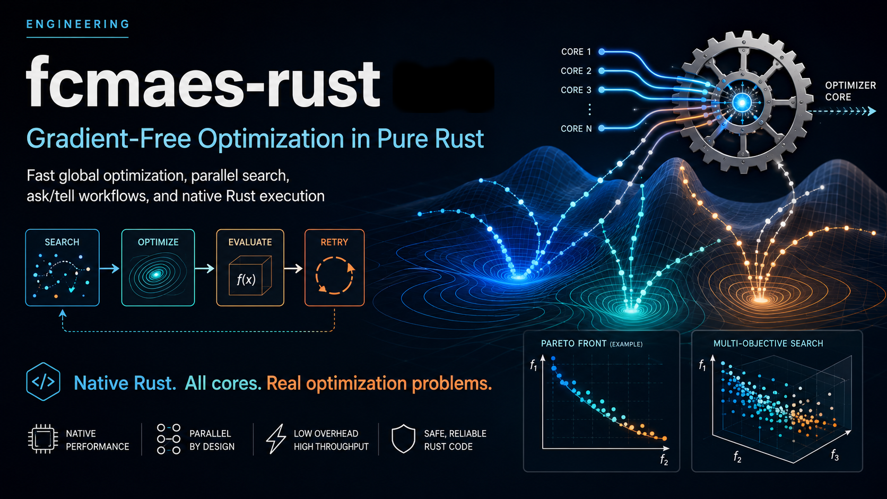

<p align="center">
  
</p>

# fcmaes-rust


[](https://crates.io/crates/fcmaes-core)
[](https://docs.rs/fcmaes-core)
[](https://pypi.org/project/fcmaes-rust/)
[](https://dietmarwo.github.io/fcmaes-rust/)

[Slides (PDF)](https://github.com/dietmarwo/fcmaes-rust/blob/main/docs/fcmaes-rust-slides.pdf)
· [Book (PDF)](https://github.com/dietmarwo/fcmaes-rust/blob/main/docs/fcmaes-rust-book.pdf)
· [YouTube video](https://youtu.be/c8MIu3_dZyY)

`fcmaes-rust` is a native Rust implementation of fast, parallel,
gradient-free optimization algorithms and selected fcmaes application
examples. The optimizer implementation in `fcmaes-core` is 100% Rust: it does
not compile, link, load, or call the original fast-cma-es C++ implementation.
Optimizer numerics, retry coordination, random-number generation, fitness
evaluation, and parallel execution all run in Rust.

In this project, “port” means that algorithms were translated, reimplemented,
and tested in Rust. It does not mean an FFI wrapper around the old C++ code;
the public API documentation explains the algorithms through their primary
literature and records implementation-specific behavior explicitly.

The repository is a standalone Cargo workspace. GTOP models and example
objective functions also execute in Rust. This includes the Mazda mass and
constraint response surfaces: their compact model data is embedded in the
example crate and evaluated by native Rust code. The Buckingham–Pi example
also implements dimension-matrix enumeration, numerical nullspace analysis,
regression, and continuous-exponent optimization directly in Rust; it has no
BuckinghamPy dependency.

## Core design principle: improve results for the same wait

**Independent retry turns otherwise idle CPU cores into additional chances to
find a better solution before the user's deadline.** Many useful stochastic,
local, and third-party optimizers execute one search on one thread. The generic
`fcmaes_core::retry` coordinator runs independent instances concurrently and
returns the best retained result; the wrapped optimizer does not have to be an
fcmaes implementation.

The controlled [GTOP equal-wall experiment](benchmarks/gtop-cmaes-retry/README.md)
wrapped the external, serial `cmaes` crate and compared one restart lane with
16 lanes on a 16-physical-core Ryzen 9 9950X. Both arms waited approximately
4.000 seconds per pair. Across 100 paired seeds on each of seven problems,
retry improved the mean returned objective on **7/7 problems**. It won
86–96/100 pairs, close to the roughly 94% expected when independent retry gets
about 15 times as many starts:

| Equal-wall evidence | Serial external CMA-ES | Through `fcmaes` retry |
|---|---:|---:|
| User-visible wall time | 4.000109–4.000150 s | 4.000440–4.000523 s |
| Mean active cores | 1.00 | 15.99–16.00 |
| Problems with the better mean | 0/7 | **7/7** |
| Cassini1 target successes | 38/100 | **100/100** |

This is the practical library design claim: on that fixed machine and
protocol, retry bought better mean quality for the same wait by spending more
aggregate CPU work. The paired win rate mainly confirms that the scheduler
delivered those extra independent opportunities; the mean and sdev quantify
their effect on the returned distribution. This is not a theorem for every
objective or budget. The full quality, wall-time, and work-accounting tables
are in the benchmark report; variability fell on five problems but rose on
SAGAS and Tandem.

### Two complementary ways to spend the cores

Retry is not the only parallelism boundary. **All population-based
fcmaes-core optimizers expose ask/tell or an equivalent whole-population batch
interface.** The caller asks for candidates, evaluates them concurrently on
CPU workers, a GPU, a simulator farm, or remote services, and tells the
optimizer the ordered results. This often gives the largest wall-time benefit
when one objective evaluation is expensive.

| Parallel strategy | Unit of parallel work | Best fit | Main effect at fixed wall time |
|---|---|---|---|
| Independent `retry` | Complete optimizer runs | Multimodal problems; serial internal algorithms; cheap to moderately costly objectives | Explores more independent basins and improves the distribution of the returned best |
| Population ask/tell | Candidates from one optimizer generation | Expensive simulations, training jobs, hardware tests, or remote evaluations | Advances one search through more generations during the same wait |

DE, active CMA-ES, CR-FM-NES, PGPE, BiteOpt, and MODE provide direct ask/tell
interfaces. MAP-Elites and Diversifier provide equivalent batch evaluators and
ordered archive updates. Dual Annealing is the deliberate exception: its next
point depends on the preceding point and score, so it has no population to
evaluate concurrently. Retry can still parallelize independent Dual Annealing
runs. Both forms can be combined, but partition the available workers between
outer retries and inner batch evaluation to avoid oversubscription. See the
[optimizer guide](docs/optimizers.md#parallel-evaluation-asktell-and-retry).

## Implementation facts

| Feature | Implementation |
|---|---|
| Optimizer core | 100% native Rust in `fcmaes-core` |
| Legacy C++ optimization backend | None; no C++ library is compiled, linked, loaded, or invoked |
| Core build | Standard Cargo build; no project `build.rs`, CMake, or C/C++ compiler |
| Parallelism | Independent retry workers plus ask/tell and ordered Rayon population batches |
| Objective functions | Native Rust closures and batch evaluators |
| Python integration | Optional PyO3 extension that exposes the Rust core; Python is not an optimizer backend |

To build only the reusable optimizer library, a Rust toolchain is sufficient:

```bash
cargo build --release -p fcmaes-core
```

This statement deliberately applies to the optimizer core. Building every
optional workspace component can additionally require Python for `fcmaes-py`
and native tooling pulled in by data-compression or network dependencies used
by examples. Those integrations do not contain or restore the historical C++
optimizer backend.

## Workspace

| Crate | Purpose |
|---|---|
| `fcmaes-core` | Optimizers, fitness handling, RNG, retry, multi-objective optimization, and quality diversity |
| `fcmaes-gtop` | Internal native GTOP objective library shared by the examples and Python package |
| `examples` (`fcmaes-examples`) | Native GTOP problems, application objectives, benchmarks, and executable examples |
| `fcmaes-py` | Optional PyO3 extension for embedding the Rust implementation in a Python package |
| `foundations/` | Standalone standard suites, Lennard-Jones scaling, audited quality indicators, and seven compact lessons |
| `tutorials/*` | Twenty-two standalone application workspaces spanning simulation, astrodynamics, circuits, mechanics, energy, routing, hydraulics, ML, and other domains; see the [tutorial index](tutorials/README.md) |

Only two registry artifacts are published: `fcmaes-core` on crates.io and the
`fcmaes-rust` binding distribution on PyPI. `fcmaes-gtop` is an internal
source dependency marked `publish = false`; `examples/` and `tutorials/` are
available only from this GitHub repository and are not included in either
registry package.

The application tutorials are intentionally not root workspace members. Each
keeps its application-specific dependencies, artifacts, and lockfile isolated;
run its Cargo commands from that tutorial directory.

New users can start with the
[Foundations guide](foundations/README.md): eight classic scalar functions,
ZDT1–4/ZDT6, DTLZ1–7, a Lennard-Jones scaling study, a seven-step lesson ladder, and exact/typed-sampled
multi-objective quality indicators. `foundations/` is a user guide rather than
an application tutorial, so the simulator-in-the-loop tutorial count remains
twenty-two.

The [optimizer-boundary guide](docs/optimizer-boundary.md) records why the
core stops at bounded gradient-free global methods and evidence utilities.
Corrected paired experiments keep Nelder–Mead, Bayesian optimization, and
gradient solvers behind the retry adapter boundary instead of adding them as
core algorithms or dependencies.

### Tutorial evidence map

The [tutorial index](tutorials/README.md) is the exhaustive catalogue. This
shorter map highlights the main experimental decisions and validation results.

#### Multi-objective and quality-diversity evidence

Seventeen application tutorials retain multi-objective optimization.
MAP-Elites campaigns are recorded for NeXosim, Rapier, ReBop, Brahe,
atmospheric source
localization, room ventilation, RustPower, sindr circuit design, quadruped
locomotion, phased-array register codebooks, and energy-hub sizing.

- **Descriptor redesign can help.** In RustPower, direct decision variables
  produced only 4% archive coverage. Emergent behavior coordinates
  reached 68% mean coverage over three seeds at the same 100k-evaluation
  budget. Constrained MODE remains primary because the near-unique asset
  architecture survived the descriptor change.
- **A completed QD campaign can still fail its evidence gate.** The SmartCore
  study separates fixed-fold tuning, model selection, and frozen final
  evaluation. Replacing
  two highly correlated descriptors increased range-study occupancy from
  16/400 to 91/400 cells, but the subsequent 49.0%-coverage campaign still
  failed held-out niche retention.
- **Accepted descriptor gates.** The phased-array study reaches
  40.83% coverage and 95.07% holdout niche retention on its corrected 12×10
  grid. The energy-hub study follows its accepted native-grid pilot with a
  64-elite portfolio and an independent
  8,760-hour chronological hydrogen replay.
- **Rejected descriptor gates are published too.** The field-service,
  water-network, and truss-sizing studies reject unstable or weakly retained
  repertoires instead of presenting them as successful QD results.

#### Selected application protocols

- **Policy search:** the neural-controller tutorial compares PGPE and CR-FM-NES
  on a 118-parameter controller using common scenarios, disjoint validation,
  and a frozen 1,024-scenario final test.
- **Fixed-sequence astrodynamics:** the GTOC1 tutorial applies coordinated
  DE–CMA-ES and incumbent-seeded retry to the real 87-variable EVEEEJSJA
  low-thrust tour. It explains why its VSOP2013 result is not an official DE405
  re-scoring.
- **Split-brain route discovery:** the GTOC1 route-search tutorial keeps a
  provider-independent agent boundary. Its seed-42 L0 audit finds 15 admissible
  random routes, 24 evolutionary routes, and none from MiniMax-M3. The three
  promoted random controls all fail L1 closure, so independent seeds, matched
  promotion, and a validated L2 finalist remain open requirements.
- **Circuits and optics:** the sindr study combines interpolated AC features,
  retry, MODE, and an E12 catalogue. The gate-driver front passes timestep
  refinement and a 49-design ngspice comparison. The optical-lens study
  validates its dependency-free ray tracer before optimizing a Cooke-triplet
  front.
- **Robust locomotion:** the quadruped tutorial makes quality diversity the
  primary result and uses five-seed held-out terrain replay rather than
  treating training coverage as robustness.
- **Specialist baselines:** the network-coverage tutorial validates its kernel
  and certificates before optimization. Its marginal-greedy prefix frontier
  dominates every finite MODE point, so the tutorial recommends the specialist
  method for that frozen submodular formulation.

#### Reproducibility

Tutorial result directories contain the canonical raw evidence and generated
SVGs needed to reproduce the published pages from a clean clone. Schema-driven
tutorials use `run.json`; room ventilation and neural policy search also check
aggregate CSVs and plots spanning multiple seeds and validation studies.

Implemented algorithms include Differential Evolution, active CMA-ES,
CR-FM-NES, PGPE, Dual Annealing, BiteOpt, MODE, CVT-MAP-Elites, the
Diversifier, independent retry, coordinated retry, and weighted
multi-objective retry.

The example crate includes GTOP mission optimization, Mazda factory-design
objectives, stock-strategy optimization, material-flow planning, flexible
job-shop and harvesting, multi-UAV task assignment, spherical t-design,
transfer scheduling, Buckingham–Pi dimensional analysis, damped control, F-8
aircraft control, and Lotka-Volterra control.

## Quick start

### Install the released packages

Inside a Rust application, add the published optimizer library:

```bash
cargo add fcmaes-core
```

The crate is imported in Rust as `fcmaes_core`.

Python users install the published binding distribution with:

```bash
python -m pip install fcmaes-rust
```

It imports as `fcmaes_rust`; its optimizer backend is the same native Rust
implementation:

```python
import fcmaes_rust

print(fcmaes_rust.__version__)
print(fcmaes_rust.phase1_build_info())
```

A compatible prebuilt wheel requires neither a local Rust toolchain nor a
C/C++ compiler. Published wheels support CPython 3.11 through 3.13. Building
the Python package from its source distribution does require Rust.

### Build and run the repository

Install Rust 1.88 or newer, then run from this directory. Rust 1.88 is the
tested minimum for the edition-2024 source and current locked dependency set;
the CI workflow checks it explicitly.

```bash
cargo test --workspace
cargo build --release --workspace
```

Run a small native optimization:

```bash
cargo run --release -p fcmaes-examples --bin jobshop -- --evals 2000
```

Run a GTOP retry workload:

```bash
cargo run --release -p fcmaes-examples --bin gtop-examples -- \
  --problem cassini1 --retries 16 --evaluations 5000 --workers 16 --seed 1
```

With `fcmaes-rust` installed, run the repository's active CMA-ES Python
example with:

```bash
python examples/python/test_cma.py
```

## Documentation

- [Rendered user guide and tutorial book](https://dietmarwo.github.io/fcmaes-rust/)
- [Generated `fcmaes-core` API reference](https://docs.rs/fcmaes-core)
- [AI problem-solving context](ai-context.md)
- [Security and numerical-integrity reporting](SECURITY.md)
- [Getting started](docs/getting-started.md)
- [Choosing an optimizer](docs/choosing-an-optimizer.md)
- [Architecture and implementation boundaries](docs/architecture.md)
- [Optimizer guide](docs/optimizers.md)
- [Retry and multi-objective retry](docs/retry.md)
- [Native examples and benchmarks](docs/examples.md)
- [Combinatorial encoding cookbook](docs/combinatorial-encodings.md)
- [Buckingham–Pi dimensional-analysis example](docs/buckingham-pi.md)
- [Native Rust application-optimization tutorials](tutorials/README.md)
- [NeXosim production-line tutorial](tutorials/nexosim-production-line/README.md)
- [Rapier trebuchet tutorial](tutorials/rapier-trebuchet/README.md)
- [ReBop stochastic-oscillator tutorial](tutorials/rebop-oscillator/README.md)
- [Split-brain oscillator topology-search tutorial](tutorials/oscillator-topology-search/README.md)
- [Brahe satellite-constellation tutorial](tutorials/brahe-constellation/README.md)
- [RustPower voltage-control tutorial](tutorials/rustpower-voltage-control/README.md)
- [Atmospheric source-localization tutorial](tutorials/dispersion-source-localization/README.md)
- [Room-ventilation optimization tutorial](tutorials/cfd-room-ventilation/README.md)
- [ML hyperparameter-optimization tutorial](tutorials/ml-hyperparameter-tuning/README.md)
- [Neural-controller policy-search tutorial](tutorials/neural-controller-policy-search/README.md)
- [GTOC1 “Save the Earth” tutorial](tutorials/gtoc1/README.md)
- [Split-brain GTOC1 route-search tutorial](tutorials/gtoc1-route-search/README.md)
- [sindr circuit-design tutorial](tutorials/sindr-circuit-design/README.md)
- [thevenin transient gate-driver tutorial](tutorials/thevenin-gate-driver/README.md)
- [Pure-Rust optical lens-design tutorial](tutorials/optical-lens-design/README.md)
- [Rapier quadruped gait-repertoire tutorial](tutorials/rapier-quadruped-gait/README.md)
- [Hardware-quantized phased-array codebook tutorial](tutorials/phased-array-codebook/README.md)
- [Bilevel energy-hub sizing tutorial](tutorials/energy-hub-bilevel/README.md)
- [Random-key field-service routing tutorial](tutorials/field-service-routing/README.md)
- [Water-network pump-scheduling tutorial](tutorials/water-network-scheduling/README.md)
- [Truss topology and catalogue-section sizing tutorial](tutorials/truss-sizing/README.md)
- [Weighted network-coverage tutorial](tutorials/network-coverage/README.md)
- [Optional PyO3 bindings](docs/python-bindings.md)
- [Release history](CHANGELOG.md)
- [Publishing checklist](RELEASING.md)
- [Development and testing](docs/development.md)
- [Recorded native benchmark results](benchmarks/README.md)

Generate the complete API reference with:

```bash
cargo doc --workspace --no-deps --open
```

Build the rendered guide locally with mdBook 0.5.4:

```bash
python scripts/check_doc_consistency.py
python scripts/build_book.py
python scripts/check_book_links.py
```

The builder stages canonical repository files under `target/`; it does not
maintain duplicate copies of the guides or tutorial results.

## Optimizer comparison

### Equal-budget GTOP results

The reproducible [GTOP optimizer comparison](benchmarks/optimizer-comparison/comparison.md)
uses 100 experiments per problem and a common 240,000-evaluation cap. fcmaes
has the best mean optimum on six of seven problems. Its independent BiteOpt
retry arm has the lowest mean optimizer wall time per actual evaluation on all
seven, at 142–310 ns/evaluation. Raw total wall time is not the headline speed
measure because plain `cmaes` CMA-ES stops protectively after using only
7.4%–58.8% of its allowance. The exception in mean solution quality is Tandem,
where adaptive BIPOP-CMA-ES leads the equal-budget table but does not reach the
`-1493` target.

### Tandem stress test

In the pre-registered Tandem stress test, BIPOP-CMA-ES reached 0/1,000 targets:
its best result was -1410.050665 after 9,466,290,846 actual evaluations. In
contrast, fcmaes coordinated DE→CMA retry reached the target in 85/100
experiments with a mean of 230,727,025 evaluations. Across their complete
campaigns, the 100 fcmaes experiments used 23.07 billion actual evaluations,
2.44 times the 9.47 billion used by the 1,000-retry stress test. These are
separate budget regimes and allocations: the equal-budget table supports the
controlled comparison, while the larger coordinated result demonstrates the
benefit of adaptive retry coordination on a hard problem.
The original Python/C++ fcmaes performance table reports a similar 81/100
Tandem success rate; the linked report records both results and their exact
parallel execution models.

### Controlled CMA-ES implementation diagnostic

The separate [controlled active CMA-ES implementation diagnostic](benchmarks/cmaes-implementation/README.md)
holds the objective and parallel architecture much closer between
`fcmaes-core` and `cmaes` 0.2.2. Its complete 20-pair campaign finds no
universal quality winner:

- `cmaes` leads serial throughput on cheap and high-dimensional cases.
- `fcmaes-core` leads median aggregate throughput under equal 16-instance
  multistart.
- Protective-stop behavior differs substantially and is reported rather than
  normalized away.

The easy analytic functions isolate implementation effects; they are not
recommended CMA-ES workloads. At 100 µs objective cost, the serial speed gap
is already negligible.

### Equal-wall parallel retry

The complementary
[GTOP equal-wall retry experiment](benchmarks/gtop-cmaes-retry/README.md) plugs
that external, single-threaded `cmaes` implementation into
`fcmaes_core::retry`. Its primary 100-pair experiment compares the
best-objective mean/sdev returned by one serial restart lane and by 16 lanes
after the same four-second wait. Measured wall mean/sdev checks fairness;
starts, evaluations, CPU time, and active cores expose the deliberately higher
parallel work. This demonstrates that retry is an optimizer adapter rather
than a facility reserved for fcmaes algorithms.

In the completed seven-problem campaign:

- retry improves mean objective on every case and wins 86–96 of 100 pairs;
- it reduces standard deviation on five cases but increases it on SAGAS and
  Tandem; and
- both arms measure about 4.000 seconds, at roughly 1 versus 16 active cores.

Because the retry arm completed about 15 times as many independent starts, iid
restart order statistics alone predict a win rate near 15/16, or 94%. The
observed wins are consistent with that baseline; the improved means measure the
distributional benefit relevant to the user.

A separate five-pair pilot retains equal-work scheduler-scaling evidence but
is not part of the practical quality claim.

## Data-backed examples

The examples are self-contained by default:

- Trading includes an offline adjusted-close cache and can optionally refresh
  it through Yahoo Finance.
- Mazda bundles its decision table and compact response-surface data under
  `examples/data/`; neither binary needs or accepts an external model path. The
  [Mazda data notice](examples/data/MAZDA_NOTICE.md) records provenance and the
  benchmark's acknowledgement request.
- The [Multi-UAV data and compatibility notice](examples/data/UAV_NOTICE.md)
  documents the native task-assignment port and source benchmark.
- The [Buckingham notice](examples/data/BUCKINGHAM_NOTICE.md) records the
  dimension-matrix catalog's provenance and the numerical port's deliberately
  narrower scope than BuckinghamPy.

Both Mazda drivers accept `--workers N` for ordered parallel objective batches;
use `--workers 16` for sixteen evaluation threads or `--workers 0` to select
available parallelism.

This public workspace intentionally contains only the Rust port and its
related documentation, native examples, benchmark results, and optional Rust
bindings. Historical Python/C++ implementations and port-planning material are
not part of this repository.

## License

The Rust source and documentation are MIT licensed; see [LICENSE](LICENSE).
The embedded Mazda benchmark data retains its recorded provenance and
acknowledgement request; see [the Mazda data notice](examples/data/MAZDA_NOTICE.md).
