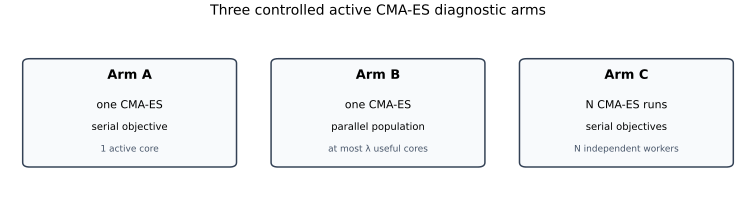
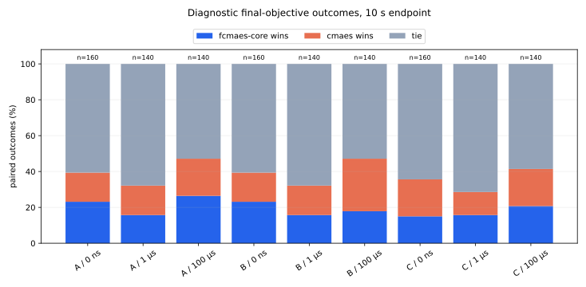
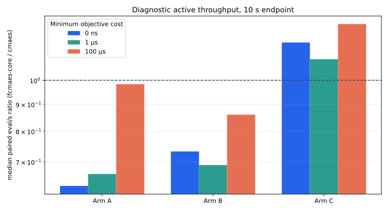
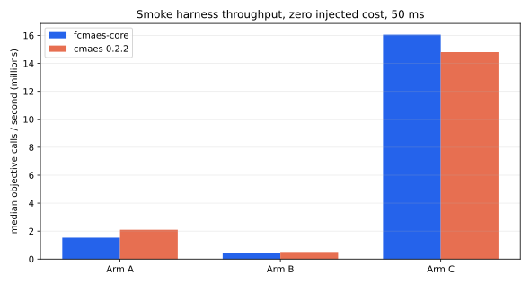

# Controlled active CMA-ES implementation diagnostic

This standalone diagnostic asks a deliberately narrow question: with the
same objective, initial distribution, offspring population, wall deadline,
and parallel architecture, how do the active CMA-ES implementations in
`fcmaes-core` and [`cmaes` 0.2.2](https://crates.io/crates/cmaes/0.2.2)
behave?

It is **not** a general CMA-ES performance benchmark and does not claim that
CMA-ES is the right solver for its analytic controls. Sphere, Ellipsoid, and
gradient-available Rosenbrock are deliberately easy ways to expose overhead,
dimensional scaling, covariance work, and stopping behavior. They are not
application recommendations.

The checked-in [20-pair publication bundle](results/implementation-v1/comparison.md)
contains 7,920 raw rows from the complete protocol. The separate
[`results/harness-smoke`](results/harness-smoke/comparison.md) bundle only
validates the harness on three paired seeds and does not establish a winner.



## What this diagnostic can answer

The cases have distinct diagnostic roles:

| Case | Role here | What it does not establish |
|---|---|---|
| Sphere, n=10/100 | implementation overhead and dimension scaling against a known optimum | that CMA-ES is preferable to a direct or gradient-based method |
| Rosenbrock, n=10/40 | covariance adaptation and ill-conditioned-valley behavior | that derivative-free search should replace available gradients |
| Rastrigin, n=10/40 | multimodal behavior and the value of independent starts | performance on arbitrary real multimodal applications |
| Ellipsoid, n=100 | full-covariance cost and conditioning under a controlled objective | a practical reason to optimize this function with CMA-ES |
| Cassini1 | one real, bounded, derivative-free objective | simulator-heavy or broad astrodynamics performance |
| Injected latency | the crossover from optimizer-bound to objective-bound execution | the cost structure of a particular application |

This makes the diagnostic useful for implementation overhead, dimensional
scaling, parallel topology, and termination policy. It cannot select the best
optimizer for an application. That requires the real objective, an explicit
restart policy, and application metrics such as success probability or
time-to-target.

The most practically useful throughput result is negative: in serial Arm A,
the median paired `fcmaes-core / cmaes` evaluation-rate ratio moves from 0.630
at zero injected cost to 0.983 at 100 µs. Once the objective costs roughly
100 µs, the aggregate implementation-speed difference is already negligible.
For slower engineering simulations, choosing between the libraries on this
microbenchmark would be misplaced precision.

## What the API audit changed

The original proposal assumed that the external crate used standard CMA-ES.
It does not: `cmaes` 0.2.2 defaults to `Weights::Negative`, its active CMA-ES
mode. Both sides therefore use an active covariance update. They still differ
in learning-rate formulae, eigendecomposition scheduling, numerical stopping,
random-number generation, and boundary-adjacent sampling. Even Arm A compares
two implementations of the same algorithm family, not line-by-line identical
state equations.

The audit also removed DE→CMA versus BIPOP from the controlled matrix. That is
a useful system comparison, but it changes both implementation and algorithm.
The existing [broader optimizer comparison](../optimizer-comparison/comparison.md)
already reports it. This benchmark keeps three controlled arms:

| Arm | Parallel architecture | What it isolates |
|---|---|---|
| A | one run, serial objective | closest implementation/parameterization comparison |
| B | one run, population evaluated by the configured worker pool | population-parallel overhead and the population-size utilization ceiling |
| C | one serial CMA-ES instance per worker, best result shared | equal independent-multistart architecture |

Arm A always records one worker. Arms B and C use the configured worker count;
the default is the number of physical cores, not SMT threads.

## Shared objective contract

Both adapters call the same `SharedObjective::evaluate(&[f64])`. Optimizers
operate in unbounded normalized coordinates with the same initial mean and
scalar `sigma0 = 0.3`. The harness reflects each coordinate into `[-1, 1]`
and then decodes it to the problem bounds. This removes native bound handling
from the comparison, at the cost of benchmarking a deliberate shared wrapper
rather than either library's usual bounded API.

The harness, not either library, counts calls and retains the best value. The
`cmaes` adapter forwards `DVector::as_slice()` without copying; a contract test
checks pointer identity. A 4,000-sample first-generation test checks that both
adapters realize the declared initial mean and standard deviation within a
predefined tolerance. Matching numeric seeds identify paired experiments but
do not create matching random streams.

For analytic functions, `--cost-ns` sets a minimum busy-wait evaluation
latency; it is not a sleep and it is not necessarily additive when the natural
function evaluation already consumes part of that interval. A separate direct
harness calibration is stored with each result. Serial residual nanoseconds per
evaluation subtract this calibration, but remain diagnostic rather than a
library-internal profile.

## Deadlines and unavoidable stops

Each deadline is a separate paired experiment. Setup time is included, and an
optimizer may overrun by one generation. Tolerance stops are set to their most
permissive exposed values. Numerically protective criteria that the libraries
do not expose cannot be disabled, so every row records its termination reason.
The raw row retains both active execution time and the allocated deadline. A
run that stops early contributes zero CPU use for the rest of its allocation;
the report's core-utilization column therefore divides process CPU time by
allocated time. Throughput and calibrated residual overhead use active
execution time instead.

This matters in both datasets. In the smoke run, 21 of 144 rows ended through
a `cmaes` internal numerical stop; all 72 `fcmaes-core` rows reached the
external deadline. In the publication campaign, `cmaes` stopped internally
in 2,434 of 3,960 rows (61.5%), while all 3,960 `fcmaes-core` rows reached the
deadline. The report therefore shows termination counts beside quality and
throughput. A protective stop is observable behavior, not automatically a
defect.

## Publication diagnostic result

The complete seed-42 campaign used 20 paired experiment indices on an AMD
Ryzen 9 9950X with 16 physical cores, Rust 1.97.1, and the three independent
deadline endpoints. It recorded 24,963,543,455 objective calls. The sum of
active per-row wall times is 5.327 hours and the sum of measured process CPU
time is 43.731 hours. The [raw CSV](results/implementation-v1/paired.csv) and
[machine-readable manifest](results/implementation-v1/run.json) are the
authoritative evidence.

At the 10-second endpoint, the preregistered paired objective counts are:

| Arm | fcmaes-core wins | cmaes wins | ties | Total pairs |
|---|---:|---:|---:|---:|
| A: serial single run | 96 | 78 | 266 | 440 |
| B: population parallel | 84 | 90 | 266 | 440 |
| C: independent multistart | 75 | 80 | 285 | 440 |

Wins use the same conservative relative tie rule as the generated report:
`|a-b| <= 1e-10 * max(1, |a|, |b|)`. A plain floating-point `<` comparison
would count tiny differences after both implementations reached the same
optimum as wins; for Arm A it would change 96/78/266 into 286/97/57.

These aggregate counts do **not** identify a universal quality winner. Easy
cases contribute many ties, while Rastrigin, Cassini1, and the short expensive
Ellipsoid endpoints split in problem-specific ways. The exhaustive
[generated comparison](results/implementation-v1/comparison.md) preserves the
20-pair counts for every problem, cost, arm, and deadline.



Throughput depends strongly on architecture and objective cost. At the
10-second deadline, the median paired `fcmaes-core / cmaes` active eval/s ratios
across all available problems were:

| Minimum objective cost | Serial Arm A | 16-instance Arm C |
|---:|---:|---:|
| 0 ns | 0.630 | 1.179 |
| 1 µs | 0.664 | 1.096 |
| 100 µs | 0.983 | 1.278 |

The external crate has the serial-throughput advantage on cheap and
high-dimensional cases, and the median serial gap nearly disappears at 100 µs.
Under equal 16-instance multistart, fcmaes-core has the higher aggregate
throughput. Dimension still matters: `cmaes` remains substantially faster on
the 100-dimensional Sphere and Ellipsoid cases.

These are active-runtime ratios. Allocated-core accounting separately charges
idle time after an early stop.



The diagnostic conclusion is conditional. `cmaes` 0.2.2 executes one cheap,
especially high-dimensional instance more efficiently in this campaign.
fcmaes-core produces higher median aggregate throughput under equal
independent full-core multistart, but final quality is mixed. Neither result
is an optimizer recommendation. As objective cost rises, serial implementation
overhead becomes unimportant; application-specific success and restart
behavior should decide. Applications that require a full wall allocation must
also decide explicitly whether to restart after a protective stop. This
harness does not hide that policy difference by adding an unregistered
restart layer.

## Run it

From this directory:

```bash
cargo run --release --locked -- --mode verify

cargo run --release --locked -- \
  --mode campaign --preset smoke --output results/smoke-local

python3 plot_results.py --results results/smoke-local
```

The smoke preset uses two ten-dimensional problems, costs of 0 and 100 µs,
10 and 50 ms deadlines, and three pairs. It checks execution, not optimizer
quality.

The pilot is the minimum sensible methodology check:

```bash
cargo run --release --locked -- \
  --mode campaign --preset pilot --output results/pilot
python3 plot_results.py --results results/pilot
```

The complete preset uses 20 pairs, three deadlines through 10 seconds, all
three arms, seven analytic cases, and Cassini1. Cassini1 uses only its natural
cost (`0` in the cost column). The recorded campaign accumulated 5.327 hours
of active per-row wall time on the 16-core machine; allow additional time for
building and local system variation.

```bash
cargo run --release --locked -- \
  --mode campaign --preset publication --output results/implementation-v1
python3 plot_results.py \
  --profile publication --results results/implementation-v1
```

Interrupted campaigns can continue with `--resume`. Existing rows must be a
compatible subset of the requested protocol. `--mode report --output PATH`
regenerates only `comparison.md` from an existing `paired.csv`.

## Artifacts and interpretation

- `paired.csv` contains every library row at full precision.
- `run.json` records the protocol, compiler, CPU, worker count, and aggregate
  work.
- `comparison.md` is generated from the CSV and reports medians, paired
  wins/losses/ties, throughput, CPU-time-derived allocated cores, and Arm-A
  residual overhead. Active wall time and active-core utilization remain in
  the raw rows.
- `images/` contains generated views. The smoke and publication profiles use
  distinct filenames, and the CSV remains authoritative.

The smoke throughput plot illustrates why the arms must not be collapsed into
one headline:



Population parallelism in Arm B is capped by the explicit offspring
population. Arm C can occupy all physical cores because it exposes one full
optimizer instance per worker. The publication diagnostic conclusions above
remain scoped by problem, cost regime, arm, deadline, termination behavior,
compiler, and machine.
