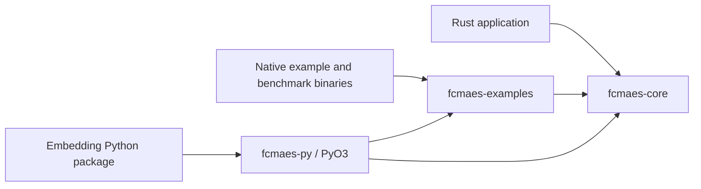

# Architecture

## Workspace

The workspace has three crates:

| Crate | Responsibility |
|---|---|
| `crates/fcmaes-core` | Pure-Rust fitness layer, RNG, optimizers, and retry coordinators |
| `crates/fcmaes-py` | Optional PyO3 extension module named `_fcmaes_ext` |
| `examples` (`fcmaes-examples`) | Native GTOP and application objectives, data adapters, optimizer runners, and binaries |

`fcmaes-core` does not depend on Python or the examples crate. The bindings
depend on both because they expose optimizer and GTOP functions. Native Rust
applications can depend only on `fcmaes-core` unless they need the GTOP
catalog.

## Core module map

| Module | Main public surface |
|---|---|
| `fitness` | `Objective`, `Fitness`, `NAN_REPLACEMENT` |
| `rng` | `Rng` |
| `de` | `De`, `DeParams`, `DeResult` |
| `cmaes` | `Cmaes`, `CmaesParams`, `AcmaResult` |
| `crfmnes` | `Crfmnes`, `CrfmnesParams`, `CrfmnesResult` |
| `pgpe` | `Pgpe`, `PgpeParams`, `PgpeResult` |
| `da` | `optimize_da`, `DaParams`, `DaResult` |
| `biteopt` | `optimize_bite`, `BiteOpt`, `DeepBiteOpt`, parameters and results |
| `retry` | `retry`, `advanced_retry`, configurations, contexts, bounds, and results |
| `moretry` | weighted scalarization retry, vector result retention, Pareto indices |
| `mode` | constrained multi-objective DE/NSGA-II ask/tell optimizer |
| `mapelites` | CVT archive, MAP-Elites emitters, and Diversifier |

The crate root re-exports the main types, so users normally import from
`fcmaes_core` rather than individual modules.

## Objective and fitness flow

Optimizers receive an `Objective` separately from `Fitness`. `Fitness` owns
dimension and bound information, optional normalized coordinates, evaluation
counting, non-finite-value sanitization, and population evaluation. It does not
own a callback.

For scalar objectives, the blanket implementation for synchronized Rust
functions uses `eval_scalar` directly and avoids allocating a one-element
result vector. `Mode` consumes objective-plus-constraint batches, while
`moretry` exposes each vector objective through a weighted scalar view.

Bounded optimization can operate directly in real coordinates or in a
normalized `[-1, 1]` box. Call `Fitness::set_normalize(true)` before creating
an optimizer that should use normalized coordinates. CMA-ES, PGPE, and the
native examples use normalization where appropriate.

## Concurrency model

Three concurrency boundaries matter:

1. `retry` and `advanced_retry` create a fixed Rayon pool per call. Workers
   atomically claim restart IDs and optimize outside the result-store lock.
2. `Fitness::eval_population*` can evaluate one optimizer population in
   parallel. `workers == 1` is serial, positive values request that many
   threads, and non-positive values use the global Rayon pool.
3. Python objectives reacquire the GIL for each callback. Native scheduling
   and optimizer work can run concurrently, but cheap pure-Python objective
   bodies remain GIL-bound.

Do not blindly use 16 retry workers and 16 population workers. That can create
nested parallelism. The native GTOP drivers use retry-level parallelism and
keep each DE→CMA optimizer serial.

## Optional PyO3 path

The `fcmaes-py` crate exposes optimizer functions, ask/tell classes, retry,
MODE, QD, and GTOP functions. Native optimizer loops release the GIL and
reacquire it only for Python objective callbacks. It is an embedding surface,
not a bundled Python facade or distribution; downstream packages decide how to
convert bounds, package results, persist archives, and expose plotting.

## Current boundaries

The following are implemented in Rust:

- DE, active CMA-ES, CR-FM-NES, PGPE, Dual Annealing, and BiteOpt.
- Basic and coordinated advanced retry.
- Weighted multi-objective retry, MODE, CVT-MAP-Elites, and Diversifier.
- GTOP objective functions and native GTOP, Mazda MO/QD, trading,
  material-flow, flexible job-shop/harvesting, spherical t-design,
  transfer-scheduling, damp-control, F-8, and Lotka-Volterra drivers.
- Python bindings for the implemented optimizers, retry, MODE, QD, and GTOP.

The following are deliberately outside this Rust workspace:

- MAP-Elites persistence, shared-memory statistics, and plotting orchestration.
- Python package facades and integrations with SciPy, pygmo, or plotting tools.
- The generated Mazda response-surface library, which remains an optional
  external model consumed through its published ABI.
