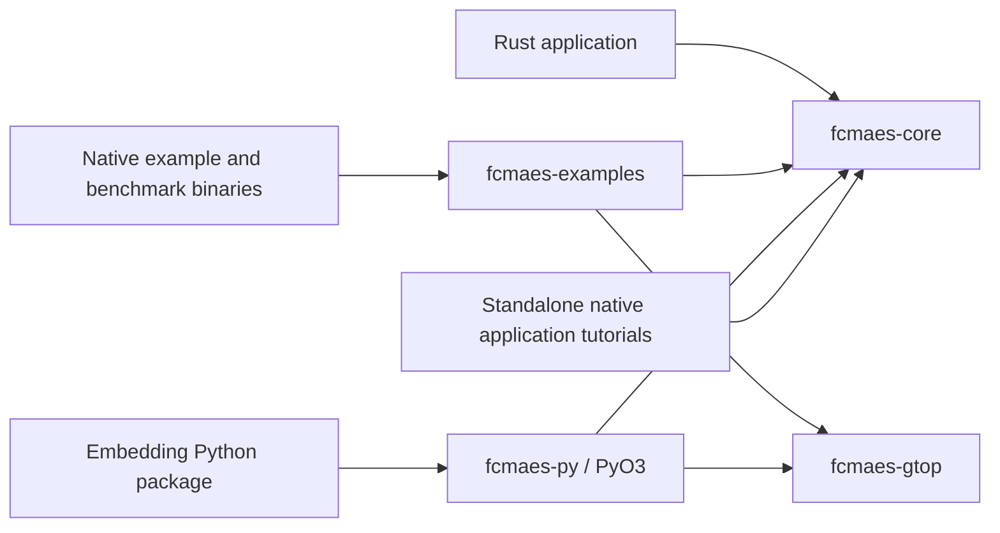

# Architecture

The optimization engine is implemented entirely in Rust. `fcmaes-core` does
not compile, link, load, or invoke the historical fast-cma-es C++ backend.
References to C++ in source comments document behavioral provenance and parity;
they do not identify a runtime or build dependency.

## Workspace

```mermaid
flowchart LR
    R[Rust application] --> C[fcmaes-core]
    E[Native example and benchmark binaries] --> X[fcmaes-examples]
    X --> C
    X --> G[fcmaes-gtop]
    P[Embedding Python package] --> B[fcmaes-py / PyO3]
    B --> C
    B --> G
    T[Standalone native application tutorials] --> C
```

The workspace has four crates:

| Crate | Responsibility |
|---|---|
| `crates/fcmaes-core` | Pure-Rust fitness layer, RNG, optimizers, and retry coordinators |
| `crates/fcmaes-gtop` | Internal dependency-free GTOP objective library shared by examples and Python |
| `crates/fcmaes-py` | Optional PyO3 module packaged as `fcmaes_rust._fcmaes_ext` |
| `examples` (`fcmaes-examples`) | Native GTOP and application objectives, data adapters, optimizer runners, and binaries |

`fcmaes-core` does not depend on Python, GTOP, or the examples crate. The
bindings depend only on the core and focused GTOP crates; application
examples, networking dependencies, and large example data are excluded from
the Python package. Native Rust applications can depend only on `fcmaes-core`
unless they need the internal GTOP catalog.

The twelve application directories below `tutorials/` are standalone Cargo
workspaces, not root members. This isolates application dependencies and
result artifacts while reusing the local core. The room-ventilation tutorial
demonstrates a purpose-built native simulation backend: each candidate owns its
D2Q9 flow and D2Q5 pollutant state, so population parallelism remains at the
fcmaes layer. The ML tutorial similarly keeps every tree fit and probability
prediction in Rust while using disjoint tuning, selection, and final datasets.
The neural-controller tutorial keeps stochastic rollout evaluation in Rust and
uses PGPE and CR-FM-NES for fixed-topology direct policy search.

## Core module map

| Module | Main public surface |
|---|---|
| `fitness` | `Objective`, `Fitness`, `NAN_REPLACEMENT` |
| `rng` | `Rng` |
| `de` | `De`, `DeParams`, `DeResult` |
| `cmaes` | `Cmaes`, `CmaesParams`, `AcmaResult` |
| `crfmnes` | `Crfmnes`, `CrfmnesParams`, `CrfmnesResult` |
| `pgpe` | `Pgpe`, `PgpeParams`, `PgpeResult` |
| `da` | `optimize_da`, `DaParams`, `DaResult` |
| `biteopt` | `optimize_bite`, `BiteOpt`, `DeepBiteOpt`, parameters and results |
| `retry` | `retry`, `advanced_retry`, configurations, contexts, bounds, and results |
| `moretry` | weighted scalarization retry, vector result retention, Pareto indices |
| `mode` | constrained multi-objective DE/NSGA-II ask/tell optimizer |
| `mapelites` | CVT archive, MAP-Elites emitters, and Diversifier |

The crate root re-exports the main types, so users normally import from
`fcmaes_core` rather than individual modules.

## Objective and fitness flow

Optimizers receive an `Objective` separately from `Fitness`. `Fitness` owns
dimension and bound information, optional normalized coordinates, evaluation
counting, non-finite-value sanitization, and population evaluation. It does not
own a callback.

For scalar objectives, the blanket implementation for synchronized Rust
functions uses `eval_scalar` directly and avoids allocating a one-element
result vector. `Mode` consumes objective-plus-constraint batches, while
`moretry` exposes each vector objective through a weighted scalar view.

Bounded optimization can operate directly in real coordinates or in a
normalized `[-1, 1]` box. Call `Fitness::set_normalize(true)` before creating
an optimizer that should use normalized coordinates. CMA-ES, PGPE, and the
native examples use normalization where appropriate.

## Concurrency model

Three concurrency boundaries matter:

1. `retry` and `advanced_retry` create a fixed Rayon pool per call. Workers
   atomically claim restart IDs and optimize outside the result-store lock.
2. `Fitness::eval_population*` and `parallel_batch` can evaluate one optimizer
   population in parallel. `workers == 1` is serial, positive values request
   that many threads, and non-positive values use the global Rayon pool.
3. Python objectives reacquire the GIL for each callback. Native scheduling
   and optimizer work can run concurrently, but cheap pure-Python objective
   bodies remain GIL-bound.

Do not blindly use 16 retry workers and 16 population workers. That can create
nested parallelism. The native GTOP drivers use retry-level parallelism and
keep each DE→CMA optimizer serial.

QD batch evaluation follows the same split: `map_elites_batch` and
`diversify_batch` may evaluate a candidate population concurrently, while
`Archive::update_evaluated` applies results serially in candidate order. This
avoids archive locks and keeps seeded runs independent of worker scheduling.

## Optional PyO3 path

The `fcmaes-py` crate exposes optimizer functions, ask/tell classes, retry,
MODE, QD, and GTOP functions. Native optimizer loops release the GIL and
reacquire it only for Python objective callbacks. Maturin packages the
extension behind the `fcmaes_rust` facade. The facade deliberately retains
the extension's low-level tuples, dictionaries, and NumPy arrays; persistence,
plotting, and higher-level result adapters remain downstream concerns.

## Current boundaries

The following are implemented in Rust:

- DE, active CMA-ES, CR-FM-NES, PGPE, Dual Annealing, and BiteOpt.
- Basic and coordinated advanced retry.
- Weighted multi-objective retry, MODE, CVT-MAP-Elites, and Diversifier.
- GTOP and Mazda objective functions and native GTOP, Mazda MO/QD, trading,
  material-flow, flexible job-shop/harvesting, spherical t-design,
  transfer-scheduling, Buckingham–Pi dimensional analysis, damp-control, F-8,
  and Lotka-Volterra drivers.
- Standalone application tutorials for NeXosim, Rapier, ReBop, Brahe,
  RustPower, SmartCore hyperparameter tuning, atmospheric dispersion, and room
  ventilation, plus native neural-controller policy search, pykep-core GTOC1,
  sindr AC circuit design, and validated thevenin transient design. The
  ventilation backend is deliberately educational and is
  accompanied by reference, held-out, and grid-sensitivity evidence rather
  than engineering claims.
- Python bindings for the implemented optimizers, retry, MODE, QD, and GTOP.

The following are deliberately outside this Rust workspace:

- General MAP-Elites persistence and shared-memory statistics. The GitHub
  tutorials include application-specific CSV persistence and offline plotting.
- Python package facades and integrations with SciPy, pygmo, or plotting tools.
