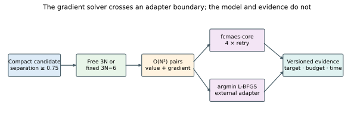
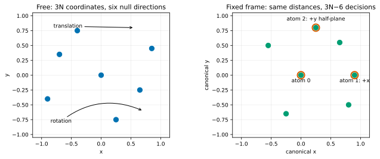
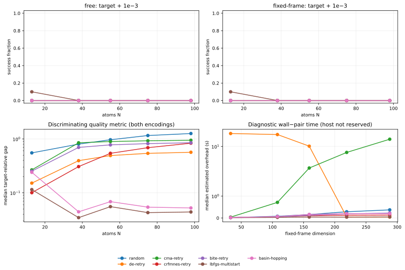
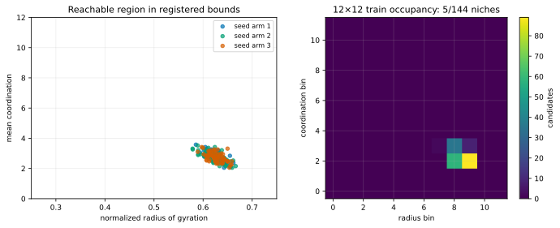

# Lennard-Jones clusters: where gradients should win

The Lennard-Jones study extends Foundations from small teaching functions to
one continuous problem family whose dimension grows from 33 to 294 while its
physics stays unchanged. It is intentionally also a boundary example:
Lennard-Jones energy has an inexpensive analytic gradient, so a gradient
solver is the correct first choice. The `fcmaes-core` arms measure how its
bounded, gradient-free methods scale; they are not presented as the preferred
tools for molecular structure prediction.

The source-cited targets are *putative* minima from the
[Cambridge Energy Landscape Database table](https://www-wales.ch.cam.ac.uk/~jon/structures/LJ/tables.150.html).
Neither this guide nor the database table proves global optimality.



## The model

For atoms at positions `x_i` and reduced units `epsilon = sigma = 1`, the
minimized energy is

```text
E(x) = 4 Σ_{i<j} (r_ij^-12 - r_ij^-6),  r_ij = |x_i - x_j|.
```

The implementation evaluates every pair once and accumulates energy and the
analytic Cartesian gradient in the same traversal. It uses a finite
quadratic continuation in squared distance below `r = 0.75`. The continuation
matches value and first derivative at the boundary and becomes monotonically
worse toward coincidence. `overlap_pairs` makes use of the guard visible in
every artifact. The compact initializer itself keeps atoms at least `0.75`
apart.

Two encodings expose rather than hide geometric redundancy:

- `free` optimizes all `3N` coordinates. Translation and rotation leave the
  objective unchanged, so six flat directions remain for a non-linear
  cluster.
- `fixed-frame` places atom 0 at the origin, atom 1 on positive `x`, and atom
  2 in the positive-`y` half of the `xy` plane. This leaves `3N-6` decisions.
  Encoding selects non-degenerate anchors and canonicalizes any supplied
  structure by a rigid transform.



The frozen cube half-width is `1.5 N^(1/3)`. Every arm uses the same compact
initializer family: rejection-sampled candidates from a sphere of radius
`0.8 N^(1/3)`, under deterministic arm-specific seed streams, not uniform
samples from a mostly dissociated cube. Population methods project a
candidate back to the declared box if numerical optimizer steps cross it, and
the artifact records `projected_candidates`.

## What is compared

The selected sizes alternate relatively accommodating and difficult
landscapes:

| N | Free dimension | Fixed dimension | Source-cited putative energy | Character |
|---:|---:|---:|---:|---|
| 13 | 39 | 33 | -44.326801 | complete icosahedron |
| 38 | 114 | 108 | -173.928427 | competing fcc/icosahedral funnels |
| 55 | 165 | 159 | -279.248470 | Mackay icosahedron |
| 75 | 225 | 219 | -397.492331 | Marks decahedral structure |
| 98 | 294 | 288 | -543.665361 | Leary tetrahedral structure |

The Cambridge overview describes N=38 and the Marks-decahedral sizes as stiff
tests for putative global optimization. The
[LJ38 landscape discussion](https://www-wales.ch.cam.ac.uk/~jon/forest/LJ.html)
also explains why one mean energy would hide the important funnel behavior.

Each row is one independent root seed. The arms are:

| Arm | Purpose |
|---|---|
| `random` | equal-budget compact-candidate control |
| `lbfgs-multistart` | required analytic-gradient reference using `argmin` |
| `basin-hopping` | perturbed local-minimum reference |
| `de-retry`, `cma-retry`, `crfmnes-retry`, `bite-retry` | four schedule-independent retries under the same total pair budget |

The adapter dependency is a non-default feature of Foundations, not a
dependency of `fcmaes-core`. This is the interoperation pattern described in
[The optimizer boundary](../docs/optimizer-boundary.md): an external solver
uses the same model and evidence contract without expanding the core crate.

One energy-only call and one combined value/gradient evaluation each count as
one full `pair_traversal`. That is the primary equal budget within each cluster
size. `pair_terms_evaluated` multiplies it by `N(N-1)/2`, preventing a reader
from mistaking equal calls across sizes for equal compute. Objective calls,
gradient calls, measured pair time, wall time, overlap pairs, projections, and
estimated optimizer overhead are separate columns. The overhead value is
`max(wall - measured_pair_time, 0)` and is only an estimate: initialization,
locking, timing, and serialization are not perfectly separable.

Exact success means `energy <= source-cited target + 1e-3`. Best achieved
objective and target-relative gap remain visible when that strict indicator is
sparse; 1%, 5%, and 10% attainment are secondary summaries. Ten independent
seeds are required before the results can be described as a comparison. The
smoke preset has two seeds and is only a deterministic adapter/conformance
check.

## Run and audit

Inspect a model without enabling the gradient dependency:

```bash
cd foundations
cargo run --release --locked -- \
  --suite lennard-jones --atoms 38 --parameterization fixed-frame
```

Run the small conformance protocol or the ten-seed publication protocol:

```bash
cargo run --release --locked --features gradient-reference -- \
  --lj-campaign --preset smoke --workers 2 --seed 42 \
  --output results/smoke

cargo run --release --locked --features gradient-reference -- \
  --lj-campaign --preset publication --workers 0 --seed 42 \
  --output results/publication
```

`--workers 0` uses available parallelism for independent case rows. Each
population optimizer and each retry is single-threaded inside that outer
layer, preventing nested oversubscription. Seeds come from `(root_seed,
run_id)`, and rows are sorted before serialization.

No Cambridge coordinate file is redistributed. If you obtained an XYZ or
plain coordinate file under its own terms, audit it explicitly:

```bash
cargo run --release --locked -- \
  --suite lennard-jones --atoms 38 --parameterization fixed-frame \
  --reference-file /path/to/LJ38.xyz
```

The command prints measured energy, target, absolute error, and whether it
meets `1e-6`, together with the file's SHA-256 hash. Missing or malformed files
are errors; there is no embedded or identity fallback.

To reproduce the publication audit without retaining the coordinates:

```bash
audit_dir=$(mktemp -d)
for n in 13 38 55 75 98; do
  curl -fsSL "https://www-wales.ch.cam.ac.uk/~jon/structures/LJ/points/$n" \
    -o "$audit_dir/$n"
done
cargo run --release --locked --features gradient-reference -- \
  --lj-campaign --preset publication --workers 0 --seed 42 \
  --output results/publication --reference-directory "$audit_dir"
```

The checked-in run independently reproduced all five targets within `4.9e-7`.
Its [audit manifest](results/publication/lennard-jones/reference-audit.json)
retains source URLs, hashes, and residuals while the coordinate files remain
outside the repository.

## Population and CR-FM-NES configuration

The comparison intentionally uses each core optimizer's declared policy, not
one matched population size. Each retry receives 5,000 of the 20,000 pair-loop
traversals:

| Arm | Population policy | Full generations/retry, fixed LJ13 → LJ98 |
|---|---|---:|
| DE | core default `15d` | 10 → 1 |
| CMA-ES | core default `floor(4 + 3 ln d)` | 357 → 250 |
| CR-FM-NES | calibrated 16 | 312 → 312 |
| BiteOpt | population-free | not applicable |

This is consequently evidence about these explicit policies, not abstract
algorithms under matched populations. In particular, DE's `15d` default leaves
only one full generation per large-cluster retry.

The first run also exposed a poor CR-FM-NES scale choice. A disjoint,
three-seed sensitivity check crossed normalized sigma `{0.05, 0.15, 0.50}`
with population `{16, 32, 64}` at LJ13, LJ38, and LJ98. It selected
`sigma=0.05`, population 16 by pooled median target-relative gap, replacing the
initial `0.15/32` configuration before the primary ten-seed rerun. The full
[81-row sensitivity table](results/publication/lennard-jones/crfmnes-configuration.csv)
is retained as a post-hoc configuration diagnostic, not ranking evidence.

## Measured scaling evidence

The checked-in `publication` run contains ten seeds, 20,000 full pair-loop
traversals per arm, both encodings, and all five sizes. Because exact success is
rare, the most informative compact comparison is the best achieved objective
across the 20 runs for each size and arm. Lower is better; bold indicates the
best arm, not a newly established minimum.

| N | Putative target | L-BFGS | Basin hopping | CR-FM-NES | DE | CMA-ES | BiteOpt | Random |
|---:|---:|---:|---:|---:|---:|---:|---:|---:|
| 13 | -44.327 | **-44.327** | -41.472 | -41.472 | -39.781 | -37.325 | -35.228 | -21.328 |
| 38 | -173.928 | **-169.885** | -169.792 | -138.330 | -113.537 | -58.253 | -62.958 | -56.403 |
| 55 | -279.248 | **-270.652** | -264.143 | -146.454 | -152.440 | -41.648 | -74.791 | -37.649 |
| 75 | -397.492 | **-386.015** | -382.717 | -146.665 | -203.393 | -36.682 | -79.369 | -4.004 |
| 98 | -543.665 | **-532.553** | -526.787 | -113.023 | -244.924 | -42.938 | -97.078 | 59.666 |

The strict and tiered attainment counts aggregate 100 cells per arm: five
sizes × two encodings × ten seeds.

| Arm | Exact `+1e-3` | Within 1% | Within 5% | Within 10% |
|---|---:|---:|---:|---:|
| L-BFGS multistart | 2 | 2 | 61 | 85 |
| Basin hopping | 0 | 0 | 26 | 72 |
| CR-FM-NES retry | 0 | 0 | 0 | 9 |
| DE retry | 0 | 0 | 0 | 0 |
| CMA-ES retry | 0 | 0 | 0 | 0 |
| BiteOpt retry | 0 | 0 | 0 | 0 |
| Random | 0 | 0 | 0 | 0 |

Thus the exact criterion remains honest, while the objective and
target-relative gap expose the quality ordering. This does not show that
L-BFGS is a complete cluster-search strategy: it reaches the exact threshold
in only 2% of its cells. It does show that ignoring the inexpensive analytic
gradient would be especially hard to justify at this budget.



Full precision is in
[`results/publication/lennard-jones/scaling.csv`](results/publication/lennard-jones/scaling.csv)
and the complete decisions and protocol metadata are in
[`run.json`](results/publication/lennard-jones/run.json). Wall times describe
the recorded machine and run, not a machine-independent library property.
The host was not reserved exclusively for this run, so the overhead panel is
diagnostic instrumentation rather than a cross-library timing claim; rerun on
an idle host before using its crossover points for a deployment decision.

## Descriptor pilot: rejected

The optional quality-diversity proposal pre-registered normalized radius of
gyration and mean coordination at cutoff `1.35`. Three deterministic arms of
64 compact candidates reached only 3.01% mean coverage of the 12×12 grid,
below the frozen 8% gate. All other gates passed, including 92.71% same-niche
retention after an independent `N(0, 0.01)` coordinate perturbation. The
verdict is therefore `rejected`, and the QD campaign is explicitly skipped.



The complete measurements and thresholds are in
[`pilot.md`](results/publication/lennard-jones/pilot/pilot.md), with every
candidate in `pilot.csv`. Bounds were not narrowed after seeing the sparse
archive. The rejection is useful evidence: morphology descriptors are
scientifically interpretable, but this compact candidate generator does not
support the intended repertoire claim.

## What this study can and cannot establish

It can test the model, analytic gradient, parameterizations, adapter boundary,
schedule-independent retry, high-dimensional optimizer overhead, and success
frequency under one frozen protocol. It cannot prove a global minimum,
establish an all-purpose optimizer ranking, replace specialist cluster-search
methods, or support conclusions about Bayesian optimization: the pair
potential is cheap and parallel.
