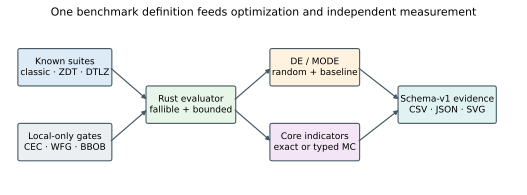
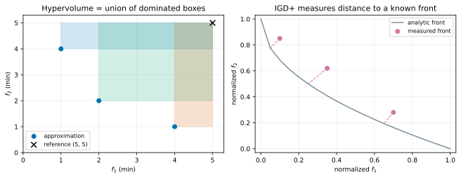
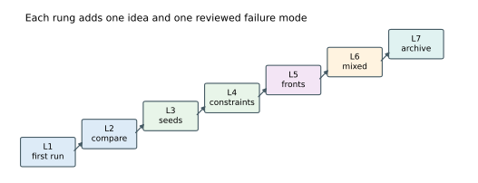
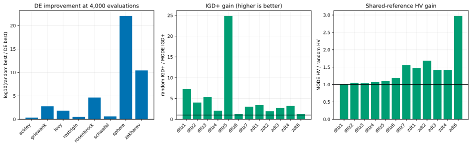

# Foundations: standard suites, measured fronts, and a seven-step on-ramp

`foundations/` is the small, referenceable side of fcmaes-rust. It combines
one-seed conformance runs over eight classic scalar functions, ZDT1–4/ZDT6 and
DTLZ1–7; a separate ten-seed continuous Lennard-Jones scaling comparison;
audited multi-objective quality indicators; and seven lessons that run in well
under a minute. Known values and analytic fronts make it possible to test
measurement code independently of optimizer success.

This is a user guide, not application tutorial number 23:

| Directory | Contains | Reader question |
|---|---|---|
| `foundations/` | standard suites, indicators, seven short lessons | How do I start, and can I measure a known problem? |
| `examples/` | GTOP, Mazda, trading, jobshop, UAV and other bespoke objectives | What does a realistic objective look like? |
| `tutorials/` | 22 simulator-in-the-loop studies with frozen protocols | How do I run a defensible campaign end to end? |

The exact contracts are frozen in [BENCHMARK_SPEC.md](BENCHMARK_SPEC.md).
[PROVENANCE.md](PROVENANCE.md) records formula sources and why CEC data is
loaded locally while WFG/BBOB remain explicit evidence-gate skips.

Throughout this guide, `MODE` names the optimizer rather than a particular
population-update policy. Lessons L4–L6 and the publication campaign retain
the `ModeParams` default `nsga_update=true`, so they use MODE's NSGA-II-style
population update. MODE also supports its DE update with
`nsga_update=false`; that alternative is not evaluated by Foundations.
The analytic suite objectives are intentionally evaluated sequentially because
thread dispatch would dominate their cost. For costly objectives, evaluate
the decisions returned by `Mode::ask()` with
[`parallel_batch`](../docs/architecture.md#concurrency-model); it uses cached
Rayon pools and preserves candidate order before `Mode::tell()`.

The [Lennard-Jones extension](LENNARD_JONES.md) grows one analytic problem
from 33 to 294 variables and deliberately includes external L-BFGS references.
It demonstrates the documented optimizer boundary instead of implying that a
gradient-free global method is the right default for a smooth pair potential.



## Run it

From the standalone directory:

```bash
cd foundations
cargo test --locked
cargo run --release --locked -- --lesson all --workers 2
cargo run --release --locked -- --suite zdt3
cargo run --release --locked -- --suite lennard-jones --atoms 38
cargo run --release --locked -- \
  --campaign --preset smoke --workers 2 --seed 42 \
  --output results/smoke
```

Reproduce the checked-in conformance evidence and figures:

```bash
cargo run --release --locked -- \
  --campaign --preset publication --workers 2 --seed 42 \
  --output results/publication
../tutorials/python/.venv/bin/python plot_results.py --check
```

The separate Lennard-Jones evidence requires the optional gradient adapter:

```bash
# Populate this temporary directory with Cambridge point files named
# 13, 38, 55, 75, and 98; LENNARD_JONES.md gives the complete download loop.
audit_dir=/path/to/temporary/cambridge-points
cargo run --release --locked --features gradient-reference -- \
  --lj-campaign --preset publication --workers 0 --seed 42 \
  --output results/publication --reference-directory "$audit_dir"
```

The `publication` preset names the checked-in artifact size; it does not make
the run a statistical benchmark. It uses one seed, 4,000 scalar evaluations,
and 4,096 multi-objective evaluations per optimized/control arm. Its
2026-07-31 analytic run took 0.47 seconds after compilation on a Ryzen 9
9950X. The analytic suite and MODE population evaluations are sequential;
`--workers 2` only exercises the schedule-independence check in L3. The
separate Lennard-Jones evidence contains 700 case rows whose recorded
single-worker case times sum to 1,911.8 seconds, scheduled over 32 outer
workers. Both timings are provenance, not parallel-scaling or cross-library
benchmarks.

## Why the indicators live in `fcmaes-core`

Hypervolume, IGD/IGD+, GD/GD+, additive epsilon, spacing, and spread are useful
outside this guide, so their implementation is
[`fcmaes_core::indicators`](../crates/fcmaes-core/src/indicators.rs). The API:

- rejects empty, non-finite, dimensionally inconsistent input;
- requires an explicit hypervolume reference point;
- reports duplicate collapse and dominated-point removal;
- computes exact hypervolume through four objectives;
- returns a different enum variant for Monte Carlo hypervolume; and
- reports the Monte Carlo seed, sample count, and standard error.

The 2-D fixture below has hypervolume 11 relative to `(5, 5)`. The tests also
compare exact and sampled volume, check 10,000 strict-dominance pairs, and
assert the correct translation/scaling behavior.



## Suite status

| Suite | Status | Independent check |
|---|---|---|
| Classic 8 | implemented | known decisions at dimensions 2, 10 and 40 |
| ZDT1–4, ZDT6 | implemented | analytic relation and nondominance |
| DTLZ1–7 | implemented | simplex/sphere/degenerate/disconnected geometry |
| CEC | loader only | synthetic shift/rotation round trip; no silent fallback |
| WFG1–9 | skipped | independently sourced fixed-point fixtures unavailable |
| BBOB 24 | skipped | independently sourced fixed-point fixtures unavailable |
| Lennard-Jones 13/38/55/75/98 | implemented | analytic gradient, pair fixtures, rigid-transform invariance, and independently recorded publication-coordinate audit |

ZDT3 samples only its five nondominated intervals. DTLZ5/6 sample their
degenerate manifold; DTLZ7 maps a deterministic sequence over its disconnected
intervals. Asking for the same reference-set size returns the same points
without an RNG seed.

## The lesson ladder

Each lesson source is at most 120 lines, each section below is at most 90
lines, and the complete stdout is checked byte for byte against
[`results/expected/ladder.txt`](results/expected/ladder.txt).



### L1 — first bounded retry

```bash
cargo run --release --locked -- --lesson 1
```

Construct `RetryBounds`, give each DE restart a finite budget and seed, then
read the retained best result. The objective remains a plain Rust closure.

### L2 — four optimizers, one budget

```bash
cargo run --release --locked -- --lesson 2
```

CMA-ES, DE, BiteOpt, and CR-FM-NES each receive 1,500 Rastrigin-10 evaluations.
The row is illustrative rather than a ranking: one seed and one function are
not evidence that an optimizer is generally superior.

### L3 — workers must not choose seeds

```bash
cargo run --release --locked -- --lesson 3 --workers 8
```

Eight DE runs derive seeds from `(root_seed, run_id)` before ordered parallel
evaluation. The lesson asserts byte-identical serial and parallel result
vectors. Worker scheduling is execution policy, not experimental randomness.

### L4 — finite objectives and explicit constraints

```bash
cargo run --release --locked -- --lesson 4
```

MODE receives one finite objective followed by one constraint, feasible at
`<= 0`. `NAN_REPLACEMENT` is reserved for numerical failure; `1e99` is not
used as a hidden physical constraint that flattens the useful landscape.

### L5 — measure the front

```bash
cargo run --release --locked -- --lesson 5
```

MODE approximates ZDT1, then the lesson reports hypervolume and IGD+ against
501 analytic reference points. Its front-derived reference covers the complete
front. The conventional fixed box is reported as ineligible if any point lies
outside; points are never removed to manufacture a partial hypervolume.

This cheap teaching objective uses a serial iterator. When each population
member is costly and independent, the corresponding ask/tell pattern is:

```rust
use fcmaes_core::parallel_batch;

let decisions = mode.ask();
let values = parallel_batch(&decisions, workers, |x| expensive_objective(x));
mode.try_tell(&values)?;
```

`workers=1` remains serial, a positive value selects an explicitly sized
cached pool, and a non-positive value uses the global Rayon pool. Avoid nested
retry and population parallelism unless the CPU budget is partitioned
deliberately.

### L6 — mixed variables need two layers

```bash
cargo run --release --locked -- --lesson 6
```

MODE's integer mask changes mutation behavior. The application still decodes
the physical category by rounding/clamping a coordinate bounded in `[0, 8)`.
Applying the mask to a normalized `[0, 1]` category without a decoder would be
the wrong abstraction.

### L7 — ask the archive for its shape

```bash
cargo run --release --locked -- --lesson 7
```

A regular two-dimensional `Archive` with capacity 120 reports its exact native
`12×10` layout. Plotters and manifests consume `grid_layout()` instead of
independently guessing `floor(sqrt(capacity))`; `layout.cells()` remains exact
for ragged capacities such as 60, where the maximum `9×7` rectangle contains
three positions that are not archive niches.

## Checked-in conformance evidence

The compact tables make the measurement path auditable:

- requested and actual evaluations remain separate;
- initial controls are nested;
- every front records its normalization and shared reference;
- fixed-box ineligibility remains null instead of being filtered; and
- deterministic rechecks have zero discrepancy.

As a basic outcome check, DE improves over random search on all eight scalar
functions at the same requested budget. The initial row is a 31-member random
population—not the box center, which would leak the exact optimum on symmetric
functions. It contains the first 31 points of the random arm's stream. The
identical Griewank initial/random values therefore mean that the next 3,969
samples did not improve the incumbent; they are not a seeding bug.

| Problem | Initial | Random | DE |
|---|---:|---:|---:|
| Ackley | 19.2 | 18.5 | 8.05 |
| Griewank | 48.0 | 48.0 | 0.0811 |
| Levy | 29.8 | 12.2 | 0.179 |
| Rastrigin | 110 | 74.9 | 24.3 |
| Rosenbrock | 1.90e5 | 2.47e4 | 0.564 |
| Schwefel | 2.99e3 | 1.87e3 | 454 |
| Sphere | 54.1 | 16.5 | 1.41e-21 |
| Zakharov | 7.54e4 | 77.4 | 2.94e-9 |

Both optimized/control arms request 4,000 evaluations. Random uses exactly
4,000; DE finishes its current population batch and records 4,006–4,029 actual
evaluations, a maximum 0.73% overshoot. The result CSV exposes both counts.

MODE with its default NSGA-II-style population update improves both
shared-reference hypervolume and IGD+ over the equal-budget random control on
all twelve multi-objective problems. This evidence does not compare MODE's two
update policies. Unlike scalar DE, MODE and its random control both use exactly
their requested 4,096 evaluations.

Each problem uses one reference shared by its initial, random, MODE, and
convergence fronts: the component-wise union nadir plus 10% of
`max(observed range, 1)` after analytic normalization. Every complete front
therefore contributes positive volume. Hypervolume values are comparable
between arms of one problem, not across problems.

The conventional fixed `[1.1; m]` result remains a secondary nullable column.
Because 33 of 36 fronts cross that box, their fixed-box value is
`not-applicable-outside-reference` rather than a filtered zero.

| Problem | Initial HV | Random HV | MODE HV | Random IGD+ | MODE IGD+ |
|---|---:|---:|---:|---:|---:|
| DTLZ1 | 3.025e8 | 3.187e8 | 3.203e8 | 44.8 | 6.18 |
| DTLZ2 | 10.16 | 12.43 | 13.06 | 0.274 | 0.0679 |
| DTLZ3 | 2.215e9 | 2.725e9 | 2.821e9 | 401 | 75.6 |
| DTLZ4 | 6.358 | 10.47 | 11.22 | 0.474 | 0.231 |
| DTLZ5 | 13.38 | 16.25 | 17.83 | 0.254 | 0.0102 |
| DTLZ6 | 1,547 | 1,917 | 2,284 | 8.57 | 6.94 |
| DTLZ7 | 2.985 | 4.567 | 7.114 | 2.31 | 0.766 |
| ZDT1 | 3.012 | 3.616 | 5.337 | 1.90 | 0.560 |
| ZDT2 | 1.296 | 1.780 | 3.000 | 3.23 | 1.67 |
| ZDT3 | 2.075 | 2.559 | 3.620 | 0.999 | 0.370 |
| ZDT4 | 27.80 | 42.89 | 60.83 | 55.9 | 17.5 |
| ZDT6 | 0.3587 | 0.9399 | 2.796 | 7.50 | 6.12 |



The complete full-precision evidence starts at
[`results/publication/run.json`](results/publication/run.json): schema-v2
manifests, scalar arms, indicator rows, decisions with normalized fronts,
same-evaluator deterministic rechecks, convergence checkpoints, lesson stdout,
and WFG/BBOB skip records. The deterministic recheck detects evaluator
nondeterminism or front bookkeeping errors; it is not independent model
validation.

## Limitations

- These are unshifted/unrotated teaching functions, not a replacement for a
  full COCO/CEC experiment.
- One seed and a small budget demonstrate contracts; they do not establish an
  optimizer ranking.
- The CEC loader intentionally ships without competition data.
- WFG/BBOB stay skipped until primary-source fixed-point fixtures with clear
  redistribution terms are reviewed.
- Exact hypervolume is deliberately limited to four objectives; larger fronts
  use a labeled estimate with uncertainty.
- Lennard-Jones targets are source-cited putative minima, not mathematical
  proofs; no reference coordinates are redistributed.
