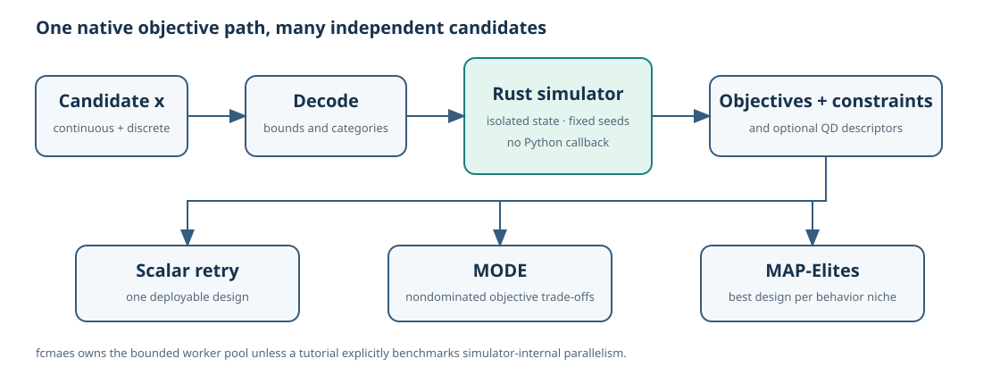
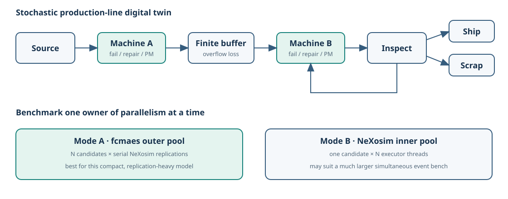
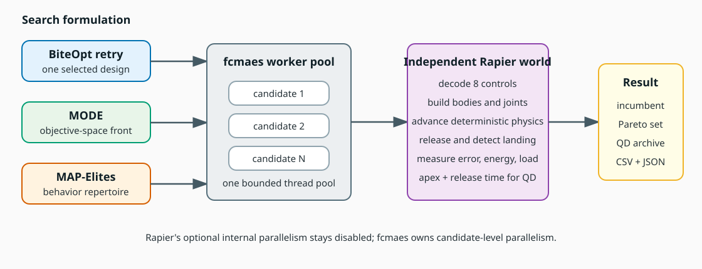
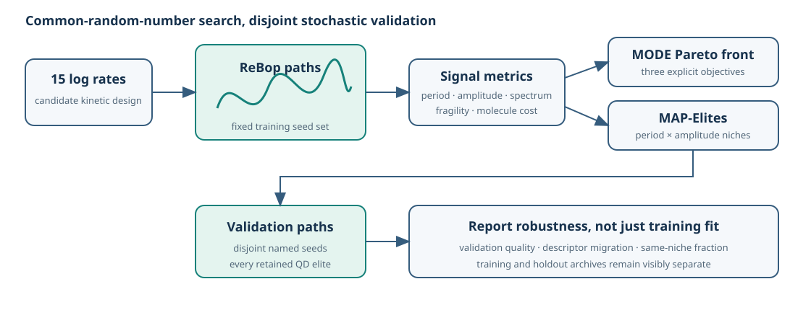
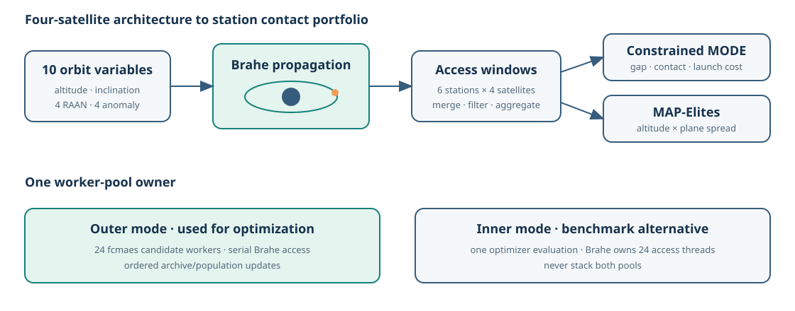
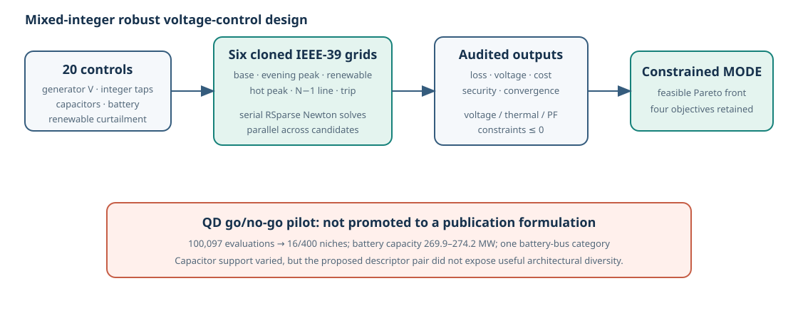
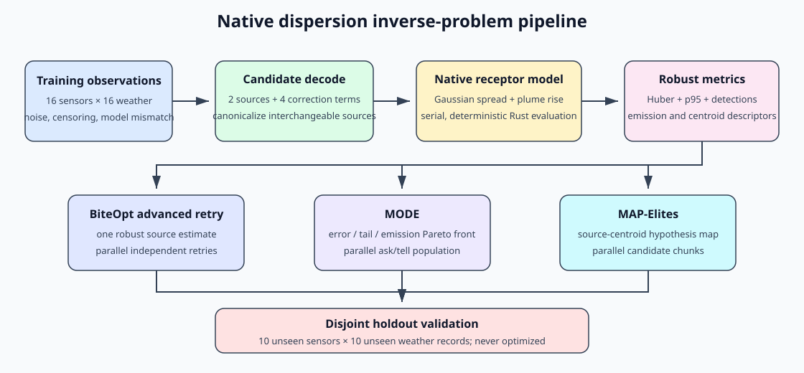
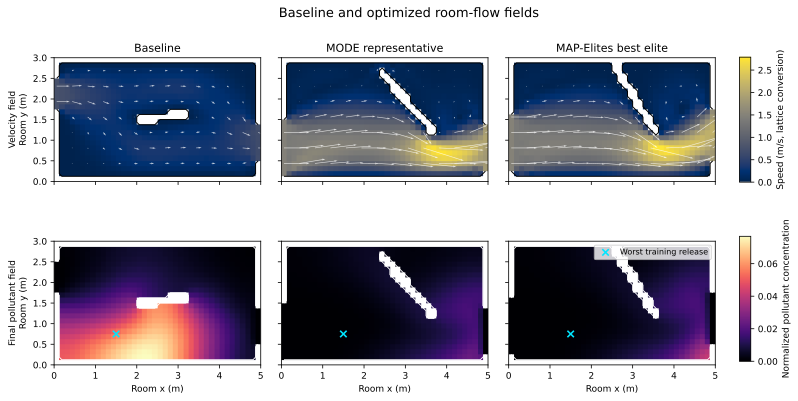
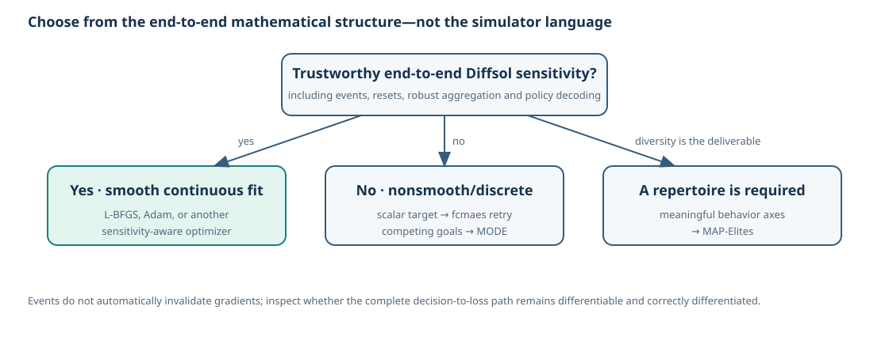

# Optimizing native Rust simulations with fcmaes-rust

## 1. Introduction

These tutorials show how to put a native Rust simulation directly inside an
`fcmaes-rust` objective. There is no Python callback or serialization boundary
between optimizer and simulator: a candidate is decoded, simulated and scored
in Rust, and independent candidates are distributed across native worker
threads.

The seven applications deliberately cover different reasons for choosing
gradient-free optimization:

| Tutorial | Simulator | Problem property | Implemented formulations | QD decision |
|---|---|---|---|---|
| [Production line](nexosim-production-line/) | NeXosim | stochastic discrete events and mixed controls | MODE + MAP-Elites | accepted |
| [Trebuchet](rapier-trebuchet/) | Rapier | contact, release and joint-limit discontinuities | BiteOpt retry + MODE + MAP-Elites | accepted |
| [Biochemical oscillator](rebop-oscillator/) | ReBop | intrinsically noisy stochastic reaction paths | BiteOpt retry + MODE + MAP-Elites | accepted |
| [Satellite constellation](brahe-constellation/) | Brahe | access-window appearance/disappearance and worst-gap aggregation | BiteOpt retry + constrained MODE + MAP-Elites | accepted |
| [Voltage control](rustpower-voltage-control/) | RustPower | mixed-integer controls, contingencies and power-flow failures | constrained MODE + MAP-Elites | MODE primary, QD secondary |
| [Atmospheric source localization](dispersion-source-localization/) | ISC-3-derived native model | inverse inference, censoring, model mismatch, and non-identifiability | BiteOpt advanced retry + MODE + MAP-Elites | accepted |
| [Room ventilation](cfd-room-ventilation/) | Custom D2Q9/D2Q5 Rust backend | variable geometry, numerical constraints, worst-case releases, and resolution sensitivity | BiteOpt retry + MODE + MAP-Elites | accepted |

Each directory is a standalone Cargo workspace. This keeps large,
simulator-specific dependency sets out of the main `fcmaes-rust` workspace
while using the same local core:

```toml
fcmaes-core = { path = "../../crates/fcmaes-core" }
```

Run commands from the repository root, for example:

```bash
cd tutorials/rapier-trebuchet
cargo run --release -- --help
```

### What you will learn

Across the series you will learn how to:

- wrap an expensive, nonsmooth Rust simulation as an optimizer objective;
- preserve mixed continuous, integer and categorical decisions;
- choose scalar retry, MODE or MAP-Elites from the result the application
  needs;
- use common random numbers and disjoint validation for noisy objectives;
- assign one owner to the CPU worker budget; and
- export native results for reproducible Python/Matplotlib analysis without
  putting Python in the hot evaluation path.

Prerequisites are a current stable Rust toolchain and a platform linker. Each
tutorial pins its standalone dependency graph in `Cargo.lock`. Figure
regeneration additionally needs Python 3.11 or newer:

```bash
cd tutorials/python
python -m venv .venv
.venv/bin/python -m pip install -r requirements-lock.txt
.venv/bin/python -m pip install --no-deps -e .
.venv/bin/python render_all.py --check
```

The quick commands are functional checks; the recorded publication commands
use 16 or 24 workers and range from seconds to several minutes per seed on the
documented Ryzen 9 9950X.

The examples follow four recurring rules:

1. Choose the required result first: one design, a Pareto front, or a
   behavior-diverse archive. Express genuinely distinct engineering goals as
   MODE objectives instead of hiding every preference in one penalty sum.
2. Report constraints explicitly, including simulation failure, whenever the
   formulation supports them.
3. Fix stochastic seed sets during optimization and validate against disjoint
   seeds afterward.
4. Give one layer ownership of parallelism. Benchmark simulator-internal
   parallelism against fcmaes candidate parallelism instead of enabling both
   pools blindly.

MODE and MAP-Elites answer different questions:

- MODE approximates a Pareto front: which feasible designs are nondominated
  over several competing objectives?
- MAP-Elites builds a repertoire: what is the best feasible design found in
  each user-defined behavior niche?

MAP-Elites is useful only when its descriptors express diversity that a user
would actually choose between. It is not a generic replacement for MODE, and
objective values should not be relabeled as descriptors without a reason.
The RustPower tutorial is the worked example: its first descriptor pair was a
pair of decision variables and reached 4% coverage, while emergent behavior
coordinates on the identical budget reached 68%. See the
[CVT-MAP-Elites and Diversifier guide](../docs/optimizers.md#cvt-map-elites-and-diversifier)
for the batch APIs, the [result schema](RESULT_SCHEMA.md), and the
[Python plotting package](python/) for reproducible figures.

The recorded timings are reproducibility checks from one machine, not
cross-library performance claims. Every detailed tutorial explains its model,
budgets, output files, limitations and validation strategy.



### Short glossary

- **Nondominated / Pareto point:** no retained feasible design is at least as
  good in every objective and strictly better in one.
- **Descriptor:** a measurable behavior or architecture coordinate used to
  organize a QD repertoire, not another name for the optimized objective.
- **Niche:** one archive cell or CVT region; it stores the best quality found
  for that descriptor region.
- **Coverage:** occupied niches divided by archive capacity.
- **QD score:** the sum of reciprocal positive minimized qualities used by the
  current archive implementation; higher is better only for the same
  descriptor bounds and archive geometry.

### Troubleshooting

- An empty or sparse QD archive usually means feasibility is too rare,
  descriptor bounds are wrong, or invalid simulations were correctly rejected.
  Inspect the invalid and clipping counts before increasing the budget. If the
  descriptors are themselves decision variables, no budget will help: the
  archive can only reach the part of that input space which is also feasible.
  See the RustPower tutorial for the measured before/after.
- If performance worsens as workers increase, check for a nested simulator
  thread pool. NeXosim and Brahe make the two ownership choices explicit.
- If stochastic elites move between niches on validation, increase replication
  count and show both training and holdout maps; do not hide the migration.
- Run `cargo test` and `cargo clippy --all-targets -- -D warnings` inside a
  standalone tutorial directory. The root workspace deliberately excludes
  these simulator-heavy crates.
- Run `python tutorials/python/check_docs.py` from the public repository root
  after moving result or image files.

## 2. NeXosim: production-line digital twin

[NeXosim](https://github.com/asynchronics/nexosim) is a component-oriented
discrete-event simulation framework. The tutorial models

```text
source → machine A → finite buffer → machine B → inspection
                                            ↘ rework or shipping
```

Orders, processing times, failures, repairs and quality outcomes are
stochastic. MODE chooses buffer capacity, machine speeds, maintenance
thresholds, rework routing, dispatch priority and staffing. It minimizes
negative throughput, lead time, work in progress, and energy/staffing cost.
Integer capacity and staffing decisions coexist with continuous policies.

MAP-Elites is implemented as the complementary operating-catalog view.
Achieved throughput and mean WIP form the two-dimensional behavior map;
lead time, cost and failure/overflow penalties determine within-niche quality.
Every retained policy is re-evaluated on disjoint stochastic seeds. Three
100,096-evaluation runs reached 30.583% mean coverage; only 38.908% of elites
remained in the same holdout niche, an important warning against hiding
simulation uncertainty.

This tutorial is primarily about parallel architecture. It compares:

- many serial NeXosim replications evaluated concurrently by fcmaes; and
- serial candidate evaluation where one NeXosim bench owns the thread pool.

Both modes use identical candidates, replications and total worker counts, so
the comparison does not hide nested oversubscription. For this small,
replication-heavy bench, outer fcmaes parallelism was much faster; a larger
model with more simultaneous component work can reverse that outcome.

```bash
cd tutorials/nexosim-production-line
cargo run --release -- \
  --strategy both --workers 16 \
  --evaluations 512 --popsize 32 \
  --replications 4 --horizon 240 --seed 42
```

See the [complete NeXosim tutorial](nexosim-production-line/README.md) for the
event model, common-random-number setup, benchmark interpretation and tests.



## 3. Rapier: discontinuous mechanical design

[Rapier](https://github.com/dimforge/rapier) supplies the rigid-body dynamics
for a two-dimensional trebuchet/robotic thrower. fcmaes chooses arm and sling
lengths, masses, initial and release angles, damping and pivot friction.

The projectile is attached through a rope joint and released when the arm
crosses the selected angle. Contact, joint limits and removal of the joint make
small parameter changes capable of producing qualitatively different
trajectories. Those discontinuities are exactly where finite-difference
gradients become unreliable.

The tutorial presents both:

- BiteOpt parallel retry for a scalar target-error/resource score; and
- MODE for the Pareto trade-off among landing error, available energy and peak
  pivot load.

MAP-Elites is implemented because mechanically different throws can be useful
even when they have similar scalar scores. Trajectory apex and release time
are behavior descriptors; target error, energy and peak load determine quality
inside each niche. Invalid releases are rejected. Across three
200,192-evaluation runs the archive reached 40.583% mean coverage with a
0.022% descriptor-clipping rate.

Rapier's internal parallel feature is disabled. Each physics evaluation is
deterministic and serial, while fcmaes distributes evaluations across workers.
The selected design can be replayed in a self-contained browser animation.

```bash
cd tutorials/rapier-trebuchet
cargo run --release -- \
  --mode all --workers 24 --target 35 \
  --evaluations 20000 --retries 24 \
  --mo-evaluations 200000 --popsize 256 \
  --qd-evaluations 200000 --qd-capacity 400 \
  --qd-chunk-size 256 --seed 42
```

See the [complete Rapier tutorial](rapier-trebuchet/README.md) for the physical
model, serious-run results, Pareto extremes and replay output.



## 4. ReBop: robust stochastic oscillator design

[ReBop](https://github.com/Net-Mist/rebop) simulates well-mixed stochastic
chemical reaction networks. This tutorial optimizes the logarithms of all 15
kinetic rates in the Vilar oscillator using its compiled macro DSL.

Every candidate is evaluated on the same named stochastic seed set. This
common-random-number design reduces comparison noise without pretending the
objective is deterministic. A disjoint holdout seed set is used only after
optimization, so the report exposes designs that overfit the training paths.

The scalar BiteOpt formulation combines period error, spectral impurity,
amplitude, autocorrelation, molecule count and failure rate. MODE separately
minimizes oscillation error, molecular resource use and stochastic fragility.
This is a native Rust example of robust optimization under intrinsic
simulation noise.

Mean oscillation period and amplitude are the implemented phenotype
descriptors, while spectral purity, molecule cost, fragility and failed-run
fraction determine cell quality. The archive answers “which robust circuit is
best for every reachable period/amplitude combination?” MODE remains present
for the three explicit objective trade-offs. Three 20,096-evaluation QD runs
reached 97.833% mean training coverage; every elite was then checked with
disjoint holdout seeds, and only 37.843% stayed in the same niche.

```bash
cd tutorials/rebop-oscillator
cargo run --release -- \
  --mode both --workers 24 --target-period 20 \
  --replications 4 --validation-replications 8 \
  --evaluations 2000 --retries 24 \
  --mo-evaluations 20000 --popsize 256 --seed 42
```

See the [complete ReBop tutorial](rebop-oscillator/README.md) for seed control,
signal metrics, training/holdout results and reaction-rate bounds.



## 5. Brahe: constellation access optimization

[Brahe](https://github.com/duncaneddy/brahe) provides orbit propagation,
ground-station data and access-window calculations. The tutorial chooses the
shared altitude and inclination plus independent RAAN and mean anomaly for four
satellites.

For six ground stations it propagates 24 hours, finds and merges access
windows, rejects short passes, then evaluates worst communication gap, total
contact duration and launch-complexity proxies. An access window appearing or
disappearing changes the objective discontinuously; the maximum-gap operation
adds another nonsmooth layer.

BiteOpt retry handles a scalar design score. Constrained MODE exposes the
gap/contact/cost trade-off while enforcing a minimum number of accepted passes
per station. The tutorial also compares fcmaes-owned outer parallelism with
Brahe-owned access parallelism without allowing both pools to expand together.
Finalists can optionally be checked with Brahe's higher-fidelity numerical
propagator.

The QD pilot passed: altitude and circular RAAN spread distinguish
architecturally meaningful constellations without duplicating MODE objectives.
Candidates missing the per-station pass constraint are rejected. Three
4,096-evaluation runs reached 99.167% mean coverage of a 400-cell archive.
Constrained MODE remains the direct view when the question is the three-way
gap/contact/launch-cost trade-off.

```bash
cd tutorials/brahe-constellation
cargo run --release -- \
  --mode all --workers 24 --parallel outer \
  --evaluations 500 --retries 24 \
  --mo-evaluations 8192 --popsize 256 \
  --qd-evaluations 4096 --qd-capacity 400 \
  --qd-chunk-size 128 --seed 42 \
  --numerical-validation
```

See the [complete Brahe tutorial](brahe-constellation/README.md) for station
selection, access rules, thread-pool ownership and validation limitations.



## 6. RustPower: robust mixed-integer voltage control

[RustPower](https://github.com/chengts95/rustpower) performs steady-state AC
power-flow analysis. The tutorial uses its embedded IEEE-39 case and pure-Rust
RSparse solver path over six deterministic load, renewable, battery and N−1
line-outage scenarios.

The 20 controls include generator voltage setpoints, integer transformer taps,
categorical capacitor and battery locations, capacitor steps, battery capacity
and renewable curtailment. Constrained MODE minimizes mean line loss, voltage
deviation, lifecycle cost and worst security stress.

Voltage breaches, thermal overload and non-convergence are separate
constraints. A failed Newton solve is not replaced with an arbitrary enormous
objective value: its failed fraction and clipped residual form a calibrated
constraint violation. This preserves objective scales and makes feasibility
auditable.

Constrained MODE is the primary formulation because losses, voltage quality,
investment and security are explicit competing goals with hard feasibility
limits. This tutorial also records the clearest worked example of the descriptor
rule stated above. The first QD attempt used continuous battery MW and capacitor
MVAr as descriptors; after 100,097 evaluations only 16/400 niches were occupied
and battery capacity stayed in a 269.9–274.2 MW band. Both axes were decision
variables, so the archive re-plotted its own search box instead of illuminating
behavior. Replacing them with emergent coordinates measured from the solved
scenarios — weighted-mean bus voltage and the security-utilization spread across
the six scenarios — raised mean coverage from 4.0% to 68.0% over three seeds at
the identical budget, with no descriptor clipping. The corrected archive is a
useful operating-strategy repertoire; asset siting and sizing remain nearly
unique on this network, which the descriptor fix confirms rather than removes.
MODE was retained, not replaced.

```bash
cd tutorials/rustpower-voltage-control
cargo run --release -- \
  --mode optimize --workers 24 \
  --evaluations 8192 --popsize 128 --seed 42
```

See the [complete RustPower tutorial](rustpower-voltage-control/README.md) for
scenario definitions, rating calibration, licensing/build caveats and the
recorded Pareto result.



## 7. Atmospheric dispersion: robust source localization

The [dispersion tutorial](dispersion-source-localization/) is an inverse
problem rather than another forward engineering design. A native Rust
Gaussian-plume model infers the positions, emission rates, and release heights
of two sources together with wind and spread corrections from censored
receptor observations.

Its numerical equations are adapted from the MIT-licensed
[`really-simple-dispersion-wasm`](https://github.com/joshuanunn/really-simple-dispersion-wasm),
but the browser and WebAssembly layers are not used. Concentration is evaluated
only at the receptors required by the objective. The model is derived from the
superseded ISC-3 model and is explicitly educational, not suitable for
regulatory or safety decisions.

The deterministic synthetic dataset has separate sensors and weather for
training and validation. Observation-specific spread perturbations, relative
noise, background concentration, and a detection limit prevent the inverse
problem from being an exact replay of its own forward model.

BiteOpt coordinated advanced retry searches for one robust estimate. MODE
retains the trade-off among mean reconstruction error, tail/detection error,
and total emission. MAP-Elites remains complementary: emission-weighted source
centroid coordinates organize a map of alternative hypotheses, while the
robust reconstruction score chooses the elite inside each cell. Archive
coverage is not interpreted as a confidence region.

Recorded 24-worker runs reduced the mean hidden-source position error from
860.4 m for the initial baseline to 15.2 m for scalar retry and 11.7 m for the
selected MODE point. Three 200,192-evaluation QD runs filled all 400 centroid
niches; the quality gradient across that deliberately complete map, not
coverage by itself, is the useful result.

```bash
cd tutorials/dispersion-source-localization
cargo run --release -- \
  --mode all --workers 24 \
  --evaluations 5000 --retries 24 --depth 6 --max-eval-fac 6 \
  --mo-evaluations 200000 --popsize 256 \
  --qd-evaluations 200000 --qd-capacity 400 \
  --qd-chunk-size 256 --seed 42
```

See the
[complete atmospheric dispersion tutorial](dispersion-source-localization/README.md)
for the decision vector, model attribution, held-out results, serious-run
budgets, QD interpretation, and limitations.



## 8. Room ventilation: optimization with a purpose-built backend

The [room-ventilation tutorial](cfd-room-ventilation/) demonstrates a case
where the objective needs a small simulation kernel tailored to optimization.
Every candidate changes two wall vents and an internal baffle. A custom native
Rust backend rebuilds that geometry, solves D2Q9 lattice-Boltzmann flow, and
reuses the flow field for three D2Q5 pollutant releases.

The custom implementation keeps solver state isolated and deterministic while
fcmaes evaluates candidates in parallel. It also makes the backend part of the
tutorial model rather than an independently validated engineering package.
The tutorial therefore pairs optimization results with a straight-channel
property check, three-grid sensitivity, three optimizer seeds, and three
held-out pollutant releases.

MODE preserves exposure, receptor concentration, fan-proxy, and final-mass
trade-offs. MAP-Elites organizes feasible alternatives by fresh-air flow and
occupied-zone low-velocity fraction. Across seeds 42–44, MODE obtained
training quality `1.122344 ± 0.004929` and held-out quality
`1.492211 ± 0.004592`; MAP-Elites filled `76.00% ± 1.56%` of 400 niches.
The coarse-grid MODE representative slightly violates the flux constraint, so
the result is explicitly described as resolution sensitivity rather than grid
convergence.

```bash
cd tutorials/cfd-room-ventilation
cargo run --release --bin cfd-room-ventilation -- \
  --mode all --workers 16 \
  --mo-evaluations 2048 --popsize 128 \
  --qd-evaluations 2048 --qd-capacity 100 --qd-chunk-size 128 \
  --seed 42 --output results/smoke
```

See the [complete room-ventilation tutorial](cfd-room-ventilation/README.md)
for robust source sets, equal-budget publication commands, backend scope,
verification evidence, and deterministic figure regeneration.



## 9. Diffsol: why gradients are the better default

[Diffsol](https://github.com/martinjrobins/diffsol) is an MIT-licensed Rust
ODE/DAE solver with explicit and implicit integration, event/root detection,
resets, interpolation and dense output, quadrature, checkpointing, and forward
and adjoint sensitivity analysis. Equations can be supplied through Rust
traits/closures or the DiffSL DSL.

We deliberately do **not** add another fcmaes tutorial for Diffsol's standard
smooth parameter-fitting problems. Diffsol can calculate the gradients that
those problems need, so a gradient-based optimizer is the natural first
choice. The Diffsol book demonstrates this directly:

- [predator–prey parameter fitting](https://martinjrobins.github.io/diffsol/primer/population_dynamics_fitting.html)
  obtains gradients with forward sensitivities and uses L-BFGS;
- [spring–mass parameter fitting](https://martinjrobins.github.io/diffsol/primer/spring_mass_fitting.html)
  obtains gradients with an adjoint backward pass and uses L-BFGS;
- [weather prediction with a neural ODE](https://martinjrobins.github.io/diffsol/primer/weather_neural_ode.html)
  uses adjoint gradients and AdamW.

Using fcmaes for those smooth fits would discard valuable derivative
information and usually spend many more simulation evaluations. The right
lesson is not “apply gradient-free optimization to every Rust simulator”; it
is “match the optimizer to the mathematical structure of the problem.”

Diffsol could still support a worthwhile fcmaes application when the outer
decision problem is no longer smooth or purely continuous. Candidate topics
include:

- a fed-batch reactor with discrete feed-policy stages;
- pharmacological dosing with integer dose counts and event-triggered timing;
- hybrid control with resets and mode switches;
- energy-system operation under discrete commitment decisions;
- robust controller tuning that minimizes a worst case over uncertain plant
  models.

Events alone do not automatically rule out sensitivities. An fcmaes tutorial
would be justified when resets, discrete policies, solver failures, robust
maxima or other discontinuities make the end-to-end gradient unavailable or
misleading. Until such a formulation adds something distinct from the
repository's existing dynamic-control examples, the Diffsol book's
sensitivity-aware gradient workflows are the better tutorial.

MAP-Elites would change that conclusion only when diversity is itself the
deliverable—for example, an archive indexed by oscillation period and energy
use or by qualitatively different event-triggered policies. Smooth
parameter estimation with one best fit is still a gradient-based problem, even
when the simulator happens to be written in Rust.


