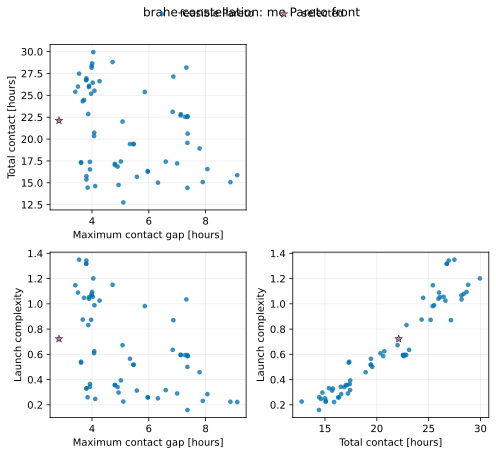
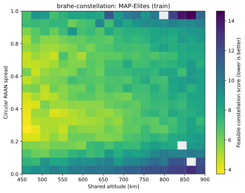
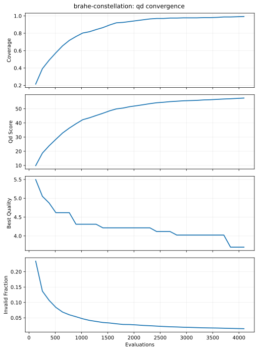

# Brahe constellation access optimization

This standalone tutorial is part of the public `fcmaes-rust` repository. It
combines the native Rust optimizers in `fcmaes-core` with
[Brahe 1.7.0](https://docs.rs/brahe/1.7.0/brahe/), an MIT-licensed Rust
astrodynamics and mission-analysis library.

The example is deliberately a real simulation objective rather than a
mathematical test function:

```text
10 design variables
    ↓
four Keplerian satellite propagators
    ↓
Brahe access search: 6 stations × 4 satellites × 24 hours
    ↓
merge overlapping contacts, reject passes shorter than 3 minutes
    ↓
BiteOpt retry or constrained MODE
```


Brahe's KSAT station data is embedded in the dependency, so no station file or
network request is required at runtime. The model also installs a zero-valued
static Earth-orientation provider. That choice makes optimization runs offline
and repeatable; replace it with current EOP data before treating the access
times as operational predictions.

## Design

The four satellites share altitude and inclination. Each has independent RAAN
and mean anomaly:

```text
x = [
    altitude_km,
    inclination_deg,
    raan_1, raan_2, raan_3, raan_4,
    mean_anomaly_1, mean_anomaly_2, mean_anomaly_3, mean_anomaly_4
]
```

| Variable | Bounds |
|---|---:|
| altitude | 450–900 km |
| inclination | 45–100° |
| each RAAN | 0–360° |
| each mean anomaly | 0–360° |

The fixed epoch is 2025-01-01 00:00 UTC. Eccentricity is 0.001 and argument of
perigee is 0°. The default network selects Svalbard, Fairbanks, Singapore,
Hartebeesthoek, Cordoba, and Troll from Brahe's embedded KSAT dataset.

An access requires at least 10° elevation. Brahe searches on a 60-second grid
and refines boundaries to 0.25 seconds. Windows shorter than 180 seconds are
reported but excluded from all objectives and constraints. Since a retained
window spans at least three grid steps, the grid cannot step entirely over it.

Overlapping satellite windows at one station are merged. Thus simultaneous
visibility of two satellites is one continuous contact opportunity, and
contact duration is not double counted.

## Optimization formulations

The scalar BiteOpt retry objective is minimized:

```text
score =
    worst_station_gap_hours
    + 10 × missing_required_passes
    + 4.5 × normalized_altitude
    + circular_RAAN_spread
```

All undesirable terms are positive penalties. The altitude term ranges from
zero at 450 km to 4.5 at 900 km.

Constrained MODE independently minimizes:

1. worst communication gap over all stations;
2. negative total network contact duration;
3. `normalized_altitude + 0.5 × circular_RAAN_spread`.

MODE also receives one explicit feasibility constraint:

```text
missing_required_passes <= 0
```

The required number is two merged, accepted contact opportunities per station
per 24 hours, scaled up for longer horizons. Bounds enforce the prescribed LEO
altitude range, and the three-minute rule is enforced by filtering.

The printed Pareto `quality` is a higher-is-better summary used only to select
one representative for reporting:

```text
quality =
    total_contact_hours
    / ((1 + worst_gap_hours) × (1 + launch_complexity))
```

MODE itself still optimizes the uncollapsed three-objective vector.

MAP-Elites is retained as a separate architecture view. Shared altitude and
circular RAAN spread are behavior descriptors; the feasible scalar
constellation score determines quality inside each cell. Candidates missing
the required station passes cannot enter the archive. The resulting portfolio
answers which contact design is best at different altitude/plane-spread
architectures, while MODE continues to expose the gap/contact/launch trade-off.

## Parallelism without oversubscription

Both layers can parallelize, so the CLI makes ownership explicit:

- `--parallel outer` is the default. fcmaes runs independent retry optimizers
  or MODE candidate evaluations on `--workers` threads. Every Brahe access
  search is serial.
- `--parallel inner` gives fcmaes one objective worker and configures Brahe to
  process the 24 station/satellite pairs on `--workers` threads.

No mode allows both pools to expand at once. For this workload, outer
parallelism is preferable because candidate evaluations are independent and
numerous.

The built-in benchmark evaluates exactly the same fixed candidate vectors in
both modes and verifies identical scores:

```bash
cd tutorials/brahe-constellation
cargo run --release -- \
  --mode benchmark --workers 24 --benchmark-candidates 512 --seed 42
```

Recorded on 2026-07-24 on an AMD Ryzen 9 9950X:

| Mode | Candidates | Threads | Wall time | Evaluations/s |
|---|---:|---:|---:|---:|
| fcmaes outer candidate parallelism | 512 | 24 | 3.407 s | 150.3 |
| Brahe inner access parallelism | 512 | 24 | 4.080 s | 125.5 |

The maximum score difference was exactly zero. Outer parallelism was 1.20×
faster for this six-station, four-satellite problem. This is a single-machine
measurement, not a general Brahe benchmark; the balance can change with a
larger station network or fewer optimizer candidates.

## Run

A substantial 24-worker run:

```bash
cd tutorials/brahe-constellation
cargo run --release -- \
  --mode all --workers 24 --parallel outer \
  --evaluations 500 --retries 24 \
  --mo-evaluations 8192 --popsize 256 --seed 42 \
  --qd-evaluations 4096 --qd-capacity 400 --qd-chunk-size 128 \
  --numerical-validation
```

`--evaluations` is the budget of each BiteOpt retry. MODE rounds
`--mo-evaluations` up to a complete population. Numerical validation runs only
after optimization.

A quick functional run:

```bash
cargo run --release -- \
  --mode both --workers 4 --parallel outer \
  --evaluations 12 --retries 2 \
  --mo-evaluations 8 --popsize 4 --no-output
```

Run only the QD architecture search:

```bash
cargo run --release -- \
  --mode qd --workers 24 --parallel outer \
  --qd-evaluations 4096 --qd-capacity 400 \
  --qd-chunk-size 128 --seed 42
```

QD requires `--parallel outer`; the CLI refuses nested Brahe/fcmaes pools.

Evaluate the baseline without optimization:

```bash
cargo run --release -- --mode simulate --workers 16
```

Replay a design by passing ten comma-separated values:

```bash
cargo run --release -- \
  --mode simulate --numerical-validation \
  --x 702.086836885,88.660434130,296.042491414,172.978771112,227.690703019,181.241523928,329.014897384,148.678143359,241.988590149,297.782016936
```

Use `--provider` and `--stations` to select another embedded network. Run
`cargo run --release -- --help` for all options.

## Recorded 24-worker optimization

The following deterministic smoke run uses the full 24-hour model:

```bash
cargo run --release -- \
  --mode both --workers 24 --parallel outer \
  --evaluations 50 --retries 24 \
  --mo-evaluations 512 --popsize 64 --seed 42
```

| Design | Optimizer evaluations | Wall time | Worst gap | Contact | Scalar score | Pareto quality |
|---|---:|---:|---:|---:|---:|---:|
| Evenly phased baseline | — | — | 4.601 h | 16.642 h | 7.1007 | 1.6208 |
| BiteOpt retry best | 1,200 | 8.625 s | 3.557 h | 12.723 h | 4.0352 | 2.3080 |
| MODE representative | 512 | 4.559 s | 2.839 h | 22.111 h | 5.6830 | 3.3452 |

Every design in the table satisfies the per-station pass constraint. BiteOpt
minimizes the scalar's strong altitude and RAAN-spread costs; MODE exposes the
trade-off and finds a representative with 32.9% more contact and a 38.3%
shorter worst gap than the baseline. Its final population contained 64
nondominated feasible points in this small run.

The MODE representative is:

```text
[702.086836885, 88.660434130,
 296.042491414, 172.978771112, 227.690703019, 181.241523928,
 329.014897384, 148.678143359, 241.988590149, 297.782016936]
```

Optional finalist validation replaces two-body Keplerian motion with Brahe's
numerical propagator and a 20×20 EGM2008 gravity field. For that representative
it predicted a 2.790-hour worst gap and 22.561 contact-hours: changes of
-0.049 hour and +0.450 hour respectively. The numerical module is not used
during optimization because it is slower and Brahe currently documents that
API as experimental.

These are functional results from one optimizer seed, not repeated-seed
performance statistics.



## MAP-Elites pilot and campaign

Brahe passed the conditional QD pilot. Altitude and circular plane spread are
direct architecture choices with physical bounds, so the archive does not
duplicate MODE's objective axes. The 512-evaluation pilot occupied 94 of 100
niches with no descriptor clipping.

The publication campaign used 24 outer fcmaes workers, serial Brahe access
calculations, a 400-cell archive, chunks of 128 and 4,096 evaluations for each
of three optimizer seeds:

| Metric | Mean | Sample standard deviation |
|---|---:|---:|
| Wall time | 31.843054 s | 0.147795 s |
| Occupied niches | 396.667 | 0.577 |
| Coverage | 99.167% | 0.144 percentage points |
| QD score | 57.399401 | 0.245830 |
| Best feasible score | 3.979731 | 0.252279 |
| Infeasible evaluations | 71.667 | 11.060 |
| Clipped descriptors | 0 | 0 |

The near-complete coverage shows that the architecture space is reachable; it
does not imply all cells have equally strong access performance. MODE remains
the correct artifact for selecting among the three explicit mission
objectives. Raw statistics are in
[`results/publication/qd-summary.csv`](results/publication/qd-summary.csv).





## Output

Unless `--no-output` is supplied, the command writes:

- `results/report.html`: self-contained station map, access timeline, and
  optimization progress;
- `results/access_windows.csv`: accepted and rejected raw Brahe windows;
- `results/stations.csv`: station coordinates and aggregated metrics;
- `results/design.csv`: the selected design;
- `results/pareto.csv`: feasible nondominated MODE designs;
- `results/convergence.csv`: incumbent scalar proxy or MODE quality.
- `results/qd_archive.csv`: occupied architecture niches and their designs;
- `results/run.json`: schema-v1 run configuration and artifact references.

Open `results/report.html` directly in a browser; it has no external assets.

## Accuracy and scope

This is a simulation-optimization example, not an operational mission-design
tool. It deliberately omits antenna scheduling, simultaneous-link capacity,
frequency compatibility, occultation beyond the elevation constraint, launch
vehicle plane-change modeling, collision avoidance, and station outages.
Static zero EOP data is reproducible but not appropriate for precise pass
timing. The numerical finalist uses gravity perturbations but no drag, solar
radiation pressure, or third bodies.

For higher fidelity, initialize current EOP data, add spacecraft-specific force
models and constraints, validate several Pareto finalists, and keep that
expensive stage separate from the fast search.

## Test

```bash
cargo test
cargo clippy --all-targets -- -D warnings
```

The tests cover bounds, interval merging, circular plane spread, embedded
station loading, deterministic access evaluation, constraint output, and
invalid configuration. The QD adapter test checks feasible architecture
descriptors and archive option validation.

## References

- [Brahe source and MIT license](https://github.com/duncaneddy/brahe)
- [Brahe ground-station datasets](https://docs.brahe.space/latest/learn/datasets/groundstations.html)
- [Brahe access computation](https://docs.brahe.space/latest/learn/access_computation/computation.html)
- [Brahe maximum-communications-gap example](https://docs.brahe.space/latest/examples/max_communications_gap.html)
- [Brahe thread-pool configuration](https://docs.brahe.space/latest/library_api/utils/threading.html)
- [Brahe numerical propagation](https://docs.brahe.space/latest/learn/orbit_propagation/numerical_propagation/index.html)
