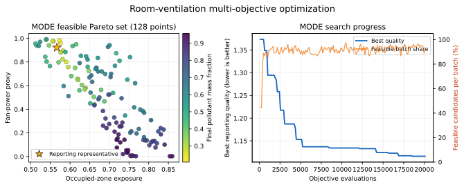
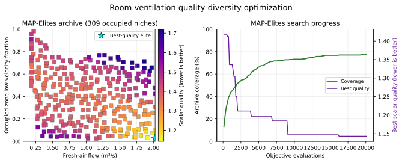
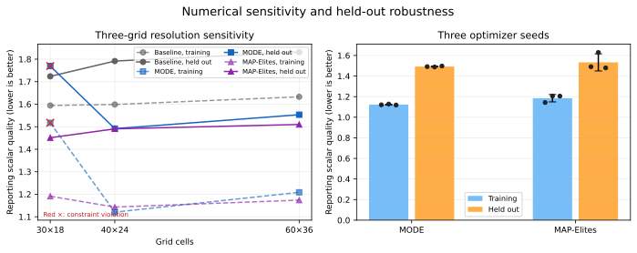

# Educational room-ventilation optimization in native Rust

This public tutorial couples a native two-dimensional flow and passive scalar
simulation to `fcmaes-core`. It demonstrates parallel black-box simulation
optimization with scalar retry, MODE, and MAP-Elites. Its claims are
deliberately limited: this is an educational numerical
simulation-optimization tutorial, not a building-design, health, or regulatory
CFD tool.

```text
fresh-air inlet -> room + passive pollutant -> pressure outlet
                          |
                     occupied zone
```

Optimization changes vent openings and baffle geometry for every candidate,
then evaluates thousands of candidates concurrently. A small custom backend
was created so geometry rebuilding, solver state, boundary handling, and
deterministic execution are owned by one objective with no adapter or
serialization layer. It uses D2Q9 lattice-Boltzmann flow with bounce-back
walls and a rasterized baffle; a D2Q5 advection-diffusion lattice transports
pollutant through the converged velocity field.

Every evaluation owns isolated Rust state, so fcmaes controls parallelism
without nested solver threads. The trade-off is scope: this purpose-built
backend is understandable and fast enough for an optimization tutorial, but
it is not a general CFD library and its evidence must not be interpreted as
engineering validation. See [BACKEND.md](BACKEND.md).

## Design problem

Nine continuous variables control opposing wall vents and an internal baffle:

| Index | Variable | Bounds | Meaning |
|---:|---|---:|---|
| 0 | `inlet_y` | 0.12–0.88 | Inlet vertical center / room height |
| 1 | `inlet_width` | 0.12–0.45 | Inlet opening height / room height |
| 2 | `outlet_y` | 0.12–0.88 | Outlet vertical center / room height |
| 3 | `outlet_width` | 0.12–0.45 | Outlet opening height / room height |
| 4 | `inlet_velocity` | 0.25–1.50 m/s | Fresh-air speed |
| 5 | `baffle_x` | 0.20–0.80 | Baffle center x / room width |
| 6 | `baffle_y` | 0.15–0.85 | Baffle center y / room height |
| 7 | `baffle_length` | 0.15–0.65 | Baffle length / room height |
| 8 | `baffle_angle` | -1.40–1.40 rad | Angle from horizontal |

The default room is 5 m × 3 m on a 40 × 24 grid. The inlet is on the left wall
and the outlet is on the right.

## Robust objective and held-out validation

One flow solve is reused across three pollutant releases. The optimization
uses the worst result for every pollutant objective:

| Set | Normalized release locations `(x, y)` |
|---|---|
| Training | `(0.72, 0.30)`, `(0.30, 0.25)`, `(0.58, 0.55)` |
| Held out | `(0.22, 0.48)`, `(0.48, 0.36)`, `(0.78, 0.52)` |

Held-out releases never influence optimizer decisions. They are evaluated
after each selected result and written to `validation.csv`.

MODE minimizes four continuous worst-case objectives:

1. occupied-zone exposure integrated over the scalar horizon;
2. maximum normalized concentration at six receptors;
3. normalized `flow_rate * inlet_velocity²` fan-power proxy;
4. pollutant mass remaining at the end of the horizon.

The scalar BiteOpt and MAP-Elites quality is:

```text
exposure + 0.5*maximum_receptor + 0.2*fan_power
         + 0.5*final_mass_fraction
```

Clearance time to 10% remaining mass is reported only as a diagnostic because
the finite simulation horizon right-censors slow designs.

Positive constraint violations receive a factor-100 scalar penalty. MODE
receives the same constraints explicitly, feasible at `constraint <= 0`:

- fresh-air flow of at least 0.18 m²/s;
- both baffle endpoints at least one grid cell inside the room;
- interior inlet/outlet flux mismatch no greater than 5%;
- steady-flow velocity residual no greater than `5e-4`.

The pressure drop and fan-power values are numerical proxies, not calibrated
watts or pascals.

## MODE and MAP-Elites

MODE preserves the trade-offs between the four objectives. A reporting scalar
selects one representative after optimization but does not control MODE.

MAP-Elites minimizes the scalar quality in a 20 × 20 behavior archive with:

- fresh-air flow from 0.09 to 2.025 m²/s;
- occupied-zone fluid fraction below 0.1 m/s, from 0 to 1.

Only feasible designs enter the archive. MAP-Elites complements rather than
replaces MODE: MODE shows objective trade-offs, while QD shows which
flow-behavior combinations can be reached with useful quality.

## Run

Because the package has an optimizer and a verification binary, specify the
binary explicitly.

Evaluate the baseline, including held-out releases:

```bash
cargo run --release --bin cfd-room-ventilation -- --mode evaluate
```

Run a short smoke search:

```bash
cargo run --release --bin cfd-room-ventilation -- \
  --mode all --workers 4 \
  --retries 4 --evaluations 200 \
  --mo-evaluations 512 --popsize 64 \
  --qd-evaluations 512 --qd-capacity 100 --qd-chunk-size 64 \
  --seed 42 --output results/smoke
```

Use `--workers 0` for all available CPUs. Each CFD kernel remains
single-threaded; parallelism is across retries or population/archive batches.

### Reproduce the publication campaigns

The recorded study uses three named seeds and equal search budgets:

```bash
for seed in 42 43 44; do
  cargo run --release --bin cfd-room-ventilation -- \
    --mode multi --workers 16 \
    --mo-evaluations 20000 --popsize 128 \
    --flow-steps 800 --scalar-steps 600 --seed "$seed" \
    --output "results/mode-seed-$seed" \
    --csv "results/mode-seed-$seed/selected-field.csv"

  cargo run --release --bin cfd-room-ventilation -- \
    --mode qd --workers 16 \
    --qd-evaluations 20000 --qd-capacity 400 --qd-chunk-size 128 \
    --flow-steps 800 --scalar-steps 600 --seed "$seed" \
    --output "results/qd-seed-$seed" \
    --csv "results/qd-seed-$seed/selected-field.csv"
done
```

Both algorithms perform 20,096 evaluations after rounding to 157 complete
batches of 128.

Run the reference channel, three-grid study, and seed-42 field reproduction:

```bash
cargo run --release --bin verification -- \
  --mode-results results/mode-seed-42/pareto.csv \
  --qd-results results/qd-seed-42/archive.csv \
  --output results/verification
```

Generate all figures and the seed summary:

```bash
python3 -m pip install -r ../python/requirements-lock.txt
python3 plot_results.py --write
python3 plot_results.py --check
```

Plotting requires numpy and matplotlib but they are not optimization-runtime
or Cargo dependencies. The central `tutorials/python/render_all.py --check`
command invokes this check with the schema-driven tutorial renderers. The SVG
output is byte-for-byte deterministic for unchanged CSV inputs.

## Recorded results

All runs used 16 workers, the 40 × 24 grid, 800 maximum flow steps, 600 scalar
steps, and 20,096 search evaluations. Values are mean ± sample standard
deviation across seeds 42, 43, and 44:

| Method | Training quality | Held-out quality | Search time | Result |
|---|---:|---:|---:|---:|
| Baseline | 1.598712 | 1.791533 | — | fixed design |
| MODE | 1.122344 ± 0.004929 | 1.492211 ± 0.004592 | 35.413 ± 0.202 s | 127.3 ± 1.2 Pareto points |
| MAP-Elites | 1.184577 ± 0.035902 | 1.532841 ± 0.083438 | 33.166 ± 0.337 s | 304.0 ± 6.2 niches |

MAP-Elites coverage was `76.00% ± 1.56%`; its reciprocal-fitness QD-score was
`219.371 ± 3.888`. MODE was more stable for the reporting scalar in this
three-seed sample. MAP-Elites provides behavior diversity, so its success
should not be reduced to its best scalar elite.

Full per-seed data, selected designs, verification tables, and interpretation
are in [results/publication-evidence.md](results/publication-evidence.md).





The figures above use seed 42. The aggregate result table prevents that one run
from being presented as stochastic evidence.

## Flow and pollutant fields


The common color scales compare the baseline and seed-42 representatives.
Velocity arrows are superimposed on speed; the lower row shows the final field
for each design's worst-exposure training release.

## Numerical verification

The 48 × 20 straight-channel reference produces:

| Property | Result |
|---|---:|
| Axial-profile relative symmetry error | `5.833e-15` |
| Maximum transverse lattice velocity | `3.253e-5` |
| Maximum/mean axial velocity | 1.49236 |
| Relative flux mismatch | 0.004140 |
| Final velocity residual | `9.897e-7` |

This checks symmetry, profile development, flux conservation, and numerical
convergence. It is not experimental validation.



The resolution study evaluates baseline and seed-42 representatives on
30 × 18, 40 × 24, and 60 × 36 grids. Scalar horizons scale with grid width and
flow limits scale approximately with its square. The coarse-grid MODE design
slightly violates the flux constraint (5.326% versus 5%), which is shown with
a red cross. At 40 × 24 and 60 × 36 all three designs are feasible. The
remaining quality movement is reported as resolution sensitivity, not claimed
as formal grid convergence.

## Verification commands

```bash
cargo fmt --all -- --check
cargo clippy --all-targets -- -D warnings
cargo test --all-targets
python3 -m py_compile plot_results.py
```

Tests cover geometry, vent masks, baffle rasterization, deterministic fields,
multi-source aggregation, held-out problem construction, scalar and descriptor
bounds, malformed decisions, CLI parsing, a tiny MAP-Elites run, selected-CSV
parsing, and straight-channel reference properties.

## Scope and remaining limitations

The evidence above is sufficient for an educational optimization tutorial
because it exposes stochastic variation, held-out behavior, numerical
sensitivity, constraints, and complete reproducible artifacts. It does not
turn the model into validated engineering CFD.

Important limitations remain:

- two-dimensional, isothermal, laminar, low-resolution physics;
- simplified inlet/outlet and bounce-back boundary conditions;
- lattice time, diffusivity, and pressure are not physically calibrated;
- only six release locations and three optimizer seeds;
- no comparison against experiments or an independent CFD solver;
- grid sensitivity remains visible, especially for constraint margins.

A future engineering study should add physical nondimensional calibration,
reference experiments, more source/occupancy scenarios, safety margins on
constraints, finer-grid finalist validation, and an independent SIMPLE or
finite-volume comparison.
