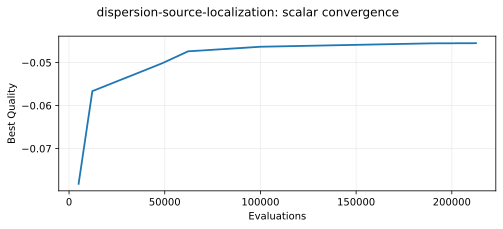
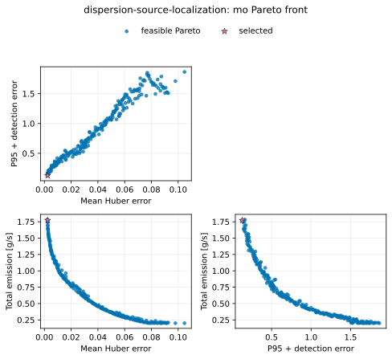
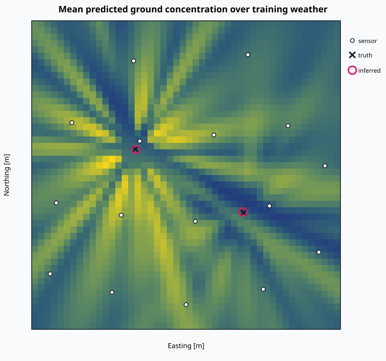
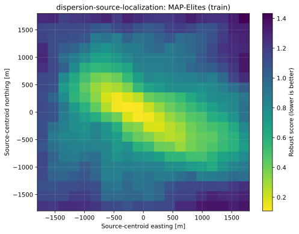
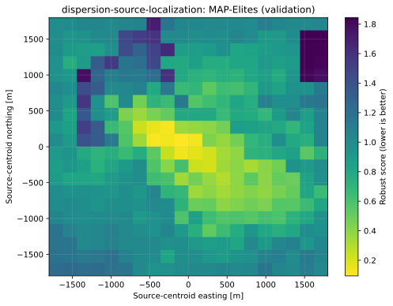

# Atmospheric dispersion source localization

This standalone tutorial puts a native atmospheric dispersion model directly
inside `fcmaes-core`. It infers two emission sources and four weather/model
correction parameters from receptor observations, then compares:

- BiteOpt with coordinated advanced retry for one robust estimate;
- MODE for the reconstruction-error/emission Pareto front; and
- MAP-Elites for a map of alternative source-centroid hypotheses.

The example complements the engineering-design tutorials with an inverse
problem: observations are fixed and the optimizer searches for a plausible
hidden cause.

> **Educational model only.** The Gaussian-plume equations are derived from
> the superseded US EPA ISC-3 model. This tutorial is not a regulatory
> air-quality model and must not be used for safety, health, compliance, or
> emergency-response decisions.

## Model and provenance

The numerical core adapts Gaussian plume spread and Briggs plume-rise
equations from Joshua Nunn's MIT-licensed
[`really-simple-dispersion-wasm`](https://github.com/joshuanunn/really-simple-dispersion-wasm).
The exact upstream revision, retained license, and scope of the adaptation are
in [`UPSTREAM_NOTICE.md`](UPSTREAM_NOTICE.md).

The browser bindings and full image grid from the upstream project are not
used. The tutorial evaluates concentrations only at the receptors needed by
the objective. That keeps a 256-observation candidate evaluation small enough
to expose optimizer overhead while remaining entirely native Rust.

The checked-in dataset is deterministic and synthetic:

- training: 16 sensors × 16 weather records = 256 observations;
- validation: 10 different sensors × 10 different weather records = 100
  observations;
- sensor coordinates/IDs and weather record IDs/directions are disjoint
  between the two splits, while both retain representative stability classes;
  and
- the data generator adds deterministic relative noise, background
  concentration, censoring at a `0.02 µg/m³` detection limit, and
  observation-specific spread perturbations.

The evaluator does not contain those observation-specific perturbations.
Consequently, optimizing the known generating parameters cannot reproduce the
measurements exactly. This deliberate model mismatch and the disjoint holdout
reduce the otherwise misleading “inverse crime” of fitting data generated by
the identical forward model.


## Decision vector

The two sources are canonicalized by `(x, y)` position so exchanging their
labels does not create a second representation of the same design.

| Indices | Decision | Bounds | Unit |
|---:|---|---:|---|
| 0, 1 | Source 1 easting and northing | -1,800–1,800 | m |
| 2 | Source 1 log10 emission rate | -1–1 | log10(g/s) |
| 3 | Source 1 release height | 20–120 | m |
| 4, 5 | Source 2 easting and northing | -1,800–1,800 | m |
| 6 | Source 2 log10 emission rate | -1–1 | log10(g/s) |
| 7 | Source 2 release height | 20–120 | m |
| 8 | Wind-direction bias | -15–15 | degrees |
| 9 | Wind-speed scale | 0.80–1.20 | ratio |
| 10 | Lateral-dispersion scale | 0.70–1.30 | ratio |
| 11 | Vertical-dispersion scale | 0.70–1.30 | ratio |

For each observation, measured and predicted concentrations are transformed as

```text
z = ln(1 + concentration / detection_limit).
```

The robust scalar score minimized on the training split is

```text
mean Huber(z_pred - z_measured)
  + 0.35 × p95(|z_pred - z_measured|)
  + 0.80 × detection-mismatch fraction
  + 0.01 × total emission [g/s].
```

The source-position error printed by this synthetic tutorial uses the hidden
truth only for evaluation. It is never supplied to an optimizer and would not
exist for real observations.

MODE independently minimizes:

1. mean Huber reconstruction error;
2. p95 absolute log error plus `0.5 ×` detection mismatch; and
3. total emission rate.

The reported MODE representative minimizes the scalarized display score over
the final nondominated front. The full front remains in `pareto.csv`; choosing
one representative does not collapse the optimization to a scalar problem.

MAP-Elites complements rather than replaces MODE. Its behavior descriptors are
the emission-weighted source-centroid easting and northing, each spanning
`[-1,800, 1,800] m`. Each niche keeps the candidate with the lowest robust
scalar score. The resulting archive answers “how good is the best hypothesis
found around each source centroid?” It is not a confidence region: filling a
niche says only that the optimizer found a candidate there, and a high-quality
value is still conditional on this simplified model and dataset.

## Parallel execution

One candidate evaluation is deterministic and serial. `fcmaes-core` owns the
only worker pool:

- coordinated retry runs independent BiteOpt searches on workers with
  independently derived random streams;
- MODE evaluates each ask/tell population in parallel; and
- MAP-Elites evaluates each candidate chunk in parallel.

This tutorial therefore has no nested simulator pool and no oversubscription
switch to tune. `--workers 0` uses the available logical CPU count.

## Run

From the public repository root:

```bash
cd tutorials/dispersion-source-localization
cargo run --release -- \
  --mode all --workers 24 \
  --evaluations 5000 --retries 24 --depth 6 --max-eval-fac 6 \
  --mo-evaluations 200000 --popsize 256 \
  --qd-evaluations 200000 --qd-capacity 400 \
  --qd-chunk-size 256 --seed 42 \
  --output results/my-run
```

In `all` mode, artifacts are written below `scalar/`, `mo/`, and `qd/` in the
selected output directory. A quick smoke run is:

```bash
cargo run --release -- \
  --mode all --workers 4 \
  --evaluations 100 --retries 4 --depth 3 --max-eval-fac 2 \
  --mo-evaluations 1024 --popsize 64 \
  --qd-evaluations 1024 --qd-capacity 100 \
  --qd-chunk-size 64 --seed 42 --output results/quick
```

Run one formulation or evaluate a supplied twelve-value design:

```bash
cargo run --release -- --mode scalar --workers 24
cargo run --release -- --mode multi --workers 24
cargo run --release -- --mode qd --workers 24
cargo run --release -- --mode simulate \
  --x=-820,420,0.3710678623,52,930,-610,0.0969100130,78,3,1.04,1.07,0.94
```

MODE and MAP-Elites round requested evaluations up to a complete population or
chunk. The QD capacity must be a perfect square because the archive is rendered
as a two-dimensional grid. Run `cargo run --release -- --help` for every
option.

## Recorded 24-worker results

The following release-mode campaigns were executed on 2026-07-24 on an AMD
Ryzen 9 9950X with 16 physical cores, 32 logical CPUs, Rust 1.97.1, and exactly
24 fcmaes workers. Timings are reproducibility data for this implementation on
one machine, not a cross-library benchmark.

| Selection | Evaluations | Wall time | Training score | Validation score | Mean source-position error |
|---|---:|---:|---:|---:|---:|
| Initial baseline | — | — | 1.707545579 | 2.075631169 | 860.424 m |
| BiteOpt advanced retry | 420,000 | 0.991893 s | 0.045491744 | 0.101801505 | 15.223 m |
| MODE representative | 200,192 | 0.817734 s | 0.064922190 | 0.071900636 | 11.675 m |
| MAP-Elites best, CLI seed 42 | 200,192 | 0.461363 s | 0.107735363 | 0.131739997 | 31.753 m |

The scalar campaign used 24 retries with a 5,000-evaluation initial budget.
Advanced retry increased later budgets linearly to a factor of six, producing
420,000 total evaluations. MODE used population 256 and 782 complete
generations. These are the exact recorded commands:

```bash
cargo run --release -- \
  --mode scalar --workers 24 --evaluations 5000 --retries 24 \
  --depth 6 --max-eval-fac 6 --seed 42 \
  --output results/publication/scalar-seed-42

cargo run --release -- \
  --mode multi --workers 24 --mo-evaluations 200000 \
  --popsize 256 --seed 42 \
  --output results/publication/mo-seed-42
```







The QD campaign used a 20 × 20 archive, chunks of 256, and 200,192 actual
evaluations for each CLI seed 42, 43, and 44:

```bash
for seed in 42 43 44; do
  cargo run --release -- \
    --mode qd --workers 24 --qd-evaluations 200000 \
    --qd-capacity 400 --qd-chunk-size 256 --seed "$seed" \
    --output "results/publication/qd-seed-$seed"
done
```

| QD metric | Mean | Sample standard deviation |
|---|---:|---:|
| Wall time | 0.459970 s | 0.006537 s |
| Occupied niches | 400.000 | 0.000 |
| Coverage | 100.000% | 0.000 percentage points |
| QD score | 586.386718 | 14.989383 |
| Best training quality | 0.108442840 | 0.000870306 |
| Invalid evaluations | 0.000 | 0.000 |
| Clipped descriptors | 14.667 | 3.786 |

All cells being occupied does **not** mean all source locations are plausible.
The archive deliberately explores the complete centroid plane; the quality
gradient across that plane carries the useful information. Only 0.0073% of
evaluations were clipped on average, so the documented descriptor bounds cover
the searched behavior space well.

Raw per-seed values are in
[`results/publication/qd-summary.csv`](results/publication/qd-summary.csv).
The plots below show CLI seed 42; the table prevents one archive from standing
in for run-to-run variability.





The fitted emission rates are regularized and remain model-dependent. For
example, the scalar estimate totals `2.0805 g/s` while the synthetic truth
totals `3.6 g/s`. Good source-location recovery in this run must not be
misread as calibrated emission recovery.

## Outputs and visualization

Each formulation writes the versioned schema-v1 `run.json`, a convergence
trace, the fixed observations, a baseline/truth/selection summary, and a native
SVG source map. MODE additionally writes `pareto.csv`; MAP-Elites writes
`qd_archive.csv` with training and holdout qualities.

Regenerate the common Matplotlib figures through the locked plotting package:

```bash
cd ../python
python -m venv .venv
.venv/bin/python -m pip install -r requirements-lock.txt
.venv/bin/python -m pip install --no-deps -e .
.venv/bin/python render_all.py --write
.venv/bin/python render_all.py --check
```

Python is used only after optimization. Candidate decoding, plume evaluation,
parallel execution, optimization, CSV/JSON export, and the source map are all
native Rust.

## Tests and limitations

```bash
cargo test
cargo clippy --all-targets -- -D warnings
```

The tests cover reference values from the adapted numerical core,
canonicalization and bounds, deterministic/disjoint data splits, objective
adapters, optimizer option validation, tiny end-to-end scalar/MODE/QD runs,
and artifact generation.

The tutorial intentionally omits terrain, buildings, deposition, chemistry,
time-varying releases, correlated measurement errors, uncertainty calibration,
and modern regulatory dispersion physics. A real inverse study needs a
validated domain model, measured meteorology, identifiability analysis,
uncertainty quantification, and independent expert review.
