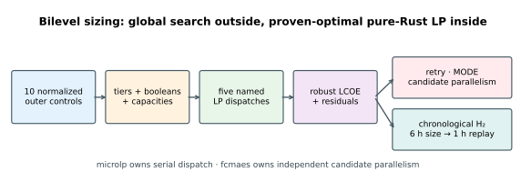
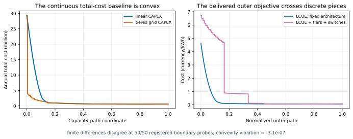
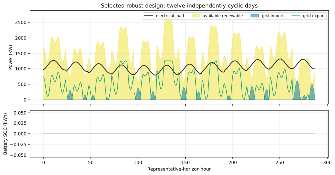
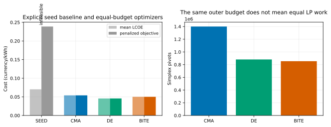
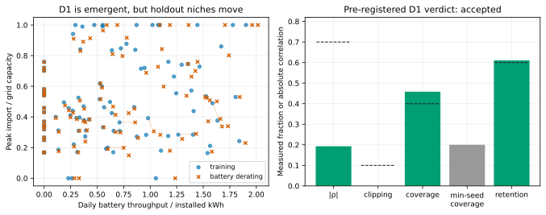
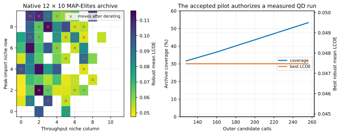
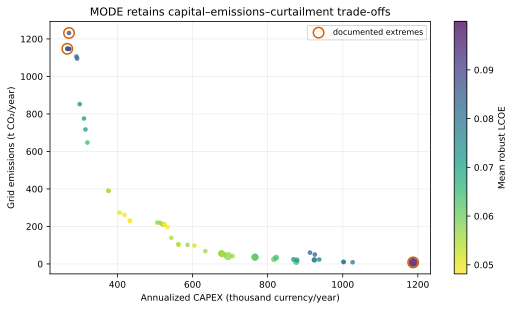
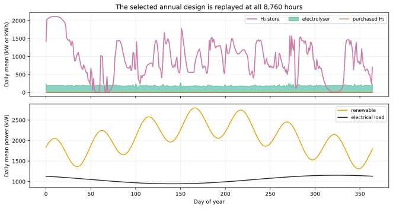
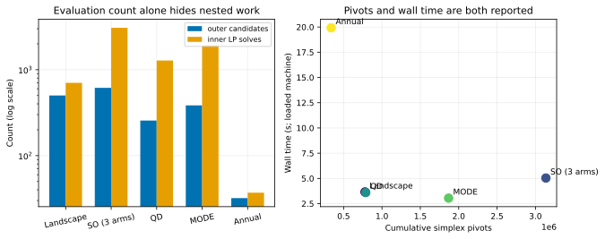

# Bilevel energy-hub sizing with a pure-Rust inner LP

This tutorial sizes PV, wind, a battery, a tiered grid connection, and—in a
separate chronological experiment—an electrolyser and hydrogen store. Each
outer candidate creates a linear dispatch problem. `microlp` solves that inner
problem to a proven optimum; `fcmaes-core` searches the discontinuous outer
design space and owns candidate-level parallelism.

The distinction matters. Dispatch scheduling by itself is an LP and does not
justify a global optimizer. The delivered sizing problem does because it adds
catalogue tiers, inclusion switches, and a ratio objective around that LP.
This is the counterpart to the other tutorials' rule “use gradients when the
model is smooth”: here the convex baseline is shown explicitly instead of
being hidden.

The corrected checked-in publication protocol found:

- a differential-evolution design with robust mean LCOE `0.045683` and minimum
  training self-sufficiency `92.53%`;
- 51 feasible nondominated MODE points spanning annualized CAPEX
  `266,567–1,187,577` and grid emissions `8.06–1,231.62 t CO₂/year`;
- an **accepted** D1 pilot on the archive's actual 12 × 10 grid, followed by a
  64-elite MAP-Elites portfolio; and
- a chronological electricity/H₂ design whose independent hourly replay costs
  `0.051935` per combined delivered kWh, supplies all synthetic H₂ demand on
  site, and uses `2,119.55 kWh-H₂` of storage range.

These values come from synthetic profiles and a transparent teaching cost
model. They demonstrate architecture and reproducibility, not an investable
energy project.



## Model boundary

The system is one industrial site behind one symmetric grid connection:

| Asset | Outer decision | Main representative-day model | Annual extension |
|---|---|---:|---:|
| PV | 0–5,000 kWp | yes | yes |
| Wind | inclusion switch + 0–3,000 kW | yes | yes |
| Battery | switch, 100–20,000 kWh, 50–5,000 kW | yes | yes |
| Grid | one of 500, 850, 1,250, 1,800, 2,600, 4,000 kW | yes | yes |
| Electrolyser | switch + 0–2,500 kW | excluded | yes |
| H₂ store | switch + 0–120,000 kWh-H₂ | excluded | yes |

The ten optimizer coordinates are normalized to `[0,1]`. The authoritative
decoder applies log scaling to battery sizes and equal-width bins to catalogue
and boolean coordinates. MODE deliberately receives continuous normalized
coordinates: declaring those coordinates integer would collapse them to only
the endpoints before the decoder could reach every tier.

The shipped profiles are deterministic and synthetic. PV follows daylight and
season; wind combines daily and slower harmonics; electrical and industrial
H₂ demand have daily and seasonal terms; import prices use fixed time-of-use
bands. The exact publication values are checked in as
[`generated-publication.csv`](scenarios/generated-publication.csv), while
[`scenario-modifiers.csv`](scenarios/scenario-modifiers.csv) defines every
named perturbation.

No external data are needed. A reader substituting PVGIS or Open Power System
Data must document the downloaded version, location, license, preprocessing,
timezone, missing-data treatment, and resulting checksum. Such external data
are not silently mixed into the checked-in results.

## Inner dispatch LP

For timestep `t` of duration `Δ`, all dispatch variables are non-negative:

```text
renewable[t] - curtail[t] + import[t] + discharge[t]
  = load[t] + export[t] + charge[t] + electrolyser[t] - unserved[t]

soc[t] = soc[t-1]
       + Δ (eta_charge charge[t] - discharge[t] / eta_discharge)
```

Import/export, charge/discharge, battery state, curtailment, and unserved load
all have physical bounds. Representative-day battery state closes separately
at every 24-hour boundary. The chronological model closes once across the
whole year.

The annual extension adds:

```text
h2[t] = h2[t-1]
      + Δ (eta_electrolyser electrolyser[t]
           + purchased_h2[t] - industrial_h2_demand[t])
```

Purchased H₂ is an always-available but expensive fallback. Without it,
excluding the electrolyser would make a fixed-demand candidate infeasible;
without any H₂ demand, a correct optimizer would size the store to zero.

The inner objective minimizes import cost minus export revenue, plus purchased
H₂ and value of lost electrical load. Curtailment has exactly zero cost.
Adding a positive tie-break cost to curtailment would break the strongest LP
invariant—more installed capacity could then increase operating cost.

A `1e-9` currency/kWh tie-break is applied only to charge, discharge, and
electrolyser flow. It selects a reproducible member of a degenerate optimum
without changing the LP class: the coefficient is fixed, non-negative, and
capacity expansion still enlarges the feasible set. Even if every bounded
flow were simultaneously saturated, the annualized perturbation is at most
`0.0876` currency/year in the publication representative-day model and
`0.1095` currency/year in the chronological model. The actual perturbation is
smaller. Curtailment remains unpenalized.

Unserved load and curtailment make every finite capacity vector LP-feasible.
Outer infeasibility is therefore an explicit service residual, not `NaN` or a
solver crash. A result is accepted only when `microlp` reports both `Optimal`
and `ProvenOptimal`.

## Solver gate and exact invariants

The implementation measured the pinned `microlp 0.6.0` before adopting it:

| Horizon | LP variables | Constraints | Loaded-machine solve | Simplex pivots |
|---|---:|---:|---:|---:|
| 24 steps | 168 | 48 | 0.34 ms | 110 |
| 288 steps | 2,016 | 576 | 22.6 ms | 1,519 |
| 2,016 steps | 14,112 | 4,032 | 322 ms | 10,080 |
| 8,760 steps | 61,320 | 17,520 | 2.60 s | 41,434 |

The machine was shared with another long optimization, so these are horizon
diagnostics rather than isolated performance claims. The public API cannot
replace arbitrary right-hand sides or capacity bounds after a solve; every
candidate rebuilds its LP. It exposes pivot statistics but no public
pure-LP iteration limit, so the tutorial uses no machine-dependent timeout.
Full findings are in [`M1_FINDINGS.md`](M1_FINDINGS.md).

Tests cover:

- electrical and storage residuals, cyclic closure, and every physical bound;
- an analytic two-hour arbitrage answer;
- the all-zero design, which serves every kWh through the explicit slack;
- capacity monotonicity over 200 nested capacity pairs;
- no battery cycling with a flat tariff and unit efficiency;
- coarse/hourly annual energy consistency;
- all catalogue endpoints and a one-million-sample flat bin histogram; and
- identical serial/parallel decoding of 10,000 candidates.

## Why the outer problem is gradient-free

For a fixed architecture and continuous grid cost, the inner LP value plus
linear annualized CAPEX is convex and piecewise linear in the capacities. The
first landscape curve passes a scale-aware midpoint-convexity gate with no
positive violation.

Three delivered features change the problem:

1. LCOE divides cost by served energy;
2. wind, battery, and hydrogen have inclusion switches; and
3. the grid connection has catalogue steps.

The finite-difference experiment is stratified: half of its probes use random
continuous interiors, while half sit immediately beside a tier or boolean
boundary. The fine and coarse differences disagreed at all `50/50` registered
boundary probes. A local derivative describes one piece, not the decision
required to cross into another piece.



## Horizons and permitted claims

| Preset | Dispatch horizon | State closure | What it may establish |
|---|---|---|---|
| `smoke` | four representative days, 96 hourly steps | once per day | CI and intra-day battery dispatch |
| `publication` | twelve representative days, 288 hourly steps | once per day | robust electricity-hub sizing |
| annual extension | 1,460 chronological six-hour steps, then one 8,760-hour replay | whole year | model-qualified H₂ storage behavior |

The first two presets exclude the hydrogen subsystem in code. They cannot make
a seasonal-storage claim, however attractive a representative-day number
might look. Every manifest repeats this limitation.

## Robust scenario protocol

Every scalar, MODE, and pilot candidate is evaluated on five training cases:

- `base_year`;
- `low_solar_year`;
- `high_load_winter`;
- `tariff_peak_shifted`; and
- `export_price_zero`.

Selection is then challenged by structurally different holdouts:
`wind_outage`, `battery_derated_80pct`, `load_growth_15pct`, and one
quarter-hour replay. Holdouts change failure kind rather than only random
seed. The quarter-hour case changes the discretization by four while retaining
the LP balance invariants.

The selected robust dispatch shows how renewable power, grid exchange, and
battery state interact across the twelve independently cyclic days:



## Equal-budget scalar comparison

CMA-ES, differential evolution, and BiteOpt received 160 requested outer
calls per arm and four seeded retries. Population-based methods can complete a
generation beyond that request, so actual calls are reported rather than
quietly truncated.

| Arm | Actual outer calls | Robust mean LCOE | Min. self-sufficiency | Max. annual cycles | Feasible |
|---|---:|---:|---:|---:|---:|
| Analytic seed | baseline replay | 0.070236 | 75.39% | 426.52 | no |
| CMA-ES | 248 | 0.054026 | 97.21% | 277.92 | yes |
| DE | 207 | **0.045683** | 92.53% | 0.00 | yes |
| BiteOpt | 160 | 0.050120 | 88.19% | 0.00 | yes |

The explicit analytic seed is infeasible and is not charged to any optimizer's
budget. All three optimized designs satisfy the frozen constraints. DE selected
`1,447.60 kWp` PV, `3,000 kW` wind, no battery, and the `1,250 kW` grid tier.
Each retry derives its random stream from the arm root seed and stable retry
ID, so changing worker count changes scheduling but not search trajectories.

One outer call expands into five LP solves. Across the three arms, 615 actual
candidate calls caused 3,075 inner solves and 3,136,196 simplex pivots.



Full precision is in
[`results/publication/so/`](https://github.com/dietmarwo/fcmaes-rust/tree/main/tutorials/energy-hub-bilevel/results/publication/so).

## Pre-registered descriptor gate

MAP-Elites is useful only when its axes are jointly reachable and sufficiently
stable for selection. The primary pair was registered before running:

```text
D1 = (daily battery throughput / installed battery kWh,
      peak import / installed grid capacity)

|Spearman correlation| < 0.7
clipping on either bound < 10%
coverage on the archive's native capacity-120 grid > 40%
same-niche battery-derating retention > 60%
```

The executable does not use a hand-drawn rectangular grid. It reproduces the
exact regular-grid factorization used by `fcmaes_core::Archive`: publication
capacity 120 is **12 columns × 10 rows**, while smoke capacity 60 is a ragged
seven-row grid with row lengths `9,9,9,9,8,8,8`. A cross-check test compares
the tutorial mapper against `Archive::index_of_niche()` over both layouts.

Daily normalization prevents the four- and twelve-day presets from changing
the first descriptor merely by changing horizon length. Only feasible
candidates enter the diagnostics.

| D1 diagnostic | Measured |
|---|---:|
| Structured candidates | 240 |
| Feasible candidates | 95 |
| Rank correlation | 0.1926 |
| Bound clipping | 0.00% / 0.00% |
| Native-grid coverage | **45.83%** |
| Minimum single-seed coverage | 20.00% |
| Battery-derating niche retention | **61.05%** |
| Coarse 30-cell retention | 74.74% |
| Mean normalized D1 shift, hourly → 15-minute same day | 0.00793 |

D1 clears every frozen gate on the grid the archive actually uses. D2 =
`(self-sufficiency, curtailed-renewable fraction)` has 84.21% retention but
only 19.17% coverage; D3 includes the decision-led PV/battery ratio and remains
a control rather than a fallback. The frozen publication verdict is therefore
**accepted**, but only marginally: 58 of 95 candidates retain their niche, one
retained candidate above the strict 60% threshold.



Minimum per-seed coverage was registered as a reported sensitivity diagnostic,
not an acceptance threshold. It remains low at 20%. Adding a new gate after
seeing that number would be as misleading as moving an existing threshold.
The smoke preset is intentionally smaller and rejects D1 at 35.0% coverage and
57.1% retention; it exercises the skip path but does not replace the
publication verdict.

D1's first axis also has a structural boundary: 17 of the 95 feasible pilot
designs are battery-free and therefore map to throughput zero. The selected
scalar DE design is in this group, and battery derating cannot move such a
design on that axis. This makes part of the retention result easier than for
battery-using designs. The tutorial reports that limitation rather than
post-hoc redefining the descriptor.

## MAP-Elites portfolio

The accepted pilot authorized the frozen 256-call QD arm. It performed 1,280
LP solves, rejected 108 invalid or infeasible candidates, and occupied 64 of
120 niches (`53.33%`). Retained robust mean LCOE spans
`0.047470–0.116068`.

The archive replay is deliberately stricter than the pilot verdict: only 31
of 64 elites (`48.44%`) remain in the same niche after battery derating. The
pilot gate answered whether D1 justified spending the QD budget; it did not
guarantee that the optimized portfolio would have the pilot sample's
retention. The migration flags are therefore part of the deliverable, and a
consumer needing stable post-derating selection should filter or re-optimize
the portfolio.



Full precision is in
[`results/publication/qd/`](https://github.com/dietmarwo/fcmaes-rust/tree/main/tutorials/energy-hub-bilevel/results/publication/qd),
and the pilot verdict is
[`results/publication/pilot/pilot.md`](results/publication/pilot/pilot.md).

## Constrained MODE front

MODE independently minimizes:

1. annualized CAPEX;
2. worst annual unserved electrical energy;
3. mean grid-import CO₂; and
4. mean curtailed renewable energy.

Self-sufficiency, battery cycles, and LP status remain explicit constraints,
all feasible at values no greater than zero. Tier and boolean coordinates
remain continuous to MODE and are decoded only inside the objective.

The 384-call publication run retained 51 feasible nondominated points.
Unserved energy is zero throughout the retained front, while CAPEX, CO₂,
curtailment, and robust mean LCOE still trade off.



Full precision and selected extremes are in
[`results/publication/mo/`](https://github.com/dietmarwo/fcmaes-rust/tree/main/tutorials/energy-hub-bilevel/results/publication/mo).

## Chronological electricity and hydrogen extension

The annual arm is intentionally focused. BiteOpt sizes 32 candidates on 1,460
chronological six-hour periods. Only the selected design is rebuilt at hourly
resolution and solved across all 8,760 periods.

The hourly replay selected:

| Capacity or metric | Value |
|---|---:|
| PV | 4,323.25 kWp |
| Wind | 2,888.55 kW |
| Battery | 3,712.31 kWh / 663.00 kW |
| Electrolyser | 377.18 kW |
| H₂ store | 2,119.55 kWh-H₂ |
| Grid | 2,600 kW |
| Combined delivered-energy cost | 0.051935 |
| Electrical self-sufficiency | 99.41% |
| On-site H₂ fraction | 100.00% |
| H₂ storage amplitude | 2,119.55 kWh-H₂ |
| Maximum storage residual | `1.61e-9 kWh` |

The six-hour sizing cost was `0.051207`; the independent hourly value is
`0.051935`, so the coarse model is not reported as if it were the validation.
The H₂ state has a nonzero year-linked pattern, but this synthetic one-year LP
does not establish tank losses, degradation, compressor behavior, reserve
requirements, or multi-year adequacy.



## Budget accounting

Candidate count is not a sufficient work unit for an embedded solver:

| Arm | Candidate calls | LP solves | Simplex pivots | Loaded-machine wall time |
|---|---:|---:|---:|---:|
| Landscape evidence | 501 | 703 | 779,375 | 3.66 s |
| SO, three arms | 615 | 3,075 | 3,136,196 | 5.04 s |
| MAP-Elites | 256 | 1,280 | 788,522 | 3.61 s |
| MODE | 384 | 1,920 | 1,868,436 | 3.05 s |
| Annual search + replay | 32 | 37 | 337,724 | 19.92 s |

The annual row separates 32 optimizer calls from four deterministic selection
replays and the final hourly validation in its manifest. All values were
recorded on a loaded machine.



## Reproduce

From the public repository root:

```bash
cd tutorials/energy-hub-bilevel

# CI-sized complete protocol; its smaller pilot may record QD as skipped
cargo run --release --locked -- \
  --preset smoke --mode all --workers 2 --seed 42 --no-output

# Checked-in publication evidence
cargo run --release --locked -- \
  --preset publication --mode all --workers 4 --seed 42 \
  --output results/publication

# Regenerate the checked-in synthetic scenario table
cargo run --release --locked -- --mode scenarios --preset publication

# One arm with an explicit outer budget
cargo run --release --locked -- \
  --preset smoke --mode so --evaluations 100 --workers 4
```

`workers = 0` resolves to available parallelism. Each `microlp` solve remains
serial; candidate evaluation is the only parallel layer.

Native Rust writes schema-v1 JSON and full-precision CSV following
[`../RESULT_SCHEMA.md`](../RESULT_SCHEMA.md). Python only renders evidence:

```bash
python3 plot_results.py --write
python3 plot_results.py --check
```

`results/smoke` and `results/local` are ignored. Publication evidence and all
SVGs are versioned.

## Test and audit

```bash
cargo fmt --all -- --check
cargo clippy --all-targets -- -D warnings
cargo test
cargo doc --no-deps
cargo deny check licenses
```

`fcmaes-core 0.1.3` is pinned, `microlp 0.6.0` is pinned, the crate is a
standalone workspace, and [`deny.toml`](deny.toml) audits the complete lockfile.
The model is pure Rust and has no native LP dependency.

## Limitations

- Cost, weather, demand, and emissions factors are tutorial assumptions.
- The inner model is linear and perfect-foresight; it omits unit commitment,
  demand charges, forecast error, network constraints, degradation, and
  reserve procurement.
- Representative days model intra-day battery behavior only.
- The annual H₂ model omits compression, leakage, minimum inventory, and
  conversion back to electricity.
- Pilot acceptance means the registered sample justified running QD; the
  lower full-archive retention shows that it does not certify every elite.
- Optimizer results are fixed-budget examples, not proofs of global
  optimality.
