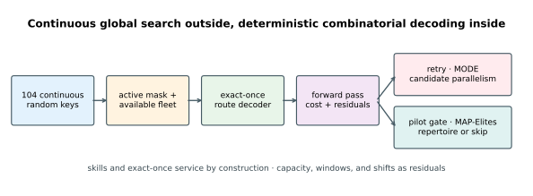
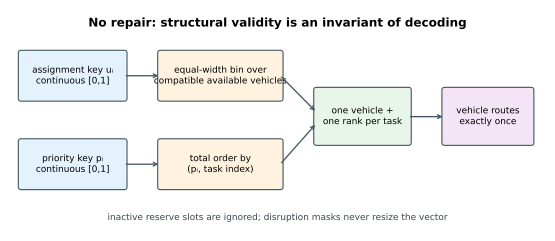
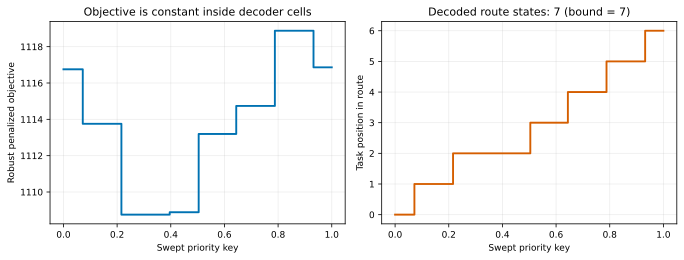
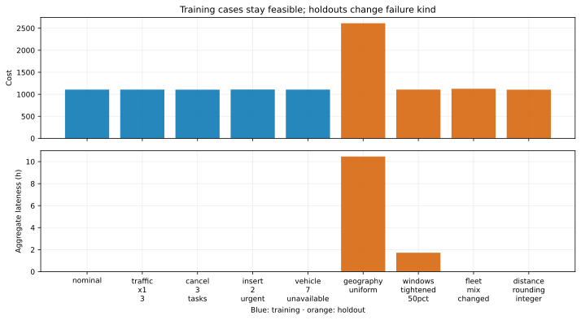
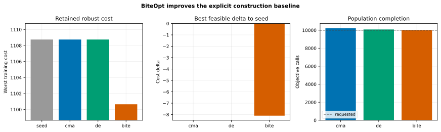
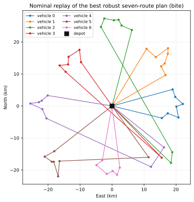
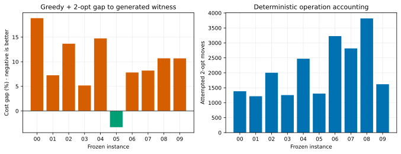
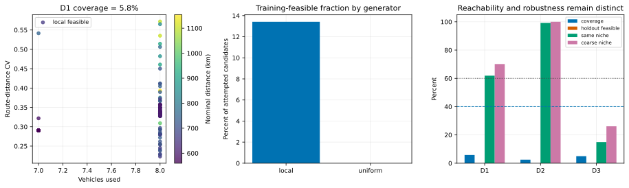
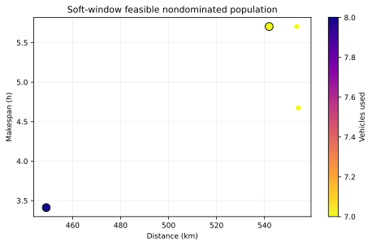

# Field-service routing with random-key decoding

This tutorial turns 104 continuous values into a field-service plan: each of
52 task slots selects a compatible vehicle and a priority within that
vehicle's route. Fifty slots are active normally; two are reserve urgent visits
that a disruption scenario can activate without resizing the optimizer.

The main result is methodological rather than a new routing record:

- the random-key surface really is a staircase—sweeping one priority
  coordinate produced exactly `7` decoded route states, matching its proven
  upper bound;
- a structured seed was feasible in all five training disruptions; BiteOpt
  improved its robust cost from `1108.7515` to `1100.6531`, while CMA-ES and DE
  did not improve it under equal requested budgets;
- a soft-window MODE run returned five feasible nondominated population
  representatives spanning `7–8` used vehicles and `449.00–554.13 km`; and
- the pre-registered QD descriptor gate **rejected** both candidate pairs:
  D1 coverage was only `5.83%` and no sampled plan remained hard-feasible over
  every holdout.

That last result is not hidden. MAP-Elites is implemented and replay-tested,
but the publication archive was skipped because running it after a failed gate
would turn an exploratory picture into an unsupported operational catalogue.



## Why random keys

Global optimizers work naturally on bounded real vectors. Routing decisions are
assignments and permutations. Random keys provide a deterministic bridge:

```text
assign_key[i]   -> equal-width bin over compatible available vehicles
priority_key[i] -> ascending order within the selected vehicle
```

Ties use task index, and non-finite values are rejected. Every active task is
therefore assigned exactly once and has exactly one route position. Skill
compatibility is achieved by construction; capacity, hard windows, and shifts
remain explicit constraints.

The assignment coordinates must stay continuous. Marking normalized `[0,1]`
keys as integer coordinates in an optimizer would round them to two endpoints,
making all interior vehicle bins unreachable.



The encoding creates plateaus, not a smooth surrogate for a permutation. With
all other coordinates fixed:

- sweeping one priority key visits at most `r` states, where `r` is the number
  of tasks on its vehicle; and
- sweeping one assignment key visits at most the number of compatible
  vehicles.

Both statements are asserted over 1,001 sweep points. The publication priority
sweep counted seven distinct states:



This is why finite-difference gradients are not used. The relevant change is a
route-state boundary, not the derivative inside a constant interval.

## Frozen model boundary

[`COST_SPEC.md`](COST_SPEC.md) is authoritative. Travel uses Euclidean
distance at a constant `48 km/h`; service waits for an early window for free;
lateness is measured at service start; and a used vehicle costs a fixed charge
plus distance. This is deliberately smaller than a production router: there is
no road network, traffic calendar, break regulation, pickup-delivery
precedence, or stochastic service time.

The ten synthetic instances and their witness schedules are checked in as CSV.
Each was generated from a complete feasible schedule, not accepted merely
because aggregate fleet capacity looked sufficient. See
[`PROVENANCE.md`](PROVENANCE.md).

The independent scoring gate is documented in
[`M4_FINDINGS.md`](M4_FINDINGS.md). `vrp-core` did not provide the supplied-route
checking interface needed here, so it was not retained. A separately written
in-repository scorer agreed exactly on 1,000 random supplied routes. That is
strong regression evidence but weaker than an external validator.
Bit-exactness is expected because both implementations apply the same primitive
operations in the same order to the same decoded routes. The check covers
distance, timing, capacity, shift and cost arithmetic; separate decoder tests
cover exact-once service, skills, ties and active masks.

## Fixed dimension under disruptions

All robust candidates are evaluated on:

| Training case | Change |
|---|---|
| `nominal` | 50 base visits |
| `traffic_x1_3` | travel time ×1.3; distance cost unchanged |
| `cancel_3_tasks` | deactivate three fixed base slots |
| `insert_2_urgent` | activate the two reserve slots |
| `vehicle_7_unavailable` | remove vehicle 7 from compatible assignment lists |

The vector remains 104-dimensional. Inactive coordinates are ignored.
Removing a vehicle changes assignment bins, so the structured seed uses key
values in the overlap of nominal and disrupted bins and avoids vehicle 7 in
both cases. That is a non-anticipative plan, not a separate route optimized
after observing the disruption.

Holdouts change kind: uniform geography, windows tightened by 50%, a changed
fleet mix, and per-leg integer-km rounding. They are never used for optimizer
selection.



## Robust hard-window optimization

The scalar objective is the worst training-scenario cost plus calibrated
penalties for worst capacity, lateness, and shift violations. CMA-ES,
differential evolution, and BiteOpt each received 10,000 requested calls and
ten retries. Population completion caused small differences in actual calls:

| Arm | Actual calls | Worst cost | Delta to seed | Search found feasible improvement |
|---|---:|---:|---:|---:|
| explicit seed baseline | 1 | 1108.7515 | 0 | no |
| CMA-ES | 10,230 | 1108.7515 | 0 | no |
| DE | 10,081 | 1108.7515 | 0 | no |
| BiteOpt | 10,000 | **1100.6531** | **−8.0984** | **yes** |

The baseline is not charged to any optimizer budget. Each arm retains the
better of its search result and that explicit seed; `arms.csv` also records
the raw search-best cost, so a fallback cannot masquerade as optimization.
BiteOpt reduced robust cost by `0.73%` and nominal distance from `560.02 km` to
`552.12 km`. CMA-ES and DE returned worse raw search candidates, so their
published rows correctly remain at the seed.

Retry zero starts at the exact seed and the other nine starts use deterministic
jitter. Their random streams are keyed by retry ID rather than worker
scheduling; the release test compares one and four workers and requires equal
calls, search result, retained result, and improvement verdict.



The nominal route map below is a visualization; the authoritative output is
the full-precision `routes.csv`.



## Why not a dedicated VRP solver?

On pure routing, start with a mature VRP solver. The native comparison here is
only deterministic greedy insertion plus 2-opt—not a specialist solver and not
a claim about the best VRP software. Across ten generated instances it beat the
construction witness once by `3.32%` and was `5.17–18.87%` worse on the other
nine. It took 1,217–3,818 attempted insertion and 2-opt moves without using its
100,000-move ceiling.



`fcmaes` becomes attractive when the route order sits inside a custom simulator
or scenario objective, or when assignment must be combined with unusual
continuous controls. A QD repertoire can also be valuable, but only after its
behavior axes pass a reachability and robustness gate.

## Descriptor gate: an informative rejection

The primary axes were emergent vehicles used × route-distance coefficient of
variation. The fallback was vehicles × waiting, and distance × vehicles was a
decision-led negative control.

The corrected pilot uses the publication archive's exact `12 × 10` geometry
and three deterministic seed arms. Its frozen generator spends half of 2,000
attempts on local witness perturbations and half on uniform decision vectors:

| Generator | Attempts | Training-feasible | Feasible fraction |
|---|---:|---:|---:|
| local perturbation | 999 | 134 | 13.41% |
| uniform decision box | 1,001 | 0 | 0% |

This shows that the hard-feasible random-key region is extremely narrow.
Consequently the verdict is evidence about this candidate generator and
formulation, not proof that no useful descriptor pair can exist under a more
specialized feasible-plan sampler.

For every training-feasible plan, niche migration uses the representative
`geography_uniform` holdout. Hard-feasibility retention separately requires
surviving **all four** holdouts:

| Pair | \|ρ\| | Coverage | Minimum seed coverage | Axis clipping | All-holdout feasible | Same niche `12×10` | Same niche coarse |
|---|---:|---:|---:|---:|---:|---:|---:|
| D1 vehicles × imbalance | 0.401 | 5.83% | 4.17% | 0% / 0% | **0%** | 61.94% | 70.15% |
| D2 vehicles × waiting | 0.642 | 2.50% | 1.67% | 0% / 0% | **0%** | 99.25% | 100% |
| D3 distance × vehicles | 0.618 | 5.00% | 4.17% | 7.46% / 0% | **0%** | 14.93% | 26.12% |

The frozen gate requires `|ρ| < 0.7`, less than 10% clipping on each axis,
coverage above 40%, more than 60% geography-holdout same-niche retention, and
more than 60% hard-feasibility retention over all holdouts. D1 retains niches
but fails coverage and operational robustness; D2 fails for the same reasons.
The checked-in QD manifest therefore has `status: "skipped"`,
`actual_evaluations: null`, and no stale archive artifacts.



An explicit `--mode qd` remains available for research on training scenarios.
Its output must be called exploratory unless a revised descriptor protocol is
registered and rerun.

## Soft-window trade-offs

The MODE formulation minimizes distance, used vehicles, makespan, and
aggregate lateness while constraining capacity and shift. Lateness is an
objective here, so this is intentionally a different problem from the robust
hard-window scalar arm.

The publication population retained five feasible nondominated points. Its
distance/fleet extremes were:

| Distance | Vehicles | Makespan | Lateness |
|---:|---:|---:|---:|
| 449.00 km | 8 | 12,282 s | 0 s |
| 541.94 km | 7 | 20,533 s | 0 s |



## Reproduce

From this directory:

```bash
cargo test --locked
cargo run --release --locked -- \
  --mode all --preset publication --workers 4 --seed 42 \
  --output results/publication
python plot_results.py --check
```

Use `--preset smoke` for CI. `--workers 0` uses available parallelism; pin a
worker count when comparing timing. Publication wall times were measured on a
shared machine and are descriptive only. Evaluation counts and local-search
move attempts are the reproducibility budgets.

The figures are generated only from checked-in CSV/JSON artifacts. Full
precision lives under
[`results/publication/`](https://github.com/dietmarwo/fcmaes-rust/tree/main/tutorials/field-service-routing/results/publication).
[`DEPENDENCY_NOTICE.md`](DEPENDENCY_NOTICE.md) documents the one explicitly
accepted unmaintained transitive macro crate; new advisories still fail
`cargo deny`.
