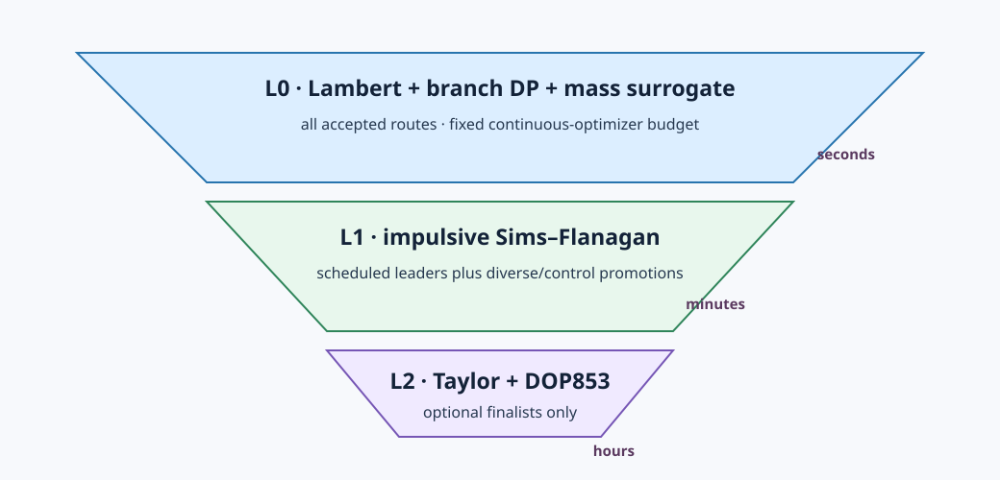
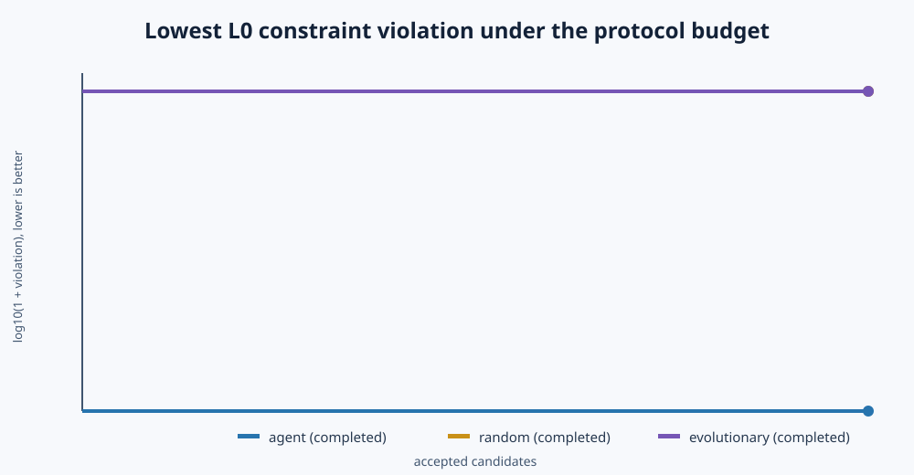
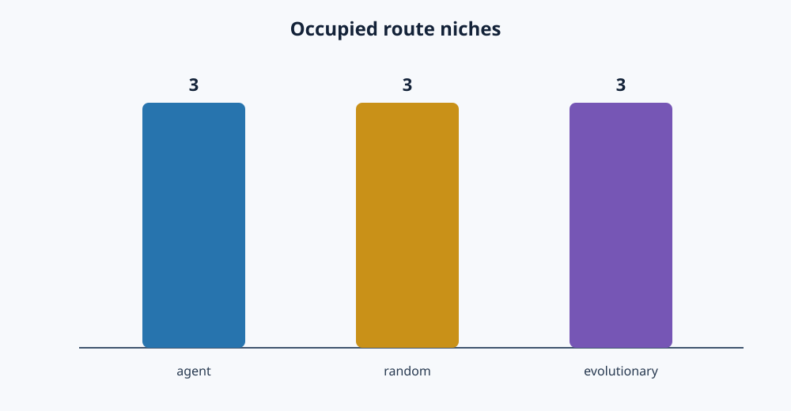
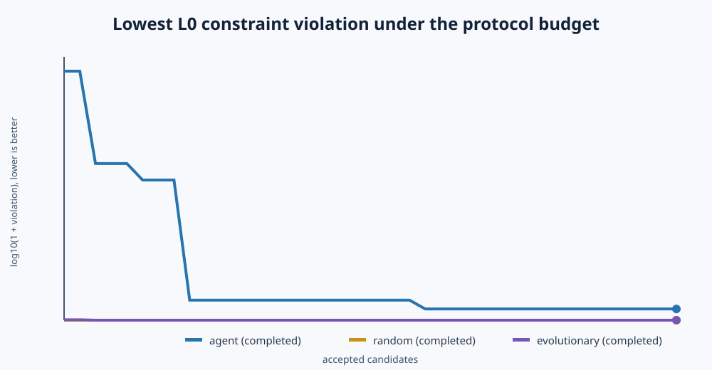
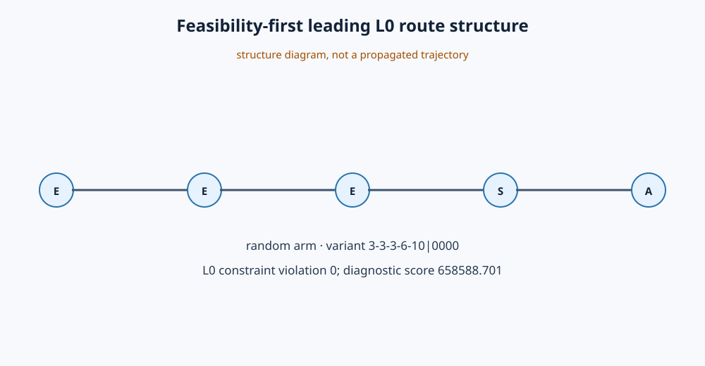
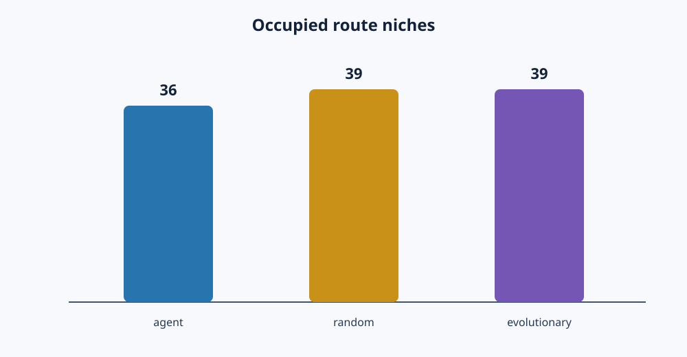
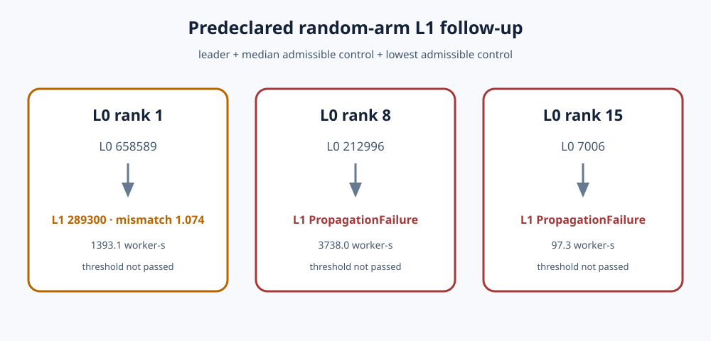

# Split-brain GTOC1 route search

> **Claim boundary.** This tutorial compares ways to propose GTOC1 planet
> orders. L0 is a multi-revolution Lambert surrogate and L1 is an impulsive
> Sims–Flanagan approximation. Neither is a validated continuous-thrust GTOC1
> solution. Only the optional L2 Taylor transcription plus independent DOP853
> repropagation may support model-qualified feasibility language.

> **Work in progress.** The first live seed-42 L0 audit is now complete for
> MiniMax-M3, random, and the repaired evolutionary control. A predeclared
> random-arm follow-up promoted the L0 leader plus median and lowest admissible
> controls to L1; none passed the closure threshold. No arm ran L2. One seed
> is neither an agent-performance claim nor a new GTOC1 solution. A result
> directory is final only when its `run.json` records its terminal status.

The tutorial source is MIT-licensed. Its direct MPL-2.0 `pykep-core`
dependency and the narrow `cargo deny` exception are documented in the
[dependency notice](DEPENDENCY_NOTICE.md).

The fixed-sequence [GTOC1 “Save the Earth” tutorial](../gtoc1/) asks how to
optimize one known `EVEEEJSJA` route. This companion asks the preceding
question: **which planet order should be optimized?** It implements the
split-brain architecture proposed in that tutorial:

- a discrete outer proposer chooses bodies and per-leg Lambert direction;
- deterministic Rust code rejects invalid proposals and derives all numerical
  bounds and revolution caps;
- `fcmaes-core` optimizes launch epoch and leg durations under an identical L0
  budget for every accepted proposal;
- a crash-safe archive feeds compact, untrusted observations back to the
  proposer; and
- selected leaders and controls are promoted to a much more expensive L1
  model.

An AI agent is one proposer, not the judge. Grammar-aware random search and a
route `(1+1)` evolutionary strategy receive the same accepted-candidate
target, variant cap, inner budget, worker allocation, promotion policy, and
root seeds. A negative result—no advantage over the baselines—is a valid
outcome.


## Why split the problem?

A route such as `EVVEEEEJSJA` contains discrete knowledge about resonances and
gravity-assist structure, but its quality cannot be inferred from the body
letters. Each order still needs a continuous search over launch date and
flight times, multi-revolution Lambert branch selection, flyby auditing, and
eventually low-thrust controls. Asking a language model for all those numbers
would mix speculative reasoning with the evidence-producing numerical layer.

The interface therefore contains only:

```json
{
  "bodies": ["Earth", "Venus", "Earth", "Jupiter", "Saturn", "Jupiter", "TW229"],
  "clockwise": [false, false, false, false, true, true],
  "rationale": "an untrusted explanation"
}
```

`clockwise` is the exact `LambertProblem` direction flag. It is not the
multi-revolution `Left`/`Right` branch; the Lambert dynamic program chooses
those branches independently.

## Route grammar and identity

Every route starts at Earth, ends at asteroid 2001 TW229, contains 3–14
encounters, uses only Venus, Earth, Jupiter, and Saturn internally, has no
identical-body run longer than four, has at most four Jupiter/Saturn encounters,
and must have a sum of minimum leg durations below 30 years. Mercury and Mars
are deliberately excluded: preliminary searches consistently spent substantial
budget on poor route families containing them. Direction has one Boolean per
leg.

The archive deliberately keeps two identities:

- `structure_key`: body order only, used for diversity and the per-order
  variant cap;
- `variant_key`: body order plus every direction bit, used for evaluation and
  caching.

Revolution caps are derived from the body pair and configuration. An agent
cannot enlarge them. Launch time, total flight time, and capped-softmax
duration-allocation coordinates decode to legal per-leg bounds whose sum never
exceeds 10,957.5 days.

## Three fidelity levels



### L0: Lambert chain and endpoint-repair mass surrogate

For each physical schedule, `pykep-core` generates all configured
zero-/multi-revolution Lambert families. A forward dynamic program connects
them through intermediate planets. Feasibility-first ranking accounts for
launch excess, minimum-periapsis shortfall, and the endpoint velocity changes
needed to repair each junction to an unpowered equal-speed flyby. A rocket
equation maps that repair to an estimated retained mass.

This is a screening model. A high L0 score can still be optimistic, and a
failed inner optimization means only that no complete chain was found within
the declared budget.

Raw estimated score must never be sorted independently of the constraint. A
diagnostic example from the completed seed-42 MiniMax arm makes this concrete:
`ESJVEJA` (`3-6-5-2-3-5-10|010101`) has an estimated L0 score of about
160,627, but its Earth–Saturn departure requires `10.327 km/s` hyperbolic
excess. The competition permits `2.5 km/s`, so the squared launch violation
alone is about `61.265`. The penalized objective and feasibility-first archive
therefore rank it far below the low-violation routes; it is not a leader or a
score-bearing feasible result. A deliberately lower-ranked control promotion
could still test it, but its raw score supplies no evidence of mission quality.

L0 also records a global full-thrust rocket-equation capacity warning. It does
not prune because endpoint-repair Δv is not a proved lower bound on
continuous-thrust effort. Launch excess and periapsis shortfall are hard L0
constraints; thrust realizability and solar distance require L1/L2 evidence.

### L1: chronological Sims–Flanagan promotion

Promotion consumes the **exact L0 schedule and selected Lambert branches**.
Each repaired fixed-endpoint leg becomes a `SimsFlanaganLeg` using analytic
Lagrange/Kepler propagation. Arrival mass is a decision on every leg, and
optimized mass is carried chronologically through the tour. The default
continuation is:

1. 12 impulses, penalty `1e9`;
2. 12 impulses, penalty `1e12`;
3. 25 impulses, penalty `1e15`.

The final controls, per-leg fuel, mismatch, throttle norm, solar-distance
samples, evaluations, worker-seconds, and failure observation remain in the
archive. They are also an exact warm start for L2.

The checked-in JPL2 control regression reproduces final mass
`1424.093608744 kg`, maximum normalized mismatch `3.12845009e-8`, maximum
throttle `0.999975870154`, and minimum sampled solar distance
`0.654921189476 AU`. That pins the numerical L1 model; it is not an official
GTOC score.

### L2: optional finalist gate

The existing route-generalized `ZohTourProblem` accepts the stored
Sims–Flanagan controls, resamples them to 5–8 genuine constant-thrust segments
per leg, optimizes with Taylor propagation, and independently repropagates the
reported decision with DOP853. Daily solar-distance sampling is required.
This takes hours and is intentionally outside the default campaign.

## Outer strategies and promotion

The guided agent alternates exploration and exploitation after a
feedback-blind bootstrap. “Feedback-blind” means scores are withheld; a
pretrained model can still know published routes, so matches to JPL/Jena/
Deimos families must be labelled rather than presented as discoveries.

During bootstrap and exploration, a candidate must clear a body-only edit
distance from the protected leaders and niche elites. Exploitation may make
distance-one edits. Exact variants and structures that reached their equal
variant cap never consume an inner budget.

The baselines are:

- random grammar-valid variable-length routes and independent direction bits;
- an evolutionary strategy with independent grammar-random bootstrap seeds,
  random immigrants during exploration, and feasibility-first elite
  exploitation using substitution, insertion, deletion, adjacent swap,
  outer-tail resampling, and one direction-bit flip.

The random immigrants are protocol-critical, not a tuning embellishment.
One-edit children cannot clear the exploration distance-three gate, and a
mutation-only elite pool eventually saturates the exact-variant and
per-structure caps.

After every eight accepted L0 candidates, the default policy promotes one
leader and one diverse niche elite—or, with probability 0.2, a lower-ranked
control. Controls measure surrogate error outside the sample the surrogate
already prefers. The main scientific figure is therefore L0 estimated score
versus L1 score, including promotion failures.

## Agent boundary and security

The Rust driver has no HTTP, TLS, async-runtime, or provider SDK dependency.
It spawns an exact argv array without a shell, writes one request to stdin,
closes stdin, reads independently capped stdout/stderr streams, and enforces a
deadline. On Unix the adapter gets a fresh process group, which is terminated
as a unit on timeout. Malformed model output receives exactly one JSON repair
call.

CI uses `agents/mock_agent.py`, which is deterministic and offline. Replay
mode consumes a redacted prior `agent_log.jsonl`. The optional
`agents/llm_agent.py` supports OpenAI- and Anthropic-compatible endpoints
using only the Python standard library; no provider or model is compiled into
Rust.

[`config.live.example.json`](config.live.example.json) is a complete campaign
configuration for
[MiniMax's Anthropic-compatible API](https://platform.minimax.io/docs/api-reference/text-anthropic-api).
Its `agent` object contains:

```json
{
  "transport": "command",
  "command": ["python3", "agents/llm_agent.py"],
  "provider": "anthropic-compatible",
  "model": "MiniMax-M3",
  "base_url": "https://api.minimax.io/anthropic",
  "api_key_env": "ROUTE_AGENT_API_KEY",
  "maximum_tokens": 20000,
  "provider_options": {"thinking": {"type": "adaptive"}}
}
```

Then export `ROUTE_AGENT_API_KEY` only in the process environment. Artifacts
store the variable name, provider/model identifiers, options, latency, and
token usage—not the credential value.

Run the offline adapter tests, export the key, and launch the arm with:

```bash
python3 -m unittest agents/test_llm_agent.py
export ROUTE_AGENT_API_KEY='your-minimax-api-key'
cargo run --release --locked -- \
  --mode campaign --config config.live.example.json
```

The adapter sends `thinking: {"type": "adaptive"}` together with
`stream: true`. Its Anthropic SSE parser consumes keep-alives and
`thinking_delta` events without retaining the reasoning, concatenates only
`text_delta` events into candidate JSON, merges start/final token usage, and
requires a clean `message_stop`. Provider error events and truncated streams
remain typed transport failures. Because this wire format has no native
`response_format`, the adapter appends the protocol-owned route constraints,
an exact output example, and JSON Schema after the user prompt. Each provider
call is deliberately independent; the Rust driver supplies a bounded summary
of prior proposal exchanges instead of continuing a provider-native reasoning
chain.
For MiniMax the adapter sends both `Authorization: Bearer` and `X-Api-Key`;
their Messages API specifies that bearer authorization takes precedence when
both are present.

Before funding the full campaign, run one accepted-candidate L0 smoke test.
This permits one proposal attempt, no transport retry, at most one JSON-repair
call, and at most 8,192 generated tokens per call:

```bash
cargo run --release --locked -- \
  --mode campaign --config config.live.example.json \
  --accepted-candidates 1 --max-proposal-attempts 1 --max-level l0 \
  --retries 1 --evaluations 500 --max-eval-fac 1 --workers 1 \
  --agent-max-tokens 8192 --agent-max-retries 0 \
  --results results/minimax-smoke/agent
```

Use a separate copy of the configuration for every root seed and comparison
arm. The random and evolutionary arms do not call the adapter, but their L0
and promotion settings must remain identical.

## Reproduce the offline protocol

From this tutorial directory:

```bash
cargo test --locked
cargo clippy --locked --all-targets -- -D warnings

# Evaluate a supplied physical schedule without optimization.
cargo run --release --locked -- \
  --mode inspect --route EVEEEJSJA --clockwise 00000011 \
  --schedule 8168.477153978,817.769667745,660.575139524,788.584346596,1412.595495585,445.823854604,479.477839881,3269.045639424,548.827683602

# Optimize one route at L0.
cargo run --release --locked -- \
  --mode scout --route EVEEEJSJA --clockwise 00000011 \
  --retries 32 --evaluations 20000 --max-eval-fac 10 --seed 43

cargo run --release --locked -- \
  --smoke --strategy agent \
  --agent-command-json '["python3","agents/mock_agent.py"]' \
  --results results/smoke/agent

cargo run --release --locked -- \
  --smoke --strategy random --results results/smoke/random

cargo run --release --locked -- \
  --smoke --strategy evolutionary --results results/smoke/evolutionary

python3 compare_campaigns.py --results results/smoke
```

These smoke and CI paths are intentionally gitignored scratch output. Readers
can inspect the committed `results/protocol-evidence/` fixture without running
the code; live provider campaigns are published only after they finish and
their complete manifest/CSV bundle has been reviewed.

A single archived route can be promoted independently:

```bash
cargo run --release --locked -- \
  --mode refine \
  --from-result 'results/smoke/agent/archive.jsonl#3-2-3-3-3-5-6-5-10|00000011'
```

The optional end-to-end L1 protocol test uses a deliberately inadequate
budget and should normally report `threshold_passed=false`:

```bash
cargo run --release --locked -- \
  --smoke --strategy agent --accepted-candidates 1 \
  --max-level l1 --l1-smoke --promote-every 1 --promote-batch 1 \
  --results results/l1-smoke
```

## Persistence and artifacts

`archive.jsonl` is append-only and checksummed. An L1/L2 revision appends a new
complete record for the same immutable L0 candidate; loading verifies that the
revision did not alter identity or L0. A truncated final line is ignored, but
mid-file corruption is fatal. Snapshots and cache entries use a temporary
sibling, flush, and atomic rename.

Each arm writes:

- `run.json`: status, configuration identity, proposal/token counters,
  requested and actual evaluations, wall time and allocated worker-seconds;
- `archive.jsonl`, `archive.json`, and `archive.csv`;
- `proposal_log.jsonl` and replayable `agent_log.jsonl`;
- `promotions.csv` with L0/L1 gap and failure;
- `convergence.csv`.

Allocated worker-seconds are `wall × resolved workers`, not measured CPU time.
Parallel coordinated retry is not claimed bit-reproducible; fixed-seed
single-worker regression and replay are.

## Evidence status

The original committed fixture is only a transport, persistence, and protocol smoke
check. Its deterministic mock emits the historical JPL, JPL2, and Jena routes
as its first three proposals; it is not a language model and its table is not
an agent-versus-baseline capability comparison. The table deliberately omits
route scores and instead reports constraint status, accounting, and coverage.

The reviewed live evidence uses MiniMax-M3, root seed 42, a 20,000-token
response cap, a 40-candidate target, and a 120-attempt ceiling. It was
deliberately launched at L0 only. The compact final bundles—without optimizer
cache files—are checked in under
[`results/live-l0-seed42/`](https://github.com/dietmarwo/fcmaes-rust/tree/main/tutorials/gtoc1-route-search/results/live-l0-seed42).
They retain the final manifests, archives, proposal/provider logs, convergence,
and empty promotion tables. The original one-route failure and the
bootstrap-only 39-route rerun remain beside the completed repaired arm instead
of being overwritten.

The exact offline evidence is retained in
[`results/protocol-evidence/comparison.md`](results/protocol-evidence/comparison.md);
regenerate its table with `python3 compare_campaigns.py --check`.





The empty [surrogate-gap panel](images/surrogate-gap.svg) is a status
placeholder, not a scientific figure: the L0-only protocol fixture contains
zero promotions and therefore zero measured gaps. The separate L1 smoke
command tests promotion plumbing, while a future publication campaign must
supply the gap distribution. The
[closest-route structure diagram](images/best-route-structure.svg) labels the
mock fixture's lowest-violation body order and explicitly is not a propagated
trajectory.

### Live seed-42 L0 audit

The three configurations requested the same root seed, 40 accepted candidates,
120 proposal attempts, L0 inner budget, variant cap, worker allocation, and
promotion policy. All three final arms completed:

| Arm | Status | Accepted | L0 admissible | Lowest violation | Niches |
|---|---|---:|---:|---:|---:|
| MiniMax-M3 | completed | 40 / 40 | 0 | 0.342919 | 36 |
| random | completed | 40 / 40 | 15 | 0 | 39 |
| evolutionary | completed | 40 / 40 | 24 | 0 | 39 |

“L0 admissible” means only `constraint_l0 <= 1e-8`: launch excess and
periapsis checks in the Lambert endpoint-repair screen pass. It does not mean
that the thrust history, mass continuity, solar-distance constraint, or final
intercept is realizable.



The random arm's leading L0-admissible route is
`3-3-3-6-10|0000` (`EEESA`). Its diagnostic estimated score is
`658,588.701`, with `2.500 km/s` launch v-infinity, `6.688 km/s` powered flyby
change, `9.024 km/s` endpoint repair, and 6,995.3 flight days. Those numbers
make it a useful L1 challenge candidate, not a GTOC1 solution or score. No
MiniMax proposal passed the L0 constraint threshold in this seed.



The numerical work was of the same order across the completed arms: MiniMax
used 74,005,732 actual L0 evaluations and 45.333 allocated worker-hours;
random used 75,743,371 and 44.190 worker-hours; evolutionary used 81,822,640
and 51.776 worker-hours. Wall time was 8.697 h, 1.381 h, and 1.618 h,
respectively. The agent made 94 provider calls, consumed 944,365 reported
tokens, encountered 10 transport failures, and had 43 diversity rejections.
These are accounting observations, not cost-normalized model-quality claims.



The evolutionary repair was incremental and its failed attempts remain useful
protocol evidence:

1. the original arm stopped at 1/40 because every post-seed one-edit bootstrap
   mutation failed the distance-three gate;
2. keeping independent samples through the six-route bootstrap fixed that
   deadlock, but the mutation-only exploration/exploitation pool saturated at
   39/40 after 120 attempts; and
3. using independent random immigrants for exploration while retaining elite
   mutations for exploitation completed 40/40 in 58 attempts and occupied 39
   niches.

The generated, feasibility-first table is
[`results/live-l0-seed42/comparison.md`](results/live-l0-seed42/comparison.md).
Both tables and both figure sets are regenerated and checked independently.

### Predeclared random-arm L1 follow-up

Before inspecting any L1 output, the follow-up selected the leader, median,
and lowest route among the 15 L0-admissible random candidates: ranks 1, 8, and
15. Exact variant keys and order are stored in `run.json`. This design tests
the top surrogate prediction and two controls without spending the controls
on routes already disqualified by L0 launch/periapsis constraints.



No promotion passed:

- rank 1 `3-3-3-6-10|0000` returned a finite L1 score of `289,300.288`,
  versus `658,588.701` at L0, but maximum normalized mismatch remained
  `1.07444` rather than at most `1e-7`; maximum throttle was also `1.02870`;
- rank 8 `3-3-3-2-6-10|00011` encountered a typed elliptic Kepler propagation
  convergence failure; and
- rank 15 `3-2-2-3-2-2-2-2-3-2-3-10|00000000100` encountered a typed
  hyperbolic Kepler propagation convergence failure.

The complete generated table is
[`results/live-l1-seed42/comparison.md`](results/live-l1-seed42/comparison.md).
The recorded L1 work is 56,052,992 observed objective calls and 5,228.4
worker-seconds. A zero actual-evaluation count on a propagation failure means
the exception escaped before the retry layer returned its counter; it does not
mean that no compute was consumed. The requested caps and measured
worker-seconds remain recorded.

No L2 success is required for an honest L1 comparison. Here there is no
threshold-passing L1 candidate to promote. The abstract and conclusion must
continue to say “Lambert and impulsive Sims–Flanagan route-proposal
comparison,” never “new feasible GTOC1 solution.”

### What is still missing?

The following items deliberately remain open:

- repeat all three arms for a predeclared set of independent root seeds rather
  than drawing a capability conclusion from seed 42;
- run matched, predeclared L1 promotions for agent and evolutionary archives
  before comparing strategy-specific surrogate error;
- diagnose the two control-route Kepler convergence failures and improve L1
  accounting so an interrupted retry reports its exact objective count;
- report feasibility-first results: positive L0 constraint values are
  violations, so their estimated and fixed-mass scores are diagnostic values,
  not valid mission scores;
- obtain a threshold-passing L1 candidate before considering L2 Taylor
  transcription and independent DOP853 repropagation.

Publishing this list is intentional. It separates a useful, reproducible
workbench from conclusions that the evidence does not yet support.

## Run your own experiment

Start with the offline smoke commands above. For a live experiment, copy
`config.live.example.json`, choose an explicit provider and model, point
`api_key_env` at an environment variable, and never put the credential in the
JSON file. Reduce `accepted_candidates`, `maximum_proposal_attempts`,
`inner_budget`, and `maximum_tokens` for a first paid test.

The following commands run one matched L0 set. `--results` also redirects the
agent log into the corresponding arm directory:

```bash
experiment_root=results/my-live-l0-seed42

cargo run --release --locked -- \
  --mode campaign --config config.live.example.json \
  --strategy agent --max-level l0 --seed 42 \
  --results "$experiment_root/agent"

cargo run --release --locked -- \
  --mode campaign --config config.live.example.json \
  --strategy random --max-level l0 --seed 42 \
  --results "$experiment_root/random"

cargo run --release --locked -- \
  --mode campaign --config config.live.example.json \
  --strategy evolutionary --max-level l0 --seed 42 \
  --results "$experiment_root/evolutionary"

python3 compare_campaigns.py --results "$experiment_root"
python3 plot_results.py --results "$experiment_root" \
  --output images/my-live-l0-seed42
```

The random and evolutionary arms do not contact the configured provider. Use
a new directory for every seed and every fidelity level; do not overwrite or
reinterpret a completed manifest with changed settings. Before comparison,
confirm that all three `run.json` files say `completed` and record matching
budgets apart from `strategy`, provider usage, and the output path.

For an L1 study, change all three arms to `--max-level l1` and use a fresh
root such as `results/my-live-l1-seed42`. L1 is substantially more expensive:
the checked-in refinement schedule reaches 25 impulses and 1.2 million
evaluations in its last continuation stage. L2 remains an explicitly selected
follow-on for a few finalists, not part of the broad route-order campaign.

To reproduce the targeted random-arm follow-up without altering the completed
L0 bundle, copy only its append-only archive and promote the exact predeclared
variants:

```bash
mkdir -p results/my-live-l1-seed42/random-targeted
cp results/live-l0-seed42/random/archive.jsonl \
  results/my-live-l1-seed42/random-targeted/archive.jsonl

cargo run --release --locked -- \
  --mode campaign --config config.live.example.json \
  --strategy random --max-level l1 --seed 42 \
  --promote-variants \
  '3-3-3-6-10|0000,3-3-3-2-6-10|00011,3-2-2-3-2-2-2-2-3-2-3-10|00000000100' \
  --results results/my-live-l1-seed42/random-targeted
```

Parallel coordinated retry is not bit-reproducible even with a fixed root
seed. Preserve the raw archives and report distributions across seeds. Use
replay mode when testing the deterministic numerical pipeline against the same
agent proposals without paying for another provider call.
