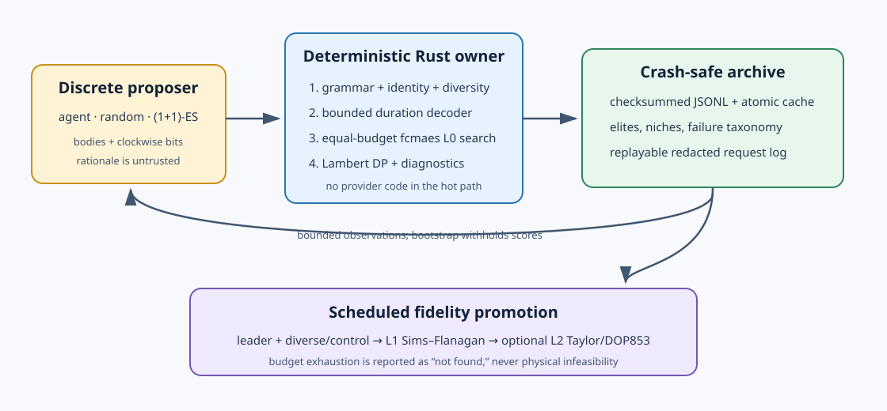
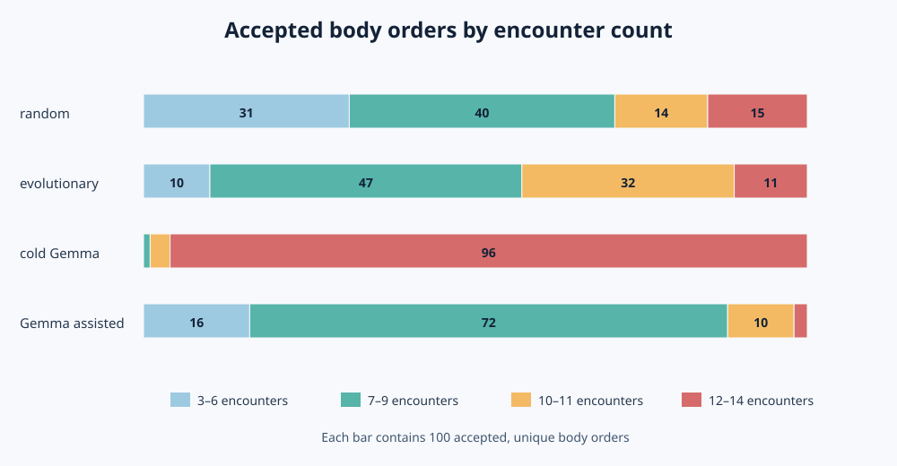
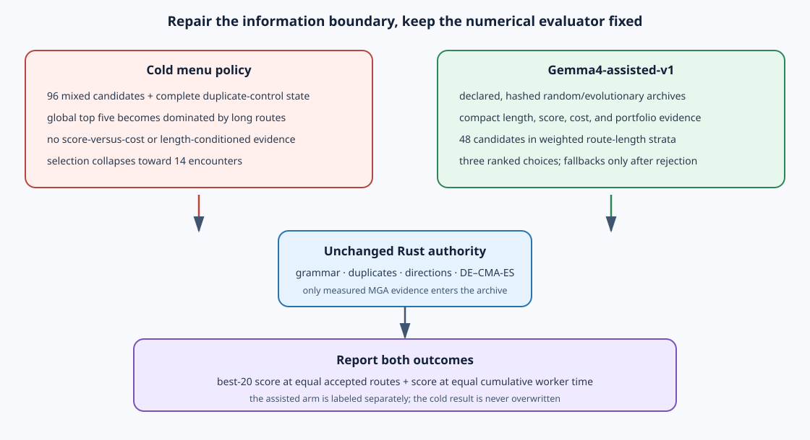
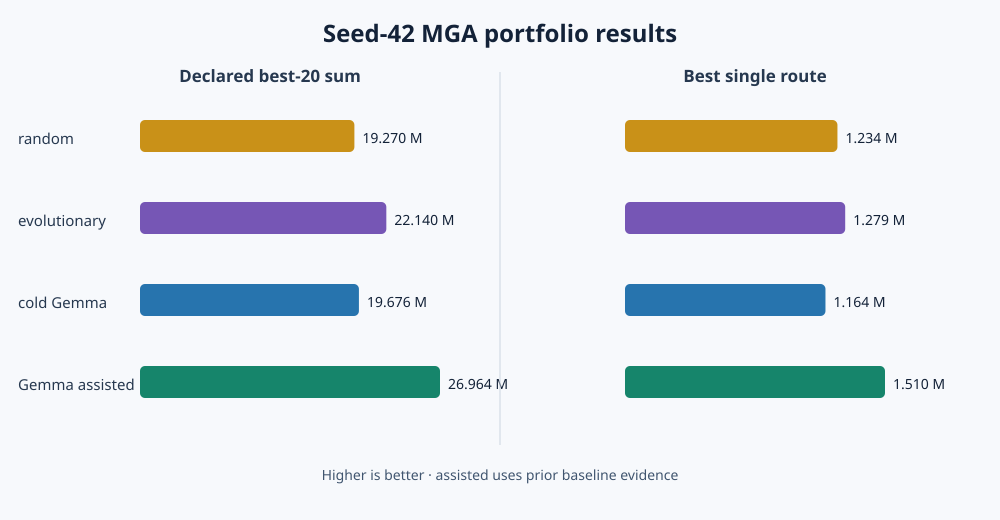

# Split-brain GTOC1 route discovery

> **Claim boundary.** This tutorial discovers planet orders with an impulsive
> multiple-gravity-assist (MGA) model. “MGA-qualified” means only that the
> declared optimizer found a finite Lambert/flyby solution. It does not mean
> continuous-thrust feasible, competition-valid, or better than a published
> GTOC1 solution.

> **Measured status.** The JPL control, three blind 100-route seed-42 arms, and
> the separately named Gemma-assisted follow-up are complete. Cold Gemma
> collapses onto long routes; the prior-informed, length-stratified interface
> repairs that failure and raises the best-20 MGA sum from 19.676 M to 26.964 M.
> This is one-seed outer-search evidence, not a model-capability result or a
> low-thrust GTOC1 solution. Older endpoint-repair and Sims–Flanagan folders are
> retained only as development history and must not be mixed with this archive.

The fixed-sequence [GTOC1 “Save the Earth” tutorial](../gtoc1/) explains the
competition and studies known routes in detail. This companion answers an
earlier question: **which planet orders deserve expensive downstream work?**

The source is MIT-licensed. Its direct MPL-2.0 `pykep-core` dependency is
described in the [dependency notice](DEPENDENCY_NOTICE.md).

## The reduced research question

The tutorial deliberately does not solve the full low-thrust competition
problem. Its outer loop searches for a portfolio of promising body orders:

1. propose a grammar-valid planet order;
2. derive its historical pair-dependent Lambert direction pattern in Rust;
3. optimize launch epoch and direct leg times with the same DE–CMA-ES budget;
4. enumerate multi-revolution Lambert families and charge launch/flyby
   impulses in an MGA score;
5. archive the result and feed a bounded summary to the next proposal; and
6. compare the sum of the best 20 scores after 100 accepted orders.

Low-thrust transcription, Taylor integration, and DOP853 validation belong to
a later project fed by this portfolio. Keeping them out makes the outer
planet-order comparison much larger, cheaper, and easier to interpret.



## Why split the brain?

Planet-order selection is discrete and benefits from structural hypotheses:
resonant inner loops, an outer-planet energy pump, and motifs seen in prior
routes. Numerical fitness is a different kind of work. A model cannot infer a
route’s score from letters alone; launch date, flight times, Lambert branches,
powered flybys, and final impact geometry must be computed.

The proposer therefore returns only:

```json
{
  "bodies": ["Earth", "Venus", "Earth", "Jupiter", "Saturn", "Jupiter", "TW229"],
  "rationale": "an untrusted search hypothesis"
}
```

Rust owns every validity and score decision. Rationale is archived for audit,
never treated as physical evidence.

## Grammar, directions, and duplicates

Every route:

- starts at Earth and ends at asteroid 2001 TW229;
- has 3–14 encounters;
- uses only Venus, Earth, Jupiter, and Saturn internally;
- has no identical-body run longer than four;
- contains at most four Jupiter/Saturn encounters; and
- admits route-derived minimum leg times within the 30-year limit.

Mercury and Mars remain excluded because earlier experiments spent large
budgets on poor families containing them.

### Direction is derived, not guessed

Independent random direction bits were part of the previous exploratory
protocol. They are unsuitable here. The checked-in historical JPL, JPL2,
Jena, and Deimos route fixtures all use the same restricted pattern:

- default direction on inner-planet and outward legs;
- reverse direction for Saturn→Jupiter; and
- reverse direction for the terminal Jupiter→TW229 leg.

This is consistent with the official [GTOC1 results](https://www.esa.int/gsp/ACT/projects/gtoc_1/gtoc1results/),
which emphasize that the two leading trajectories share the Jupiter–Saturn–
Jupiter outer geometry. The Deimos workshop analysis likewise identifies
Jupiter–Saturn–Jupiter–asteroid as the desirable final sequence. The Boolean
rule itself is a tested property of the reconstructed local trajectory
fixtures, not a claim that ESA published universal direction bits.

`canonical_clockwise()` derives this pattern from each ordered body pair.
Random, evolutionary, and Gemma proposals cannot override it. The test suite
checks all four historical fixtures exactly. Manual `mga-inspect` and
`mga-scout` calls still accept explicit direction bits for sensitivity studies.

This makes body order the campaign identity. A repeated order is rejected
before optimization, recorded in `proposal_log.jsonl`, and consumes no MGA
budget. The local-model adapter goes further: it offers Gemma only a
deterministic menu of grammar-valid unseen orders. Rust still performs the
authoritative duplicate check, including for remote/free-form adapters.

## The MGA qualification score

For one launch date and set of leg times, `pykep-core` creates every configured
zero- and multi-revolution Lambert family. Dynamic programming connects the
arcs using the minimum powered-flyby impulse returned by
`pykep_core::astro::flyby::flyby_delta_v` at the safe body radius.

Only launch excess above the free `2.5 km/s` capability and powered-flyby
impulses reduce the mass estimate. Asteroid-relative arrival speed is useful
impact energy, not an arrival-burn cost:

\[
S_{\mathrm{MGA}} = 1500\exp\!\left(-\frac{\max(0,v_\infty-2.5)+
\sum_i\Delta v_{\mathrm{fb},i}}{24.516625}\right)
\frac{|(\mathbf v_A-\mathbf v_{sc})\cdot\mathbf v_A|}{10^6}.
\]

Higher is better. A candidate with a finite optimized score is
“MGA-qualified” for downstream study. This deliberately says nothing about
whether low thrust can realize its Lambert scaffold.

### JPL control

The historical-control mode fixes JPL’s `EVEEEJSJA|00000011` order/direction,
allows the published timing as an incumbent, and enumerates all configured
Lambert branches. The checked-in seed-43 result is:

| quantity | result |
|---|---:|
| optimized MGA score | 1,841,018.733 |
| fixed-1442.9-kg impact score | 1,851,239.950 |
| charged impulsive Δv | 1.087232 km/s |
| final mass estimate | 1,434.933 kg |
| relative impact speed | 52.660437 km/s |
| selected early branches | 3R, 1L, 1R |
| actual / requested evaluations | 1,824,145 / 3,520,000 |
| recorded wall time / workers | 116.765 s / 32 |

See [`results/mga-jpl-seed43.json`](results/mga-jpl-seed43.json). This validates
that MGA recognizes the winning route’s useful structure; it is not a
competition trajectory validation.

```bash
cargo run --release --locked -- \
  --mode mga-scout --route EVEEEJSJA --clockwise 00000011 \
  --schedule 8998,1278,950,1189,1756,486,482,3275,543 \
  --retries 32 --evaluations 20000 --max-eval-fac 10 \
  --workers 0 --seed 43
```

The campaign path is intentionally history-blind. Even when an arm proposes
the JPL body order, `optimize_mga_campaign()` uses route-derived bounds and a
neutral midpoint—never JPL’s published timing or special bounds. All arms see
the same numerical problem.

## Three matched outer strategies

The experiment compares:

- **random**: independent grammar-valid body orders;
- **evolutionary**: a feedback-blind random bootstrap, mutations of several
  score-ranked elites, and regular random immigrants; and
- **Gemma 4 31B**: a local llama.cpp model selecting an opaque ID from a
  deterministic menu of unseen valid candidates.

Evolution mutates only the body order: substitution, insertion, deletion,
adjacent exchange, and outer-tail resampling. Direction-bit mutation no longer
exists. During bootstrap/exploration, body edit distance protects diversity;
exploitation may refine a nearby route family.

All three arms share:

| setting | publication value |
|---|---:|
| accepted unique body orders | 100 |
| proposal-attempt ceiling | 2,500 |
| DE–CMA-ES retries per order | 32 |
| initial evaluations per retry | 20,000 |
| maximum retry budget factor | 10 |
| default workers | physical CPU cores |
| root seed | 42 |
| portfolio metric | sum of best 20 MGA scores |

The best-one score is retained, but the declared comparison target is the
top-20 sum. It rewards a proposer for finding a useful portfolio rather than
getting lucky once.

### Eight-hour budget design

On the development Ryzen 9 9950X, one representative full-budget random route
used 16 physical workers, made 2,031,391 actual objective calls, and took
149.642 seconds. At that measured rate, 100 routes project to about 4.16 hours.
The eight-hour ceiling leaves about 3.84 hours for longer routes, optimizer
variance, operating-system load, and duplicate proposal overhead.

This is a sizing measurement, not a universal runtime guarantee. Check the
first few routes on a different machine. If their mean exceeds 240 seconds,
reduce `--accepted-candidates` before starting all arms and apply the same new
target to every arm. Do not stop one arm early based on its observed scores.

## Local Gemma 4 through llama.cpp

[`config.llamacpp.example.json`](config.llamacpp.example.json) is a complete
campaign configuration. It assumes an OpenAI-compatible llama.cpp server at
`http://127.0.0.1:8080/v1` and deliberately needs no fake API key. Replace the
model ID with the ID exposed by your server if necessary.

The checked-in settings use:

```json
{
  "provider": "openai-compatible",
  "model": "gemma-4-31b-it",
  "base_url": "http://127.0.0.1:8080/v1",
  "api_key_env": null,
  "maximum_tokens": 8000,
  "provider_options": {
    "candidate_menu_size": 96,
    "temperature": 0.6,
    "chat_template_kwargs": {"enable_thinking": false}
  }
}
```

`enable_thinking: false` is intentional for the candidate-menu task: Gemma
chooses among already valid candidates while the expensive reasoning and
evidence production happen in Rust. The adapter accepts normal text or fenced
JSON, enforces a JSON-schema `candidate_id`, and maps that opaque ID back to a
body order. Local loopback URLs require no credential; remote URLs still
require `api_key_env`.

This is the original **cold** menu policy. It is retained unchanged so its
result remains replayable; the assisted follow-up below is opt-in and uses a
different, explicit protocol identifier.

Anthropic-compatible streaming remains supported by
[`config.live.example.json`](config.live.example.json). Thinking deltas are
discarded and never mixed into the candidate JSON.

## Run the matched experiment

Start the local model before the Gemma arm. Each command writes to a distinct
directory and can resume an interrupted archive. The random and evolutionary
arms parse the same config but never contact the provider.

```bash
experiment_root=results/mga-matched-seed42

cargo run --release --locked -- \
  --mode campaign --config config.llamacpp.example.json \
  --strategy random --seed 42 \
  --results "$experiment_root/random"

cargo run --release --locked -- \
  --mode campaign --config config.llamacpp.example.json \
  --strategy evolutionary --seed 42 \
  --results "$experiment_root/evolutionary"

cargo run --release --locked -- \
  --mode campaign --config config.llamacpp.example.json \
  --strategy agent --seed 42 \
  --results "$experiment_root/gemma4"

python3 compare_campaigns.py --results "$experiment_root"
```

The reviewed seed-42 bundle is checked in under
[`results/mga-matched-seed42`](results/mga-matched-seed42/README.md). It retains
the accepted-route archives, terminal manifests, convergence and rejection
logs, and provider exchanges while omitting redundant response caches.

## A useful failure: cold Gemma collapses on route length

The completed matched run exposed an information-boundary failure. Cold Gemma
selected 90 fourteen-encounter orders; 96 of its 100 routes fell in the 12–14
encounter band, and 18 members of its final top-20 portfolio had length 14.
Random selected four length-14 routes and evolutionary one.

| blind arm | accepted | best-20 sum | best score | niches | worker-h | wall-h |
|---|---:|---:|---:|---:|---:|---:|
| random | 100 | 19.270 M | 1.234 M | 96 | 82.9 | 5.18 |
| evolutionary | 100 | 22.140 M | 1.279 M | 97 | 77.6 | 4.85 |
| cold Gemma | 100 | 19.676 M | 1.164 M | 63 | 178.7 | 11.66 |

Cold Gemma's best-20 sum is only 2.1% above random, 11.1% below evolutionary,
and costs more than twice the worker time of either control. The 96-entry
prompt forwarded complete duplicate-control state, exposed only global score
leaders, omitted length-conditioned cost evidence, and let those leaders seed
more mutations. Once long routes occupied the global top five, Gemma received
increasingly one-sided evidence. Turning on more model reasoning would not
repair that feedback loop.

The conclusion is not “14 encounters are invalid.” The known Deimos route has
14 encounters and remains inside the grammar. The failure is spending almost
the entire portfolio on one costly dimensional class without evidence that it
dominates shorter alternatives.





## Gemma4-assisted-v1

[`config.llamacpp.assisted.example.json`](config.llamacpp.assisted.example.json)
implements the follow-up as a separately named experiment. It keeps the MGA
formula, grammar, canonical directions, DE–CMA-ES budget, root seed, 100-route
target, and best-20 objective. It changes only the outer agent interface:

- completed random and evolutionary archives are declared as prior evidence;
- their exact body orders are excluded, so Gemma cannot copy an evaluated
  route;
- the adapter verifies the full configured archive digest and stores its prefix
  in each selected route's rationale;
- the model sees compact live and prior evidence, never the full duplicate
  lists needed internally by the adapter;
- the first eight accepted routes cycle through controlled length bands before
  score feedback is exposed;
- later 48-entry menus use quotas `8 / 16 / 16 / 8` for encounter bands
  `3–6 / 7–9 / 10–11 / 12–14`;
- candidates combine mutations of score-ranked, length-diverse elites with
  stratified random immigrants; and
- Gemma ranks three choices. Rust uses lower-ranked choices only if an earlier
  proposal is rejected, and discards stale fallbacks after an accepted route.

Each menu row identifies its length band, terminal motif, outer-planet count,
optimizer-cost band, mutation parent, parent score, and nearest-elite edit
distance. Live feedback reports the best and mean MGA score, top-five mean,
and mean worker time by encounter count, plus the current best-20 cutoff.
Encounter count itself receives no reward.

This is intentionally called **assisted**, not silently substituted for the
cold arm. It uses knowledge acquired by the completed baseline experiments.
The tutorial reports both accepted-route and cumulative-worker-time views;
otherwise a strategy can look competitive merely by selecting more expensive
orders.

### Completed assisted follow-up

The 100-route seed-42 follow-up completed without transport failures:

| quantity | cold Gemma | Gemma-assisted |
|---|---:|---:|
| best-20 MGA sum | 19.676 M | 26.964 M |
| best single MGA score | 1.164 M | 1.510 M |
| occupied niches | 63 | 81 |
| actual MGA evaluations | 225.903 M | 191.154 M |
| worker-hours | 178.7 | 71.2 |
| wall-hours | 11.66 | 4.70 |
| model calls | 190 | 103 |
| model input tokens | 2.339 M | 1.080 M |

Relative to cold Gemma, the assisted policy improves the declared portfolio
metric by 37.0%, improves the best route by 29.7%, uses 59.7% less wall time,
and uses 53.8% fewer input tokens. Its leader is `EVEVVESJA`, with an MGA score
of 1,509,902, charged impulsive Δv of 3.875844 km/s, and 8,177.8 flight days.
The lower actual evaluation and worker totals arise mainly because the repaired
menu selects shorter optimization problems; every route retains the same
declared DE–CMA-ES retry limits.



The assisted result also exceeds the blind evolutionary arm's best-20 sum by
21.8%, but that is not an unbiased head-to-head model comparison: it consumed
the random and evolutionary archives as prior evidence. The defensible claim
is narrower—the diagnosed information-boundary failure can be repaired by a
transparent, versioned candidate-selection policy while Rust remains the
score authority.

The declared
[`random.archive.json`](results/assisted-prior/random.archive.json) and
[`evolutionary.archive.json`](results/assisted-prior/evolutionary.archive.json)
files, together with their terminal manifests, are checked in under
`results/assisted-prior`. The configuration pins their combined SHA-256;
changing either archive makes the adapter stop before contacting the model.

To substitute independently reproduced baseline archives, copy both files,
calculate the adapter's combined digest, update the config, and use a new
assisted result directory. The shipped evidence can be verified with:

```bash
python3 - <<'PY'
from agents.llm_agent import load_experience

prior = load_experience([
    "results/assisted-prior/random.archive.json",
    "results/assisted-prior/evolutionary.archive.json",
])
print(prior.digest)
PY
```

Then start the same llama.cpp Gemma 4 31B server and run:

```bash
# Optional transport/schema smoke test; never resume it as the full run.
cargo run --release --locked -- \
  --mode campaign \
  --config config.llamacpp.assisted.example.json \
  --strategy agent \
  --accepted-candidates 1 \
  --max-proposal-attempts 10 \
  --bootstrap-candidates 1 \
  --retries 1 --evaluations 500 --max-eval-fac 1 --workers 1 \
  --seed 42 \
  --results results/gemma4-assisted-smoke

# Full assisted experiment.
cargo run --release --locked -- \
  --mode campaign \
  --config config.llamacpp.assisted.example.json \
  --strategy agent \
  --seed 42 \
  --results /media/xxx/Public/Documents/gtoc1res/gemma4-assisted
```

Do not reuse the cold `gemma4` result directory. Resume is automatic when the
assisted directory already contains a compatible `protocol.json` and archive.

Run random and evolutionary on otherwise idle identical machines if desired.
The algorithm parameters must remain identical; wall time and CPU model belong
in the report. Parallel coordinated retry is not bit-reproducible, so repeat
the complete three-arm protocol across predeclared seeds before making a model
capability claim.

For a cheap offline protocol check:

```bash
cargo run --release --locked -- \
  --mode campaign --smoke --strategy agent \
  --agent-command-json '["python3","agents/mock_agent.py"]' \
  --results results/smoke/agent

cargo run --release --locked -- \
  --mode campaign --smoke --strategy random \
  --results results/smoke/random

cargo run --release --locked -- \
  --mode campaign --smoke --strategy evolutionary \
  --results results/smoke/evolutionary
```

Use a fresh root when any numerical or protocol setting changes. Cache keys
include the MGA formulation, dependency versions, route, budget, and root
seed; rationale text is excluded.

## Evidence and failure semantics

Each arm writes:

- `archive.jsonl`: append-only checksummed accepted results;
- `archive.json`: atomic snapshot;
- `archive.csv`: compact numerical table;
- `proposal_log.jsonl`: grammar, diversity, and duplicate rejections;
- `agent_log.jsonl`: bounded replayable provider exchanges;
- `convergence.csv`: best score and resource accumulation; and
- `run.json`: terminal status, exact non-secret configuration, workers,
  evaluations, token use, qualified count, and top-20 portfolio sum.

A duplicate or grammar rejection consumes no inner optimization budget. An
optimizer failure means “not found under this declared budget,” not physical
infeasibility. A result directory is complete only when `run.json` says
`completed`.

## Verification

```bash
cargo fmt --all -- --check
cargo test --all-targets
cargo clippy --all-targets -- -D warnings
python3 -m unittest agents.test_llm_agent
```

The tests cover the historical direction policy, grammar and mutation
closure, exact duplicate behavior, cache identity, JPL MGA regression,
history-blind campaign optimization, subprocess timeout/repair/replay, local
llama.cpp authentication, deterministic unseen candidate menus, assisted
length strata and ranked fallbacks, compact prompt redaction, Anthropic SSE
parsing, and token accounting.

## What remains open?

- repeat the blind comparison and prior-informed follow-up for predeclared
  independent seeds and record CPU hardware in the manifests;
- inspect top-20 overlap and route-family diversity, not only scalar sums;
- test whether pair-dependent direction rules should admit narrowly defined
  alternatives for route families absent from the four historical fixtures;
- pass the best MGA-qualified portfolio to a separate low-thrust study; and
- report failed downstream candidates as surrogate error, not as evidence
  against their outer proposer.

Publishing these limits is part of the experiment. The useful result is a
reproducible portfolio generator and an honest comparison, not a new GTOC1
score claim.
