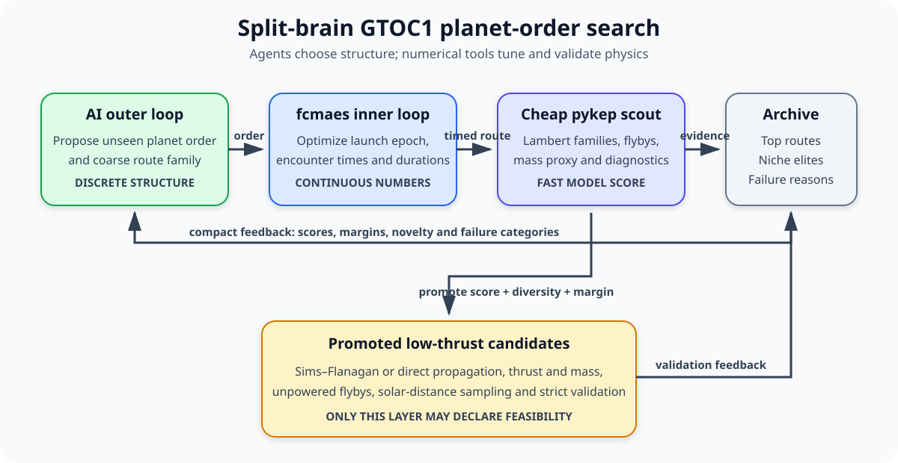

# GTOC1 “Save the Earth”: trajectory optimization with Rust

This tutorial combines [`pykep-core`](https://crates.io/crates/pykep-core)
and [`fcmaes-core`](https://crates.io/crates/fcmaes-core) to optimize the real
GTOC1 Earth-Venus-Earth-Earth-Earth-Jupiter-Saturn-Jupiter-asteroid trajectory
in native Rust. It first reproduces the continuous optimization and validation
of a known planet order, then shows how the same tools can support a broader
search for new orders.

The checked-in continuous-thrust solution scores **1,843,300.529365**, about
6,699.47 points below the rounded 1,850,000 winning score reported for JPL.
An earlier 24-impulse Sims–Flanagan approximation scored 1,850,730.667522, but
direct finite-thrust propagation exposed a canonical endpoint mismatch of
`3.23e-2`. That approximate score is retained as a useful warning, not claimed
as a valid trajectory. The stored vector uses the accelerated Taylor ZOH
system in `pykep-core` 0.1.4 and is independently repropagated with DOP853.
An experimental second transcription propagates finite thrust on all eight
legs with 5–8 segments **per leg**, so a global optimizer can change the
complete tour instead of refining only the propelled Earth–Venus leg.

> **Model score, not a new official competition result.** GTOC1 required
> DE405-equivalent planetary states. `pykep-core` 0.1.4 supplies VSOP2013 and
> represents Earth with the Earth-Moon barycentre. The score comparison is
> therefore useful for reproducing the Rust optimization workflow, but an
> official claim would require re-optimization and validation with the
> competition ephemeris.

## What is the GTOC?

The [Global Trajectory Optimisation Competition][gtoc-portal] is an
international challenge for aerospace engineers, mathematicians, and
optimization researchers. Each edition presents one deliberately difficult
interplanetary mission and normally gives teams about one month to find their
best trajectory. The winner keeps the trophy and traditionally defines and
organizes the next edition, earning the series its nickname: the “America's
Cup of rocket science.”

ESA's Advanced Concepts Team initiated GTOC in 2005. The competition provides
a shared problem, model, constraints, and scoring rule, so very different
global-search methods can be compared on the same task. GTOC1 deliberately
combined a 20-year launch window, optional gravity-assist sequences, many local
optima, and an unusual impact objective. Automated global search was meant to
matter more than experience with a previous mission.

## Why GTOC1 is called “Save the Earth”

GTOC1 is framed as a planetary-defence mission. A 1,500 kg nuclear-electric
spacecraft must reach asteroid 2001 TW229 and strike it so that the impact
changes the asteroid's semi-major axis as much as possible. The scenario is
hypothetical: the real asteroid supplies a target orbit for a realistic
deflection problem.

Reaching the asteroid is not sufficient. The score also depends on final
spacecraft mass, relative impact velocity, and impact direction. The winning
JPL solution used Saturn to reverse the spacecraft's orbital angular momentum
before a nearly head-on impact. That surprising route is a good example of why
GTOC is a global search competition rather than a conventional transfer-design
exercise.

## The mission

The [official GTOC1 problem
statement](https://sophia.estec.esa.int/gtoc_portal/wp-content/uploads/2012/11/ACT-MEM-MAD-GTOC1-The-Problem_V4.pdf)
defines a 1,500 kg nuclear-electric spacecraft with:

- 0.04 N maximum thrust and 2,500 s specific impulse;
- a launch between MJD2000 3653 and 10958 with 2.5 km/s Earth escape speed;
- at most 30 years before asteroid impact;
- unpowered gravity assists with body-specific minimum periapsis radii; and
- a minimum heliocentric distance of 0.2 AU.

The objective rewards impact energy in the asteroid's direction of motion:

```text
score = final_mass × dot(asteroid_velocity - spacecraft_velocity,
                         asteroid_velocity)
```

The [ESA result
table](https://www.esa.int/gsp/ACT/projects/gtoc_1/gtoc1results/) lists JPL's
winning score and EVEEEJSJA sequence. JPL's [workshop
presentation](https://www.esa.int/gsp/ACT/doc/MAD/ACT-PRE-MAD-GTOC1-JPL.pdf)
also publishes its encounter dates and states that only the initial
Earth-Venus phase was propelled. Those dates are enough to identify the
multi-revolution Lambert branches around the winning basin.

## Divide the search into three subtasks

Searching planet order, encounter dates, Lambert branches, and low-thrust
controls simultaneously produces an unnecessarily large mixed discrete and
continuous problem. A practical campaign is a multi-fidelity funnel:

1. **Determine good planet orders.** The outer search proposes sequences of
   gravity assists from Earth to 2001 TW229. Repeated inner-planet resonances,
   alternative outer-planet tails, and prograde-to-retrograde transitions make
   this a combinatorial problem.
2. **Evaluate orders with a cheap model.** For each fixed order, optimize
   launch and encounter times using planetary ephemerides, multi-revolution
   Lambert arcs, gravity-assist checks, and an approximate mass or flyby-repair
   cost. This stage ranks many orders quickly; it does not prove low-thrust
   feasibility.
3. **Compute valid low-thrust solutions.** Sims–Flanagan may initialize this
   stage, but it cannot finish it. Promote the strongest and most diverse
   candidates to bounded finite-thrust propagation, optimize controls and
   mass, enforce every unpowered flyby and the solar-distance limit, and
   validate the final trajectory with an independent integrator.

The executable in this tutorial implements the third task for JPL's known
`EVEEEJSJA` order. An unpublished companion implementation in the development
tree also uses fast Lambert scouts to investigate JPL and Deimos sequence
families. The following numbers come from that companion and cannot be
reproduced by this standalone tutorial. They are included because the
experiments exposed the important failure mode behind the funnel: an excellent
cheap score may disappear when thrust continuity and exact flyby feasibility
are enforced.

### What the alternate-sequence experiments taught us

The VSOP2013/`pykep-core` research model applied both layers to three other
route families:

| Route | Cheap-model lesson | Costly low-thrust result |
|---|---|---|
| Local “JPL2” `EVVEEEEJSJA` | promising impact geometry | feasible after timing refinement, score 1,838,440.445985 |
| Jena `EVVEVVEESJA` | some schedules had fixed-mass scores near 1.9 million | feasible, score 1,805,897.933756 |
| Deimos `EVVEEVVEVEJSJA` | regular-branch proxy estimated 1,887,942 | rejected: the propelled first leg could not close |

“JPL2” is a local label inherited from an earlier Java experiment; it is not
an official JPL name. The local JPL2 and Jena routes demonstrate that a cheap
model can find viable orders while still substantially overestimating their
final scores. The Deimos case shows a different hazard: its published
trajectory uses singular same-planet transfers that are not ordinary members
of the Lambert families available at those dates. Replacing them with nearby
regular branches changes the problem, and one attractive replacement
exhausted full thrust without closing its first leg.

These results are model-specific rather than official rerankings, but they
give the outer search exactly the feedback it needs: cheap rank, expensive
feasibility, failure category, and the size of the surrogate-to-validation
gap must all be retained.

## What the numerical tools must provide

### Optimization requirements

GTOC1 needs more than one successful local minimization:

- mixed discrete and continuous search for planet order, Lambert family,
  epochs, durations, mass, and thrust controls;
- multimodal global exploration across resonances and isolated Lambert basins;
- finite optimizer-facing handling of unavailable branches, propagation
  failures, illegal periapses, launch-energy excess, and equality-constraint
  mismatch, while retaining the failure category in experiment diagnostics;
- parallel independent retries with explicit evaluation, wall-time, seed, and
  stopping budgets;
- transfer of cheap-model incumbents into progressively more expensive models;
  and
- a reproducible archive containing the proposed order, optimized continuous
  vector, diagnostics, model version, budget, seed, and validation status.

Every candidate order must receive a comparable inner-optimization budget.
Otherwise the outer search measures luck or guessed dates rather than route
quality.

The fixed-sequence executable maps every `ModelError` to the same finite
`1e99` optimizer penalty. That is robust but deliberately uninformative in the
search landscape. A planet-order implementation must preserve the original
failure category in its archive before returning a flat penalty to the inner
optimizer.

### Trajectory-computation requirements

The astrodynamics layer needs:

- consistent planetary and asteroid ephemerides, epochs, frames, and units;
- Kepler propagation and robust zero- and multi-revolution Lambert solvers,
  including both left and right solution families;
- launch excess-velocity, gravity-assist turn-angle, and minimum-periapsis
  calculations with explicit singular-geometry handling;
- low-thrust propagation or transcription, thrust limits, specific impulse,
  spacecraft mass depletion, and leg-matching constraints;
- dense post-optimization sampling for the 0.2 AU solar-distance constraint;
  and
- scalar and batch interfaces suitable for native CPU parallelism.

The competition additionally requires DE405-equivalent planetary ephemerides.
A surrogate using another ephemeris can be valuable for discovery, but it must
not silently promote a model score into an official result.

## Why fcmaes-rust and pykep-rust are a strong fit

`fcmaes-core` supplies the derivative-free global optimization and retry
layer. BiteOpt tolerates irregular objectives and failure penalties;
Differential Evolution explores broadly; active CMA-ES repairs and refines
narrow continuous basins; and retry controllers distribute independent runs
across native worker threads with explicit budgets.

`pykep-core` supplies the trajectory kernels: ephemerides, Kepler propagation,
multi-revolution Lambert solutions, gravity-assist utilities, continuous ZOH
low-thrust legs, and independently selectable Taylor and DOP853 integrators.
Its Rust batch APIs can evaluate collections of propagations and Lambert
problems without Python-call overhead.

Together they keep the optimizer-to-physics hot path in compiled Rust. The
type system helps make vector dimensions and interfaces explicit, and native
threads are not restricted by Python's global interpreter lock. Just as
important, the cheap and expensive models can share the same tested
astrodynamics primitives, reducing accidental disagreement between search
stages.

## Split-brain search for planet orders

The proposed architecture follows
[`autoresearch-circuit`](https://github.com/dietmarwo/autoresearch-circuit).
That project separates discrete biochemical-circuit topology from continuous
kinetic parameters. Applied to GTOC1, an AI agent proposes *structure* and a
numerical optimizer tunes *numbers*:

| Responsibility | Circuit example | GTOC1 application |
|---|---|---|
| AI outer loop | regulatory topology | planet order and coarse route family |
| `fcmaes` inner loop | kinetic parameters | launch epoch, encounter times, and cheap-model variables |
| fast evaluator | short stochastic simulation | Lambert, flyby, and mass-surrogate model |
| expensive validator | long stress tests | low-thrust optimization and strict propagation |
| persistent memory | topology/niche archive | sequence archive with optimized timings and diagnostics |



This separation avoids a misleading conclusion. If an agent proposes a
promising order but guesses poor encounter dates, the order should not be
recorded as bad. The agent should not guess those dates at all:
`fcmaes-core` optimizes them under a fixed budget, and the resulting optimized
score becomes the feedback for the structural decision.

### Candidate contract

The agent emits only a compact, machine-checkable route:

```json
{
  "bodies": [
    "Earth",
    "Venus",
    "Venus",
    "Earth",
    "Jupiter",
    "Saturn",
    "Jupiter",
    "TW229"
  ],
  "direction_hints": [
    "prograde",
    "prograde",
    "prograde",
    "prograde",
    "prograde",
    "retrograde",
    "retrograde"
  ],
  "rationale": "Use inner-planet resonances before a Saturn reversal."
}
```

A grammar validates Earth as the start, 2001 TW229 as the destination,
supported flyby bodies, maximum sequence length, repetitions, and optional
direction hints. It canonicalizes and deduplicates candidates before spending
optimizer time. Exact Lambert branch selection normally stays inside the cheap
evaluator, where all allowed families can be compared consistently.

### Evaluation and feedback loop

One split-brain iteration is:

1. Give the agent a compact summary of best overall sequences, best
   representatives of different route niches, recent evaluations, and failure
   diagnostics.
2. Ask it for a small batch of unseen grammar-valid orders. Store its rationale
   for analysis, but never treat the rationale as physical evidence.
3. Run the cheap Rust model for every order with the same DE–CMA-ES or BiteOpt
   retry budget. Optimize dates and durations and enumerate the permitted
   Lambert families.
4. Archive the best continuous vector and diagnostics: proxy impact score,
   estimated final mass, launch excess velocity, flyby repair cost, minimum
   periapsis margin, total flight time, selected branches, evaluations, wall
   time, and failure reason.
5. Return a compressed archive summary to the agent so its next structural
   proposals can use measured evidence from earlier orders.
6. Promote a mixture of high-scoring and structurally diverse candidates to
   medium- and high-resolution low-thrust optimization. Record cheap score and
   expensive feasibility separately.
7. Feed low-thrust failures back into later proposals and use them to calibrate
   the cheap model. Only the strict numerical validator may mark a trajectory
   feasible.

Begin with a blind bootstrap of random or grammar-generated orders before
showing scores to the agent. Later iterations can alternate exploration with
exploitation. Preserve niche elites by sequence length, inner-planet encounter
counts, outer-planet tail, direction-change pattern, and flight-time band so
the archive does not collapse onto variants of the first strong family.

Promotion should combine proxy score, feasibility margin, novelty, and
uncertainty rather than selecting only the apparent leader. Occasional
lower-ranked control promotions reveal systematic surrogate errors. Random
order search and a simple evolutionary route mutation should receive the same
inner budget and serve as baselines for measuring whether the AI outer loop
actually helps.

This split-brain loop is a proposed extension; the checked-in tutorial
executable still uses the fixed `EVEEEJSJA` sequence, although its whole-tour
mode globally optimizes continuous controls and flyby geometry for that
sequence. A production implementation should also key its cache by route
encoding, ephemeris and fidelity settings, crate versions, optimizer budget,
and seeds.

## Native evaluation pipeline

One objective evaluation is entirely Rust:

```text
87 bounded variables
    │
    ├── launch + eight leg durations
    ├── launch excess magnitude and direction + Venus endpoint direction (5)
    ├── final spacecraft mass
    └── 24 × (throttle magnitude, polar angle, azimuth)
    ↓
VSOP2013 planet states + Keplerian asteroid rotated into the planet frame
    ↓
24-segment finite-thrust ZOH Earth→Venus leg, propagated with Taylor
    ↓
seven selected Lambert arcs, two of them multi-revolution
    ↓
unpowered-flyby constraints + impact score
    ↓
penalized scalar objective for fcmaes
    ↓
independent DOP853 propagation + daily path sampling for the finalist
```

There is no Python callback or foreign-function transition in the hot path.
Parallel retry owns the worker pool and distributes independent optimizer
runs; each trajectory evaluation is serial.

The implementation is split into:

- [`src/model.rs`](src/model.rs): canonical scaling, Taylor ZOH leg, DOP853
  validation, Lambert arcs, gravity assists, score, bounds, and stored result;
- [`src/model/tour.rs`](src/model/tour.rs): coarse finite-thrust propagation on
  every leg, exact unpowered-flyby maps, mesh resampling, and backend
  cross-validation;
- [`src/main.rs`](src/main.rs): coordinated DE–CMA-ES, regular parallel
  CMA-ES/BiteOpt retry, 5→8 mesh continuation, strict incumbent retention,
  CLI, and reporting.

The selected ballistic chain is `1L, 1R, 0, 0, 0, 0, 0`. Its flyby geometry
is:

| Encounter | Body | Excess speed | Turn | Periapsis | Margin |
|---:|---|---:|---:|---:|---:|
| 1 | Venus | 7.0486 km/s | 60.97° | 6,351.0 km | +0.000225 km |
| 2 | Earth | 11.8623 km/s | 25.24° | 10,132.2 km | +3,454.19 km |
| 3 | Earth | 11.8242 km/s | 10.89° | 27,207.0 km | +20,528.99 km |
| 4 | Earth | 11.8705 km/s | 33.82° | 6,895.4 km | +217.41 km |
| 5 | Jupiter | 14.4114 km/s | 39.02° | 1,216,409 km | +616,409 km |
| 6 | Saturn | 15.2983 km/s | 79.66° | 90,903.0 km | +20,903 km |
| 7 | Jupiter | 25.1089 km/s | 2.02° | 11,225,482 km | +10,625,483 km |

Saturn provides the real angular-momentum reversal. The second Jupiter
encounter turns only about 2 degrees at 157 Jupiter radii, so it behaves more
like a waypoint than a working gravity assist. The Jupiter-to-Saturn
heliocentric arc is hyperbolic, and the final impact occurs close to the
asteroid's perihelion, where its speed and the impact objective are large.

## Step 1: transcribe feasibility before optimizing score

The first nine values are launch epoch followed by eight positive durations.
Their cumulative sum gives the encounter epochs. The optimization box is
already narrower than the competition limits: launch is confined to
MJD2000 `[8800, 9200]`, and the duration upper bounds total less than 30
years. The evaluator nevertheless retains explicit launch-window and
30-year checks as defence in depth.

The asteroid elements are published in the heliocentric ecliptic J2000 frame,
whereas the VSOP2013 states returned here use the planetary frame.
`rotate_ecliptic_to_icrf` rotates only the asteroid position and velocity
before any Lambert solve. Rotating both sides, or neither side, silently
changes the transfers.

The Earth-Venus leg uses `ZohKeplerLeg`, whose normalized Cartesian equations
are

```text
r' = v
v' = -r / |r|³ + thrust × direction / mass
m' = -c × thrust
```

Position is scaled by one AU, time by `sqrt(AU³ / μ_sun)`, velocity by
`AU / time_scale`, and mass by 1,500 kg. Physical thrust and exhaust velocity
become:

```rust
let maximum_thrust =
    MAX_THRUST_NEWTONS * time_scale * time_scale
    / INITIAL_MASS_KG / AU_METRES;
let mass_flow = AU_METRES / time_scale / EXHAUST_VELOCITY_M_S;
```

Each decision row supplies a throttle in `[0,1]` and a unit direction, so
thrust remains bounded by 0.04 N throughout the segment. Position, velocity,
and mass are continuous at switches; only acceleration may jump. The seven
cut mismatches are already dimensionless in this canonical system.

The following seven legs use fixed Lambert branch identities, but their dates
remain optimization variables. Every intermediate encounter must conserve
planet-relative speed and provide enough natural turning angle above the
minimum periapsis. Equivalent powered flyby delta-v and normalized periapsis
shortfall are squared constraints.

The minimized scalar is:

```text
low_thrust_constraint = Σ normalized_mismatch_component²
gravity_constraint = Σ (powered_delta_v² + normalized_periapsis_shortfall²)
objective = 1e15 × (low_thrust_constraint + gravity_constraint) - impact_score
```

The large multiplier strongly favours a low-thrust match and unpowered
flybys, but this remains a quadratic soft penalty rather than a feasibility
barrier. Near an active periapsis limit, the optimizer can trade a very small
shortfall against impact score. The threshold-sensitivity results below show
why a sub-metre positive margin must not be treated as robust physical
clearance.

## Campaign record: from an approximation to a propagated trajectory

The stored result came from a deliberate fidelity transition:

1. Start from JPL's encounter dates and enumerate Lambert families. The
   connected low-constraint path identifies the required left/right and
   multi-revolution branches.
2. Use the historical 12- and 24-impulse Sims–Flanagan transcription to locate
   a promising control basin. Its best model score was 1,850,730.667522.
3. Interpret those controls as bounded, piecewise-constant thrust and propagate
   the seven physical states with the Taylor ZOH system. The unchanged impulse
   incumbent misses the Venus endpoint by `3.2343e-2` in canonical norm, so its
   score is not a continuous-thrust result.
4. Run incumbent-seeded CMA-ES on the continuous transcription. Closing the
   physical leg required reducing final mass from 1,442.454 kg to
   1,436.663 kg; the corresponding score is 1,843,300.529365.
5. Apply a damped minimum-norm correction derived from the ZOH mismatch
   Jacobian. This reduces the Taylor cut mismatch to `1.58e-11` without
   changing mass or encounter geometry.
6. Repropagate with DOP853, sample the complete trajectory at no more than
   one-day intervals, and accept the vector only if the independent mismatch,
   flyby, flight-time, and solar-distance checks pass.

This history is the central lesson of the tutorial: mesh refinement inside an
impulsive model cannot replace propagation of the physical finite-thrust
equations. The stored known-route model fixes the Earth–Venus leg at 24 ZOH
segments and `VSOP_THRESHOLD` at `1e-9`; it has no `--segments` or
`--vsop-threshold` option. The separate whole-tour mode accepts
`--segments-per-leg 5..=8`.

The stage loop never replaces the incumbent with a weaker run:

```rust
if result.y < best.y {
    incumbent.clone_from(&result.x);
    best = result;
}
```

That detail matters for expensive retries: a stochastic stage which happens
to underperform cannot erase hours of previous work. The CLI also reports
each optimizer return as `STAGE_RESULT`. If no stage improves the stored
vector, the final block is labelled `INCUMBENT_RESULT`, not
`OPTIMIZED_RESULT`, so a failed search cannot look like a newly computed
success.

## Coarse whole-tour global search

The stored result assumes that only Earth–Venus is propelled and follows
selected Lambert arcs afterward. The experimental whole-tour transcription
removes that assumption: each of the eight legs has its own bounded
piecewise-constant thrust schedule. The requested mesh size is the number of
segments on **each leg**, not the total number of thrust intervals.

The decision vector contains:

- launch epoch and eight leg durations;
- launch excess magnitude and direction;
- periapsis fraction and flyby-plane angle for each of seven unpowered
  flybys; and
- throttle, polar angle, and azimuth for every finite-thrust segment on every
  leg.

For `S` segments per leg the dimension is `26 + 8 × 3 × S`:

| Segments per leg | Total thrust segments | Decision variables |
|---:|---:|---:|
| 5 | 40 | 146 |
| 6 | 48 | 170 |
| 7 | 56 | 194 |
| 8 | 64 | 218 |

Mass, position, and velocity are propagated continuously within each leg.
At an encounter, three position residuals enforce arrival at the planet. The
incoming velocity is passed through `flyby_outgoing_velocity`, which preserves
planet-relative speed and applies the selected periapsis and flyby-plane
angle; that outgoing velocity initializes the next leg. Position is reset to
the planet only at this multiple-shooting node. Thus the 24 position residuals,
rather than a hidden Lambert reset, determine whole-tour feasibility.

The objective is:

```text
objective = 1e15 × Σ(24 canonical position residuals²) - impact_score
```

Taylor propagation is used in the optimizer. Every reported tour is
repropagated with DOP853 and prints both residual norms and their maximum
component difference. A converged candidate would still need a finer
transcription and daily DOP853 path sampling before it could replace the
stored validated result.

The Lambert-based stored route supplies only an initial guess: its first-leg
controls are conservatively averaged onto the coarse mesh, the other legs
start at zero thrust, and its incoming/outgoing asymptotes initialize the
flyby parameters. Three search modes are available:

```bash
# Evaluate the unoptimized five-segment-per-leg seed.
cargo run --release -- \
  --algorithm tour-inspect --segments-per-leg 5

# Optimize one selected mesh with coordinated DE–CMA-ES or BiteOpt retry.
cargo run --release -- \
  --algorithm tour-de-cma --segments-per-leg 5 \
  --workers 0 --retries 128 --evaluations 500000 --max-eval-fac 20

cargo run --release -- \
  --algorithm tour-bite --segments-per-leg 5 \
  --workers 0 --retries 128 --evaluations 500000

# Optimize at 5, then transfer through 6 and 7 to 8 segments per leg.
cargo run --release -- \
  --algorithm tour-mesh --segments-per-leg 8 \
  --workers 0 --retries 128 --evaluations 500000 --max-eval-fac 20
```

`tour-mesh` always begins at five segments per leg and stops at the requested
mesh. Each level receives the specified retry/evaluation budget. An
underperforming stochastic run cannot replace its incumbent on the same mesh.
At the next mesh, the driver compares the overlap-averaged incumbent with a
fresh seed and selects the better starting objective.

More continuous-thrust segments are **not automatically better for global
search**. They add real switching controls and raise the dimension from 146
to as much as 218. Moreover, the uniform 5-, 6-, 7-, and 8-segment grids are
not nested, so transferring a control profile can worsen the residual before
reoptimization. This differs from an impulsive Sims–Flanagan approximation:
there, adding impulses is primarily a way to mimic continuous thrust more
closely. Here every interval is already propagated with the finite-thrust
equations, and a smaller control space may be much easier for the global
optimizer. Independent `tour-de-cma` campaigns at each resolution are
therefore at least as important as sequential `tour-mesh` refinement.

A deliberately tiny deterministic smoke run used one worker, one retry, and
5,000 evaluations at five segments per leg:

```bash
cargo run --release -- \
  --algorithm tour-de-cma --segments-per-leg 5 \
  --workers 1 --retries 1 --evaluations 5000 \
  --max-eval-fac 1 --seed 43 --stop -1e30
```

On the development host it took 10.58 seconds and reduced the canonical
position-residual norm from `19.0221` to `5.0321`; DOP853 reproduced the latter
as `5.032105`. This proves that the global objective, optimizer, and
independent backend are connected. It is emphatically **not feasible**, and
its displayed score is not meaningful. A scientific campaign needs orders of
magnitude more evaluations, several retries, resolution comparisons, and a
final constraint-repair stage.

## Step 3: choose the refinement algorithm

The following modes refine the stored 24-segment Earth–Venus model. The
whole-tour modes are described separately above.

### ZOH feasibility repair

`zoh-repair` uses the DOP853 ZOH mismatch Jacobian, applies the chain rule for
the spherical control parameters, solves a damped seven-by-seven
minimum-norm system, and accepts only corrections that reduce the
Taylor-propagated mismatch:

```bash
cargo run --release -- --algorithm zoh-repair --stages 20
```

This is a fast local equality-constraint repair, not a global optimizer. The
stored vector already satisfies its stopping tolerance, so the command mainly
demonstrates the final campaign stage.

### Coordinated DE–CMA-ES

`de-cma` spends 40% of a broad-run budget on Differential Evolution and 60%
on active CMA-ES. During local refinement, only 10% goes to DE and 90% to
CMA-ES. `advanced_retry` increases later budgets when coordination shows that
longer local runs are productive.

```bash
cargo run --release -- \
  --algorithm de-cma --broad \
  --workers 0 --retries 300 \
  --evaluations 10000 --max-eval-fac 100 --seed 43
```

This is the expensive whole-refinement-box mode. “Broad” is relative: the
fixed Lambert branches search only the disclosed EVEEEJSJA basin, and the
launch epoch remains in `[8800, 9200]` rather than the competition's full
20-year window.

### Parallel regular CMA-ES retry

Once a feasible incumbent exists, independent CMA-ES runs from the incumbent
are more effective:

```bash
cargo run --release -- \
  --algorithm cma \
  --fraction 0.01 --stages 3 \
  --workers 0 --retries 128 \
  --evaluations 500000 --seed 900 \
  --stop -1843301
```

In local mode, encounter dates and final mass stay fixed while
`--fraction` controls the neighborhood for launch/Venus asymptote geometry
and the 24 thrust controls. `--broad` restores the complete decision box for
coordinated DE–CMA-ES. The default stop is `-1843301`; the CLI rejects any
stop target that the stored incumbent already satisfies.

### Parallel BiteOpt retry

The same incumbent and box can be tested with BiteOpt:

```bash
cargo run --release -- \
  --algorithm bite \
  --fraction 0.05 --stages 3 \
  --workers 0 --retries 128 \
  --evaluations 500000 --seed 600 \
  --stop -1843301
```

In the historical impulsive-model comparison, CMA-ES made materially larger
improvements in this smooth, tightly constrained local basin. That timing and
score cannot be transferred to the continuous ZOH objective. BiteOpt remains
useful as an independent check that the result is not specific to one local
method.

BiteOpt, CMA-ES, and DE–CMA-ES now all run their inner optimizer with no
private early-stop threshold; the retry controller alone owns campaign
stopping. This prevents BiteOpt from evaluating only its supplied guess and
returning immediately.

## Reproduce the stored result

Build and inspect without running an optimizer:

```bash
cd tutorials/gtoc1
cargo run --release -- --algorithm inspect
```

Expected key output:

```text
STORED_RESULT objective=-1843300.523990307702 score=1843300.529365212889 beats_jpl=false final_mass_kg=1436.663259037
STORED_FEASIBILITY mismatch_norm=1.582252379074e-11 powered_delta_v_km_s=4.586956592334e-9 minimum_periapsis_margin_km=0.000225
STORED_VALIDATION taylor_mismatch_norm=1.582252379074e-11 dop853_mismatch_norm=1.502872426886e-10 maximum_backend_difference=8.835557285813e-11
STORED_SOLAR minimum_distance_au=0.671522427923
```

The final Jacobian repair takes about 0.01 seconds on the development host once
CMA-ES has supplied its near-feasible continuous candidate. The earlier global
and local optimization stages were exploratory and did not emit a schema-v1
`run.json`, so this tutorial does not present an unverifiable aggregate wall
time as a reproducible benchmark. A fresh end-to-end campaign should emit the
command, seed, budgets, actual evaluations, wall time, and resulting decision
under the repository's result schema.

| Quantity | Stored result |
|---|---:|
| Continuous-model impact score | 1,843,300.529365 |
| Difference from reported JPL score | −6,699.470635 |
| Final mass | 1,436.663259037 kg |
| Launch hyperbolic excess | 2.499999991 km/s |
| Taylor ZOH mismatch | 1.58225e-11 |
| DOP853 ZOH mismatch | 1.50287e-10 |
| Maximum backend difference | 8.83556e-11 |
| Equivalent powered flyby delta-v | 4.58696e-9 km/s |
| Minimum flyby periapsis margin | +0.000225 km |
| Daily-sampled minimum solar distance | 0.671522428 AU |

## VSOP2013 threshold sensitivity

The active Venus periapsis margin is only 0.225 m at the selected `1e-9`
threshold. It must therefore be treated as numerically fragile even though
Taylor and DOP853 agree on the propagated spacecraft state. Changing the
ephemeris changes the encounter states and defines a different optimization
problem; a meaningful threshold or DE405 comparison must reoptimize or repair
the controls rather than merely rescore the fixed vector. `pykep-core` rejects
VSOP2013 thresholds below `1e-9`, so this model cannot establish robustness of
that sub-metre margin.

## Validate before trusting the score

The optimizer propagates all 24 finite-thrust segments with accelerated
Taylor integration but does not perform dense path sampling. The validator
then repeats the complete low-thrust leg with DOP853, reports both endpoint
mismatches and their maximum component difference, and samples the propelled
and ballistic trajectory at intervals no longer than one day. This keeps
thousands of validation samples out of each optimizer evaluation while
checking the 0.2 AU exclusion afterward.

Run the complete local checks:

```bash
cargo fmt --all -- --check
cargo clippy --all-targets -- -D warnings
cargo test
```

The nine tests reproduce the stored score; assert its launch-window and
flight-time limits, Taylor/DOP853 mismatch agreement, flyby feasibility, and
solar distance; reject an unsupported asteroid flyby without an index panic;
check algorithm names and stop-target validation; confirm the finite optimizer
penalty for invalid vectors; and exercise every 5–8-segment whole-tour
dimension, seed, evaluation, and mesh-resampling path. The `gtoc1` workspace
is also part of the `simulator-tutorials` CI matrix. One whole-tour test
explicitly cross-checks the five-segment seed with Taylor and DOP853.

## What the result means

The tutorial demonstrates that native Rust can model, optimize, and
cross-validate a realistic high-dimensional interplanetary trajectory. It
also corrects its earlier conclusion: the 1,850,730 Sims–Flanagan score was an
impulsive approximation, and the currently validated 24-segment
continuous-thrust result scores 1,843,300. It therefore does **not** beat JPL.
That negative result is scientifically more useful than preserving a claim
which disappears under the physical propagation model.

It also does **not** erase the ephemeris qualification:

- the competition requested DE405-equivalent states;
- VSOP2013 is an analytical planetary theory;
- `earth_moon` is a barycentric state, not the Earth's centre; and
- the active Venus periapsis margin is only +0.225 m at `1e-9`.

A next production step is therefore an ephemeris-provider abstraction backed
by DE440/DE405-compatible kernels, followed by a higher-resolution
continuous-thrust transcription and constraint repair in that model. The
optimization architecture remains the same.

[gtoc-portal]: https://sophia.estec.esa.int/gtoc_portal/
