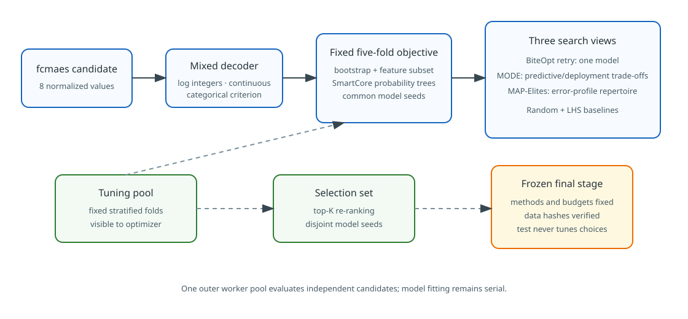
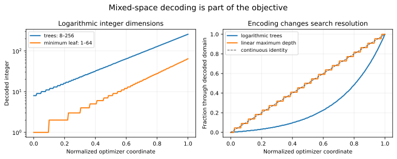
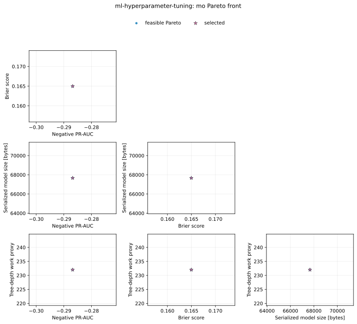
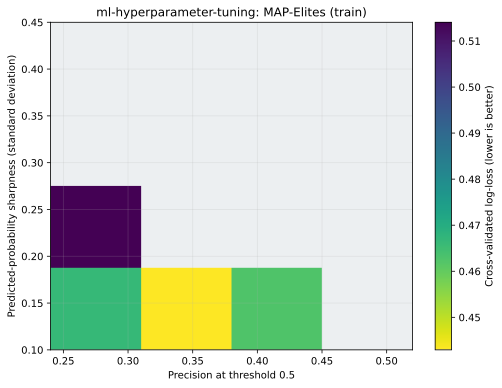
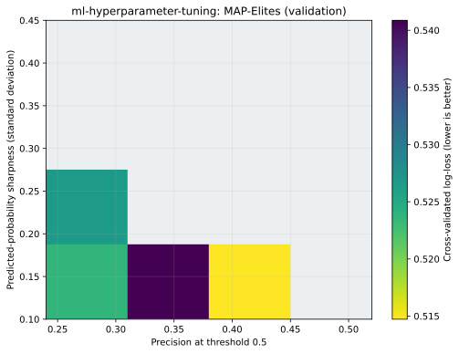
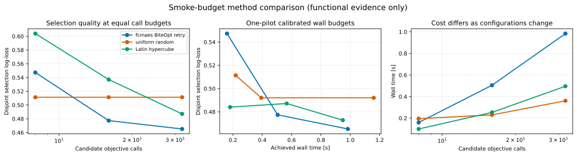
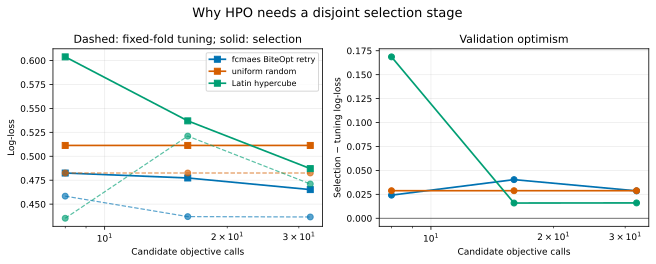
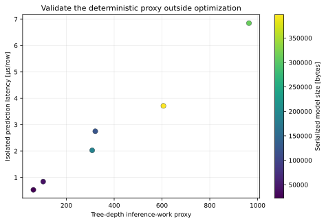
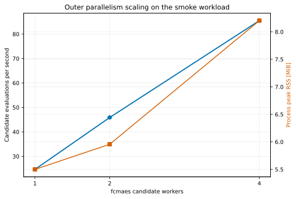

# ML hyperparameter optimization: search less naively

This tutorial places model training directly inside an `fcmaes-rust`
objective. It is about optimizer behavior and validation discipline, not about
claiming that one tree model is best for real tabular datasets.

The example combines:

- a deterministic nonlinear and imbalanced binary-classification generator;
- a pure-Rust bagged random-subspace probability forest built from
  [SmartCore](https://smartcorelib.org/) decision trees;
- BiteOpt parallel retry for one selected configuration;
- constrained MODE for predictive/deployment trade-offs;
- a MAP-Elites pilot for behaviorally different error profiles;
- uniform-random and Latin-hypercube baselines;
- fixed-fold tuning, disjoint shortlist selection, and a separately invoked
  final-test stage; and
- isolated latency and outer-parallelism benchmarks.

The tutorial is a standalone Cargo workspace. It is not a member of the root
workspace and does not affect the published `fcmaes-core` dependency graph.



## Why gradient-free optimization?

The eight decisions mix logarithmic integers, ordinary integers, continuous
fractions, and an unordered categorical:

| Hyperparameter | Type | Domain |
|---|---|---:|
| trees | log integer | 8–256 |
| maximum depth | integer | 2–24 |
| minimum leaf samples | log integer | 1–64 |
| minimum split samples | log integer | 2–64 |
| bootstrap row fraction | continuous | 0.4–1.0 |
| per-tree feature fraction | continuous | 0.25–1.0 |
| positive-class sampling weight | log continuous | 0.5–4.0 |
| split criterion | categorical | Gini / entropy |

Rounding and categorical mapping make the objective discontinuous. Bootstrap
sampling adds controlled training stochasticity, recall and structural limits
create constraints, and validation-protocol overfitting becomes visible as the
search budget grows. None of those properties is friendly to finite-difference
gradients.

The decoder works on `[0, 1]^8`. Categorical endpoints are handled explicitly:

```text
index = min(floor(u * category_count), category_count - 1)
```

The operating threshold is intentionally not a scalar or MODE decision.
Thresholds cannot affect log-loss, PR-AUC, ROC-AUC, Brier score, or
calibration. Adding one would give the optimizer a neutral dimension.



## Probability-forest adapter

SmartCore 0.5.3's `RandomForestClassifier` offers hard-label prediction but no
`predict_proba`. Its `DecisionTreeClassifier` does expose probabilities.
`ProbabilityForest` therefore builds an application-level ensemble:

1. choose bootstrap rows with the configured positive-class weight;
2. choose a feature subset for each tree;
3. fit a seeded SmartCore classification tree;
4. average the positive-class votes; and
5. clip probabilities only at the fixed numerical epsilon used by log-loss.

Feature selection is per tree, not per split, so this is described accurately
as a **bagged random-subspace probability forest**, rather than as a
reimplementation of SmartCore's stock random forest.

Each tree sample contains both classes. Invalid data, backend failures,
non-finite predictions, and pre-fit structural-limit breaches are typed
failures. The in-process implementation does not pretend that it can safely
interrupt an arbitrary fit or recover from allocator OOM.

Model fitting is serial. SmartCore 0.5.3 has no Rayon dependency; fcmaes owns
candidate-level parallelism.

## Controlled dataset and Bayes reference

The generator creates 24 features:

- eight informative variables with nonlinear interactions and a threshold;
- twelve independent noise variables; and
- four noisy near-duplicates.

The label is sampled from the known conditional probability
`eta(x) = sigmoid(score(x))`. The recorded smoke data have 16.67% positives in
the tuning pool. A separately seeded Monte Carlo sample estimates:

| Reference | Smoke estimate | Standard error |
|---|---:|---:|
| Bayes classification error | 0.160983 | 0.001306 |
| Bayes log-loss | 0.379178 | 0.001940 |

These are Monte Carlo reference floors, not closed-form exact values.

The presets use:

| Partition | Smoke rows | Publication rows | Purpose |
|---|---:|---:|---|
| tuning pool | 240 | 6,000 | fixed five-fold objective |
| selection set | 120 | 4,000 | top-K re-ranking |
| final test set | 400 | 20,000 | frozen final stage |
| Bayes reference | 10,000 | 1,000,000 | generator reference only |

Named PCG streams generate every partition, fold assignment, optimizer stream,
and model seed. A specified FNV-1a byte encoding makes partition hashes stable
across Rust toolchain versions. Manifests record those hashes so finalization
refuses a mismatched plan.

## Validation protocol

One candidate objective call fits five forests, one per fixed stratified fold.
Every candidate sees the same folds and model seeds—common random numbers make
rank comparisons less noisy.

After optimization:

1. feasible candidates are canonicalized and deduplicated;
2. the best `K` fixed-fold candidates form a shortlist;
3. every shortlisted configuration is refitted on the full tuning pool with
   disjoint model seeds;
4. those models are evaluated on the selection set; and
5. the lowest selection log-loss wins, with structural work as tie-breaker.

The final test set is not part of this loop. `--mode all` writes an unfrozen
`study-plan.json`. Review all methods, budgets, constraints, and selected
configurations first. Only then set `"frozen": true` and invoke
`--mode finalize`. Finalization validates data hashes and the content hash of
every selected source `run.json` before reading the test partition.

This is a protocol boundary, not a security claim: a Rust ownership type cannot
prevent a developer from changing code or regenerating data. Reproducibility
comes from the separate command, frozen manifest, hashes, recorded seeds, and
reviewable artifacts.

## Optimization formulations

### Scalar BiteOpt retry

The scalar objective is fixed-fold log-loss. Feasible candidates must satisfy:

```text
minority recall at threshold 0.5 >= configured minimum
estimated structural cost <= configured limit
all probabilities and metrics finite
```

Feasible fitness is log-loss. Infeasible candidates receive a finite value
above the known clipped-log-loss ceiling plus normalized violation. NaN and
infinity are never returned to BiteOpt.

`--evaluations-per-retry` is deliberately distinct from total evaluations.
The manifest records both it and the retry count.

### Constrained MODE

MODE minimizes:

1. negative PR-AUC;
2. Brier score;
3. serialized model bytes; and
4. a deterministic tree-depth inference-work proxy.

PR-AUC is used because the generated data are imbalanced. ROC-AUC and
expected calibration error remain diagnostics. Recall and structural cost are
explicit constraints.

Latency is not timed inside the objective. Parallel candidates would compete
for cores, cache, and turbo budget, turning system noise into an optimization
target. `--mode benchmark` fits models first and times prediction with one
candidate at a time.



### MAP-Elites pilot

MODE remains present regardless of the QD result. MAP-Elites uses:

- predicted-positive rate at threshold 0.5; and
- `log10((false positives + 1) / (false negatives + 1))`

as behavior descriptors. Within a niche, lower fixed-fold log-loss is better.
The publication archive is accepted only if:

- coverage is at least 40%;
- at least 50 distinct canonical configurations occupy its 400 cells; and
- at least 50% of occupied cells retain their niche on selection data.

The 32-evaluation smoke run occupies 3 of 16 cells. It is explicitly labeled
“smoke-only”; publication acceptance criteria are not applied.





## Run it

From this directory:

```bash
cargo run --release -- --preset smoke --mode all --workers 4 --seed 42
```

The recorded functional run used:

```bash
cargo run --release -- \
  --preset smoke --mode all --workers 4 --seed 42 \
  --output results/quick

cargo run --release -- \
  --preset smoke --mode budget-sweep --workers 4 --seed 42 \
  --output results/quick/budget-sweep

cargo run --release -- \
  --preset smoke --mode benchmark --workers 4 \
  --benchmark-candidates 6 --prediction-repetitions 10 --seed 42 \
  --output results/quick/benchmark
```

After reviewing the generated study plan and setting `frozen` to `true`:

```bash
cargo run --release -- \
  --preset smoke --mode finalize --workers 4 --seed 42 \
  --final-plan results/quick/study-plan.json \
  --output results/quick/final
```

A publication campaign starts with:

```bash
cargo run --release -- \
  --preset publication --mode scalar --workers 24 --seed 42 \
  --retries 24 --evaluations-per-retry 512 \
  --output results/publication/scalar-seed-42

cargo run --release -- \
  --preset publication --mode mo --workers 24 --seed 42 \
  --mo-evaluations 16384 --popsize 256 \
  --output results/publication/mo-seed-42

cargo run --release -- \
  --preset publication --mode qd --workers 24 --seed 42 \
  --qd-evaluations 16384 --qd-capacity 400 --qd-chunk-size 256 \
  --output results/publication/qd-seed-42
```

Run publication experiments for seeds 42, 43, and 44. Do not describe the
checked-in smoke artifacts as publication evidence.

Use `--help` for every option.

## Recorded smoke results

These tiny budgets test the complete pipeline; they are not method-ranking
claims.

| Method/formulation | Candidate calls | Tuning fits | Tuning trees | Selection log-loss |
|---|---:|---:|---:|---:|
| BiteOpt parallel retry | 32 | 160 | 18,505 | 0.465215 |
| constrained MODE representative | 32 | 160 | 12,215 | 0.496181 |
| random search | 32 | 160 | 9,205 | 0.511326 |
| Latin hypercube | 32 | 160 | 11,620 | 0.487126 |
| default configuration | 1 | 5 | 320 | 0.479860 |

Candidate cost varies substantially because the optimizer controls the number
and depth of trees. Therefore result tables record candidate calls, fitted
models, trees, wall time, and workers. The budget sweep reports two views:

1. equal candidate calls for the conventional HPO-budget comparison; and
2. a one-pilot calibrated-wall comparison. The equal-call baseline run
   estimates how many random/LHS calls fit into the observed BiteOpt time, then
   each baseline is rerun at that integer call budget.

The second view records both target and achieved time. It is a transparent
calibration, not a claim that noisy wall clocks can be made identical. A
publication run should report the calibration miss and repeat the complete
study across outer seeds.

The compact table above reports objective-stage fits (`5 × candidate calls`).
Machine-readable manifests additionally separate the fits and trees consumed
by shortlist/Pareto/archive selection and report their total.



The fixed-fold winner can look better than it does on disjoint data. That gap,
not a claim that one method wins at 32 calls, is the important result:



The frozen smoke final-test results are in
[`final_metrics.csv`](results/quick/final/final_metrics.csv). They were
generated only after [`study-plan.json`](results/quick/study-plan.json) was
reviewed and frozen.

## Performance measurements

The isolated smoke benchmark fits six configurations, warms prediction, and
times ten repeated prediction batches. On this run:

- Pearson correlation between structural work and latency was 0.990;
- correlation between serialized size and latency was 0.781; and
- candidate throughput increased from 24.6 evaluations/s at one worker to
  85.5 evaluations/s at four workers.

The sample is intentionally small. A publication report should repeat the
benchmark with 24 configurations, 100 prediction repetitions, CPU-affinity
policy documented where available, and several independent measurements.





The dataset is shared read-only through `Arc`; workers do not own complete
copies. `parallel_batch` preserves candidate order. Parallel retry uses
independent worker RNG streams, but scheduling can change which worker claims a
retry, so a complete retry run is not promised to be byte-identical. Report
several optimizer seeds rather than treating one run as exact.

## Artifacts and figures

Every optimizer run follows [`../RESULT_SCHEMA.md`](../RESULT_SCHEMA.md):

- `run.json` records commands, software versions, budgets, seeds, data hashes,
  constraints, tuning/selection fitted-model and tree counts, and artifacts;
- `candidates.csv` records decoded configurations and fixed-fold metrics;
- `pareto.csv` contains feasible MODE points;
- `qd_archive.csv` contains tuning and selection behavior;
- `convergence.csv` uses objective evaluations as its common axis; and
- `selected.json` records the tuning and selection evidence for one chosen
  configuration.

Regenerate all checked tutorial figures from `tutorials/python`:

```bash
.venv/bin/python render_all.py --write
.venv/bin/python render_all.py --check
.venv/bin/python check_docs.py
```

`plot_results.py` creates the HPO-specific budget, validation, latency, and
parallel-scaling figures. The common renderer creates Pareto, QD, and
convergence figures from schema-v1 manifests.

## Tests

```bash
cargo fmt --all -- --check
cargo test
cargo clippy --all-targets -- -D warnings
```

Tests cover:

- generator repeatability, partition hashes, prevalence, and Bayes references;
- stratified folds and independent streams;
- decoder endpoints, rounding, logarithmic monotonicity, and categoricals;
- deterministic bootstrap/feature selection and probability bounds;
- log-loss, Brier, PR-AUC, ROC-AUC, ECE, recall, and confusion counts;
- finite constraint handling and structural-cost rejection;
- shortlist selection and LHS strata;
- MAP-Elites niche indexing;
- frozen-plan and data-hash finalization guards;
- source-manifest tamper detection;
- ordered parallel evaluation; and
- schema-v1 artifact generation.

## Limitations

- This is a controlled synthetic classification task, not a real-data model
  benchmark or AutoML framework.
- SmartCore tree probabilities are class votes at leaves; the ensemble average
  is useful but is not a dedicated probability-calibration model.
- Per-tree feature selection differs from conventional per-split random-forest
  feature selection.
- The smoke results have one selection/final model seed and deliberately tiny
  budgets. Publication runs use five model seeds and three outer optimizer
  seeds.
- Equal candidate calls are not equal compute. The calibrated-wall view uses a
  measured pilot and can miss its target; both achieved time and call count
  remain part of every comparison.
- A hard in-process timeout and recoverable OOM handling would require
  process-isolated fitting.
- Burn MLP and egobox comparison backends are deferred extensions. No
  low-budget Bayesian-optimization claim is made without running that
  comparison.
