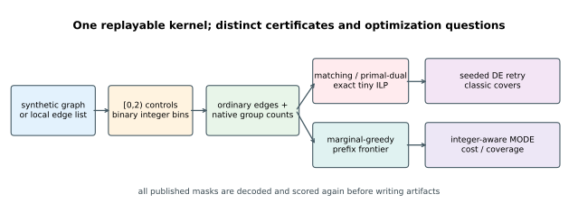
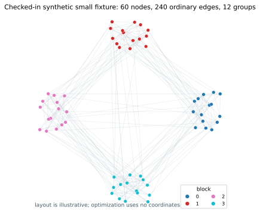
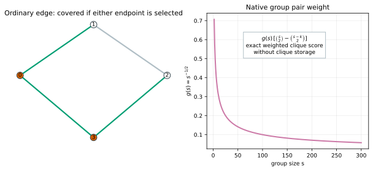
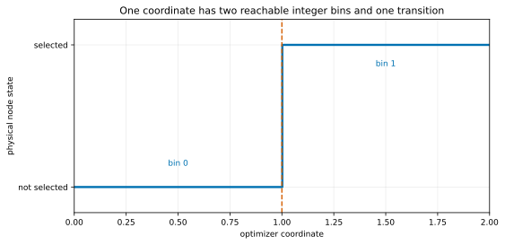
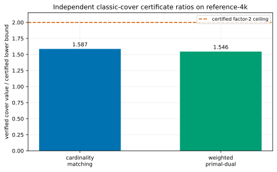
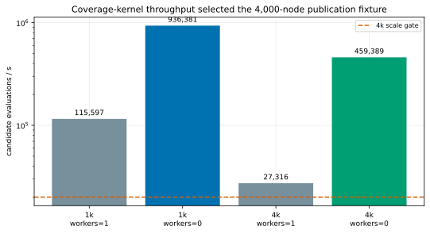
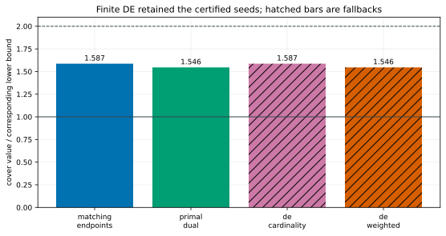
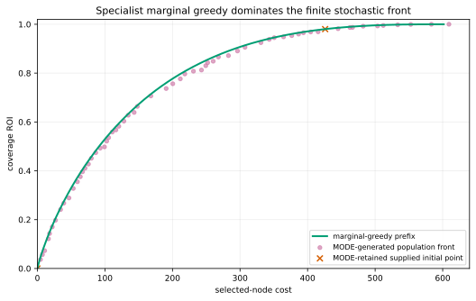
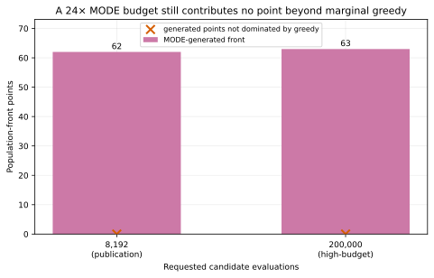
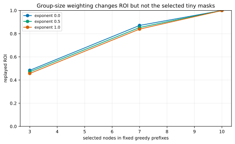

# Weighted network coverage with certified baselines

This tutorial selects nodes in an abstract network for outreach or monitor
placement. It combines ordinary edges, heterogeneous selection costs, and
overlapping groups, then asks for the trade-off between total cost and covered
relations.

No social-media or personal data is included. The checked-in graphs are
deterministic synthetic fixtures, and [`PROVENANCE.md`](PROVENANCE.md) explains
why the external graph from the source Python tutorial is not redistributed.

The measured result is deliberately not a generic-optimizer victory:

- the pre-optimization throughput gate selected the 4,000-node fixture after
  measuring 27,316 serial candidate evaluations/s, above the frozen 20,000/s
  gate;
- reverse-delete-pruned matching and primal-dual covers independently verified
  at ratios `1.587` and `1.546` to their respective certified lower bounds;
- finite DE retry retained those certified seeds but did not improve them; and
- the 62 MODE-generated population-front points were all dominated by the
  deterministic marginal-gain-per-cost prefix frontier—even after raising the
  MODE budget from 8,192 to 200,000 evaluations.

That last result is expected, not a failure to hide. The frozen extended
coverage function is monotone submodular, so a specialist marginal-greedy
method is a strong default. `fcmaes-core` becomes attractive when the model
gains non-submodular scenarios, simulator outputs, coupled continuous controls,
or other logic for which that specialist structure no longer applies.



## Problem and data

Each node `i` has positive cost `w_i`. An ordinary edge is covered when either
endpoint is selected. Groups add implicit pair relations without materializing
cliques.

The generator uses a connected stochastic-block graph, overlapping groups, and
normalized lognormal-like costs. Four fixed fixtures are checked in:

| Fixture | Nodes | Ordinary edges | Groups | Purpose |
|---|---:|---:|---:|---|
| tiny | 14 | 28 | 4 | exhaustive and exact tests |
| small | 60 | 240 | 12 | smoke optimization |
| reference-1k | 1,000 | 7,500 | 80 | scale comparison |
| reference-4k | 4,000 | 30,025 | 200 | gated publication run |

The path backbone guarantees connectivity. Additional edges prefer nodes in the
same block, while overlapping group memberships prefer a base block. These
labels are useful for inspecting the generator but do not act as optimizer
features.



Regenerate all four byte-stable CSV fixture directories with:

```bash
cargo run --release --locked -- --mode generate
```

A local two-column, zero-based undirected edge list can replace the synthetic
graph:

```bash
cargo run --release --locked -- \
  --mode mo \
  --graph /local/path/to/edge-list.txt \
  --preset publication
```

The local importer assigns deterministic synthetic costs and no groups. It
deduplicates undirected edges and drops self-loops with a counted warning; the
drop count is retained in run metadata. It does not download or copy external
data.

## Coverage contract

For a selected set `S`, group `c` of size `s`, and
`k = |c ∩ S|`, the group contribution is

```text
g(s) = s^(-1/2)
group_cov(c,S) = g(s) · [C(s,2) - C(s-k,2)].
```

The bracket is the number of unordered pairs with at least one selected
endpoint. The production kernel therefore needs only the number of selected
members in each group. It stores and visits `O(sum |c|)` memberships rather
than `O(sum |c|²)` clique edges.

Tests independently expand every group pair for every one of the `2^14`
selections of the tiny fixture. The expanded and native scores agree within
`1e-10`. The empty set gives zero, and the all-selected value agrees with its
analytic formula.



The total and normalized measures are:

```text
coverage(S) = covered ordinary edges + Σ group_cov(c,S)
cost(S)     = Σ w_i
roi(S)      = coverage(S) / coverage(V).
```

[`COVERAGE_SPEC.md`](COVERAGE_SPEC.md) is the authoritative numerical
contract. It also freezes the classic objectives, oracle meanings, and
multi-objective normalization.

## Deliberate two-bin integer decoding

There is one coordinate per node:

```text
x_i ∈ [0, 1.999999999999)
selected_i = x_i >= 1.
```

The integer mask passed to DE and MODE is correct here. The two integer bins
are the two physical node states. This differs from applying an integer mask to
normalized `[0,1]` coordinates, where rounding can collapse or distort the
intended interior bins.

Tests sample one million midpoints and find equally populated states. Sweeping
one coordinate changes exactly one node exactly once. Non-finite controls are
rejected.



## Independent classic-cover certificates

The classic vertex-cover checks use ordinary edges only. They answer two
different questions and therefore publish two different lower bounds:

1. A deterministic maximal matching has size `|M| ≤ OPT_card`. Selecting both
   endpoints and reverse-delete pruning gives a verified cardinality cover no
   larger than `2|M|`.
2. A weighted primal-dual pass constructs feasible edge-dual value
   `D ≤ OPT_weighted`. Its tight-vertex cover, again reverse-delete pruned,
   independently verifies with cost no larger than `2D`.

The 4,000-node results were:

| Certificate | Verified cover | Lower bound | Ratio |
|---|---:|---:|---:|
| cardinality matching | 3,174 nodes | 2,000 nodes | 1.587 |
| weighted primal-dual | cost 464.187 | cost 300.282 | 1.546 |

The matching lower bound is never used to claim a weighted-cost ratio.



On the 14-node fixture, separate `microlp` binary programs solve cardinality and
weighted vertex cover. They are called exact only if the solver reports
`SolutionStatus::Optimal`, and both objectives match an exhaustive `2^14`
enumeration. The larger fixtures carry certified bounds, not unsupported exact
labels. Their `exact_status` is explicitly `not-attempted`, rather than leaving
the scope to be inferred from a blank numeric field.

## Throughput gate

Publication scale was selected before optimization quality was observed. The
same fixed candidate stream measured both reference instances with one and all
available workers:

| Instance | Workers | Candidate evaluations/s |
|---|---:|---:|
| reference-1k | 1 | 115,597 |
| reference-1k | available | 936,381 |
| reference-4k | 1 | 27,316 |
| reference-4k | available | 459,389 |

The frozen rule selects `reference-4k` when its serial rate is at least 20,000
candidates/s. [`results/publication/protocol.json`](results/publication/protocol.json)
records the resulting choice. These measurements are implementation
diagnostics on this machine, not cross-language or cross-library benchmarks.



## Scalar search versus certified constructions

The two scalar objectives are:

```text
cardinality: |S| + 2 · uncovered_edges(S)
weighted:    cost(S) + (Σw_i + 1) · uncovered_edges(S).
```

Adding either endpoint always repairs an uncovered edge for less than the
penalty reduction, so a scalar optimum is a cover. Independent replay is still
required before publication.

Each DE arm requested 8,192 calls over eight retries. Population completion
caused the small actual-call overshoot:

| Arm | Actual calls | Result | Ratio to its bound | Wall time |
|---|---:|---:|---:|---:|
| matching endpoints | 0 | 3,174 nodes | 1.587 | construction |
| primal-dual | 0 | cost 464.187 | 1.546 | construction |
| DE cardinality | 8,449 | 3,174 nodes | 1.587 | 0.041 s |
| DE weighted | 8,367 | cost 464.187 | 1.546 | 0.047 s |

The optimizer retained the seeds. [`arms.csv`](results/publication/so/arms.csv)
records `retained_source=seed` and `delta_vs_seed=0` for both DE rows.
[`optimizer_incumbents.csv`](results/publication/so/optimizer_incumbents.csv)
separately publishes what DE itself found before fallback: the cardinality
incumbent selected 2,960 nodes but left 1,088 edges uncovered
(`objective=5,136`), while the weighted incumbent selected 3,018 nodes and left
1,157 edges uncovered (`objective=706,820.910`). Neither raw incumbent is a
verified cover, so reporting the certified fallback is justified without
crediting those constructions to DE.



## Cost-versus-coverage frontier

MODE minimizes normalized cost and `1 - roi` with an integer mask. Its initial
population includes empty and full selections, both certificate covers, and
evenly spaced marginal-greedy prefixes. The greedy rule repeatedly adds the
node with greatest incremental coverage per unit cost.

The publication campaign requested 8,192 calls with population 64 and took
3.107 s. It retained 64 internally nondominated population members:

- 62 were generated by MODE;
- one exactly matched a supplied greedy seed and one was the supplied empty
  endpoint; and
- after comparing against all 4,001 greedy prefixes, no MODE-generated point
  remained nondominated.



This comparison is more informative than plotting MODE alone. Seeding prevents
the stochastic population from losing known endpoints, while origin labels
prevent those same seeds from being misreported as optimizer discoveries.
Labels are matched against the 64 masks actually supplied to MODE—not against
all 4,001 possible greedy prefixes—so a later discovery cannot be
retrospectively called a seed merely because it equals an unseeded prefix.

The review-triggered budget check raises MODE to 200,000 evaluations, 24.4
times the publication budget. It took 8.762 s and retained 63 generated points
plus the supplied empty endpoint. Marginal greedy still dominated every
generated point; only the equal empty endpoint remained nondominated in the
combined comparison. The negative result is therefore not explained by the
original two-evaluations-per-variable budget.

| MODE campaign | Requested evaluations | Wall time | Generated population-front points | Generated points surviving greedy |
|---|---:|---:|---:|---:|
| publication | 8,192 | 3.107 s | 62 | 0 |
| high-budget | 200,000 | 8.762 s | 63 | 0 |



The exponent `0.5` is a transparent modeling policy rather than a discovered
constant. Replaying fixed tiny-fixture greedy masks at exponents `0`, `0.5`,
and `1` shows how strongly large-group pairs contribute.



## When to use a dedicated method

Use matching, primal-dual, exact ILP, or a mature graph solver when the task is
ordinary vertex cover. Use marginal greedy when the objective remains monotone
submodular and its approximation behavior is acceptable. They are faster,
easier to certify, and exploit more structure than generic global search.

The continuous-box representation becomes useful when the real problem adds
features such as:

- mutually exclusive outreach channels or coupled continuous effort levels;
- scenario-dependent coverage with nonlinear reliability or interference;
- simulation-derived benefit that is not submodular;
- multiple resource and fairness constraints; or
- a mixed discrete/continuous controller whose graph subset is only one part.

Those extensions should be benchmarked against the strongest specialist that
still applies. The present result is a warning against assuming dimensional
scalability alone implies solution quality.

## Reproduce and verify

Fast local checks:

```bash
cargo test --all-targets
cargo clippy --all-targets -- -D warnings
cargo run --release --locked -- --mode all --preset smoke
```

Frozen publication campaign:

```bash
cargo run --release --locked -- \
  --mode all \
  --preset publication \
  --workers 0 \
  --output results/publication

python plot_results.py
python plot_results.py --check
```

The unmodified publication command automatically runs the additive
200,000-evaluation MODE sensitivity campaign on `reference-4k`.
`--evaluations N` requests a single explicit budget and disables that additive
check.

Individual modes are `generate`, `inspect`, `validation`, `throughput`, `so`,
and `mo`. `--evaluations N`, `--instance NAME`, `--seed N`, and `--no-output`
support controlled experiments.

Publication artifacts expose exact commands, seeds, worker requests, requested
and actual calls, elapsed time, objective definitions, certificate scope, and
selected masks. Wall times vary by hardware; certificate inequalities and
replayed scores are the portable claims.

## Boundaries

This is an abstract optimization tutorial, not a deployment policy. Synthetic
node costs and relations do not represent real-world access, need, fairness, or
harm. A practical public-health or infrastructure application would require
domain validation, governance, privacy review, equity constraints, uncertainty
analysis, and monitoring for adverse outcomes.

The synthetic generator is not a validated model of any real network. The
publication uses one seed and finite optimizer budgets. Its negative MODE
result is evidence for this instance and formulation, not a universal claim
about MODE or other mixed-variable applications.
