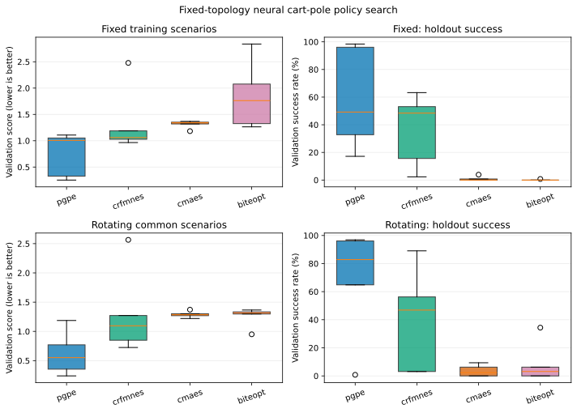
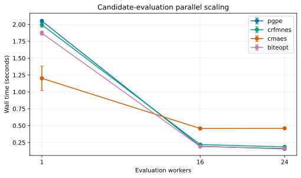
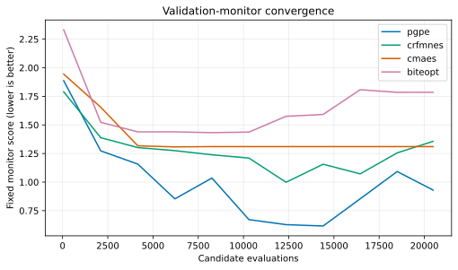
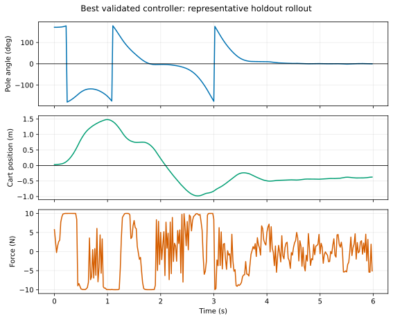

# Fixed-topology neural controller policy search

This tutorial demonstrates why PGPE and CR-FM-NES belong in the optimizer
portfolio. It optimizes a 118-parameter fixed-topology neural controller for
stochastic continuous-action cart-pole swing-up and balancing, with the model
written entirely in Rust. Active CMA-ES and BiteOpt provide comparison points.

The simulator varies cart mass, pole mass, pole length, friction, actuator
strength, initial state, sensor perturbations, and wind. Every population batch
uses common scenario seeds. The fixed protocol reuses the same scenarios;
the rotating protocol deterministically changes them between generations.
Final policies are evaluated on a disjoint seed set.

The controller observes normalized cart position and velocity, pole sine and
cosine, and angular velocity. A `5 → 16 → 1` ReLU network plus a direct linear
skip path has 118 bounded weights. An episode succeeds only if the cart remains
inside its track for all 300 steps and the pole is within 0.25 radians of
upright for at least 80% of the final quarter.

This is fixed-topology policy search: fcmaes sees only one bounded weight
vector. It complements, but does not benchmark against, topology-evolution
frameworks such as Radiate. If architecture, connectivity, or program
structure is itself a decision variable, a genotype-aware method remains the
better representation.

## When this pattern fits

Use this pattern when the decisions are a fixed, bounded, moderately
high-dimensional parameter vector; objective gradients are unavailable or
unreliable; and many simulations can be evaluated independently. PGPE is a
strong first candidate when mirrored diagonal-distribution updates and
rank-based learning suit the noise level. CR-FM-NES is a useful comparison
when the search may benefit from a richer low-rank distribution update without
the full covariance cost of CMA-ES.

This is offline policy optimization, not an online controller optimizer.
Variable neural architectures, programs, or graphs need a representation-aware
method. Safety-critical deployment also requires domain validation well beyond
the randomized educational plant used here.

## Build and test

```bash
cd tutorials/neural-controller-policy-search
cargo test
cargo clippy --all-targets -- -D warnings
```

Run a small check:

```bash
cargo run --release -- \
  --experiment single --algo all \
  --evaluations 2048 --popsize 64 --workers 16 \
  --train-scenarios 2 --validation-scenarios 32 \
  --horizon 200 --seeds 1 --output results/smoke
```

Reproduce the recorded suite with:

```bash
cargo run --release -- \
  --experiment suite --algo all \
  --evaluations 20480 --popsize 64 --workers 24 \
  --scaling-workers 1,16,24 \
  --train-scenarios 4 --validation-scenarios 128 \
  --horizon 300 --seeds 5 --seed 42 \
  --output results/publication
```

Each candidate evaluation contains `train-scenarios` independent rollouts.
Monitor and final validation rollouts are deliberately excluded from the
optimizer evaluation budget and are reported as validation work.

Generate figures after the suite:

```bash
python -m pip install -r ../python/requirements-lock.txt
python plot_results.py --write
python plot_results.py --check
```

After selecting the best policy from the suite, evaluate it once on the frozen
final seed stream:

```bash
cargo run --release -- \
  --experiment final-test \
  --policy results/publication/best_policy.csv \
  --validation-scenarios 1024 --horizon 300 \
  --output results/publication
```

## Measured experiment

The serious suite was executed on 2026-07-24 using:

- AMD Ryzen 9 9950X, 16 physical cores and 32 hardware threads;
- Rust 1.97.1, `--release`, thin LTO;
- five independent root seeds, 42 through 46;
- population 64 and exactly 20,480 candidate evaluations per run;
- four common training rollouts per candidate, or 81,920 optimizer rollouts;
- 128 disjoint validation scenarios per final policy; and
- 24 evaluation workers for the quality comparisons.

All algorithms received the same initial policy, weight bounds, population,
candidate budget, scenario schedule, and validation seeds for a given root
seed. PGPE, CR-FM-NES, and CMA-ES used one population ask/tell operation per
batch. BiteOpt used its delayed-feedback batch interface. Monitor evaluations
are excluded from the reported optimizer wall time, as is final validation.

The minimized score is

```text
mean episode loss + 0.35 × worst-20%-CVaR episode loss
```

Episode loss combines failure to remain on the track, time-averaged upright
error, failure to balance during the final quarter, cart motion, pole velocity,
and control effort. Success is reported separately rather than inferred from a
score threshold.

### Disjoint validation quality

Values are means and sample standard deviations across the five independent
runs. Lower score and higher success are better.

| Training scenarios | Algorithm | Validation score | Holdout success |
|---|---|---:|---:|
| fixed | PGPE | **0.749 ± 0.422** | **58.8% ± 36.9%** |
| fixed | CR-FM-NES | 1.344 ± 0.639 | 36.6% ± 26.2% |
| fixed | active CMA-ES | 1.313 ± 0.075 | 0.9% ± 1.7% |
| fixed | BiteOpt | 1.853 ± 0.643 | 0.2% ± 0.3% |
| rotating | PGPE | **0.620 ± 0.376** | **68.3% ± 39.9%** |
| rotating | CR-FM-NES | 1.301 ± 0.738 | 39.7% ± 36.9% |
| rotating | active CMA-ES | 1.290 ± 0.055 | 3.6% ± 4.1% |
| rotating | BiteOpt | 1.253 ± 0.171 | 8.7% ± 14.6% |

The remaining requested holdout metrics are:

| Training scenarios | Algorithm | Worst-20% CVaR loss | Mean episode steps (300 max) | RMS force |
|---|---|---:|---:|---:|
| fixed | PGPE | 0.802 ± 0.422 | 298.2 ± 1.9 | 6.45 ± 1.03 N |
| fixed | CR-FM-NES | 1.626 ± 0.932 | 281.9 ± 30.3 | 7.63 ± 0.71 N |
| fixed | active CMA-ES | 1.082 ± 0.042 | 299.8 ± 0.3 | 6.78 ± 0.68 N |
| fixed | BiteOpt | 1.713 ± 0.692 | 278.2 ± 33.0 | 7.27 ± 0.33 N |
| rotating | PGPE | 0.722 ± 0.385 | 297.7 ± 3.7 | 6.73 ± 1.47 N |
| rotating | CR-FM-NES | 1.478 ± 0.995 | 280.3 ± 36.2 | 7.13 ± 1.28 N |
| rotating | active CMA-ES | 1.116 ± 0.080 | 299.2 ± 0.8 | 8.35 ± 0.61 N |
| rotating | BiteOpt | 1.091 ± 0.061 | 300.0 ± 0.0 | 7.25 ± 1.15 N |

Surviving all 300 steps is not equivalent to solving swing-up: zero action
also keeps the cart on the track while the pole hangs downward. That is why the
tail-balance success criterion and the continuous score are both reported.

The best final policy was rotating-scenario PGPE with root seed 45:
validation score 0.239 and 96.9% success on 128 disjoint randomized plants.
The policy swings the pole through several rotations, captures it around
three seconds, and then balances it.

Because that policy was selected after seeing the per-run validation results,
it was then evaluated once on a separate frozen set of 1,024 scenarios. It
achieved score 0.233, worst-20% CVaR loss 0.241, 97.8% success, 300.0 mean
steps, and 5.59 N RMS force. This frozen test was not used to select or tune
the controller.



Large seed-to-seed variation remains. PGPE produced two fixed-scenario policies
above 96% success, but two others remained below 33%. This is a useful result,
not a reason to report only the best run. The rotating protocol improved PGPE's
mean, but one of its five runs still failed. CR-FM-NES occasionally found good
controllers but was less reliable. On this budget, full-covariance CMA-ES and
BiteOpt were poor policy-search choices.

### Baselines

The baselines use the 128 validation scenarios associated with root seed 42.

| Baseline | Validation score | Success |
|---|---:|---:|
| zero action | 1.954 | 0.0% |
| unoptimized initial neural policy | 3.976 | 0.0% |
| hand-written energy heuristic | 2.134 | 0.8% |

The energy heuristic is intentionally simple and is not an LQR or trajectory
optimizer. Its poor robust performance shows that merely adding a plausible
swing-up rule does not solve the randomized task. Every algorithm improved the
initial neural-policy score on average; only PGPE and CR-FM-NES regularly
converted that improvement into successful holdout behavior.

### Parallel scaling

The identical fixed-scenario runs were repeated at 1, 16, and 24 workers.
Changing worker count does not change candidates or objective values.

| Algorithm | 1 worker | 16 workers | 24 workers | 24-worker speedup |
|---|---:|---:|---:|---:|
| PGPE | 2.051 ± 0.020 s | 0.194 ± 0.006 s | **0.155 ± 0.002 s** | **13.2×** |
| CR-FM-NES | 1.995 ± 0.037 s | 0.219 ± 0.004 s | **0.185 ± 0.003 s** | **10.8×** |
| active CMA-ES | 1.201 ± 0.180 s | 0.458 ± 0.017 s | 0.460 ± 0.012 s | 2.6× |
| BiteOpt batch | 1.871 ± 0.031 s | 0.190 ± 0.005 s | **0.163 ± 0.002 s** | **11.5×** |



CMA-ES gains less on this workload. Full-covariance work for 118 dimensions
remains serial, and the algorithms also produce different early-termination
profiles during search, so the scaling curves should not be interpreted as a
pure optimizer-overhead decomposition. Absolute timings should not be
transferred to a different simulator; the result concerns this model and
hardware.

### Convergence and replay

The convergence monitor evaluates each current training-best policy on 24
fixed disjoint scenarios. It is diagnostic work outside the optimizer budget.
Monitor quality can worsen while training quality improves, exposing
fixed-scenario overfitting.





Raw result data and generated artifacts are retained in
[`results/publication`](https://github.com/dietmarwo/fcmaes-rust/tree/main/tutorials/neural-controller-policy-search/results/publication):

- `runs.csv` contains all 100 optimizer runs;
- `convergence.csv` contains monitor histories;
- `baselines.csv` records the three reference controllers;
- `best_policy.csv` contains all 118 selected weights;
- `best_trajectory.csv` is the plotted disjoint rollout; and
- `frozen_final_test.csv` records the post-selection 1,024-scenario test.

## Interpretation

The recorded study supports the tutorial's intended conclusions:

- PGPE has a clear use case and materially outperforms the initial policy and
  comparison optimizers on this fixed-topology, high-dimensional task.
- CR-FM-NES provides a meaningful second distribution-search method and
  occasionally produces successful controllers.
- Population evaluation scales well without simulator-internal parallelism.
- The fixed versus rotating protocol demonstrates common random numbers,
  stochastic generalization, and why disjoint validation is mandatory.
- The controller and simulator require no domain dependency, and the final
  behavior produces an understandable replay.

Five seeds support this tutorial case study, not a broad algorithm ranking.
Hyperparameters were held near library defaults rather than tuned per
algorithm, the score was constructed for this example, and the hand baseline
is deliberately modest. PGPE is therefore the best method *observed under this
recorded protocol*, not universally superior to CMA-ES, BiteOpt, CR-FM-NES, or
topology-evolving methods.
