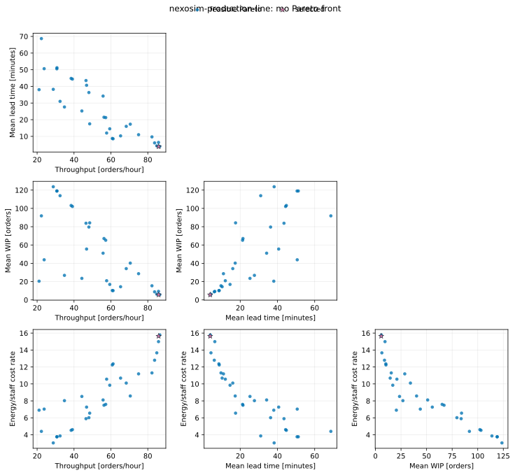
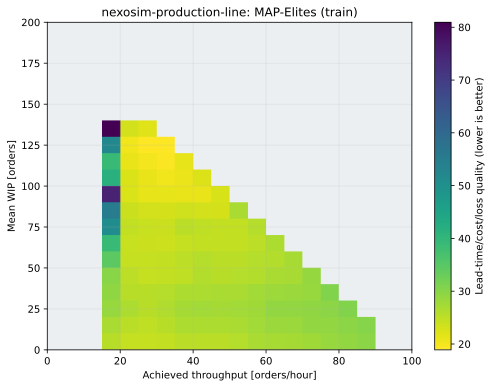
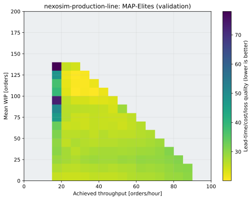
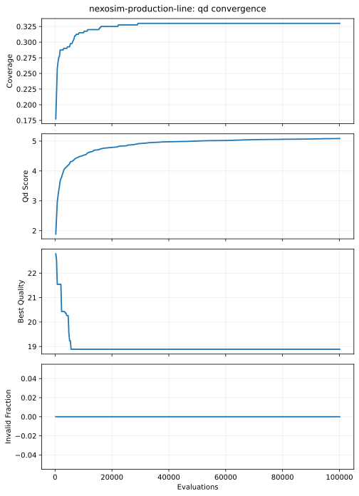

# NeXosim production-line optimization

This standalone tutorial is part of the public `fcmaes-rust` repository. It
combines:

- [NeXosim 1.0](https://github.com/asynchronics/nexosim), a component-oriented
  discrete-event simulator with single- and multithreaded executors;
- the native Rust `fcmaes-core` MODE implementation;
- a stochastic production-line digital twin:

```text
source → machine A → finite buffer → machine B → inspection
             ↑                              │
             └──────────── rework ──────────┘
                                            └→ shipping / scrap
```


## Model

The source generates a time-varying stochastic order stream. Each order has a
random work factor and base quality risk. Machines A and B include:

- lognormal processing-time variation;
- speed-dependent energy and quality effects;
- wear-dependent random failures;
- stochastic repair duration;
- threshold-driven preventive maintenance;
- configurable parallel staffing.

The finite buffer drops overflow orders. Inspection either ships, scraps, or
routes a failed order through at most two rework cycles.

MODE controls nine values:

| Index | Decision | Bounds | Type |
|---:|---|---:|---|
| 0 | Buffer capacity | 1–32 | integer |
| 1 | Machine A speed | 0.70–1.60 | continuous |
| 2 | Machine B speed | 0.70–1.60 | continuous |
| 3 | Machine A maintenance threshold | 0.15–0.95 | continuous |
| 4 | Machine B maintenance threshold | 0.15–0.95 | continuous |
| 5 | Rework routing probability | 0–1 | continuous |
| 6 | FIFO-to-shortest-work dispatch priority | 0–1 | continuous |
| 7 | Machine A staffing | 1–4 | integer |
| 8 | Machine B staffing | 1–4 | integer |

It minimizes:

1. negative hourly throughput;
2. mean shipped-order lead time;
3. time-averaged work in progress;
4. energy plus staffing cost rate.

Every candidate is averaged over fixed stochastic replication seeds. This
common-random-number design makes comparisons less noisy without pretending
that the digital twin itself is deterministic.

MAP-Elites is implemented alongside MODE. It uses achieved hourly throughput
and mean WIP as behavior descriptors, then minimizes lead time, operating cost
and the scrap/overflow fraction inside each niche. MODE remains the primary
view of the four independent objectives; QD adds a catalog of policies across
different throughput/congestion regimes.

Every QD elite is re-evaluated with a disjoint replication-seed root. Both its
training and validation descriptors are exported, together with whether the
policy remains in the same niche.

## Parallelism benchmark

The default invocation runs two separate MODE optimizations with the same
population, evaluation budget, seeds, replications, and total worker budget:

| Strategy | MODE evaluation workers | Threads inside each NeXosim bench |
|---|---:|---:|
| `outer` | N | 1 |
| `inner` | 1 | N |

No strategy combines both levels, so neither creates an N×N nested thread
configuration. The outer strategy is expected to suit this small,
replication-heavy model. Internally parallel NeXosim should become more
attractive as one simulation bench grows into many simultaneously active,
computationally expensive components.

Run a quick comparison with 16 workers:

```bash
cd tutorials/nexosim-production-line
cargo run --release -- \
  --strategy both --workers 16 \
  --evaluations 512 --popsize 32 \
  --replications 4 --horizon 240 --seed 42
```

Run only one strategy:

```bash
cargo run --release -- --strategy outer --workers 16
cargo run --release -- --strategy inner --workers 16
```

Run MODE and QD together, or QD alone:

```bash
cargo run --release -- \
  --mode all --strategy outer --workers 16 \
  --evaluations 512 --popsize 32 \
  --qd-evaluations 4096 --qd-capacity 100 \
  --qd-chunk-size 128 \
  --replications 4 --validation-replications 8

cargo run --release -- \
  --mode qd --workers 16 \
  --qd-evaluations 4096 --qd-capacity 100 --qd-chunk-size 128
```

QD always uses serial NeXosim benches under the fcmaes candidate worker pool.
It never enables both parallel layers.

Use `--workers 0` to select the available logical CPU count. MODE rounds the
requested evaluation budget up to a complete population. NeXosim supports at
most `usize::BITS` executor threads (64 on a typical 64-bit target); the CLI
rejects larger explicit worker counts and caps automatic selection accordingly.

Each strategy prints:

- wall time and the exact candidate/replication counts;
- a simple balanced score for quick comparison;
- Pareto-front objective values and decoded controls.

The balanced score is only a compact diagnostic. Select an actual design from
the reported Pareto front using domain preferences and validate it with more,
previously unseen replication seeds.

## Recorded smoke result

The documented 16-worker command was run on 2026-07-24 on an AMD Ryzen 9
9950X with Rust 1.97.1 in the Cargo release profile:

| Strategy | Candidate evaluations | Simulation replications | Pareto members | Balanced score | Wall time |
|---|---:|---:|---:|---:|---:|
| Outer fcmaes, serial NeXosim | 512 | 2,048 | 32 | 6.354786007 | 0.092181 s |
| Serial fcmaes, 16-thread NeXosim | 512 | 2,048 | 32 | 6.354786007 | 13.133946 s |

The fronts were identical, and outer parallelism was 142.48× faster in this
smoke run. This small line exposes little simultaneous work within one
discrete-event timestamp, while the inner strategy constructs a 16-thread
executor for every replication. The result therefore demonstrates why the two
parallelism levels must be benchmarked; it is not a general claim that
NeXosim's internal executor is slow. A large simulation bench with many
computationally expensive components can shift the balance.



## Recorded MAP-Elites campaign

The descriptor pilot found WIP values around 100, so the original 0–50
tentative bound was expanded before publication. The frozen archive covers
throughput from 0–100 orders/hour and mean WIP from 0–200 orders. The final
pilot and all serious runs had zero clipping.

Three publication runs used 24 workers, four training replications per
candidate, eight validation replications per elite, a 400-cell archive,
chunks of 256 and 100,096 actual candidate evaluations:

```bash
cargo run --release -- \
  --mode qd --workers 24 \
  --replications 4 --validation-replications 8 --horizon 240 \
  --qd-evaluations 100000 --qd-capacity 400 \
  --qd-chunk-size 256 --seed 42 \
  --output results/publication/qd-seed-42
```

| Metric | Mean | Sample standard deviation |
|---|---:|---:|
| Optimization wall time | 9.906888 s | 0.231267 s |
| Holdout validation time | 0.025092 s | 0.001415 s |
| Occupied niches | 122.333 | 8.737 |
| Coverage | 30.583% | 2.184 percentage points |
| QD score | 5.009692 | 0.134571 |
| Best training quality | 18.087532 | 1.106833 |
| Invalid candidates | 0 | 0 |
| Clipped descriptors | 0 | 0 |
| Holdout elites remaining in the same niche | 38.908% | 16.123 percentage points |

The low niche-stability fraction shows that four short stochastic
replications are enough for a fast search but not for treating exact cell
membership as certain. The archive remains useful as a policy catalog only
when holdout descriptors are shown beside training descriptors. Per-seed data
are in
[`results/publication/qd-summary.csv`](results/publication/qd-summary.csv).







## Output

Optimization commands write schema-v1 artifacts below `--output`:

- `run.json`: exact budget, seeds, workers, formulation and file references;
- `pareto.csv` and `convergence.csv` for MODE;
- `qd_archive.csv` and `convergence.csv` for QD.

The plotting API reads those files without routing simulator calls through
Python:

```bash
PYTHONPATH=../python python -m fcmaes_tutorial_plots.cli \
  results/publication/qd-seed-42/run.json \
  --output-dir images/publication-qd-seed-42
```

## Test

```bash
cargo test
cargo clippy --all-targets -- -D warnings
```

The tests cover decoding, invalid configurations, stochastic reproducibility,
finite simulation outputs, tiny MODE and QD runs, holdout niche accounting,
both parallel strategies, and CLI parsing.

## Scope

This model is intentionally experimental. It demonstrates simulation-
optimization architecture rather than claiming production fidelity. A real
digital twin should replace the illustrative failure, repair, quality, energy,
and staffing equations with calibrated plant data.
