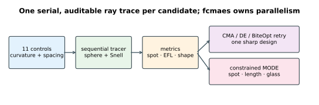
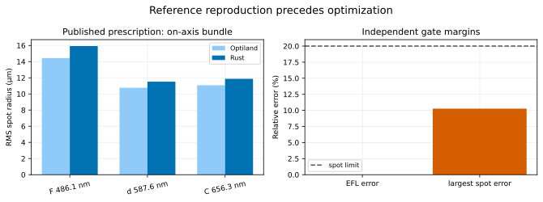
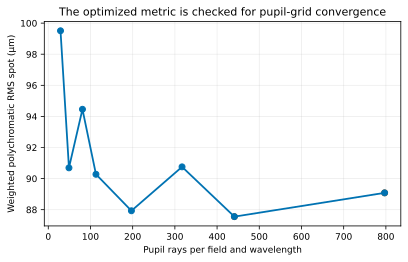
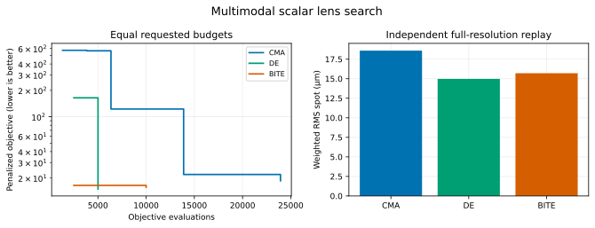
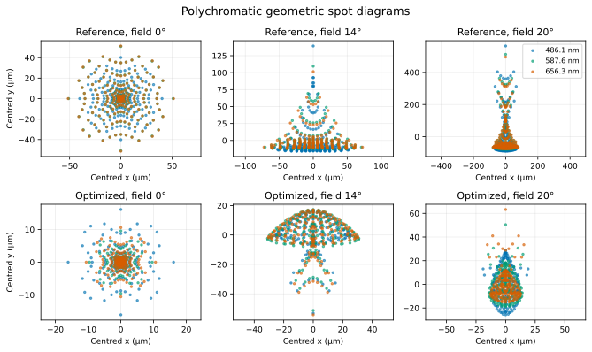
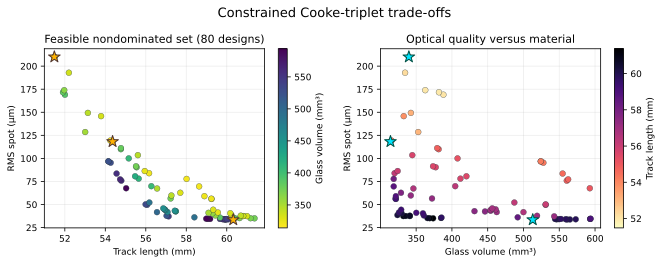

# Pure-Rust Cooke-triplet optimization

This tutorial puts an auditable sequential geometric ray tracer directly
inside `fcmaes-core`. It optimizes a three-element Cooke triplet without a
Python callback and without an optical-simulator dependency in the objective
hot path. Lens design is strongly multimodal; aperture loss, total internal
reflection, and minimum-thickness limits also introduce hard nonsmooth
boundaries. Those are exactly the conditions under which global
derivative-free retry is useful.

The result is an optimization-architecture example, not a production optical
design. It covers spherical surfaces and geometric spots; it does not model
diffraction, MTF, coatings, tolerances, aspheres, ghosting, thermal behavior,
or a complete glass catalogue.



## Model

A ray is a position \(\mathbf{p}\) and unit direction \(\mathbf{d}\). For a
spherical surface with centre \(\mathbf{c}\) and radius \(R\), the tracer solves

```text
|p + t d - c|² = R²
```

and selects the positive intersection nearest the surface vertex. At an
interface, vector Snell refraction is

```text
eta = n_before / n_after
k   = 1 - eta² (1 - cos(theta_i)²)
d'  = eta d + (eta cos(theta_i) - sqrt(k)) n
```

where the normal is oriented against the incoming ray. `k < 0` is total
internal reflection and makes the candidate invalid. Schott Sellmeier
coefficients supply wavelength-dependent indices for SK16 and F2. Unit tests
check `n_d(SK16) = 1.620408` and `n_d(F2) = 1.620037`.

The object is at infinity, the entrance-pupil diameter is 10 mm, fields are
0°, 14°, and 20°, and wavelengths are the F, d, and C lines at 486.1, 587.6,
and 656.3 nm. Rays are sampled on a circular Cartesian pupil grid. A
separately implemented 2×2 paraxial matrix supplies effective focal length
and solves the back focus for every candidate.

The eleven continuous controls are six surface curvatures, three centre
thicknesses, and two air gaps:

| Control | Bounds |
|---|---:|
| Crown 1 front radius | 15–80 mm |
| Crown 1 back radius | -800–-20 mm |
| Flint front radius | -80–-10 mm |
| Flint back radius | 10–80 mm |
| Crown 2 front radius | 20–800 mm |
| Crown 2 back radius | -80–-10 mm |
| Three centre thicknesses | 1–8 mm |
| Two air gaps | 1–10 mm |

Curvature, not radius, is passed to the optimizer so that optical power varies
on a better-scaled coordinate.

## Validation before optimization

The reference is the final F/5 SK16–F2–SK16 prescription in
[Optiland Tutorial 5c](https://optiland.readthedocs.io/en/stable/examples/Tutorial_5c_Optimization_Case_Study.html).
The complete disclosed prescription is:

| Surface | Radius | Thickness after surface | Medium after surface |
|---:|---:|---:|---|
| 1 | 30.0189 mm | 4.00000 mm | SK16 |
| 2 | -63.0945 mm | 4.21698 mm | air |
| 3 | -18.2466 mm | 4.00000 mm | F2 |
| 4 | 31.3380 mm | 2.17393 mm | air |
| 5 | 623.5070 mm | 4.00000 mm | SK16 |
| 6 | -16.4225 mm | 43.5928 mm | air to image |

The reference publishes EFL 50.002 mm and the nine field/wavelength RMS spot
radii. The independent Rust first-order result is 50.001390 mm, a 0.00122%
relative difference. At the reference's explicitly optimized 43.5928 mm image
gap, the three Rust on-axis radii are 15.923, 11.517, and 11.868 µm versus
14.440, 10.760, and 11.080 µm; the largest relative difference is 10.27%,
below the predeclared 20% limit.



This is deliberately not an exact ray-for-ray or off-axis equality claim.
Optiland places the stop on the back of the middle element and performs
entrance-pupil ray aiming; this compact tracer directly samples the 10 mm
entrance pupil on a Cartesian disk. Stop and aiming conventions mainly affect
the outer bundles, while a different pupil pattern and ray count plausibly
explain the remaining on-axis difference. The optimizer and every replay use
one internally consistent Rust convention. The validation artifact says this
explicitly instead of hiding the distinction.

The optimized quantity itself—not only EFL—also has a resolution check:

| Grid radius | Rays per field/wavelength | Weighted RMS spot |
|---:|---:|---:|
| 3 | 29 | 99.509 µm |
| 4 | 49 | 90.692 µm |
| 5 | 81 | 94.459 µm |
| 6 | 113 | 90.277 µm |
| 8 | 197 | 87.929 µm |
| 10 | 317 | 90.755 µm |
| 12 | 441 | 87.553 µm |
| 16 | 797 | 89.083 µm |

The selected 197-ray publication grid and the two finer 441- and 797-ray
checks each differ from the finest result by at most 1.72%, below the 3%
gate. The estimator is mildly non-monotone because successive Cartesian disks
are not nested, which is why the gate covers three resolutions rather than
only the last pair. Radius 8 is the declared cost/accuracy point used by every
optimizer arm; the finer grids are independent validation replays.
Full-precision evidence is in
[`results/publication/validation/`](results/publication/validation/).



## Scalar search

The minimized scalar score is the polychromatic RMS spot in micrometres with
field weights 1:2:3 for 0°:14°:20° (emphasizing the harder outer field), plus
positive penalties for:

- minimum edge thickness below 0.8 mm;
- EFL outside 50 ± 1 mm; and
- any lost, vignetted, or total-internal-reflection ray.

Every optimizer arm receives the same requested 30,000-evaluation budget and
12 parallel restarts. The disclosed reference is the evaluated first seed, so
an arm cannot silently discard a known feasible baseline. CMA-ES, differential
evolution, and BiteOpt then use independent seeded restarts. CMA-ES works in
normalized bounded coordinates: its curvature and thickness intervals differ
by roughly two orders of magnitude, so a raw shared step size would not be a
meaningful comparison.

| Arm | Actual evaluations | Retained spot | EFL | Feasible | Wall time |
|---|---:|---:|---:|---:|---:|
| CMA-ES retry | 28,954 | 18.592 µm | 50.711 mm | yes | 1.227 s |
| DE retry | 30,201 | 14.975 µm | 50.736 mm | yes | 1.221 s |
| BiteOpt retry | 30,000 | 15.700 µm | 49.072 mm | yes | 1.205 s |

Relative to the 87.929 µm reference replay at the same resolution, CMA-ES,
DE, and BiteOpt improved the weighted geometric spot by 78.9%, 83.0%, and
82.1%, respectively. The table's authoritative full-precision values are
[`results/publication/so/best.csv`](results/publication/so/best.csv).
Requested and actual budgets and per-arm wall times are recorded in
[`run.json`](results/publication/so/run.json).





## Constrained multi-objective design

MODE exposes the engineering trade-off instead of burying it in a weighted
sum. It independently minimizes:

1. weighted polychromatic RMS spot radius;
2. total optical track length through the paraxial image plane; and
3. glass volume, integrated from the two spherical sags of each element.

The edge-thickness, EFL, and ray-loss quantities remain explicit constraints,
feasible at values no greater than zero. The initial population is a
fixed-seed one-percent neighbourhood of the disclosed feasible reference,
including the reference itself. This avoids spending a short teaching run
merely discovering the narrow EFL band; MODE then evolves the full bounded
design. The fixed-seed 100,000-requested evaluation campaign rounded to
100,096 actual evaluations, completed in 3.502 s with 16 workers, and retained
80 feasible nondominated designs in
[`pareto.csv`](results/publication/mo/pareto.csv).



## Run

From the repository root:

```bash
cd tutorials/optical-lens-design

# Fast CI-sized end-to-end protocol
cargo run --release -- \
  --preset smoke --mode all --workers 4 --no-output

# Recorded campaign
cargo run --release -- \
  --preset publication --mode all --workers 16 --seed 42

# Physics/reference gate only
cargo run --release -- --mode validate
```

`fcmaes-core` owns candidate parallelism. A ray bundle is serial, which avoids
nested pools for a tiny objective.

The output follows [`../RESULT_SCHEMA.md`](../RESULT_SCHEMA.md): schema-v1
manifests, full-precision CSVs, optimizer budgets, wall times, constraints,
the reference gate, and spot coordinates. Regenerate the six SVGs with:

```bash
python plot_results.py --write
python plot_results.py --check
```

## Tests and limits

```bash
cargo fmt --all -- --check
cargo clippy --all-targets -- -D warnings
cargo test
```

Tests cover Sellmeier values, normal-incidence Snell refraction, deterministic
reference replay, bounds, explicit aperture loss, the published reference
gate, three-resolution ray-grid convergence, improvement by every scalar arm,
and a constrained MODE smoke path that must retain at least two Pareto points.
They do not
turn this teaching tracer into certified optical software. In particular, the
reported spots are geometric RMS radii, not diffraction-limited performance
or modulation transfer.
