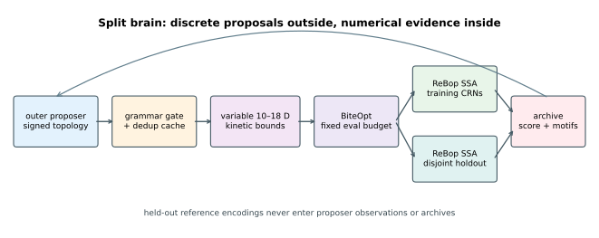
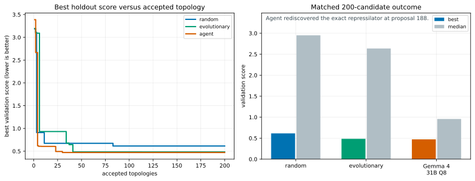
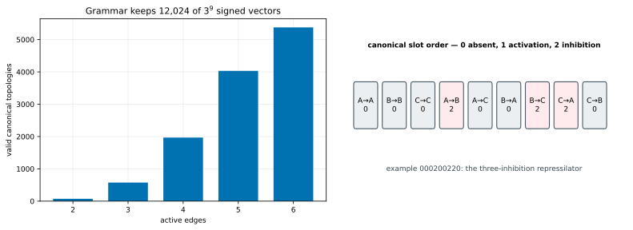
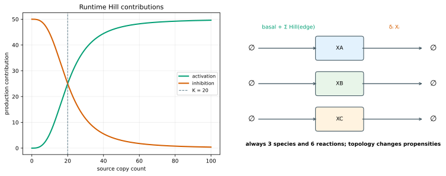
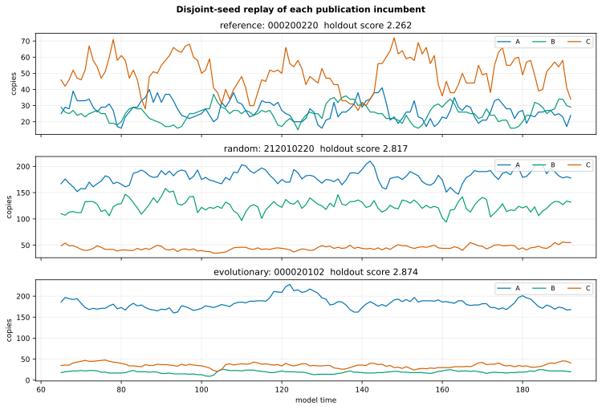
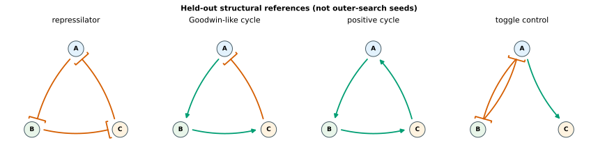
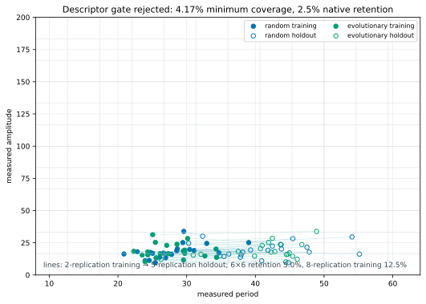

# Searching oscillator topologies with a split brain

This tutorial moves one level above
[fixed-topology Vilar oscillator design](../rebop-oscillator/README.md).
An outer process proposes *which gene regulates which*, while a native
numerical inner loop decides whether that signed network can actually produce
robust stochastic oscillations.

The architecture is a Rust port and protocol-focused extension of
[`autoresearch-circuit`](https://github.com/dietmarwo/autoresearch-circuit).
The new parts are a ReBop runtime model, fixed-evaluation inner optimization,
disjoint stochastic validation, held-out motif rediscovery, replayable
schema-v1 artifacts, and an explicit live-agent boundary. It is deliberately a
second split-brain tutorial: unlike variable-order GTOC1, the small outer
grammar has recognizable structural references.



## What the checked experiment found

The publication run optimized four reference rows separately and gave random
and evolutionary controls 20 accepted topologies each. Every topology received
one 480-evaluation BiteOpt retry, regardless of whether its kinetic vector had
10 or 18 variables. This frozen evidence remains the serial baseline; the
implementation now also supports deterministic parallel inner retry.

| Arm | Accepted | Exact reference rediscoveries | Motif classes | Best holdout score |
|---|---:|---:|---:|---:|
| references | 4 | excluded from search accounting | 4 | **2.262235** |
| grammar-aware random | 20 | 0 | 5 | 2.816855 |
| evolutionary `(1+1)` control | 20 | 0 | 1 | 2.874179 |
| live agent | 0 | — | — | **not run** |

Lower is better. The reference winner is the repressilator `000200220`.
Its 2.262 score clears the frozen 2.5 reference-calibration floor, so the
inner loop is capable of recovering at least one known oscillator before the
outer controls are interpreted.
Neither offline control exactly rediscovered a held-out reference in 20
proposals. Random also beat the simple evolutionary control: repeatedly
mutating its current best topology narrowed structural exploration. This is a
small seed-42 experiment, not evidence that random search generally dominates
evolution.

The live agent is intentionally `not-run`. It needs a provider, explicit model,
secret and deliberate token budget. The checked mock only tests JSON transport
in CI and never appears in the table. See the complete machine-generated
[comparison](results/publication/comparison.md).



The timed inner optimizations consumed 4.68 s for the four references, 35.30 s
for random and 26.82 s for evolutionary search on the development machine.
Those wall times are reproducibility notes, not a cross-language benchmark.

## The bounded topology grammar

There are three genes, one stochastic species per gene, and nine ordered edge
slots:

```text
A→A B→B C→C A→B A→C B→A B→C C→A C→B
```

Each slot is `0` absent, `1` activation, or `2` inhibition. A valid topology
has two to six active edges and no isolated gene. The slot vector is the
canonical identity, so duplicate proposals are rejected before they consume
an inner evaluation.



The structural archive key
`E{edges}-A{activations}-I{inhibitions}-S{self}-C{motifs}` is computed directly
from the decision. It is useful for search diagnostics, but it is not a
behavior descriptor.

## Runtime stochastic model

For target gene \(i\), the runtime production and degradation reactions are

\[
\varnothing \rightarrow X_i,\qquad
a_i + \sum_{j\rightarrow i} f_{ji}(X_j)
\]

\[
X_i \rightarrow \varnothing,\qquad \delta_i X_i .
\]

Activation and inhibition contributions are

\[
f^+_{ji}(x)=\alpha_{ji}\frac{x^{n_{ji}}}{K^{n_{ji}}+x^{n_{ji}}},
\qquad
f^-_{ji}(x)=\alpha_{ji}\frac{K^{n_{ji}}}{K^{n_{ji}}+x^{n_{ji}}},
\]

with \(K=20\) and initial copy count 10. This is the additive Hill model used
by `autoresearch-circuit`, not a multiplicative reinterpretation. Every
topology has exactly three species and six reactions; its active edges only
change the runtime propensity expressions.



ReBop 0.9.7 declares `Rate::expr(Expr)` but does not export `Expr`, so an
external Rust crate cannot construct that public rate. The tutorial carries a
reduced MIT-licensed reimplementation of the ReBop 0.9.7 runtime expression and
Gillespie paths it needs. It is intentionally narrower than upstream and adds
a defensive invalid-propensity guard. A dual-source integration test requires
exact sparse mass-action replay against the released crate at three seeds;
runtime expressions are covered by analytic propensity and seeded replay
tests because upstream's private `Expr` cannot be named externally.
[DEPENDENCY_NOTICE.md](DEPENDENCY_NOTICE.md) gives the exact scope, numerical
delta and removal condition.

This three-species Hill network is **not** equivalent to the nine-species,
sixteen-reaction Vilar model. The fixed Vilar tutorial is a neighboring use
case, not a trajectory oracle for a different biological system.

## Variable inner optimization

Only active edges receive kinetic parameters:

| Block | Count | Optimizer representation | Physical bounds |
|---|---:|---|---|
| basal production | 3 | `log10` | 0.1–50 |
| degradation | 3 | `log10` | 0.005–1 |
| edge strength | active edges | `log10` | 0.1–100 |
| Hill coefficient | active edges | linear | 1–5 |

The dimension is therefore \(6+2|E|\), or 10–18 under this grammar. Every
candidate receives the same number of objective calls. That is auditable, but
not neutral: a six-edge network must search a larger space with the same
budget as a two-edge network. The CSV artifacts report both dimension and
requested/actual evaluations.

BiteOpt minimizes the common-random-number training score. The final vector is
then evaluated on disjoint seeds. No simulator thread pool is enabled.

### Parallel inner retry

The split-brain boundary now has explicit numerical parallelism. For one
proposed topology, `--inner-retries R` creates `R` independent BiteOpt restarts
with a deterministic ordered seed schedule. `--workers W` runs at most
`min(R,W)` restarts concurrently; `--workers 0` uses available CPUs. Increasing
workers alone changes scheduling, not seeds, total evaluations or the selected
result. A regression test requires the same parameters and score with one and
two workers.

Both `R` and `W` default to the machine's physical-core count, capped by the
logical CPU quota visible to the process. On the 16-core/32-thread development
machine, the default is therefore 16 retries on 16 workers. Use
`--inner-retries 1 --workers 1` to reproduce the frozen serial publication
evidence. `--workers 0` deliberately opts into all visible logical CPUs but is
still capped by `R`.

`--evaluations E` is the budget **per retry**, so one topology requests
`R × E` objective evaluations. The candidate CSV records this total and the
actual total, while `run.json` records retries, requested workers and resolved
workers. For example, this uses 16 cores during each kinetic optimization:

```bash
cargo run --release --locked -- \
  --mode campaign --preset publication --strategy random \
  --accepted-candidates 200 --inner-retries 16 --workers 16 \
  --evaluations 1000 --seed 42 \
  --output results/local/random-r16-e1000
```

A focused scheduling check used two topologies, four 480-evaluation retries per
topology and seed 777. One worker took 8.23 s at 99% CPU; four workers took
2.31 s at 362% CPU, a 3.56× wall-time speedup, and both selected the identical
best score `3.0034960329076874`. This verifies parallel utilization and
worker-count invariance; it is not a general scaling benchmark.

The outer proposal loop remains sequential by design. After eight independent
bootstrap samples, the evolutionary arm selects uniformly among its eight
best validated topologies and applies one grammar-preserving edit. Every fifth
proposal is instead an independent random immigrant. The elite pool exploits
several promising neighborhoods, while the fixed 20% immigrant cadence
prevents exhaustion of the one-edit neighborhood around a single incumbent.
The agent likewise observes all prior validated results. Evaluating topology
batches from stale snapshots would define different outer algorithms.
Parallel retry fills the cores without weakening that feedback contract or
creating a nested simulator pool.

## Score contract

After 64 time units of burn-in, the model records 128 samples one unit apart.
For each gene, a fixed DFT plan over periods 8–64 measures:

- dominant period and target-period error;
- 10th-to-90th-percentile amplitude;
- spectral concentration around the dominant bin; and
- one- and two-period autocorrelation decay.

The aggregate additionally penalizes missing gene participation, period
disagreement, stochastic failure, replicate variation and molecular cost.
[`SCORE_SPEC.md`](SCORE_SPEC.md) freezes the formula.

Correctness does not circularly compare this scorer with another implementation
of the same formula. Tests use analytic sine, period-shift, flat-signal and
three-gene-participation fixtures, plus bit-identical seeded stochastic replay.



## Structural references, not seeds

The four references are optimized under the campaign budget, but never put in
proposal history:

- the three-inhibition repressilator is an oscillator reference;
- the `(+,+,−)` cycle is labelled **Goodwin-like** because this reduced
  three-species network is not Goodwin's original biochemical model;
- the positive cycle is a structural comparison, not guaranteed to oscillate;
  and
- mutual inhibition is a bistable toggle control, not an oscillator target.

The toggle adds `A→C` solely to keep gene C connected under the grammar.
Rediscovery means exact equality with the canonical vector; motif-class
discovery is reported separately.



See [MOTIFS.md](MOTIFS.md) for the encodings, classifier rules and primary
references.

## The agent boundary

An agent sees the grammar, previous topology keys, validation scores, motif
classifications and dimensions. It does not see the held-out reference list or
optimized kinetic vectors. It returns only:

```json
{"edges":[0,0,0,2,0,0,2,2,0],"input_tokens":123,"output_tokens":17}
```

Rust validates, canonicalizes and deduplicates the proposal. Invalid output
gets one bounded repair request. A duplicate consumes a proposal attempt but
no inner optimization budget. Provider usage is accumulated in `run.json`.
[`AGENT_PROTOCOL.md`](AGENT_PROTOCOL.md) defines the boundary and the
`no-motif-hint` control.

The mock emits only self-edge variants and contains none of the references. It
is a transport fixture:

```bash
cargo run --release --locked -- \
  --mode all --preset smoke \
  --agent-command 'python3 agents/mock_agent.py' \
  --output results/local/ci-smoke
```

For a real MiniMax Anthropic-compatible run, copy the example configuration,
set the secret locally, choose an explicit token limit, and record a separate
artifact directory:

```bash
osc_result_root="results/live-minimax-seed42"
mkdir -p "$osc_result_root"
cp config.live.example.json "$osc_result_root/agent-config.json"
export MINIMAX_API_KEY='...'

# Local-only check: validates the file, provider, model, token cap and key.
python3 agents/llm_agent.py \
  --config "$osc_result_root/agent-config.json" \
  --check

cargo run --release --locked -- \
  --mode campaign --preset publication --strategy agent \
  --accepted-candidates 20 \
  --agent-command "python3 agents/llm_agent.py --config $osc_result_root/agent-config.json" \
  --output "$osc_result_root"
```

The preflight makes no API request. After it passes, test one real proposal
before starting a long campaign. The Rust boundary distinguishes command or
network transport errors from malformed model responses; only the latter gets
the single repair request. Three consecutive adapter failures open a circuit
breaker, preserve the last diagnostic in `run.json`, and stop the arm. A
circuit-broken arm cannot silently resume: preserve or rename its directory,
fix and preflight the adapter, then start a fresh arm.

The MiniMax/Anthropic path uses the same transport proven by the GTOC1 route
search: both bearer and `X-Api-Key` authentication headers, SSE streaming, and
adaptive-thinking filtering. Only text deltas reach the topology parser;
thinking deltas are consumed without being mixed into the candidate JSON.

Do not check in a local configuration or the key. A real agent row belongs in
the headline comparison only after its result directory records the concrete
provider/model configuration and `run.json` records provider token usage.

## Descriptor pilot and QD decision

Period × amplitude was successful for the fixed Vilar model, but that does not
pre-approve it for a topology-search family. This tutorial ran a fresh
12×12 native-grid pilot on all 40 offline-control candidates. Only two of the
three required arms are available because the publication agent is `not-run`;
the gate therefore fails closed instead of silently treating two arms as
complete evidence.

| Gate quantity | Result | Required |
|---|---:|---:|
| deterministic arms | **2** | at least 3 |
| minimum per-arm coverage | **4.167%** | at least 5% |
| period below / above bounds | 0% / 0% | at most 5% each |
| amplitude below / above bounds | 0% / 0% | at most 5% each |
| absolute correlation | 0.2971 | at most 0.90 |
| 12×12 holdout retention, 2 training replications | **2.5%** | at least 25% |
| 6×6 holdout retention, 2 training replications | **5.0%** | at least 25% |
| 12×12 holdout retention, 8 training replications | **12.5%** | at least 25% |

The observed training ranges are 20.866–39.028 time units and
9.500–33.833 molecules, so the registered box contains the sample. Raising
training replication from two to eight improves native-grid retention from
2.5% to 12.5%, showing that measurement noise matters, but it still misses the
25% gate. Coarsening to 6×6 reaches only 5%. The pair is therefore rejected on
arm count, coverage and holdout stability. The QD arm has a schema-conforming
`status: "skipped"` manifest with no placeholder archive. This is more
informative than rendering a noisy repertoire whose elites migrate between
cells.



## Reproduce the publication evidence

From this standalone workspace:

```bash
cargo test --locked
cargo clippy --all-targets --locked -- -D warnings
python3 -m unittest agents/test_llm_agent.py

cargo run --release --locked -- \
  --mode all --preset publication \
  --inner-retries 1 --workers 1 \
  --output results/publication

# Remeasure descriptor gates from the frozen random/evolutionary archives.
cargo run --release --locked -- \
  --mode pilot --preset publication --seed 42 \
  --output results/publication

python3 plot_results.py --check
```

The publication command deliberately does not provide `--agent-command`.
`results/publication/agent/run.json` is therefore `not-run`, not fabricated.
The reference, random and evolutionary arms write:

- `run.json` — schema, protocol, status, usage and summary;
- `candidates.jsonl` — crash-replay archive;
- `candidates.csv` — topology, dimension, scores, descriptors and budgets;
- `convergence.csv` — best score and motif coverage by accepted candidate; and
- `best_trace.csv` — one disjoint-seed replay.

`--resume` restores a selected arm only after its schema-v2 `run.json` matches
the requested strategy, preset, root seed, complete inner protocol, resolved
worker count and versioned proposal policy. Candidate rows are also checked
against the strategy, evaluation budget and replication counts. Legacy
schema-v1 results remain valid evidence but cannot be extended; use a new
`--output` directory. Proposal RNG streams are derived from root seed, arm and
attempt number, and resume retains cumulative attempts, rejected/duplicate
counts, transport failures and token usage. A staged offline run therefore
does not depend on hidden global RNG state.

For a fresh matched 200-candidate run on the documented 16-core machine, make
the retry and worker counts explicit and encode them in the new result root:

```bash
osc_result_root="results/local/matched-200-e2k-r16w16-seed42"

for osc_strategy in random evolutionary; do
  for osc_target in 20 50 100 150 200; do
    cargo run --release --locked -- \
      --mode campaign \
      --preset publication \
      --strategy "$osc_strategy" \
      --accepted-candidates "$osc_target" \
      --inner-retries 16 \
      --workers 16 \
      --evaluations 2000 \
      --seed 42 \
      --output "$osc_result_root" \
      --resume
  done
done
```

The staged targets provide completed checkpoints. Reusing a schema-v1
directory, changing any numerical budget, or changing the root seed produces
an error before the archive is read or modified.

After the three proposal arms finish, optimize the four held-out references
once under the same numerical protocol:

```bash
cargo run --release --locked -- \
  --mode reference \
  --preset publication \
  --inner-retries 16 \
  --workers 16 \
  --evaluations 2000 \
  --seed 42 \
  --output "$osc_result_root"
```

Then generate the matched comparison and descriptor-gate report without
rerunning or rewriting any campaign arm:

```bash
cargo run --release --locked -- \
  --mode report \
  --preset publication \
  --accepted-candidates 200 \
  --inner-retries 16 \
  --workers 16 \
  --evaluations 2000 \
  --seed 42 \
  --output "$osc_result_root"
```

Report mode requires exact schema-v2 manifests for reference, random,
evolutionary and agent, verifies equal proposal-arm counts, and preserves the
recorded proposal failures and agent token usage. It writes only
`comparison.md` and the files below `pilot/`. The printed `qd_gate` is a
decision, not an implicit authorization to run QD; report mode never invokes
an optimizer, an agent or the QD arm.

## Limitations

- The Hill model is a coarse regulatory abstraction; it does not model mRNA,
  promoters, binding species, growth or cell division.
- “Goodwin-like” describes a signed feedback core, not model equivalence.
- A toggle is expected to be bistable, so its oscillator score is a negative
  control rather than a success criterion.
- Twenty proposals are enough to exercise the architecture, not to estimate a
  general algorithm ranking or motif-discovery probability. Under the exact
  rejection-sampled grammar, one specified three-edge reference has probability
  `1/2912` per independent valid random draw; the four references together have
  probability `1/728`, so 20 draws have only
  `1-(727/728)^20 = 2.71%` probability of any exact hit before duplicate
  conditioning.
- The simple evolutionary arm mutates only its current best topology after
  four bootstrap candidates; its one-class archive shows why diversity-aware
  parent selection matters.
- Inner retries parallelize one topology's numerical search. Topology proposals
  themselves remain sequential so evolutionary and agent decisions always use
  the latest validated archive.
- Live-agent behavior and cost remain unmeasured until a deliberate campaign
  is run.
- The compatibility copy should be removed once ReBop exports its runtime
  expression type upstream.

## Primary references

- D. T. Gillespie,
  [“Exact stochastic simulation of coupled chemical reactions”](https://doi.org/10.1021/j100540a008),
  *J. Phys. Chem.* 81, 2340–2361 (1977).
- M. B. Elowitz and S. Leibler,
  [“A synthetic oscillatory network of transcriptional regulators”](https://doi.org/10.1038/35002125),
  *Nature* 403, 335–338 (2000).
- B. C. Goodwin,
  [“Oscillatory behavior in enzymatic control processes”](https://doi.org/10.1016/0065-2571(65)90067-1),
  *Advances in Enzyme Regulation* 3, 425–437 (1965).
- T. S. Gardner, C. R. Cantor and J. J. Collins,
  [“Construction of a genetic toggle switch in Escherichia coli”](https://doi.org/10.1038/35002131),
  *Nature* 403, 339–342 (2000).
