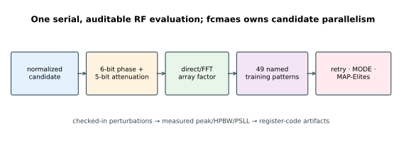
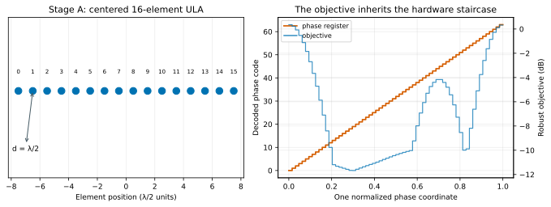
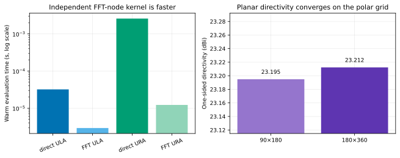
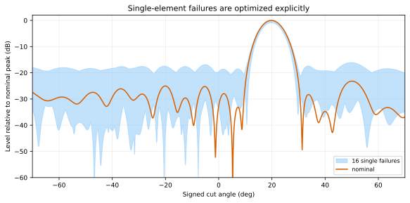
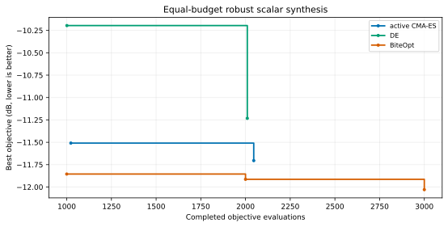
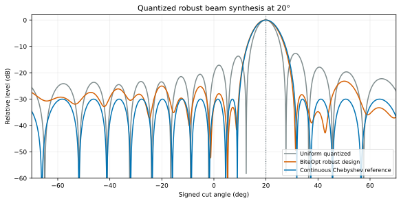
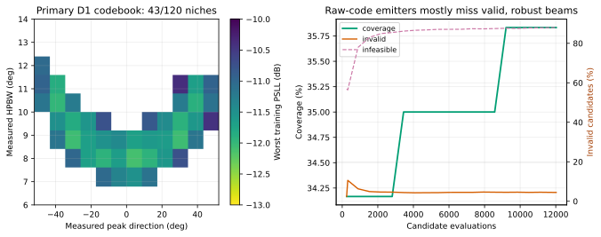
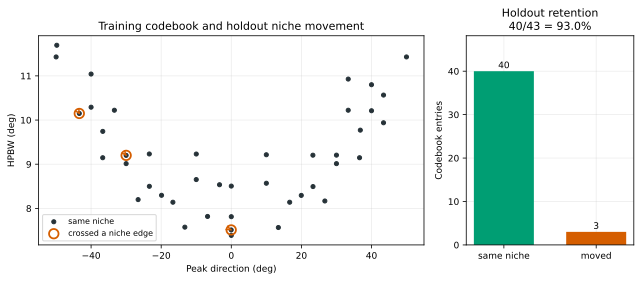
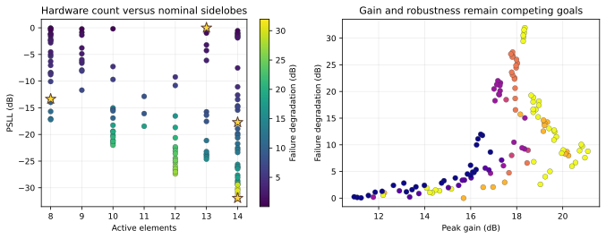

# Hardware-quantized phased-array codebooks in pure Rust

This tutorial turns a phased-array beam into the kind of object that real
hardware consumes: phase-shifter and attenuator register codes. The objective
is a staircase, element failures make robustness a worst-case problem, and the
useful result may be one beam, a trade-off front, or a complete codebook.
Those are three different optimization questions, so the implementation uses
equal-budget retry, constrained MODE, and MAP-Elites rather than forcing every
answer into one weighted sum.

The checked-in publication run found:

- a robust 20° beam with nominal PSLL `-23.18 dB` and worst-training-case
  PSLL `-12.03 dB`;
- a 127-point feasible MODE front spanning 8–14 active elements;
- a 43-beam register-level codebook covering 35.8% of its 120 niches; and
- a feasible non-uniform 16-of-24 geometry with `-31.69 dB` nominal PSLL.

The descriptor pilot is intentionally allowed to disagree with the desired
story. After correcting the pilot to use the archive's actual 12×10 grid,
peak direction and HPBW clear every pre-registered gate: coverage is 40.83%
and representative-holdout niche retention is 95.07%. QD is therefore
recorded as **accepted**, while the rejection-heavy search remains an
important limitation rather than being hidden.



## Why gradient-free optimization?

Each of the 16 elements has a 6-bit phase register and a 5-bit attenuator:

```text
phase code:       0 … 63       step 5.625°
attenuator code:  0 … 31       step 0.5 dB
```

A normalized optimizer coordinate is decoded with equal-width bins. Moving
inside one bin changes no physical state and therefore changes no array
metric. The controlled one-coordinate sweep below shows both the register
staircase and the inherited objective plateaus. Finite-difference gradients
on this representation are either zero or boundary-dependent.



The decoder is authoritative: optimization, serial replay, parallel replay,
CSV export, and codebook lookup all use the same function. The tests cover
one million phase-bin samples, both endpoints, every reachable code,
one-coordinate transitions, and 10,000 serial/parallel decoding comparisons.

## Array model

Elements lie in the `z = 0` plane at positions `(x_n, y_n)`. Direction
`theta` is measured from boresight `+z`, and `phi` is azimuth from `+x`.
With wavelength `lambda`,

```text
k                 = 2 pi / lambda
psi_n(theta, phi) = k (x_n sin(theta) cos(phi) + y_n sin(theta) sin(phi))
F(theta, phi)     = EF(theta) sum_n g_n a_n exp(j (phase_n + psi_n))
```

`g_n` is the activation or failure mask. `a_n` and `phase_n` come from the
register codes. The configurable ideal element factor is
`EF(theta) = cos(theta)^q`; the ULA closed-form tests select `q = 0`.

The tutorial separates two models whose outputs must not be confused:

| Stage | Geometry and grid | Reported quantities |
|---|---|---|
| A, optimization | 16-element ULA, half-wave spacing, 4,001 points uniform in `u = sin(theta)` | peak direction, HPBW, PSLL, sector null and taper efficiency |
| B, validation | 8×8 half-wave URA, midpoint polar grid over the upper hemisphere | planar directivity and 2-D kernel validation |

Stage A does **not** call a cut-plane integral “directivity.” Stage B uses an
ideal one-sided aperture: its field is zero behind the array, its denominator
is integrated over the upper hemisphere, and the directivity numerator is
`4 pi`. This is a transparent teaching convention, not a complete antenna,
feed, coupling, radome, or impedance model.

## Two field kernels, with an explicit contract

The direct kernel evaluates arbitrary geometry and arbitrary angular points.
It can precompute the steering matrix when repeated evaluation repays its
memory cost. The optional FFT kernel evaluates only the native, periodic,
uniform spatial-frequency nodes of a half-wave ULA or URA.

An FFT result is never interpolated onto the arbitrary polar directivity grid
and then presented as an independent exact check. Non-uniform geometry is
rejected by the FFT constructor. This distinction is enforced by tests.

The publication validation recorded:

| Check | Result |
|---|---:|
| Planar directivity, coarse polar grid | 23.19485 dBi |
| Planar directivity, fine polar grid | 23.21230 dBi |
| Refinement difference | 0.01745 dB |
| Fine precomputed steering matrix | 63.28 MiB |
| Warm direct ULA field | about 30.6 µs |
| Warm FFT ULA field | about 2.8 µs |
| Warm direct URA field | about 2.74 ms |
| Warm FFT URA field | about 11.7 µs |

These timings are same-program implementation diagnostics from one run, not
a cross-library benchmark. The recorded run shared the machine with another
long-running optimization campaign, so these are deliberately not presented
as isolated throughput. The FFT values are for native FFT nodes; the direct
and polar paths answer more general questions.



The physics tests additionally check the Dirichlet closed form, the exact
half-wave visible-region energy identity, the first uniform-array null,
steering and symmetry, a known `-30 dB` Dolph–Chebyshev pattern, sub-grid peak
interpolation, and 200 one-dimensional plus 20 two-dimensional FFT/direct
comparisons.

## Metrics and main-lobe exclusion

Peak direction uses three-point parabolic interpolation. HPBW interpolates the
first `-3 dB` crossings. PSLL excludes the main lobe between the first nulls
bracketing the peak; if no usable null exists, it falls back to
`1.5 × HPBW`. A known Dolph–Chebyshev answer tests the complete main-lobe
exclusion logic rather than merely testing the field kernel.

Taper efficiency is

```text
|sum a_n|² / (N sum a_n²)
```

and is the honest Stage-A aperture-use proxy. The scalar robust objective is
the largest PSLL over all training scenarios plus calibrated penalties for a
pointing or genuine field-kernel violation. A physically degenerate pattern
contributes the worst PSLL (`0 dB`) instead of being misreported as a kernel
error. Feasibility is `constraint <= 0`; the target is 20° within 0.25°, and
the worst-training PSLL limit is `-10 dB`. The nominal analytic seeds target
approximately `-20 dB`, while failures define the weaker robust feasibility
threshold.

## Robustness protocol

Every candidate is evaluated against the same 49 checked-in training cases:

- nominal operation;
- four fixed 5° RMS phase-error draws;
- four fixed 0.5 dB RMS amplitude-error draws;
- every one of the 16 single-element failures; and
- 24 distinct fixed non-adjacent dual failures.

The holdout changes perturbation kind, not merely random seed: four 10° phase
draws, all 15 adjacent dual failures, two `0.02 lambda` spacing-error cases,
and a grid twice as fine. The CSV perturbations in
[`scenarios/`](https://github.com/dietmarwo/fcmaes-rust/tree/main/tutorials/phased-array-codebook/scenarios)
are part of the experiment contract.



## Equal-budget scalar synthesis

CMA-ES, differential evolution, and BiteOpt each received 8,000 requested
candidate evaluations split over eight seeded parallel retries. Every retry
starts near a decoded steered/tapered beam, and every retained result is
replayed from its exported codes.

| Arm | Actual evaluations | Peak | Nominal PSLL | Worst training PSLL | Δ vs seed | Feasible |
|---|---:|---:|---:|---:|---:|---:|
| analytic seed | 13 | 19.901° | -21.24 dB | -11.66 dB | — | yes |
| CMA-ES | 8,184 | 20.137° | -17.64 dB | -11.70 dB | -0.04 dB | yes |
| DE | 8,152 | 20.160° | -17.40 dB | -11.23 dB | **+0.43 dB** | yes |
| BiteOpt | 8,000 | 19.803° | -23.18 dB | **-12.03 dB** | -0.37 dB | yes |

The first row is the baseline: the best of a deterministic 13-point sweep over
the same taper range each retry samples from. It is already feasible, so the
arms are refining a good start rather than searching from nothing. Read against
it, CMA-ES gains `0.04 dB`, BiteOpt gains `0.37 dB`, and **DE finishes
`0.43 dB` worse than the seed** despite 8,152 evaluations. On a quantized
plateau landscape that ranking is the expected one, and publishing the baseline
is what makes it visible; a table of three arms alone would have implied more
search value than the measurement supports.

The exact values, constraints, register codes, actual budgets, and wall times
are in
[`results/publication/so/`](https://github.com/dietmarwo/fcmaes-rust/tree/main/tutorials/phased-array-codebook/results/publication/so).





## Pre-registered descriptor pilot

MAP-Elites is useful only if its axes are jointly reachable and stable enough
for a user to select from. Before running the archive, each of three root-seed
arms mixes bin-scale-perturbed steering/taper designs with 20% uniform
register candidates. This is deliberately closer to the emitter distribution
than three copies of one analytic lattice. The pilot reports feasibility for
each arm and freezes these gates for D1 =
`(measured peak direction, measured HPBW)`:

```text
|Spearman correlation| < 0.7
clipping at each bound < 10%
coverage on the archive's 12 x 10 grid > 40%
same-niche retention on representative holdout > 60%
```

The D2 fallback `(measured peak direction, taper efficiency)` must pass the
same five tests on its own 120-niche grid; it does not receive a weaker gate.
The measured pilot result was:

| Diagnostic | Value |
|---|---:|
| Attempted mixed candidates | 2,160 |
| Feasible candidates | 507 (23.47%) |
| Feasible by seed 42 / 4242 / 424242 | 24.31% / 22.50% / 23.61% |
| D1 rank correlation | -0.0314 |
| Actual-grid D1 coverage | **40.83%** |
| Peak / HPBW clipping | 0.00% / 0.00% |
| Fine-grid holdout niche retention | 95.07% |
| Coarse 30-niche retention | 96.84% |
| D2 coverage / retention | 69.17% / 97.24% |

D1 clears correlation, clipping, coverage, and holdout-retention gates, so the
frozen verdict is **accepted**. The full verdict is
[`pilot.md`](results/publication/pilot/pilot.md).

## MAP-Elites register codebook

The primary 12×10 archive optimizes the worst training sidelobe ratio inside
each peak/HPBW niche. It publishes actual `u32` phase and attenuator codes, not
only normalized optimizer coordinates. A caller can find the nearest entry
and replay exactly those register settings.

The 12,000-requested campaign produced:

- 12,024 batched calls and 43 occupied niches out of 120 (35.8%);
- 40 of 43 elites that remained in the same *actual archive niche* on the
  representative holdout grid;
- 539 invalid physics or evaluation results (4.48%); and
- 10,579 evaluable candidates that failed robust feasibility (87.98%).

Together, 11,118 calls (92.47%) were rejected. Independent random register
mutations commonly create multi-lobed or insufficiently robust patterns, so
analytic steered/tapered seeds are essential.

The archive intentionally retains feasible elites only, as required by the
tutorial result schema. Archiving penalized infeasible parents might improve
exploration, but would weaken that artifact contract. At smoke scale, 248 of
512 calls are analytic seeds; smoke therefore verifies plumbing rather than
MAP-Elites exploration quality.





The deployable rows are in
[`codebook.csv`](results/publication/qd/codebook.csv); archive bookkeeping and
full-precision validation descriptors are in
[`qd_archive.csv`](results/publication/qd/qd_archive.csv).

## Constrained MODE trade-offs

MODE independently minimizes:

1. negative nominal peak gain;
2. nominal PSLL;
3. exact active-element count; and
4. degradation from nominal to worst-training PSLL.

The exact count is decoded directly in `[8,14]`, with deterministic activation
keys, so there are no dead 15/16-element decision bins. Active count remains a
trade-off objective; a broadside sector-null constraint and the genuine
kernel-failure constraint remain explicit. The 8,192-call run retained 127
feasible nondominated points spanning 8–14 active elements.



## Non-uniform geometry experiment

The geometry arm selects exactly 16 elements from 24 half-wave lattice slots,
perturbs each selected position by at most `0.25 lambda`, and optimizes its
codes. Minimum spacing must remain at least `0.25 lambda`; the selected result
has `0.334 lambda` minimum spacing and `-31.69 dB` nominal broadside PSLL.

This experiment deliberately uses the general direct kernel. The FFT path
rejects it, which makes the acceleration boundary visible instead of quietly
returning the wrong answer. Unlike the scalar, QD, and MODE arms, this
exploratory geometry arm optimizes nominal PSLL only; it does not claim
49-scenario robustness.

## Reproduce

From the public repository root:

```bash
cd tutorials/phased-array-codebook

# Fast end-to-end CI protocol, using the general direct kernel
cargo run --release --locked -- \
  --preset smoke --mode all --workers 2 --seed 42 --no-output

# Checked-in publication protocol and optional native-node FFT validation
cargo run --release --locked --features fft -- \
  --preset publication --mode all --workers 0 --seed 42 \
  --output results/publication

# One formulation at a custom budget
cargo run --release --locked -- \
  --preset smoke --mode qd --evaluations 2000 --workers 4
```

`workers = 0` resolves to the available CPU count. `fcmaes-core` owns
candidate-level parallelism; one array-pattern evaluation is serial, avoiding
nested pools.

Regenerate and byte-check the nine SVG figures:

```bash
python3 plot_results.py --write
python3 plot_results.py --check
```

Each result directory contains a schema-v1 `run.json` plus full-precision CSV
evidence following [`../RESULT_SCHEMA.md`](../RESULT_SCHEMA.md). `results/smoke`
and `results/local` are ignored; `results/publication` and all figures are
versioned.

## Test and audit

```bash
cargo fmt --all -- --check
cargo clippy --all-targets -- -D warnings
cargo clippy --all-targets --features fft -- -D warnings
cargo test
cargo test --features fft
cargo deny check licenses
```

The crate is a standalone Cargo workspace and pins `fcmaes-core`,
`num-complex`, and optional `rustfft`. `deny.toml` permits only the repository's
strict MIT/Apache/BSD/Unicode license set; there is no copyleft exception.

This remains an array-factor optimization tutorial. It does not replace a
full-wave electromagnetic solver, calibration measurements, thermal and
manufacturing analysis, spectral-mask verification, mutual-coupling models,
or hardware-in-the-loop validation.
