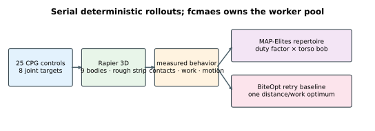
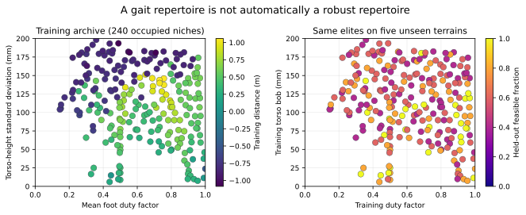
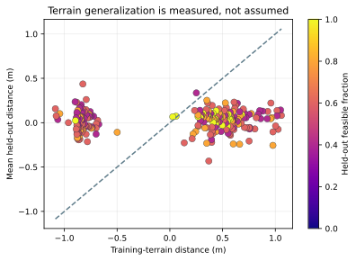
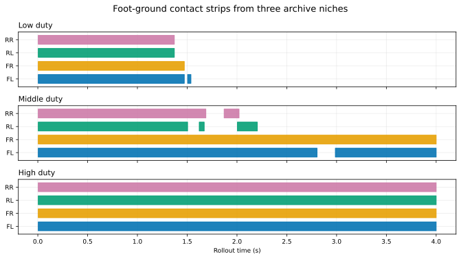
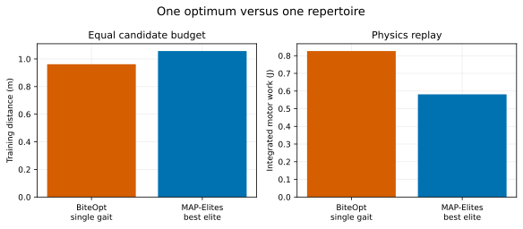

# Rapier quadruped gait repertoires

This tutorial uses `fcmaes-core` and `rapier3d-f64` to discover a repertoire
of generic quadruped gaits over uneven terrain. Gait search is a natural
quality-diversity problem: the useful output is not only one fastest
controller, but several mechanically different behaviors a user can choose
between.

This is an optimization-architecture tutorial, not a claim about a particular
robot platform. The model is nine rigid bodies with ideal position motors and
simple colliders. It omits actuator dynamics, gearboxes, compliance, sensing,
latency, battery behavior, and system identification. Ground contact is
Rapier's deterministic constraint solver, not a validated soil or foot model.



## Robot and terrain

The robot has one cuboid torso and four upper/lower leg pairs. Eight revolute
joints—four hips and four knees—move in sagittal planes. Each lower leg has a
spherical foot collider. Hip motors are limited to 30 N·m and knee motors to
22 N·m. Rapier runs in double precision with `enhanced-determinism`; its
optional `parallel` feature is disabled.

A broad ground plane is covered by 48 low roughness boxes. The strip begins
under the initial stance rather than beyond it, so even slow initial
candidates interact with the terrain. A deterministic seed controls box
heights and widths. Every 4 s rollout uses a 1/240 s timestep; the first 1 s
settles the initial pose and is excluded from distance, work, contact, and
torso-variation metrics.

## Controller

The 25 continuous variables describe a central pattern generator:

```text
x[0]                frequency, 0.5–3.0 Hz
x[1 + 3j]           amplitude of joint j, 0–0.8 rad
x[2 + 3j]           phase of joint j, -pi–pi rad
x[3 + 3j]           offset of joint j, -0.6–0.8 rad

target_j(t) = offset_j + amplitude_j sin(2 pi frequency t + phase_j)
```

The parameterization can express walk-, trot-, pace-, and bound-like phase
relationships, but none of those labels is encoded or rewarded.

## Physics-derived fitness and constraints

The scalar score is minimized:

```text
- forward distance + 0.002 × mechanical work
```

Mechanical work is not an amplitude proxy. After every Rapier step, the code
reads each motor's solver impulse and multiplies its magnitude by the measured
parent/child relative angular speed. The sum has joule units. This makes the
resource term respond to actual simulated load and motion.

Two constraints are explicit and feasible at values no greater than zero:

```text
0.15 m - minimum torso height
absolute lateral drift - 0.5 m
```

A fall therefore cannot become an interesting empty archive niche.

## Why MAP-Elites

Each feasible rollout supplies two emergent descriptors:

- mean foot duty factor: fraction of scored steps in terrain contact, averaged
  over four feet;
- torso-height standard deviation in millimetres.

The original plan called the second value “variance in mm”, which is
dimensionally inconsistent. The implementation uses standard deviation in mm
and names the artifact column accordingly.

Contact comes from Rapier's narrow-phase active contact pairs between each
foot and the ground/roughness colliders. It is not inferred from joint angles
or commanded phase.

### Range study and frozen bounds

Before running MAP-Elites, 2,000 uniformly sampled controllers were evaluated
on training terrain seed 17. All 2,000 produced active foot/terrain contact and
728 were feasible. Because the roughness boxes begin under the initial stance,
the optimizer is exposed to them from the first scored interval rather than
needing to cross a flat lead-in. Among feasible samples:

| Descriptor | Minimum | Median | 95th percentile | Maximum |
|---|---:|---:|---:|---:|
| Duty factor | 0.194 | 0.960 | 0.994 | 1.000 |
| Torso-height standard deviation | 17.177 mm | 82.058 mm | 115.091 mm | 175.126 mm |

The frozen 20×20 archive bounds are duty factor 0–1 and torso standard
deviation 0–200 mm. Any later finite descriptor outside those bounds is
counted and rejected; it is not silently clipped into an edge niche. The raw
study is [`range-study.csv`](results/publication/range-study.csv). The median
is the mean of the two middle order statistics and the 95th percentile uses
linear interpolation at index `0.95 × (n − 1)`.

## Recorded repertoire

The fixed-seed publication run requested 50,000 evaluations. MAP-Elites rounds
that to a complete 128-candidate batch. Training uses terrain seed 17;
every retained elite is then independently replayed on seeds 1001–1005.
Validation data never influence archive insertion.

The definitive counts, wall time, invalid evaluations, and QD score are in
[`results/publication/qd/run.json`](results/publication/qd/run.json), and every
elite with its full 25-vector, training metrics, and five-seed aggregate is in
[`qd_archive.csv`](results/publication/qd/qd_archive.csv).

The recorded 2026-07-28 run on an AMD Ryzen 9 9950X used 16 candidate workers:

| Metric | Recorded value |
|---|---:|
| Actual training evaluations | 50,048 |
| Wall time | 97.749 s |
| Occupied niches | 240 / 400 |
| Training coverage | 60.0% |
| Infeasible evaluations | 17,140 |
| Rejected out-of-bound descriptors | 5 |
| Best training distance | 1.057518 m |
| Best-quality elite motor work | 0.581139 J |
| Elites feasible on all five unseen terrains | 27 / 240 |
| Mean held-out feasible fraction | 0.6275 |

The archive is not merely repeating the random range study. Its duty-factor
median is 0.624 rather than 0.960 and its minimum is 0.145 rather than 0.194.
It occupies 18 of the 20 duty-factor bins and all 20 torso-height-variation
bins; the latter extends from 5.976 to 198.313 mm. Those descriptor statistics
are computed directly from the full-precision archive and are the clearest
evidence that MAP-Elites actively expands behavior coverage.



The five-seed study is deliberately strict: `validation_feasible_fraction =
1` means the elite satisfies both constraints on every unseen terrain. A
repertoire can have high training coverage and still be brittle. The plot
therefore shows the generalization result instead of presenting one training
archive as a robustness claim.



The payoff of behavior-space search is visible in contact timing. These three
elites were selected by low, middle, and high training duty factor—not by a
post-hoc gait label:



## Equal-budget scalar baseline

BiteOpt parallel retry receives the same requested 50,000 candidate budget.
Its best training-terrain gait travelled 0.962148 m after settling, used
0.826322 J of measured motor work, and completed in 99.319 s on the recorded
16-worker run. The best-quality QD elite travelled 1.057518 m with 0.581139 J
on the training terrain. It did not remain feasible on all five holdouts, so
those attractive training values are not presented as robust performance.
MAP-Elites answers a different question: its best-quality elite is one member
of a behavior catalogue rather than the sole deliverable.

BiteOpt is a named representative scalar baseline, not a claim that this is
the strongest possible single-result optimizer. The experiment compares a
single-objective deliverable with a behavior archive at equal simulation cost;
adding several scalar algorithms would instead turn it into an optimizer
ranking exercise.



Equal candidate count is the correct comparison here because one objective
call is one deterministic 4 s rollout for both methods. Held-out replay is
reported separately and is not charged to either training budget.

## Run

From the repository root:

```bash
cd tutorials/rapier-quadruped-gait

# CI-sized end-to-end check
cargo run --release -- \
  --preset smoke --mode all --workers 4 --no-output

# Recorded campaign
cargo run --release -- \
  --preset publication --mode all --workers 16 --seed 42

# Replay a specified 25-value controller
cargo run --release -- --mode simulate --x <comma-separated-values>
```

The publication protocol costs about 100,000 full rollouts plus the 2,000-point
range study and five held-out replays per occupied niche. `fcmaes-core` owns
the worker pool; each Rapier simulation remains serial, avoiding nested
parallelism and preserving exact replay.

Artifacts follow [`../RESULT_SCHEMA.md`](../RESULT_SCHEMA.md). Native Rust
writes full-precision CSV and schema-v1 JSON; Python is used only to render
the checked-in evidence:

```bash
python plot_results.py --write
python plot_results.py --check
```

## Tests

```bash
cargo fmt --all -- --check
cargo clippy --all-targets -- -D warnings
cargo test
```

Tests cover decision decoding, finite CPG targets, bit-identical rollouts,
nonzero solver-derived motor work, genuine terrain contact, foot-contact
recording, range-study contact, and explicit invalid-configuration rejection.
The CI smoke command additionally exercises parallel range sampling, BiteOpt
retry, MAP-Elites, artifact-free held-out replay, and descriptor-bound
rejection.
