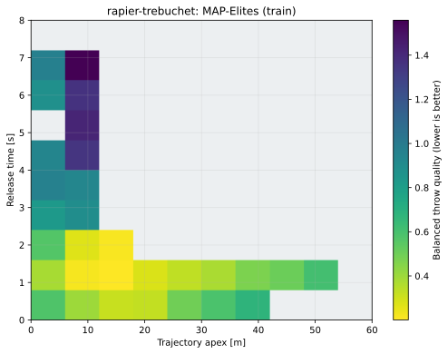
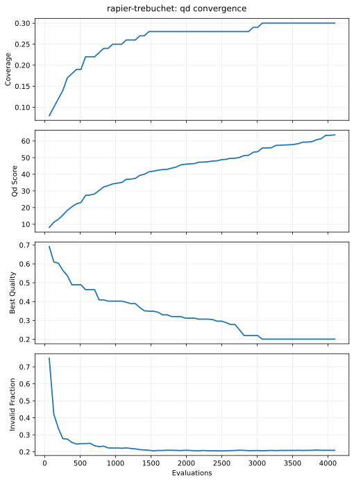
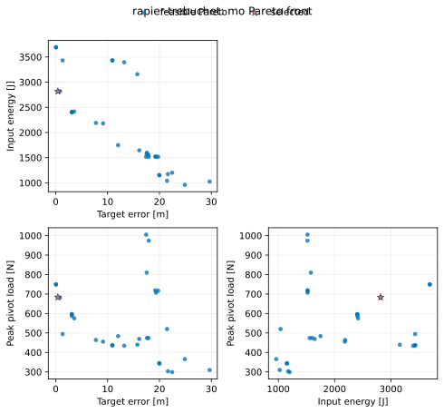
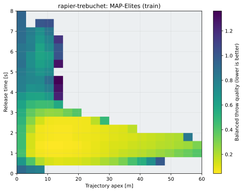
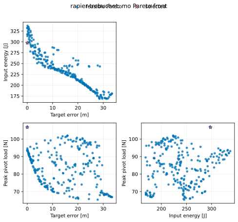

# Rapier trebuchet optimization

This standalone tutorial is part of the public `fcmaes-rust` repository. It
combines the pure-Rust `fcmaes-core` optimizers with
[`rapier2d-f64`](https://crates.io/crates/rapier2d-f64), the double-precision
2D build of the Rapier rigid-body physics engine.

Rapier is compiled with `enhanced-determinism` and without its optional
`parallel` feature. Each objective evaluation is therefore a serial,
deterministic physics run, while fcmaes evaluates independent candidates or
retries on separate worker threads. This avoids nested thread pools.

## Physical model

The compact model has a dynamic rigid throwing arm pinned to a fixed support,
an attached counterweight, a projectile on a rope joint, joint limits, a
ground collider, continuous collision detection, and an angle-triggered
release. The rope joint is removed when the arm crosses the selected release
angle. Contact and release make the objective discontinuous.

fcmaes controls:

| Index | Decision | Bounds | Unit |
|---:|---|---:|---|
| 0 | Long arm length | 2–6 | m |
| 1 | Counterweight mass | 20–220 | kg |
| 2 | Projectile mass | 0.5–10 | kg |
| 3 | Sling length | 1–6 | m |
| 4 | Initial arm angle | -1.25–-0.35 | rad |
| 5 | Release angle | -0.25–0.55 | rad |
| 6 | Joint viscous damping | 0–12 | N·m·s |
| 7 | Pivot Coulomb friction | 0–20 | N·m |

The counterweight is rigidly attached to the short side of the arm. This makes
the model a hybrid between a compact trebuchet and a robotic thrower, while the
rope-constrained projectile retains the release dynamics.

The scalar BiteOpt-retry objective is minimized:

```text
target error + 0.002 × input energy + 0.0002 × peak pivot load
             + invalid-release/landing penalty
```

The resource terms are positive penalties. A negative sign would reward
wasting energy and increasing structural load.

MODE independently minimizes:

1. absolute landing-position error;
2. counterweight potential energy made available to the throw;
3. peak pivot force, measured from Rapier's hinge constraint impulse.

Invalid releases are penalized in every objective so that a motionless,
zero-energy candidate cannot become a misleading Pareto solution.

MAP-Elites is an additional, not replacement, formulation. It uses:

- trajectory apex and release time as behavior descriptors; and
- the normalized target-error, energy and peak-load combination as the
  minimized quality inside each niche.

This produces mechanically different low/fast and high/slow throws while MODE
continues to expose the original three-objective trade-off. Invalid releases
return non-finite QD values and cannot occupy empty niches.


## Run

Use 24 fcmaes workers for scalar, multi-objective and quality-diversity
optimization:

```bash
cd tutorials/rapier-trebuchet
cargo run --release -- \
  --mode all --workers 24 --target 35 \
  --evaluations 20000 --retries 24 \
  --mo-evaluations 200000 --popsize 256 \
  --qd-evaluations 200000 --qd-capacity 400 \
  --qd-chunk-size 256 --seed 42
```

Quick smoke run:

```bash
cargo run --release -- \
  --mode all --workers 4 \
  --evaluations 200 --retries 2 \
  --mo-evaluations 512 --popsize 32 \
  --qd-evaluations 4096 --qd-capacity 100 --qd-chunk-size 64
```

Run only one formulation:

```bash
cargo run --release -- --mode single --workers 24
cargo run --release -- --mode multi --workers 24
cargo run --release -- --mode qd --workers 24
```

Replay a specified physical design without optimization:

```bash
cargo run --release -- --mode simulate \
  --x 3.5,80,4,2.5,-0.75,-0.05,2,2
```

`--workers 0` uses the available logical CPU count. `--evaluations` is per
BiteOpt retry. MODE rounds `--mo-evaluations` up to a complete population.
MAP-Elites rounds `--qd-evaluations` up to a complete, even-sized QD chunk;
`--qd-capacity` must be a perfect square for the documented two-dimensional
grid.
Run `cargo run --release -- --help` for all options.

## Quick QD and visualization check

The descriptor pilot initially exposed releases beyond an early 4 s bound.
The frozen tutorial bounds are now 0–60 m for apex and 0–8 s for release time.
A 4,096-evaluation fixed-seed smoke run produced no clipped descriptors:

| Evaluations | Archive | Occupied | Coverage | Invalid | Clipped | Best quality | Wall time |
|---:|---:|---:|---:|---:|---:|---:|---:|
| 4,096 | 100 | 30 | 30.0% | 855 | 0 | 0.200650546 | 1.072107 s |

This is a pipeline check, not the multi-seed publication campaign. Regenerate
its figures from the native Rust artifacts:

```bash
PYTHONPATH=../python python -m fcmaes_tutorial_plots.cli \
  results/quick/qd/run.json --output-dir images/quick-qd
```





The corresponding quick MODE run remains independently available:



The publication QD campaign used 24 workers, a 400-cell archive, chunks of 256
and 200,192 actual evaluations for each of seeds 42, 43 and 44:

| Metric | Mean | Sample standard deviation |
|---|---:|---:|
| Wall time | 11.524671 s | 0.471233 s |
| Occupied niches | 162.333 | 5.859 |
| Coverage | 40.583% | 1.465 percentage points |
| QD score | 972.330666 | 12.854853 |
| Best balanced quality | 0.041271890 | 0.003028160 |
| Invalid evaluations | 52,173.333 | 2,725.652 |
| Clipped descriptors | 43.333 | 12.014 |

The clipping rate was only 0.022% of evaluations, so the frozen bounds cover
the practically searched behavior space without claiming every pathological
trajectory is inside it. Raw per-seed statistics are in
[`results/publication/qd-summary.csv`](results/publication/qd-summary.csv).
The figure below is the named seed-42 archive; the table prevents that one
archive from standing in for run-to-run variability.



## Recorded 24-worker optimization results

The following fixed-seed campaigns were executed on 2026-07-24 on an AMD
Ryzen 9 9950X with 16 physical cores, 32 logical CPUs, and Rust 1.97.1.
Both used exactly 24 fcmaes workers, a 35 m target, the release build, and the
default simulation timestep of 1/180 s. Rapier remained single-threaded inside
each evaluation.

The scalar campaign used 24 independent BiteOpt retries, 20,000 evaluations
per retry, depth 6, and seed 42:

```bash
cargo run --release -- \
  --mode single --workers 24 --target 35 \
  --evaluations 20000 --retries 24 --depth 6 --seed 42 \
  --output results/publication/scalar-seed-42
```

The multi-objective campaign used MODE with population 256, 782 complete
generations, and seed 42. Rounding to a complete population increased the
requested 200,000 evaluations to 200,192:

```bash
cargo run --release -- \
  --mode multi --workers 24 --target 35 \
  --mo-evaluations 200000 --popsize 256 --seed 42 \
  --output results/publication/mo-seed-42
```

| Design | Evaluations | Wall time | Evaluations/s | Landing | Target error | Energy | Peak pivot load | Scalar score |
|---|---:|---:|---:|---:|---:|---:|---:|---:|
| Initial | — | — | — | 13.576227 m | 21.423773 m | 1478.120111 J | 340.157696 N | 24.448044362 |
| BiteOpt retry best | 480,000 | 28.968742 s | 16,570 | 35.000096 m | 0.000096 m | 283.972483 J | 98.194144 N | 0.587679710 |
| MODE representative | 200,192 | 8.619674 s | 23,225 | 34.999990 m | 0.000010 m | 297.884297 J | 106.682878 N | 0.617115116 |

The BiteOpt result reduced energy by 80.8% and peak pivot load by 71.1%
relative to the initial design while matching the target. MODE retained 256
Pareto points. Its reported representative minimizes the example's balanced
selection score over the final front and has a printed Pareto quality of
`-0.040457002`.

The optimized controls were:

| Decision | BiteOpt retry best | MODE representative |
|---|---:|---:|
| Arm length | 2.320797 | 2.275854 |
| Counterweight mass | 20.001153 | 21.394817 |
| Projectile mass | 0.501652 | 0.504059 |
| Sling length | 5.989521 | 5.612902 |
| Initial arm angle | -1.249383 | -1.249535 |
| Release angle | 0.549596 | 0.550000 |
| Joint damping | 0.000153 | 0.011078 |
| Pivot friction | 0.001028 | 0.000150 |

Selected extremes from the final MODE front illustrate the trade-off:

| Selection criterion | Target error | Energy | Peak pivot load |
|---|---:|---:|---:|
| Minimum target error | 0.000010 m | 297.884297 J | 106.682878 N |
| Minimum energy | 28.542249 m | 168.624992 J | 89.477070 N |
| Minimum peak load | 27.812185 m | 245.529436 J | 65.393401 N |



Replaying both recorded vectors reproduced their reported objective values
exactly. These are optimization results for the deterministic illustrative
model, not repeated-seed benchmark statistics. In particular, sub-millimetre
target errors describe numerical matching inside this model and must not be
read as real-world mechanical accuracy.

## Output and visual story

By default, the command creates `results/`:

- `replay.html`: self-contained animation with initial/optimized trajectory
  comparison and convergence plot;
- `trajectory.csv`: arm, counterweight, sling-tip, and projectile states;
- `convergence.csv`: incumbent scalar or balanced MODE score;
- `pareto.csv`: the final MODE front and its eight decision values.
- `qd_archive.csv`: occupied niches, quality, descriptors, visit count and
  decision values for QD runs;
- `run.json`: schema-v1 configuration, provenance and artifact references.

Open `results/replay.html` in a browser. No web server is needed.

The animation is a diagnostic replay, not a mechanical certification. Verify
promising designs with finer timesteps, calibrated material limits, and a more
detailed flexible-body model before drawing engineering conclusions.

## Test

```bash
cargo test
cargo clippy --all-targets -- -D warnings
cargo run --release -- --mode simulate --no-output
PYTHONPATH=../python python -m pytest ../python/tests
```

The tests cover design validation, deterministic physics, finite loads,
trajectory recording, objective adapters, option validation, and tiny parallel
MODE and MAP-Elites runs. The Python tests validate schema loading, PyO3-array
adapters, and deterministic SVG generation.
