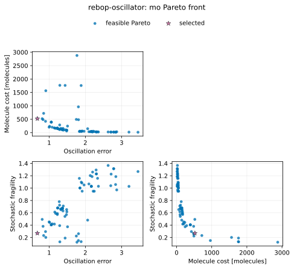
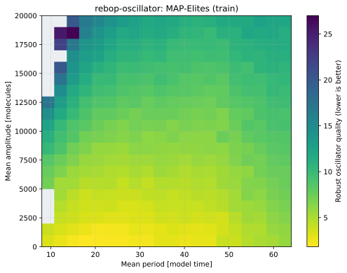
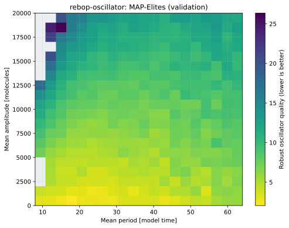
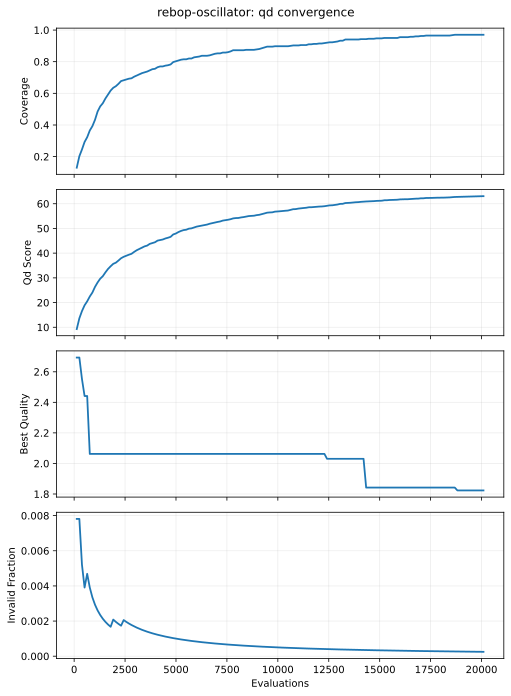

# ReBop robust stochastic oscillator optimization

This standalone tutorial is part of the public `fcmaes-rust` repository. It
combines the pure-Rust `fcmaes-core` optimizers with
[`rebop` 0.9.7](https://docs.rs/rebop/0.9.7/rebop/), an MIT-licensed
stochastic simulator for well-mixed chemical reaction networks.

The model uses ReBop's compiled macro DSL, not its slower runtime construction
API. It is based on the 9-species, 16-reaction Vilar stochastic oscillator
included with ReBop.


## Reproducible stochastic evaluation

ReBop 0.9.7 has the seed control needed for a fair noisy objective:

- macro-generated systems expose `seed(u64)`;
- the runtime API exposes `Gillespie::new_with_seed` and `seed`.

No upstream patch is required. This example defines two disjoint, named arrays
of 16 seeds in `src/lib.rs`:

- the first `--replications` training seeds are reused for every optimizer
  candidate;
- the first `--validation-replications` holdout seeds are used only after
  optimization.

This common-random-number design makes candidate comparisons reproducible and
less noisy. The holdout report makes overfitting to the training paths visible.
Changing the optimizer's `--seed` does not change either simulation seed set.

ReBop executes each stochastic path serially. fcmaes distributes independent
candidate evaluations across its worker pool, and each candidate evaluates its
replications serially. There is no nested parallelism.

## Design variables

The optimizer controls all 15 published Vilar kinetic rates:

```text
x_i = log10(rate_i)
```

| Index | Rate | Published baseline |
|---:|---|---:|
| 0 | `alpha_a` | 50 |
| 1 | `alpha_prime_a` | 500 |
| 2 | `alpha_r` | 0.01 |
| 3 | `alpha_prime_r` | 50 |
| 4 | `beta_a` | 50 |
| 5 | `beta_r` | 5 |
| 6 | `delta_ma` | 10 |
| 7 | `delta_mr` | 0.5 |
| 8 | `delta_a` | 1 |
| 9 | `delta_r` | 0.2 |
| 10 | `gamma_a` | 1 |
| 11 | `gamma_r` | 1 |
| 12 | `gamma_c` | 2 |
| 13 | `theta_a` | 50 |
| 14 | `theta_r` | 100 |

Each log-rate is bounded to ±0.5 decades around its baseline. Thus every
physical rate ranges from `baseline / sqrt(10)` to `baseline * sqrt(10)`, a
tenfold span. Wider independent bounds produced a few extremely
reaction-intensive candidates that dominated evaluation time without adding
useful circuit-design information.

## Robustness metrics

Each stochastic path has a 64-time-unit burn-in followed by 128 samples at
one-unit intervals. The repressor trace is analyzed for:

- period and relative target-period error;
- 10th-to-90th-percentile amplitude;
- spectral concentration around the strongest oscillatory frequency;
- autocorrelation decay after two estimated periods;
- mean total molecule count;
- failure due to weak/non-spectral oscillation or invalid molecule counts.

The scalar BiteOpt objective is minimized:

```text
oscillation_error =
    period_error
    + 2 × spectral_impurity
    + amplitude_penalty
    + 0.5 × autocorrelation_decay
    + 5 × failed_run_fraction

fragility =
    period_coefficient_of_variation
    + 0.5 × amplitude_coefficient_of_variation
    + autocorrelation_decay
    + 5 × failed_run_fraction

scalar_score =
    oscillation_error + 0.001 × mean_molecules + 2 × fragility
```

All undesirable terms are positive penalties. Negative impurity, amplitude,
or failure terms would reward the behavior the optimization is meant to
avoid.

MODE independently minimizes:

1. oscillation error;
2. mean molecules plus an invalid-run penalty;
3. stochastic fragility.

The CLI prints the training and holdout metrics separately and reports a
simple balanced quality scalar for selecting one representative from the
Pareto front.

MAP-Elites is added alongside MODE, not instead of it. Mean period and mean
amplitude are the behavior descriptors. The existing robust scalar score is
minimized within each niche. The archive therefore answers which robust
circuit is best for different reachable period/amplitude phenotypes, while
MODE continues to answer the independent
oscillation-error/molecule-cost/fragility trade-off.

Every retained QD elite is re-evaluated on the disjoint validation seeds. The
archive stores both sets of descriptors and reports whether holdout behavior
remains in the same niche. This makes stochastic descriptor drift visible
rather than treating a noisy training archive as ground truth.

## Run

A substantial 24-worker run:

```bash
cd tutorials/rebop-oscillator
cargo run --release -- \
  --mode all --workers 24 \
  --target-period 20 \
  --replications 4 --validation-replications 8 \
  --evaluations 2000 --retries 24 \
  --mo-evaluations 20000 --popsize 256 \
  --qd-evaluations 20000 --qd-capacity 400 \
  --qd-chunk-size 128 --seed 42
```

`--evaluations` is the budget of each BiteOpt retry. MODE rounds its requested
budget up to a complete population. MAP-Elites rounds its requested budget up
to a complete even-sized chunk. `--qd-capacity` must be a perfect square for
the two-dimensional grid. `--workers 0` uses the available logical CPU count.

Quick functional run:

```bash
cargo run --release -- \
  --mode all --workers 4 \
  --replications 2 --validation-replications 4 \
  --evaluations 50 --retries 4 \
  --mo-evaluations 256 --popsize 32 \
  --qd-evaluations 1024 --qd-capacity 100 --qd-chunk-size 32
```

Evaluate the published Vilar parameters without optimization:

```bash
cargo run --release -- \
  --mode simulate --replications 4 --validation-replications 8
```

Run `cargo run --release -- --help` for every option. A custom design can be
replayed with `--mode simulate --x LOG_RATE_0,...,LOG_RATE_14`.

## Recorded 24-worker smoke result

The following deterministic optimizer run was recorded on 2026-07-24 on an
AMD Ryzen 9 9950X with Rust 1.97.1:

```bash
cargo run --release -- \
  --mode both --workers 24 \
  --replications 4 --validation-replications 8 \
  --evaluations 100 --retries 24 \
  --mo-evaluations 2048 --popsize 128 --seed 42
```

| Design | Candidate evaluations | Stochastic paths | Wall time | Training score | Holdout score | Holdout period | Holdout molecules | Holdout failures |
|---|---:|---:|---:|---:|---:|---:|---:|---:|
| Published Vilar rates | — | — | — | 3.850317 | 3.629589 | 24.841902 | 1347.676758 | 0% |
| BiteOpt retry best | 2,400 | 9,600 | 26.344639 s | 2.373547 | 2.097143 | 18.412764 | 534.017578 | 0% |
| MODE representative | 2,048 | 8,192 | 6.555744 s | 1.736088 | 2.524510 | 21.426971 | 525.785156 | 0% |

BiteOpt improved the holdout score by 42.2% and MODE by 30.4% relative to the
published baseline. The MODE population retained 75 Pareto points. Both
optimized designs had zero failures on the eight disjoint holdout paths.

The recorded physical rates were:

| Rate | BiteOpt retry best | MODE representative |
|---|---:|---:|
| `alpha_a` | 93.941122 | 23.794970 |
| `alpha_prime_a` | 499.368794 | 274.961572 |
| `alpha_r` | 0.007594 | 0.008536 |
| `alpha_prime_r` | 70.957904 | 18.883147 |
| `beta_a` | 15.900094 | 39.879668 |
| `beta_r` | 3.684622 | 2.606957 |
| `delta_ma` | 20.724470 | 25.860682 |
| `delta_mr` | 0.752309 | 0.326942 |
| `delta_a` | 0.458952 | 0.527905 |
| `delta_r` | 0.281394 | 0.304178 |
| `gamma_a` | 2.737633 | 3.021407 |
| `gamma_r` | 0.389440 | 0.518140 |
| `gamma_c` | 1.617531 | 0.919304 |
| `theta_a` | 23.726579 | 35.886822 |
| `theta_r` | 147.053056 | 80.790019 |

This is a functional optimization result, not a repeated-optimizer-seed
benchmark. The difference between training and holdout scores is part of the
result: stochastic optimization should report generalization, not only the
paths used to rank candidates.



## Recorded MAP-Elites campaign

The descriptor pilot widened the amplitude range twice before publication.
The frozen archive spans periods 8–64 and amplitudes 0–20,000 molecules. The
publication campaign used 24 workers, four common training paths per
candidate, eight disjoint holdout paths per elite, a 400-cell archive, chunks
of 128, and 20,096 actual candidate evaluations for each optimizer seed:

```bash
cargo run --release -- \
  --mode qd --workers 24 \
  --replications 4 --validation-replications 8 \
  --qd-evaluations 20000 --qd-capacity 400 \
  --qd-chunk-size 128 --seed 42 \
  --output results/publication/qd-seed-42
```

| Metric | Mean | Sample standard deviation |
|---|---:|---:|
| Optimization wall time | 153.089655 s | 9.857429 s |
| Holdout validation time | 4.698961 s | 0.896111 s |
| Occupied niches | 391.333 | 3.512 |
| Coverage | 97.833% | 0.878 percentage points |
| QD score | 63.233166 | 1.009406 |
| Best training quality | 1.801980 | 0.118905 |
| Invalid candidates | 4.000 | 2.646 |
| Clipped descriptors | 708.667 | 82.051 |
| Holdout elites remaining in the same niche | 37.843% | 3.941 percentage points |

The 3.53% mean clipping rate is reported rather than hidden. It comes from
very high-amplitude, high-resource circuits outside the deliberately bounded
behavior catalog; those candidates map to its upper edge. A future
domain-specific variant could instead reject them or archive log-amplitude.

More importantly, fewer than half of the elites stayed in the same
period/amplitude cell on holdout seeds. That is the central result of this
example: noisy QD needs validation of both quality and behavior. Per-seed
statistics are in
[`results/publication/qd-summary.csv`](results/publication/qd-summary.csv).







## Output

By default the command writes:

- `results/report.html`: initial/optimized repressor traces and convergence;
- `results/traces.csv`: first holdout trace for both designs;
- `results/replications.csv`: every training and holdout metric;
- `results/convergence.csv`: incumbent scalar or balanced MODE score;
- `results/pareto.csv`: MODE objectives and all 15 log-rates.
- `results/qd_archive.csv`: training and validation descriptors/quality,
  validation niche migration, visit counts and all log-rates;
- `results/run.json`: schema-v1 run configuration, seed sets and artifact
  references.

The HTML report is self-contained and needs no web server.

## Test

```bash
cargo test
cargo clippy --all-targets -- -D warnings
cargo run --release -- --mode simulate --no-output
PYTHONPATH=../python python -m fcmaes_tutorial_plots.cli \
  results/publication/qd-seed-42/run.json \
  --output-dir images/publication-qd-seed-42
```

Tests cover bounds, rate decoding, disjoint seed sets, exact seeded
reproducibility, stochastic path variation, finite baseline metrics, objective
validation, optimizer validation, and a tiny parallel MODE run.
The QD test additionally checks holdout evaluation and niche accounting.

## Scope

This is a simulation-optimization architecture example, not a calibrated
synthetic-biology design tool. Metric thresholds, target period, observation
window, molecule-cost model, and holdout count should be chosen from the
experimental context before scientific use.
