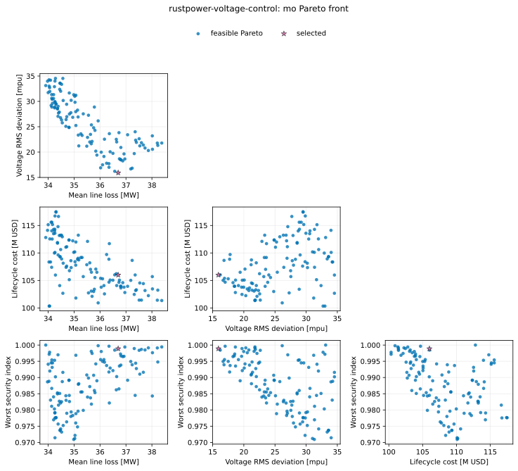
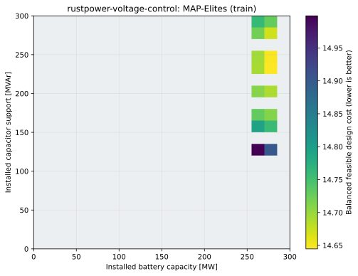
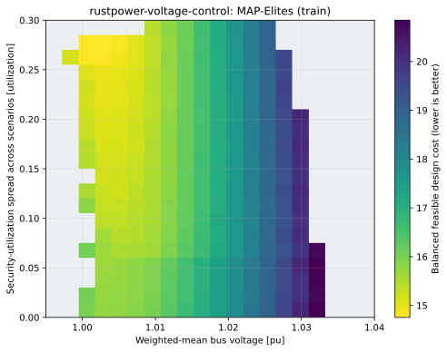
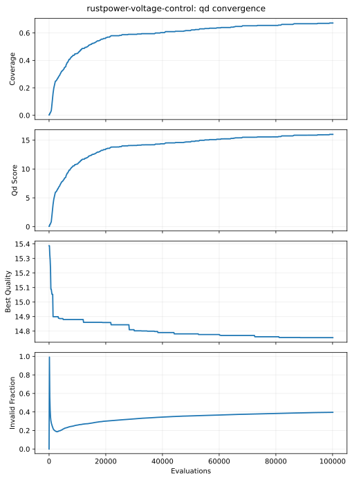

# RustPower robust voltage-control optimization

This standalone tutorial is part of the public `fcmaes-rust` repository. It
combines the native Rust constrained MODE implementation with
[RustPower 0.5.0](https://github.com/chengts95/rustpower), an MPL-2.0
steady-state electrical-network library.

The example uses RustPower's embedded IEEE-39 network and its pure-Rust RSparse
Newton–Raphson solver. It does **not** enable the optional KLU/SuiteSparse path,
so it needs no SuiteSparse installation or native solver configuration.
RustPower's unconditional ZIP dependency may still build bundled compression C
code through Cargo, so a normal platform C linker/compiler must be available.
The application code is MIT-licensed; RustPower and `bevy_archive` remain
subject to their own MPL-2.0 licenses.

```text
20 mixed continuous/discrete controls
    ↓
six deterministic operating and contingency scenarios
    ↓
RustPower AC power flow with explicit convergence auditing
    ↓
four objectives + three explicit feasibility constraints
    ↓
fcmaes constrained MODE
```


## Model

The controls are:

| Control | Count | Type | Bounds |
|---|---:|---|---|
| Generator voltage setpoints | 9 | continuous | 0.95–1.06 pu |
| Transformer tap offsets | 3 | integer | −4…+4 steps |
| Capacitor-bank locations | 2 | categorical | six candidate load buses |
| Capacitor-bank sizes | 2 | integer | 0…6 × 25 MVAr |
| Battery location | 1 | categorical | six candidate load buses |
| Battery power capacity | 1 | continuous | 0–300 MW |
| Renewable curtailment | 2 | continuous | 0–50% |

Battery energy capacity and chronological state of charge are outside a
steady-state power-flow model. Here “capacity” is the installed MW rating and
each scenario supplies a fixed charge/discharge policy. Capacitors use the
pandapower/RustPower sign convention: negative shunt Q is capacitive injection.

Every candidate is evaluated against the same named scenario set:

| Scenario | Load | Renewable availability | Battery dispatch | Network |
|---|---:|---:|---:|---|
| base | 100% | 65% | idle | intact |
| evening peak | 112% | 25% | 100% discharge | intact |
| high-renewable low-load | 90% | 90% | 100% charge | intact |
| hot peak | 120% | 45% | 80% discharge | intact |
| N−1 line 23 | 108% | 40% | 80% discharge | line 23 out |
| renewable trip | 105% | 0% | 80% discharge | intact |

The scenarios are deterministic. That makes every candidate comparison
repeatable and lets MODE spend its budget on design trade-offs rather than
sampling noise.

## Objectives and constraints

MODE independently minimizes:

1. scenario-weighted mean active line loss in MW;
2. scenario-weighted RMS bus-voltage deviation in milliper-unit;
3. lifecycle proxy cost in million USD;
4. worst security/violation index.

The cost combines capacitor and battery installation, tap-control wear and
curtailed-energy opportunity cost. It is an illustrative normalized engineering
model, not a vendor estimate.

The security index is the worst of voltage-band utilization, line-rating
utilization and a calibrated non-convergence severity. Values below one retain
margin; values above one violate an operating limit. The raw current ratings in
RustPower's embedded converted case are lower than the case's own reference
flow. This example therefore defines the planning rating as 1.6 times the
embedded value. The N−1 case alone permits a further 1.2 emergency multiplier.
Both factors are explicit constants rather than hidden objective penalties.

MODE also receives three constraints, all feasible at `<= 0`:

```text
g_voltage = worst(max(Vmin - V, V - Vmax))
g_thermal = worst(line loading / allowed loading - 1)
g_pf      = -1                              if every scenario converges
            failed fraction + clipped mismatch  otherwise
```

This is important for power-flow optimization. A failed Newton solve is not
converted into a magic objective such as `1e99`, which would distort objective
scales and Pareto dominance. Instead it is an explicit constraint with a
bounded mismatch component. The finite objectives still describe the last
iterate, but failed candidates cannot be feasible.

The printed `quality` is a higher-is-better reporting score, not a fifth MODE
objective:

```text
quality = 1 /
    ((1 + loss/60)
     (1 + voltage_mpu/30)
     (1 + cost_musd/50)
     (1 + security)
     (1 + 20 × summed_positive_constraint_violation))
```

The final factor prevents an infeasible low-cost design from looking better
than a feasible Pareto representative. MODE itself still sees the four
objectives and three constraints separately.

Transformer and line outages are discrete topology changes, while tap
positions and bank steps are integers. The resulting objective is nonsmooth
and is a natural gradient-free optimization problem.

The CLI also contains a MAP-Elites formulation. Its two descriptors are
*emergent behavior* coordinates measured from the six solved scenarios, not
decision variables:

| Axis | Descriptor | Bounds | Meaning |
|---:|---|---|---|
| 0 | Weighted-mean bus voltage | 0.995–1.040 pu | The voltage level the plan settles into. Operating high reduces current and losses but spends upper headroom; operating low keeps headroom for contingencies. |
| 1 | Security-utilization spread | 0.0–0.3 | Worst minus mildest scenario limit utilization. Small values are plans stressed almost equally by every condition; large values are plans comfortable in normal operation whose margin is set by one dominating scenario. |

Neither coordinate repeats an optimized objective. Mean voltage is not the RMS
deviation objective, which is symmetric about 1.0 pu and cannot tell a high
profile from a low one. The spread is not the worst-case security objective,
which records the level of the worst scenario rather than the gap between
normal and stressed operation. Because both require the full power-flow
campaign, the optimizer cannot place a candidate in a chosen niche without
actually producing that operating behavior.

Installed battery MW, installed capacitor MVAr and the bus identities are
exported as archive metadata. Bus identities are never treated as numbers with
a false Euclidean distance. Within each niche the formulation minimizes the
reciprocal of the reporting quality, and any positive voltage, thermal or
convergence constraint returns non-finite QD fitness and cannot occupy the
archive.

A uniform random archive does not bootstrap itself on this network, so the run
evaluates and counts one disclosed warm start: the documented seed-42 MODE
representative. Decision variables are normalized to `[0,1]` before variation
so a 0.01 mutation has comparable meaning for a generator setpoint and a 300 MW
battery variable. MODE remains the primary formulation; the recorded QD results
below explain what the archive adds and what it does not.

## Parallelism

RustPower's RSparse solve is serial in this build. fcmaes evaluates independent
candidates in parallel, and every worker creates an isolated network and solver
state. There is no nested thread pool and no oversubscription ambiguity.

Run a 24-worker optimization:

```bash
cd tutorials/rustpower-voltage-control
cargo run --release -- \
  --mode optimize --workers 24 \
  --evaluations 8192 --popsize 128 --seed 42
```

MODE rounds the requested budget up to a complete population. `--workers 0`
uses the available CPU count.

Run MODE and MAP-Elites in one invocation:

```bash
cargo run --release -- \
  --mode all --workers 24 \
  --evaluations 8192 --popsize 128 \
  --qd-evaluations 4096 --qd-capacity 400 \
  --qd-chunk-size 128 --seed 42
```

`all` writes MODE and QD artifacts into `results/mo` and `results/qd`. The
formulations remain separate; the QD scalar does not replace the four-objective
Pareto front.

Evaluate the reference design:

```bash
cargo run --release -- --mode simulate
```

Replay any result by copying its printed `MO_REPRESENTATIVE_X`:

```bash
cargo run --release -- --mode simulate --x V0,V1,...,V19
```

Measure objective throughput with the same fixed candidate set:

```bash
cargo run --release -- \
  --mode benchmark --workers 24 --benchmark-candidates 1024 --seed 42
```

Run `cargo run --release -- --help` for all options.

## Recorded 24-worker run

This deterministic run was recorded on 2026-07-24 on an AMD Ryzen 9 9950X:

```bash
cargo run --release -- \
  --mode optimize --workers 24 \
  --evaluations 8192 --popsize 128 --seed 42
```

| Design | Feasible | Mean line loss | Voltage RMS | Lifecycle cost | Worst security index |
|---|---|---:|---:|---:|---:|
| Unoptimized reference | no | 39.470 MW | 33.217 mpu | 0.000 M$ | 1.3836 |
| Selected Pareto point | yes | 36.700 MW | 15.926 mpu | 106.006 M$ | 0.9989 |

MODE completed 8,192 candidate evaluations, or 49,152 AC power flows, in
3.069 seconds (2,669 candidates/s). Feasible population members first appeared
by evaluation 2,560; the final 128-member population contained 120 feasible
nondominated points. Relative to the infeasible reference, the selected point
reduced mean line loss by 7.0% and voltage RMS deviation by 52.1%, while paying
for the storage, capacitors and curtailment required to satisfy every scenario.

Its mixed controls were:

```text
generator V pu =
  [1.017062, 1.009571, 0.989965, 1.015449, 1.011000,
   0.993151, 1.000223, 0.976330, 0.998678]
tap offsets       = [0, 1, -2]
capacitor buses   = [8, 8] in one-based IEEE numbering
capacitor steps   = [1, 6] × 25 MVAr
battery           = bus 15, 270.831 MW
curtailment       = [43.37%, 46.68%]
```

The limiting case was high-renewable/low-load at security index 0.9989; the
hot-peak case reached 0.9961 and the N−1 case 0.9798. Every solve converged.

The separate fixed-candidate throughput command:

```bash
cargo run --release -- \
  --mode benchmark --workers 24 --benchmark-candidates 1024 --seed 42
```

evaluated 1,024 candidates / 6,144 power flows in 0.157 seconds: 6,535
candidates/s and 39,208 power flows/s. The optimization rate is lower because
it includes MODE population updates, Pareto ranking and periodic progress
audits. These are single-seed, single-machine functional results, not optimizer
performance statistics.



## QD: a rejected descriptor choice and its replacement

### The rejected pilot: design variables as descriptors

The first QD attempt used **installed battery MW and installed capacitor MVAr**
as the two axes. The first unseeded 4,096-evaluation run found no feasible
design. After adding the counted warm start and normalized variation, the same
small pilot occupied 12/400 cells. A much larger run tested whether that was
merely an initialization transient:

```bash
cargo run --release -- \
  --mode qd --workers 24 \
  --qd-evaluations 100000 --qd-capacity 400 \
  --qd-chunk-size 128 --seed 42 \
  --output results/pilot/qd-100k
```

| Actual evaluations | Wall time | Occupied | Coverage | QD score | Best minimized quality | Infeasible |
|---:|---:|---:|---:|---:|---:|---:|
| 100,097 | 15.920 s | 16/400 | 4.0% | 1.085476 | 14.644767 | 54,755 |

There was no descriptor clipping, but battery capacity stayed within
269.874–274.198 MW and every elite used battery bus 14.

The `results/pilot/` artifacts are the original recordings and are kept as the
evidence for this decision. They were produced by the superseded descriptor
definition, so their `run.json` and `qd_archive.csv` carry the old
`descriptor_battery_capacity_mw` / `descriptor_capacitor_mvar` columns. Both
files remain self-describing and still render, but re-running the command above
against the current code reproduces the *replacement* formulation below, not
this table.



The diagnosis is a descriptor error, not a budget or tuning problem. Both axes
were **decision variables**: the optimizer sets battery MW and capacitor steps
directly, so the archive re-plotted part of its own search box instead of
illuminating distinct behavior. Worse, feasibility across all six scenarios
demands a specific amount of storage and reactive support, so the reachable and
feasible part of that input space is a thin band. No budget can fill cells that
the feasible set does not reach.

### The replacement: emergent behavior descriptors

Replacing the two axes with the emergent coordinates documented above — solved
mean bus voltage and security-utilization spread — keeps every other part of
the formulation identical: the same model, budget, capacity, warm start, strict
feasibility rule and quality definition. Only the descriptors changed. Three
seeds at the same 100,097-evaluation budget:

```bash
for seed in 42 43 44; do
  cargo run --release -- \
    --mode qd --workers 24 \
    --qd-evaluations 100000 --qd-capacity 400 \
    --qd-chunk-size 128 --seed "$seed" \
    --output "results/publication/qd-seed-$seed"
done
```

| Metric | Mean | Sample standard deviation |
|---|---:|---:|
| Wall time | 16.054264 s | 0.054809 s |
| Occupied niches | 272.000 | 10.817 |
| Coverage | 68.000% | 2.704 percentage points |
| QD score | 16.259571 | 0.676009 |
| Best minimized quality | 14.757715 | 0.014069 |
| Infeasible evaluations | 39,945.000 | 285.349 |
| Clipped descriptors | 0.000 | 0.000 |

Coverage rose from 4.0% to 68.0%, a seventeenfold increase, with no descriptor
clipping on any seed. Per-seed statistics are in
[`results/publication/qd-summary.csv`](results/publication/qd-summary.csv).

The descriptor bounds were frozen from a recorded range pilot rather than
guessed from the decision bounds. Sampling 40,960 candidates produced 30,679
feasible designs spanning 0.998–1.036 pu mean voltage and 0.000–0.294
utilization spread; the frozen 0.995–1.040 pu × 0.0–0.3 rectangle covers that
observed range with a small margin. Occupied niches stay well inside it, so
coverage is not an artifact of bounds drawn tightly around one seed.





### What the archive does and does not show

The archive is now a genuine **operating-strategy repertoire**. Across the
seed-42 elites the minimized quality ranges 14.755–20.846, mean line loss
34.058–37.113 MW, voltage RMS deviation 14.505–36.003 mpu and lifecycle cost
99.981–105.495 M$. A planner can read off the best feasible design for a chosen
voltage level and stress profile, which the single MODE representative does not
provide.

It is **not** an architecture repertoire, and this survives the descriptor fix:
all 269 seed-42 elites still install the battery at bus 14, 264 of 269 place the
first capacitor bank at bus 7, and battery capacity stays within
266.643–273.738 MW. Seeds 43 and 44 agree. What varies across niches is the
control settings — tap offsets, generator setpoints and curtailment — not the
asset siting and sizing.

That near-unique architecture was the rejected pilot's one durable finding, and
it is now confirmed independently of the descriptor choice instead of being
confounded with it. MODE remains the primary formulation because the four
competing objectives are the decision the tutorial is really about; QD is
reported alongside it, no longer as a rejected pilot.

## Output

MODE writes:

- `pareto.csv`: feasible nondominated controls and objectives;
- `scenarios.csv`: reference and selected-design scenario audit;
- `convergence.csv`: periodic population statistics;
- `report.html`: self-contained Pareto plot and selected scenario table;
- `run.json`: schema-v1 provenance and artifact references.

QD output replaces `pareto.csv` with `qd_archive.csv` and
`representatives.csv`. Regenerate all checked-in figures from the common
Python analysis layer:

```bash
cd ../python
python render_all.py --write
python render_all.py --check
```

Use `--no-output` for timing-only runs. The common columns and minimization
conventions are defined in [`../RESULT_SCHEMA.md`](../RESULT_SCHEMA.md).

## Scope

This is a simulation-optimization demonstration, not an optimal-power-flow or
operational planning package. The generator active-power schedule is fixed
apart from the slack balance; PV reactive output is not constrained; battery
dispatch factors are prescribed; only line, voltage and convergence constraints
are audited; and transformer thermal loading, N−1 generator outages,
short-circuit duty, protection, dynamics, stability, market dispatch and
chronological storage state are omitted.

Before engineering use, replace the illustrative costs and scenario set, model
all relevant discrete installation rules, enforce generator reactive-power
limits, add the missing equipment and contingency constraints, repeat multiple
optimizer seeds, and validate Pareto finalists with an independent
production-grade power-flow tool.

## Test

```bash
cargo test
cargo clippy --all-targets -- -D warnings
cargo run --release -- --mode simulate --no-output
```

The tests cover network loading, scenario evaluation, mixed-variable decoding,
cost behavior, strict QD feasibility and descriptor semantics, a tiny MODE
integration run, CLI validation and report scaling.
