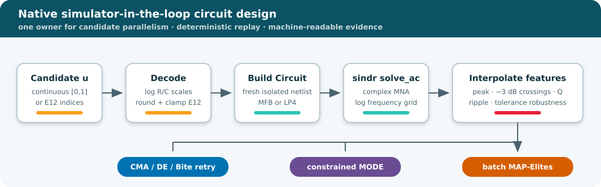
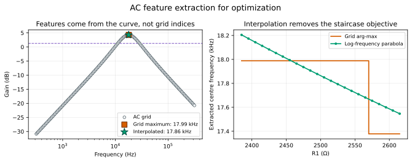
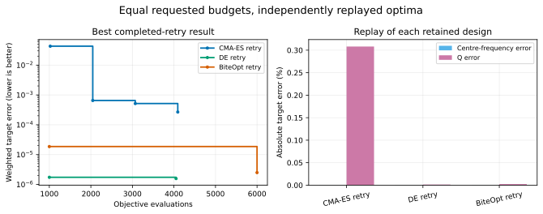
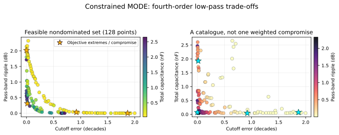
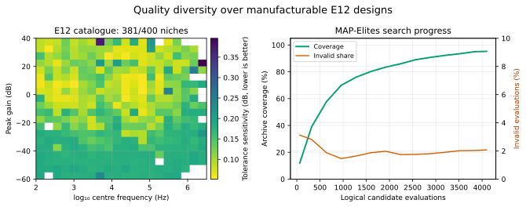
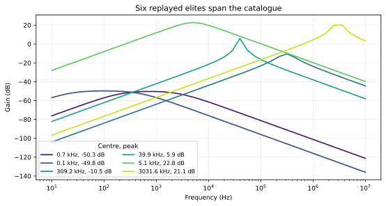

# Circuit design optimization with `fcmaes-core` and `sindr`

This standalone Rust tutorial puts a small-signal circuit simulator directly
inside single-objective, multi-objective, and quality-diversity optimizers. It
uses [`sindr 0.1.0-alpha.6`](https://docs.rs/sindr/0.1.0-alpha.6/sindr/) for AC
modified-nodal analysis and
[`fcmaes-core 0.1.3`](https://docs.rs/fcmaes-core/0.1.3/fcmaes_core/) for native
parallel search.

The example is about optimization architecture and objective design, not
production analog sign-off. Every evaluation follows the same auditable path:



The hot path has no Python callback. Python reads the recorded CSV files only
to create the documentation figures.

## Why this is a gradient-free problem

The controls span several decades, E12 controls are discrete, and the desired
outputs are features of a sampled Bode curve: its peak, two threshold
crossings, bandwidth, Q, and ripple. Those operations make a conventional
end-to-end derivative unavailable even though each circuit solve is linear.
The three formulations answer different design questions:

| Module | Circuit | Result needed | Optimizer |
|---|---|---|---|
| SO | 5-variable multiple-feedback band-pass | one filter near 10 kHz, Q=5 | parallel retry with CMA-ES, DE, and BiteOpt |
| MO | 8-variable fourth-order low-pass | a cutoff/ripple/area trade-off set | constrained MODE |
| QD | discrete E12 band-pass catalogue | one robust filter per frequency/gain niche | batch MAP-Elites |

Resistors and capacitors are decoded logarithmically. Rebuilding the short
`sindr::Circuit` for every candidate keeps worker state isolated and is small
relative to the AC sweep.

## Smooth feature extraction

Choosing the grid point with the largest gain produces a staircase objective.
Changing a component can move the real response while the winning grid index
stays fixed. More samples make the steps narrower but do not remove them.

The implementation fits a three-point parabola in log-frequency around the
sampled maximum and linearly interpolates the two −3 dB crossings in
`(log(f), dB)`. The checked-in regression experiment varies R1 over 24 values:
even the 201-point publication-grid arg-max has only **two** distinct centre
frequencies, while the interpolated feature has **24**.

Smoothness and numerical accuracy are separate requirements. A 41-point grid
made the interpolated centre frequency smooth but biased Q by about 14% because
its linearly interpolated bandwidth crossings were too widely spaced. The SO
publication grid is therefore 201 points. A regression test compares both
centre frequency and Q against an 801-point reference, with relative limits of
0.1% and 0.5% respectively.



This is more important than optimizer tuning: an optimizer can explore a
smooth approximation of the physical response instead of quantization
artifacts created by the measurement code.

## Module 1: one tuned MFB band-pass

The decision vector `u ∈ [0,1]⁵` decodes to three resistors in
`[100 Ω, 100 kΩ]` and two capacitors in `[10 pF, 1 µF]`:

```text
value = lower × (upper / lower)^u
```

The minimized scalar is dimensionless:

```text
|log10(f0 / 10 kHz)|
  + 0.2 |log10(Q / 5)|
  + max(0, 1 - linear_peak_gain)
```

Each optimizer receives a requested budget of 6,000 evaluations split over six
parallel retries. Population-based optimizers may complete a population beyond
that request, so the manifest records both requested and actual work.

| Optimizer | Actual evaluations | Best objective | Centre | Q | Wall time |
|---|---:|---:|---:|---:|---:|
| CMA-ES retry | 6,138 | 2.675×10⁻⁴ | 10,000.01 Hz | 5.0154 | 0.377 s |
| DE retry | 6,127 | 1.577×10⁻⁶ | 9,999.99 Hz | 5.0001 | 0.380 s |
| BiteOpt retry | 6,000 | 2.501×10⁻⁶ | 10,000.01 Hz | 5.0001 | 0.359 s |

These are independent arms with equal requested budgets, not sequential
polishing stages. The reported values are replayed from each retained design.
The peak-gain penalty is inactive at these three high-gain winners, but remains
part of the search objective so an attenuating response cannot win merely by
matching frequency and Q.



## Module 2: a constrained low-pass trade-off set

Two buffered second-order sections form a fourth-order low-pass with four
resistors and four capacitors. MODE minimizes three independent values:

1. `|log10(f−3dB / 100 kHz)|`;
2. pass-band ripple through 80 kHz in dB;
3. total capacitance in nF as an area/cost proxy.

The ripple measurement includes an interpolated sample at exactly 80 kHz and
parabolically interpolates an interior pass-band extremum. The 201-point MO
publication grid is tested against an 801-point reference for both cutoff and
ripple; the relative cutoff limit is 0.1% and the absolute ripple limit is
0.01 dB.

The explicit quality constraint is feasible at `<= 0`:

```text
peak_above_low_frequency_gain - 3 dB <= 0
```

The seed-42 publication run completed 8,192 evaluations and retained 128
feasible nondominated designs in 0.335 s. Pairwise Spearman correlations on
that recorded front are −0.856 for cutoff error versus ripple, −0.433 for
cutoff error versus capacitance, and +0.027 for ripple versus capacitance.
Those values describe the observed trade-offs; they were not used as
acceptance thresholds.

The constraint is not decorative: only 101 of the initial 128 population
members were feasible. The full population was feasible by the next recorded
checkpoint, and the final front's least-slack point remained 1.127 dB inside
the 3 dB limit.



The stars identify objective extremes and a scale-documented compromise. They
are examples for inspection, not an extra preference hidden inside MODE.

## Module 3: a robust E12 filter catalogue

This module deliberately extends continuous circuit tuning into
manufacturability. Each coordinate is rounded and clamped to an index in an
inclusive E12 table:

| Component class | Range | Choices |
|---|---:|---:|
| resistor | 100 Ω–100 kΩ | 37 |
| capacitor | 10 pF–1 µF | 61 |

Endpoint inclusion is why these counts are not simply “decades × 12.”
MAP-Elites itself has no integer-mask argument, so discreteness belongs in the
decoder. The archive stores the rounded indices and physical values needed to
rebuild every elite.

The descriptors are observable behavior, not decision variables:

- `log10(f0 / Hz)` from 2.0 to 6.5 (100 Hz–3.16 MHz);
- peak gain from −60 to +40 dB.

Before optimization, the publication command samples 1,000 catalogue
coordinates. Of those, 898 have an interior peak with both −3 dB crossings.
That range study is exported in `range_study.csv`; it froze the rounded bounds
above. During optimization, 189 otherwise valid responses outside the frozen
box are counted and rejected rather than silently accumulated in boundary
cells.

Quality is the population standard deviation of centre-frequency movement
over 16 independent ±5% perturbations:

```text
stddev(20 log10(f0,perturbed / f0,nominal))
```

One perturbation table is generated from the experiment seed and reused for
every candidate. These common random numbers make repeated evaluations
identical and prevent a design from winning because it received a lucky
tolerance sample.

The 4,096-candidate search used 68,416 AC solves; the preceding range study
used another 1,000, for **69,416 exact solves** in the complete QD protocol.
It filled **381 of 400 niches (95.2%)** in 2.757 s for the optimization phase;
85 candidates had no valid band-pass features. The run manifest reports
candidate calls, both solve counts, invalid responses, out-of-range
descriptors, distinct decoded elites, and the frozen 20×20 grid.



An archive is useful because it returns a repertoire rather than one optimum.
The six marked elites below are replayed directly from their recorded E12
component indices:



## Parallelism and reproducibility

`fcmaes-core` owns candidate-level parallelism. A `sindr` AC sweep is serial,
and every worker builds an isolated circuit. This avoids a nested thread pool
and gives `--workers` one clear meaning. `--workers 0` uses the available
logical CPUs.

The publication evidence was recorded on 2026-07-27 on an AMD Ryzen 9 9950X
(16 cores, 32 hardware threads) with:

```bash
cd tutorials/sindr-circuit-design
cargo run --release -- \
  --preset publication --mode all --workers 16 --seed 42 \
  --output results/publication
```

The three optimizer arms in the SO manifest ran concurrently only within each
arm; their displayed wall times should not be added to MO/QD and interpreted as
a cross-machine benchmark. Timings are reproducibility checks for this code and
machine, not performance claims about other circuit simulators.

For a bounded functional check:

```bash
cargo run --release -- \
  --preset smoke --mode all --workers 2 --seed 42 --no-output
```

Run `cargo run --release -- --help` for individual modules, optimizer arms,
budgets, frequency-grid size, Monte Carlo draws, and archive settings.
The converged SO and MO studies use 201 AC points; the independently checked
QD descriptors retain 41 points. `--points` deliberately overrides all three
when investigating grid sensitivity.

## Artifacts and figures

The publication bundle follows
[`RESULT_SCHEMA.md`](../RESULT_SCHEMA.md). All objectives are minimized and
constraints are feasible at `<= 0`.

```text
results/publication/
  so/{run.json,best.csv,convergence.csv,feature_curve.csv,feature_smoothness.csv}
  mo/{run.json,pareto.csv,convergence.csv}
  qd/{run.json,range_study.csv,archive.csv,elites.csv,convergence.csv}
```

Native Rust writes full-precision JSON/CSV. The architecture diagram is a
semantic SVG; every result plot is generated from the files above:

```bash
python plot_results.py --write
python plot_results.py --check
```

The repository-wide `tutorials/python/render_all.py --check` command calls the
same tutorial-local renderer and compares every generated SVG byte for byte.
That repository-wide comparison requires the Matplotlib version pinned in
`tutorials/python/requirements-lock.txt`; use the tutorial-local check when
working outside that environment.

## Scope and simulator limitations

The dependency is pinned exactly because `sindr` is an alpha release. This
tutorial relies on its documented AC analysis plus two implementation details
of `0.1.0-alpha.6`:

- the op-amp is a high-gain linear VCVS; its rail fields do not model AC
  clipping or supply current;
- AC analysis first obtains a DC operating point and then solves the
  linearized complex system at each frequency.

The exact crates.io `fcmaes-core = "=0.1.3"` dependency is also deliberate:
the recorded tutorial validates the published optimizer/simulator pairing.
The manifest retains a commented local-path override for testing changes to the
working-tree optimizer core before updating that pin.

Consequently, the objectives do not claim saturation, headroom, slew rate,
power consumption, nonlinear distortion, or production parasitics. Transient
amplifier and switching problems were considered and intentionally excluded:
the current transient interface does not provide the timestep and periodic
steady-state control those objectives require. Temperature sweeps were also
excluded because this RC catalogue specifies component tolerance, not junction
temperature behavior.

The separate
[`thevenin` gate-driver tutorial](../thevenin-gate-driver/README.md) follows
that transient question without changing this tutorial's simulator or
small-signal scope. It adds explicit timestep convergence and an independent
49-design ngspice validation gate before publishing an optimization result.

If a later `sindr` version changes these contracts, rerun the feature tests,
range study, and publication protocol before updating the exact version pin.

## Test

```bash
cargo fmt --all -- --check
cargo clippy --all-targets -- -D warnings
cargo test
cargo run --release -- \
  --preset smoke --mode all --workers 2 --seed 42 --no-output
python plot_results.py --check
```

The unit tests cover decoding, exact E12 endpoints, analytic RC cutoff,
interpolation smoothness, 201-to-801-point Q and ripple convergence, endpoint
safety, deterministic common tolerance draws, range-study validity, and
replayable SO, MODE, and QD smoke searches.
