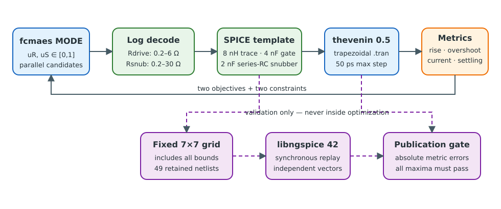
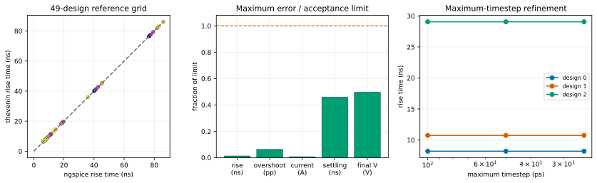
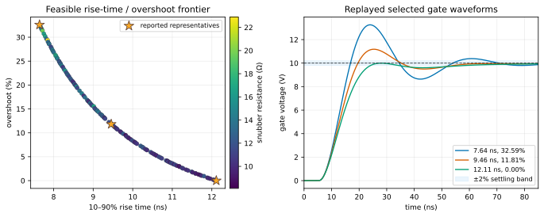
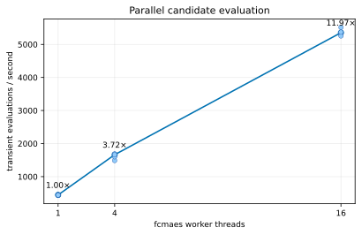

# Transient gate-driver optimization with `fcmaes-core` and `thevenin`

This standalone Rust tutorial optimizes a nanosecond-scale gate-input network
without putting Python or a foreign-function call inside the objective. It uses
[`thevenin 0.5.0`](https://docs.rs/thevenin/0.5.0/thevenin/) for transient
simulation and
[`fcmaes-core 0.1.3`](https://docs.rs/fcmaes-core/0.1.3/fcmaes_core/) for
parallel constrained multi-objective search.

It is deliberately separate from the
[`sindr` AC circuit-design tutorial](../sindr-circuit-design/README.md).
`sindr` supplies the fast small-signal filter model used there; `thevenin`
supplies explicit transient duration, timestep, and trapezoidal integration
needed here.



## The model

The example is a lumped MOSFET gate-input network, not a complete switching
converter:

```text
10 V pulse ─ Rdrive ─ 8 nH trace ─┬─ gate = 4 nF ─ ground
                                  ├─ Rsnub ─ 2 nF ─ ground
                                  └─ Rleak = 1 MΩ ─ ground
```

The series-RC branch damps the trace/gate resonance but loads the rising edge.
MODE searches two normalized controls, each decoded logarithmically:

| Control | Physical range | Role |
|---|---:|---|
| driver/gate resistance | 0.2–6 Ω | limits current and damps ringing |
| snubber resistance | 0.2–30 Ω | controls how strongly the fixed 2 nF snubber acts |

The shared [`gate-driver.cir`](netlists/gate-driver.cir) is the single source
for both simulators. Its 0–10 V pulse begins at 5 ns with a 1 ns edge. Every
publication evaluation uses trapezoidal integration, a 50 ps maximum timestep,
and a 120 ns observation window.

This topology is intentionally small enough that the optimization and the
independent validation are auditable. It represents an effective gate
capacitance and interconnect resonance. It does not represent nonlinear
capacitance, Miller charge, drain switching, magnetic coupling, temperature,
or semiconductor loss.

The exact crates.io `fcmaes-core = "=0.1.3"` pin deliberately validates the
published optimizer/simulator pairing. The manifest retains a commented
local-path override for testing working-tree optimizer changes before updating
the recorded pin.

## Objectives and constraints

All values passed to MODE are minimized. The two objectives are:

1. interpolated 10–90% gate rise time in ns;
2. overshoot above 10 V as a percentage of 10 V.

The two constraints are feasible at `<= 0`:

```text
peak driver current - 5 A <= 0
2% settling time - 75 ns <= 0
```

The current is reconstructed from `(Vdrive - Vtrace) / Rdrive`. The 10% and
90% crossing times are linearly interpolated between adjacent transient
samples. Settling is the final sample outside 9.8–10.2 V; a waveform still
outside the band at 120 ns therefore receives the maximum recorded settling
time and is infeasible.

This measurement layer matters as much as the simulator. Using a grid index
for a crossing would create the same staircase objective that the companion
AC tutorial removes from peak-frequency extraction.

## Validation before optimization

The tutorial was admitted only after two numerical gates passed.

### Independent ngspice comparison

The fixed validation set is the Cartesian product of seven inclusive values
for each normalized control: **49 designs including every bound**. Rust writes
their decoded values and `thevenin` measurements. The independent
[`ngspice_reference.py`](validation/ngspice_reference.py) harness loads
`libngspice` directly, replays the identical template synchronously, and
extracts separate transient vectors. It is never called by MODE.

| Absolute difference | Maximum over 49 designs | Acceptance limit |
|---|---:|---:|
| rise time | 0.000130 ns | 0.01 ns |
| overshoot | 0.000628 percentage points | 0.01 pp |
| peak current | 0.0000747 A | 0.01 A |
| settling time | 0.0459 ns | 0.1 ns |
| final sampled voltage | 0.00497 V | 0.01 V |

Every maximum passes. The checked
[`summary.json`](results/publication/validation/summary.json) contains the
unrounded medians, 95th percentiles, maxima, limits, and pass status.

### Timestep refinement

Three designs—strongly ringing, intermediate, and heavily damped—were replayed
at maximum timesteps of 100, 50, and 25 ps. Comparing the publication 50 ps
setting with 25 ps gives these worst differences:

| Metric | Maximum difference | Test limit |
|---|---:|---:|
| rise time | 0.0000774 ns | 0.01 ns |
| overshoot | 0.000126 pp | 0.01 pp |
| peak current | 0.0000162 A | 0.01 A |
| settling time | 0.0125 ns | 0.1 ns |
| final sampled voltage | 0.00651 V | 0.01 V |



## MODE result

The seed-42 publication run used 4,096 candidate evaluations, population 128,
and 16 candidate workers. It completed in **1.151 s** on the recorded Ryzen 9
9950X machine and retained 128 feasible nondominated designs. In this smooth
two-objective problem the final population resolves one continuous trade-off
curve, so a fully nondominated population is expected.

The plot marks the two objective extremes and a compromise selected by the sum
of independently range-normalized objectives:

| Representative | Rise time | Overshoot | Rdrive | Rsnub | Peak current | Settling |
|---|---:|---:|---:|---:|---:|---:|
| fastest | 7.644 ns | 32.594% | 0.754 Ω | 15.647 Ω | 4.986 A | 61.675 ns |
| compromise | 9.456 ns | 11.812% | 1.204 Ω | 11.226 Ω | 4.200 A | 49.225 ns |
| no overshoot | 12.113 ns | 0% | 1.620 Ω | 10.079 Ω | 3.650 A | 53.425 ns |



## Parallel candidate evaluation

The fixed 512-design benchmark was repeated five times at each width. All
7,680 transient evaluations succeeded:

| Workers | Median evaluations/s | Speedup |
|---:|---:|---:|
| 1 | 447.2 | 1.00× |
| 4 | 1,663.8 | 3.72× |
| 16 | 5,354.4 | 11.97× |

`thevenin` transient evaluation is serial for each small circuit; `fcmaes-core`
owns parallelism across independent candidates.



## Reproduce

The pure-Rust optimization, timestep study, grid, and scaling experiment need
only Cargo:

```bash
cargo run --release -- \
  --mode all --preset publication --workers 16
```

The independent reference step additionally needs the ngspice shared library.
On Debian or Ubuntu:

```bash
sudo apt install libngspice0 libngspice0-dev
python validation/ngspice_reference.py \
  --candidates results/publication/validation/candidates.csv \
  --output results/publication/validation/ngspice.csv
python validation/compare_results.py
python plot_results.py --write
python plot_results.py --check
```

The exact recorded environment is in
[`environment.json`](results/publication/environment.json). Dependency
licensing provenance is documented separately in
[`DEPENDENCY_NOTICE.md`](DEPENDENCY_NOTICE.md).

## Artifacts

```text
results/publication/
  environment.json
  mo/{run.json,pareto.csv,convergence.csv,waveforms.csv}
  validation/
    {candidates.csv,thevenin.csv,ngspice.csv,comparison.csv,summary.json}
    {timestep.csv,scaling.csv}
```

Native Rust writes the optimizer, waveform, timestep, and scaling evidence.
The ngspice harness writes its independent raw measurements. The comparison
script writes the versioned publication decision, and `plot_results.py` checks
the complete bundle before rendering deterministic SVGs.

## Test

```bash
cargo fmt --all -- --check
cargo clippy --all-targets -- -D warnings
cargo test --release
cargo doc --no-deps
cargo run --release -- \
  --mode all --preset smoke --workers 2 --no-output
python -m py_compile validation/*.py plot_results.py
python plot_results.py --check
```

The Rust tests cover exact decoding bounds, interpolated crossings, finite
transient replay, constrained MODE smoke search, and the 50-to-25 ps
convergence gates. The Python checks enforce the independent 49-design
comparison and byte-for-byte figure reproduction.
