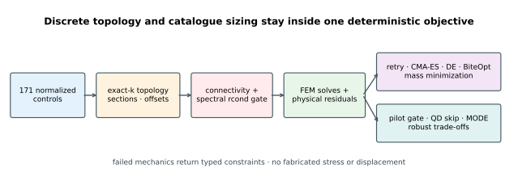
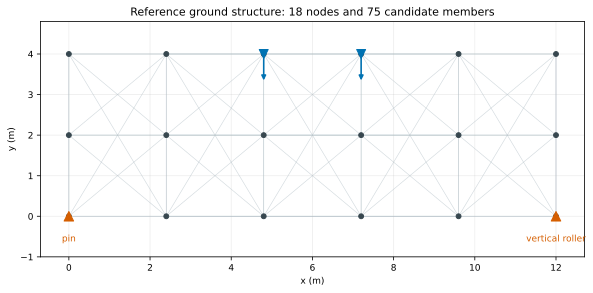
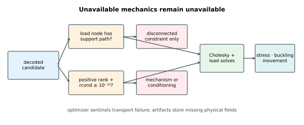
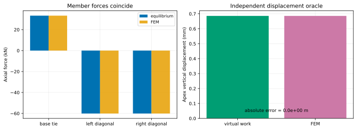
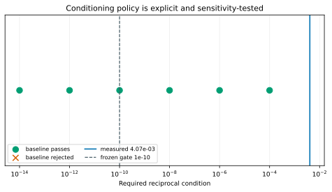
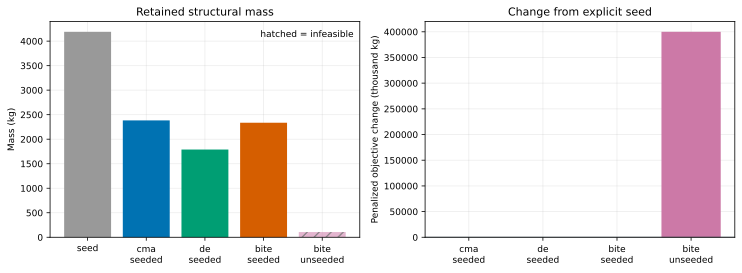
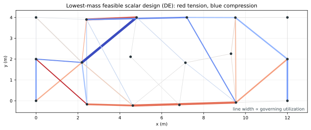
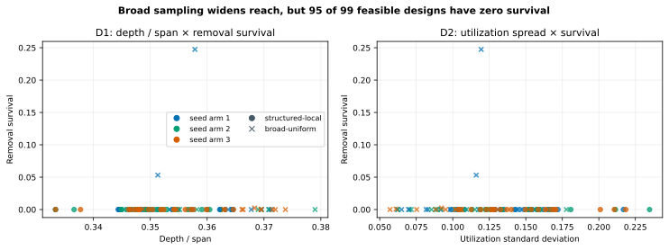
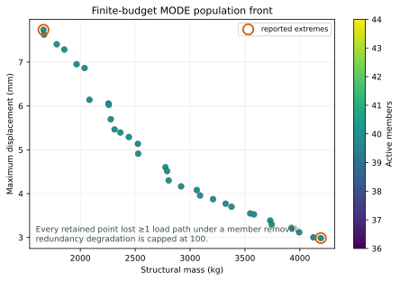

# Truss topology and catalogue-section sizing

This is an educational linear-elastic, pin-jointed 2-D truss model. It is not
a code-compliant structural design, does not replace connection, fatigue,
imperfection, second-order, fire, durability, fabrication, or foundation
checks, and must not be used for construction.

Within that boundary, the tutorial tackles a genuinely awkward global-search
problem: choose a sparse subset of a ground structure, assign a real circular
hollow section to every retained member, move selected nodes, reject
mechanisms without inventing response data, and compare mass, displacement,
and single-member-removal behavior.

The publication run found:

- a feasible `1,789.319 kg` scalar design with differential evolution, down
  `57.30%` from the explicit `4,190.377 kg` triangulated seed;
- a three-bar equilibrium/virtual-work oracle agreeing with the FEM to
  `7.28e-12 N` in force and exactly at stored precision in displacement;
- a descriptor-pilot **rejection**—only `99 / 384` mixed-generator candidates
  were feasible, 95.96% of feasible designs had zero removal survival, and
  neither emergent descriptor pair approached the frozen 40% minimum per-arm
  coverage gate; and
- 32 feasible nondominated population representatives from constrained MODE,
  spanning `1,664.421–4,191.366 kg` and `2.987–7.737 mm`, while every retained
  point still lost at least one load path under single-member removal.

That last pair of results matters. The finite optimization found light,
serviceable intact trusses; it did not demonstrate structural robustness.



## Frozen reference problem

The deterministic `6 × 3` lattice has 18 nodes over a 12 m span. Every node
pair no more than 5 m apart creates one candidate, yielding 75 possible
members. The left support is pinned, the right support is a vertical roller,
and two interior upper nodes carry the service loads.



Two simultaneous load cases are optimized:

| Case | Load at each of the two service nodes |
|---|---|
| vertical service | `Fx = 0`, `Fy = −180 kN` |
| combined service | `Fx = +45 kN`, `Fy = −135 kN` |

The holdout changes kind rather than merely changing a random seed: both load
components are multiplied by 1.10, Young's modulus is reduced by 10%, and the
roller settles by 5 mm. It is used by the descriptor pilot, never by scalar or
MODE selection.

Twelve nominal CHS sizes form the section catalogue. The designations and
dimensions are representative of the EN 10210 family, while area, second
moment of area, radius of gyration, and mass are recomputed from ideal circular
geometry in Rust. [`sections.csv`](sections.csv) is the checked-in numerical
contract and [`PROVENANCE.md`](PROVENANCE.md) states what is sourced, computed,
and merely illustrative.

## Mixed discrete and continuous decoding

For `M = 75` candidate members and `N = 10` movable nodes, the normalized
decision vector has

```text
1 + M topology ranks + M section keys + 2N offsets = 171 coordinates.
```

The first coordinate selects an exact cardinality `k ∈ [8, 40]`. The `k`
smallest topology ranks become active, with member index resolving ties.
Every active member's section key maps through 12 equal-width bins. Ten
non-support, non-load nodes may move by at most `±0.36 m` horizontally and
`±0.30 m` vertically.

This decoder keeps continuous optimizers in a simple box while enforcing exact
member count and valid catalogue indices by construction. Tests cover both
endpoints, equal bin occupancy, non-finite rejection, tie order, exact
cardinality, and fixed load-node geometry.

## Structural analysis and its failure contract

Each active bar contributes the standard 2-D axial stiffness

```text
(EA/L) [ c²   cs  −c²  −cs
         cs   s²  −cs  −s²
        −c²  −cs   c²   cs
        −cs  −s²   cs   s² ].
```

After the three support degrees of freedom are removed, the reference problem
has a 33 × 33 reduced stiffness matrix. A symmetric eigensolve establishes:

- numerical rank with
  `tol = n · ε · max(λmax, 1)`;
- positive definiteness; and
- spectral reciprocal condition `rcond = λmin / λmax ≥ 1e-10`.

Only then does Cholesky solve the load cases. Physical output includes axial
stress, Euler-buckling utilization for compressive bars, displacement,
compliance, and per-member governing utilization. Prescribed settlement uses
the partitioned right-hand side `Ff − Kfc uc`.

Disconnected, singular, ill-conditioned, and solve failures are typed. Stress,
buckling, and displacement remain absent after such a failure. Finite
sentinels exist only to transport constraints through optimizers; they are not
published as fictitious physics.



## Validation before optimization

The independent oracle is a symmetric three-bar triangle with half-span 2 m,
height 3 m, and a 100 kN apex load. Joint equilibrium gives

```text
diagonal force = −P sqrt(a² + h²) / (2h)
base tie force = Pa / (2h).
```

The apex displacement is derived separately by unit-load virtual work,
`δ = Σ Nₑ nₑ Lₑ / (EAₑ)`. The numerical evidence is:

| Quantity | Closed form | FEM | Absolute error |
|---|---:|---:|---:|
| base tie | 33.333333 kN | 33.333333 kN | `7.28e-12 N` |
| either diagonal | −60.092521 kN | −60.092521 kN | `7.28e-12 N` |
| apex displacement | 0.686077 mm | 0.686077 mm | `0 m` at stored precision |

The bit-exact displacement row is expected: the equilibrium/virtual-work path
uses analytic forces and lengths, and its result rounds to the same `f64` as
the FEM solve. Independence is visible in the force rows, whose separately
derived values differ by `7.28e-12 N`; the zero is not evidence that the two
displacement paths share an implementation.

An additional invariant applies the same vertical settlement to both supports:
the triangle translates rigidly and develops no member force.



The conditioning threshold is a declared modeling policy, not a hidden solver
side effect. The triangulated reference has `rcond = 4.07e-3`; the checked-in
sweep shows which stricter thresholds would alter its classification.



## Equal-budget scalar comparison

The scalar objective minimizes mass plus squared penalties for positive
constraint residuals. A deterministic 40-member triangulated design with the
largest section is the explicit baseline. CMA-ES, differential evolution, and
BiteOpt start near that construction; a fourth BiteOpt arm starts uniformly
to expose the cost of omitting structural seeding.

Each arm requested 2,048 objective calls over eight retries. Population
completion explains the small actual-call overshoot:

| Arm | Actual calls | Feasible | Retained mass | Change from seed |
|---|---:|---:|---:|---:|
| explicit seed | not charged | yes | 4,190.377 kg | 0 |
| CMA-ES, seeded | 2,232 | yes | 2,383.391 kg | −1,806.986 kg |
| DE, seeded | 2,168 | yes | **1,789.319 kg** | **−2,401.058 kg** |
| BiteOpt, seeded | 2,048 | yes | 2,336.105 kg | −1,854.272 kg |
| BiteOpt, uniform starts | 2,048 | **no** | 106.933 kg | penalty-dominated |

The infeasible uniform result is retained as evidence rather than silently
discarded. Its low physical mass does not make it a structure. In
[`arms.csv`](results/publication/so/arms.csv), `metrics_available=0` means the
typed connectivity or stiffness failure deliberately stopped analysis; `NaN`
in `rcond`, stress, buckling, and displacement is therefore “not computed,”
not missing successful-analysis data.



The lowest-mass feasible scalar design has 36 members, maximum stress
utilization `0.9041`, buckling utilization `0.7132`, maximum displacement
`14.428 mm`, and `rcond = 1.13e-3`.



## Removal robustness and the descriptor gate

For every active member, the expensive robustness pass removes that member and
re-solves every load case. If all removals survive,

```text
degradation = worst removal compliance / intact compliance − 1
survival    = intact compliance / worst removal compliance.
```

Any failed removal maps to a capped optimizer degradation of 100 and survival
zero, while the number of failed removals remains explicit.

The pre-registered pilot considered:

- D1: depth/span × removal survival;
- D2: member-utilization spread × removal survival; and
- D3: active count × mass as a decision-led negative control.

It used the same derived `12 × 10` geometry as a potential 120-cell archive,
three deterministic seed arms, and the kind-changing settlement holdout.

The first protocol used only local perturbations of the 40-member baseline and
a `[0, 1]` survival bound. Review correctly showed that this could not separate
a weak descriptor from a narrow generator. Protocol revision 2 therefore
freezes a mixed generator—75% structured-local candidates and 25% broad
candidates with uniform topology ranks and node offsets, maximum cardinality,
and conservative catalogue sections. It also scales both survival axes to
`[0, 0.30]` and D2 utilization spread to `[0, 0.30]`. This is a declared
post-v1 diagnostic revision, not an independent confirmation of a new
acceptance claim.

The broad component produced `38 / 96` feasible observations, while the local
component produced `61 / 288`. It widened reachable depth/span to
`0.3333–0.3790` and survival to `0–0.2474`, so the revised sample really did
leave the baseline neighborhood. The rejection nevertheless became more
diagnostic: 95 of 99 feasible designs still had exactly zero survival.

| Pair | Reachable range | Lower clipping | Spearman ρ | Minimum arm coverage | Holdout same-niche retention | Passed |
|---|---|---:|---:|---:|---:|---:|
| D1 depth × survival | `[0.3333, 0]–[0.3790, 0.2474]` | `[0%, 95.96%]` | 0.044 | 5.00% | 98.99% | no |
| D2 utilization spread × survival | `[0.0570, 0]–[0.2347, 0.2474]` | `[0%, 95.96%]` | −0.171 | 5.00% | 53.54% | no |
| D3 count × mass control | `[36, 2149.5]–[40, 5120.8]` | `[0%, 0%]` | 0.452 | 3.33% | 100.00% | no |

The gate requires `|ρ| < 0.7`, less than 10% clipping on each axis, minimum
per-arm coverage above 40%, and both normal and coarse holdout niche retention
above 60%. D1 and D2 fail both lower clipping and coverage; D2 also fails
holdout retention. The QD run is therefore represented by a schema-valid
skipped manifest with `actual_evaluations: null` and no stale archive.
Implementing MAP-Elites does not authorize presenting a weak repertoire as a
result; here the failed gate prevents the planned MAP-Elites stage from
executing at all.



## Constrained multi-objective result

MODE minimizes four quantities:

1. structural mass;
2. maximum intact displacement;
3. single-member-removal compliance degradation; and
4. active-member count.

Connectivity, mechanism, conditioning, stress, and buckling remain explicit
constraints feasible at `≤ 0`. The 256-call run performed 11,808
factorizations and 22,448 load-case solves because each candidate expands into
an intact solve and up to 40 removal analyses.

The retained population contains a `1,785.221 kg` point, only `0.23%` from the
best feasible scalar mass, satisfying the registered mass-consistency check.
However, all 32 retained points have capped degradation 100 because at least
one removal creates a failed load path. The visible front is therefore mainly
a mass–displacement trade-off, not evidence of a redundant truss.



## Carbon is an indicative output, not an EPD

The tutorial multiplies steel mass by a fixed `1.70 kg CO2e/kg` illustrative
factor. It does not model recycled content, production route, fabrication,
transport, coating, maintenance, end of life, or project geography. Carbon is
therefore perfectly correlated with mass here and is not claimed as an
independent optimization result. Replace the factor with verified,
project-specific EPD data before making comparative claims.

## Reproduce

From this directory:

```bash
cargo test --locked
cargo clippy --all-targets --locked -- -D warnings
cargo deny check licenses

cargo run --release --locked -- \
  --mode all --preset publication --workers 0 \
  --output results/publication

../../.venv/bin/python plot_results.py --write
../../.venv/bin/python plot_results.py --check
```

`--workers 0` uses available candidate parallelism. `--preset smoke` is the
short local/CI path. `--evaluations N` overrides the selected mode's
candidate/sample budget. The native program owns all mechanics, optimization,
metrics, and full-precision CSV/JSON. Python only checks those artifacts and
renders SVG.

The result layout follows [`../RESULT_SCHEMA.md`](../RESULT_SCHEMA.md):

```text
results/publication/
  protocol.json
  sections.csv
  validation/{run.json,oracle.csv,condition_sensitivity.csv}
  so/{run.json,arms.csv,convergence.csv,best_members.csv}
  pilot/{run.json,pilot.csv,pilot.md}
  qd/run.json
  mo/{run.json,pareto.csv,convergence.csv}
```

The implementation was staged from the reviewed
`truss-sizing-implementation-plan.md`. That plan remains a development record
outside the published book; this README and the versioned artifacts are the
publication contract.
