# Robust pump scheduling and pressure management

This tutorial combines a pure-Rust hydraulic solver,
[`epanet-rs`](https://crates.io/crates/epanet-rs), with
[`fcmaes-core`](https://crates.io/crates/fcmaes-core). It optimizes two
quantized variable-speed pumps, tank safety thresholds, a pressure-reducing
valve (PRV), and pump priority over a synthetic 24-hour distribution network.

The interesting part is not merely calling an optimizer around a simulator.
The implementation makes four boundaries explicit:

1. safety overrides have one tested precedence rule;
2. stepwise solver state is converted from feet/cfs to SI in one place;
3. energy is tutorial-owned `ρgQH/η` arithmetic because `epanet-rs` does not
   implement EPANET's ENERGY section;
4. demand-driven (DDA) training objectives are never averaged with
   pressure-driven (PDA) outage results.

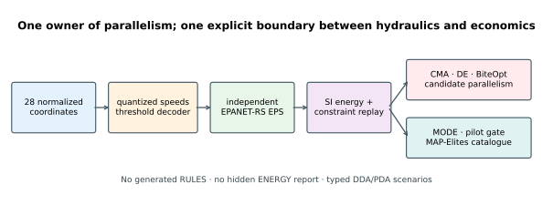

## Publication outcome

The checked-in publication run used seed 42, four candidate workers and these
frozen budgets:

```bash
cargo run --release --locked -- \
  --mode all --preset publication --workers 4 --seed 42 \
  --output results/publication
```

| Result | Measured value |
|---|---:|
| continuity residual, maximum | `1.91e-9 m³/s` |
| laminar one-pipe relative error | `5.42e-6` |
| offline power-oracle relative error, maximum | `1.49e-7` |
| threshold-witness override steps | `10` |
| one-hour → five-minute energy change | `−0.036%` |
| feasible scalar seed cost | `71.821` |
| CMA-ES robust scalar cost | `69.513` |
| DE robust scalar cost | `71.821` |
| BiteOpt robust scalar cost | **`67.169`** |
| D1 coverage / holdout niche retention | `38.0%` / `5.34%` |
| descriptor-gate decision | **rejected; QD skipped** |
| constrained MODE nondominated points | `83` |
| candidate/internal-EPS throughput ratio | about **`6.1×`** |

The seed schedule and all three scalar finalists are feasible on the six DDA
training scenarios. DE returned the seed cost rather than improving it; showing
that baseline prevents a non-improvement from looking like an optimizer result.
Requested budgets are equal at 4,000 calls per arm; actual calls are reported
because retry solvers can complete a generation after crossing that boundary.
The parallelism artifact was replayed separately with the frozen 10,000-
candidate publication workload to avoid drawing a ratio from millisecond-scale
timings; its own `run.json` records that command.

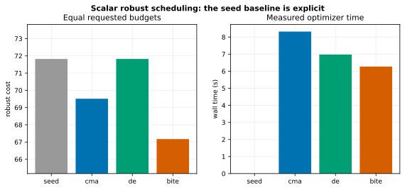

## Synthetic network

The deterministic input contains one reservoir, one elevated tank, two pumps,
one PRV, 20 demand junctions, two zero-demand valve nodes, one header, and 36
pipes. It is an educational single pressure zone, not a calibrated utility
model. [`PROVENANCE.md`](PROVENANCE.md) records every input class.

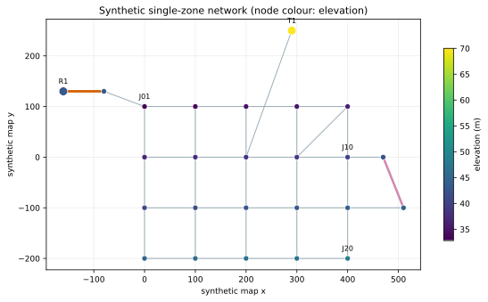

The normal structured plan keeps the minimum DDA pressure at `21.012 m`, above
the `20 m` requirement. The tank makes the system stateful: a schedule that is
acceptable in one period can make later periods infeasible through its storage
trajectory.

## Decision vector and control precedence

The optimizer sees 28 normalized continuous coordinates:

| Coordinates | Physical value |
|---|---|
| 0–11 | pump 1 speeds for twelve two-hour periods |
| 12–23 | pump 2 speeds for the same periods |
| 24 | tank low threshold in `[1.2, 5.5] m` |
| 25 | high threshold, constructed at least `0.5 m` above low |
| 26 | PRV setpoint in `[25, 50] m` |
| 27 | pump 1 first / pump 2 first |

Each speed coordinate uses equal-width bins for `off`, `0.8`, `0.9`, and
`1.0`. The coordinates stay continuous in CMA-ES, DE, BiteOpt, MODE and
MAP-Elites. There is deliberately no integer mask: such a mask would round the
normalized key itself instead of applying the authoritative four-bin decoder.

At each hydraulic step:

1. tank level at or above `high` switches both pumps off;
2. tank level at or below `low` switches the priority pump on at at least `0.8`;
3. otherwise the two-hour schedule applies.

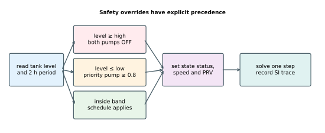

The checked-in `.inp` contains no built-in CONTROLS or RULES, so the solver
cannot silently overwrite this contract. The resulting plateaus—some schedule
coordinates become inert under an override—are one reason a derivative-free
global optimizer is appropriate.

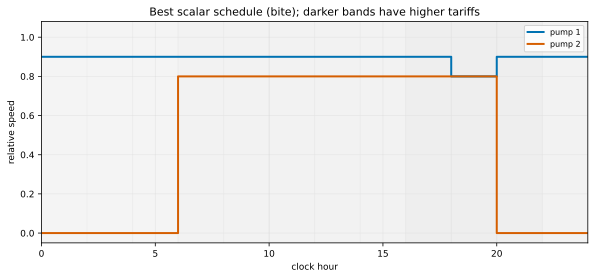

## Hydraulic driver and energy

`Simulation::initialize_hydraulics`, `run_hydraulics`, and
`next_hydraulic_timestep` provide the stepwise extended-period loop. Before
each solve the tutorial sets independent `SolverState` pump statuses, relative
speeds and the PRV pressure setting.

The solver's public step state uses internal feet and cfs. `driver.rs` converts
head, pressure, flow and velocity to SI before a value reaches economics or an
artifact. Pump electrical power is:

```text
P(kW) = ρ g Q(m³/s) H(m) / η(Q) / 1000
```

Energy uses a left-continuous interval integral. The efficiency curves in
`energy.rs` are synthetic and bounded from below; they are not extracted from
an unsupported EPANET ENERGY report.

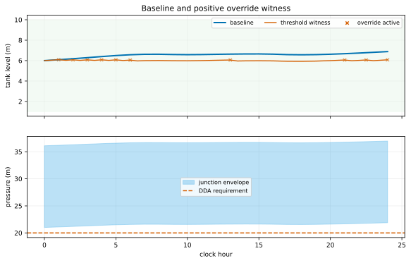

## Validation: what is and is not proved

Optimization is downstream of hard validation gates:

- maximum per-junction continuity residual is measured at every successful
  step;
- a one-reservoir/one-pipe laminar case is compared with the
  Hagen–Poiseuille closed form;
- four power points, calculated independently outside the Rust implementation
  and rounded to six decimals, are checked from a versioned CSV oracle;
- a separately written trace replay checks stored-power accumulation; and
- a deliberately low tank threshold is replayed to prove that the safety
  override really changes a hydraulic run.

The publication run reports no failed step, `1.91e-9 m³/s` maximum continuity
residual, `5.42e-6` one-pipe relative error, `1.49e-7` maximum power-oracle
error, and ten active override steps at the 30-minute validation resolution.
The trace accumulation replay is exactly zero, but is labelled as an
accumulation check rather than independent power validation.

`epanet-rs` 0.2.3 uses fixed internal gravity and kinematic-viscosity constants
for Darcy–Weisbach calculations. The closed form uses those backend constants,
then converts the result to SI; the frozen relative tolerance is `1e-5`.

These are internal physics and plumbing checks. The tutorial has not replayed
the finalists through a pinned upstream EPA EPANET executable and therefore
does **not** claim external numerical equivalence. See
[`M1_FINDINGS.md`](M1_FINDINGS.md) for the exact backend audit.

## DDA training and PDA holdouts

Six deterministic DDA training scenarios change peak demand, night demand,
profile phase, reservoir head and roughness. Five holdouts change kind:

- unseen demand profile;
- pump 1 outage under PDA;
- trunk-pipe outage under PDA;
- tariff peak shifted by three hours;
- hydraulic timestep halved.

PDA uses minimum pressure `0 m`, required pressure `20 m` and exponent `0.5`.
It exposes delivered-demand degradation instead of forcing a disconnected
network into a DDA interpretation. The pump-outage and trunk-outage replays
deliver about `99.86%` of requested volume but violate recovery and/or pressure
conditions. Their low operating costs are **not savings** and are never
numerically averaged with DDA objectives.

Junction demand remains signed in the hydraulic accounting. A negative
junction demand would represent a modeled inflow and is not silently clamped to
zero; the checked-in network itself has no negative base demands.

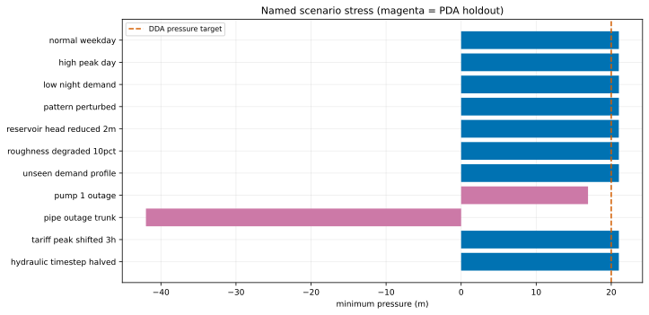

Hydraulic failures are typed constraints. `SolverError::MaxIterations` does not
provide a trustworthy “trial-limited solution”, so the driver stops that
scenario and never invents missing pressure or energy values.

## Resolution is part of the objective definition

Billing remains fixed at one-hour averages while the hydraulic step is swept
through 60, 30, 15 and 5 minutes. This prevents a smaller numerical timestep
from silently changing the tariff contract.

| Hydraulic step | Energy (kWh) | 1 h peak (kW) | Starts |
|---:|---:|---:|---:|
| 60 min | 199.231 | 8.407 | 2 |
| 30 min | 199.193 | 8.403 | 2 |
| 15 min | 199.173 | 8.401 | 2 |
| 5 min | 199.160 | 8.400 | 2 |

The `0.036%` energy spread is below the frozen `1%` gate. In this plan the
native sample peak and start count are also stable; the study was designed to
allow them to move, but measurement says they do not for this controller.

The separate threshold witness is intentionally more sensitive:

| Hydraulic step | Energy (kWh) | 1 h peak (kW) | Starts | override steps |
|---:|---:|---:|---:|---:|
| 60 min | 159.993 | 8.442 | 8 | 5 |
| 30 min | 164.034 | 8.425 | 12 | 10 |
| 15 min | 161.845 | 8.416 | 24 | 19 |
| 5 min | 163.201 | 8.417 | 66 | 56 |

This positive case prevents a structurally inactive override test from passing:
the sampled controller can switch near a threshold, so the operation itself
changes with timestep even though billing stays hourly.

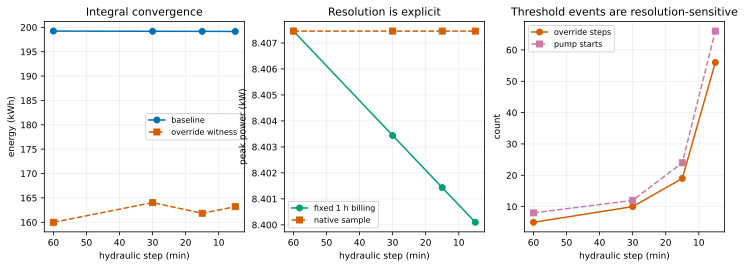

## Three optimization views

### Robust scalar schedule

The scalar objective is worst training-scenario operating cost:

```text
energy tariff cost + one-hour peak charge + pump-start cost
```

Normalized constraints cover DDA pressure, maximum pressure, tank bounds,
end-of-day tank recovery, pipe velocity, pump starts, and typed solver failure.
Positive constraint residuals receive a calibrated finite penalty; `1e99` is
never presented as a result.

### Descriptor-gated strategy catalogue

The primary D1 descriptors are off-peak energy fraction and tank turnover.
The pilot is split over three deterministic seed arms and uses the exact
archive geometry derived from the requested capacity—`10 × 10` at capacity
100. Spearman correlation assigns average ranks to ties.

The frozen gate requires finite descriptors, `|ρ| < 0.7`, less than `10%`
clipping on **each** axis, coverage above `40%`, and more than `60%` same-niche
retention under an unseen-demand holdout. Minimum per-seed coverage,
quarter-capacity retention and hydraulic-timestep retention are additional
sensitivity diagnostics rather than post-hoc pass criteria. From 1,500
attempted plans, 674 were robust-feasible:

| Pair | coverage | minimum seed coverage | clipping axes | `ρ` | unseen-demand retention | coarse retention | 30 min retention |
|---|---:|---:|---:|---:|---:|---:|---:|
| D1 off-peak fraction / tank turnover | 38% | 19% | 0.59% / 0.30% | 0.407 | **5.34%** | 93.62% | 97.48% |
| D2 pressure spread / tank turnover | 29% | 15% | 0% / 0.30% | −0.084 | **2.52%** | 90.95% | 97.63% |
| D3 mean speed / off-peak fraction | 39% | 17% | 0% / 0.59% | 0.030 | 96.14% | 97.48% | 98.37% |

No emergent pair passes. D1 and D2 both miss aggregate coverage and lose
almost every fine-grid niche under the structurally different demand profile.
Their high coarse-grid retention shows why reporting only a coarsened archive
would be misleading. D3 is a decision-led negative control, not an eligible
fallback.

The publication QD manifest therefore records a skip with zero requested
evaluations and no archive artifacts. The implementation remains replay-tested,
but this run makes no catalogue claim.

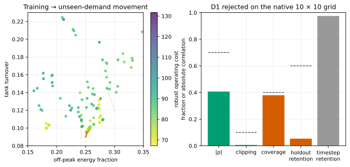

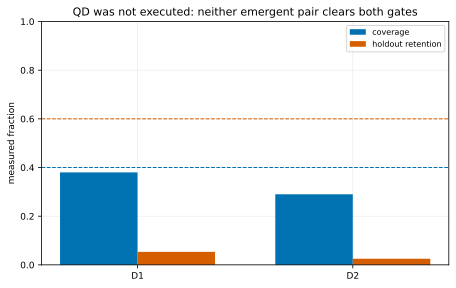

Across the four most recent gated tutorials, the measured tally is two
accepted (`phased-array-codebook` and `energy-hub-bilevel`) and two rejected
(`field-service-routing` and `water-network-scheduling`). The gate is therefore
capable of saying no.

### Constrained multi-objective front

MODE minimizes energy cost, pressure shortfall risk, switching cost and an
excess-pressure proxy. The last quantity is explicitly **not** a leakage
physics model: `epanet-rs` does not expose LEAKAGE, and this tutorial does not
invent it. Tank bounds, tank recovery, velocity and a binary
simulation-failure constraint are reported separately. All 83 published points
are feasible and mutually nondominated.

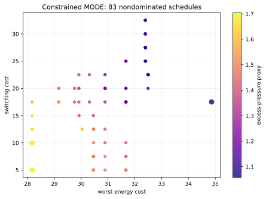

## Parallelism ownership

Every real candidate needs a tank and PRV, so its hydraulic steps are
sequential. fcmaes owns parallelism across independent candidates. A separate
tank-free, control-free network makes both arrangements legal for measurement:

| Arrangement | Throughput |
|---|---:|
| candidate-parallel, sequential EPS | 73,319 candidates/s |
| serial candidates, internal parallel EPS | 11,998 candidates/s |

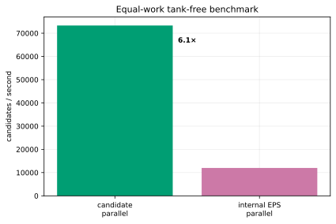

This approximately sixfold result is specific to the small benchmark and the
publication machine; it is not a universal `epanet-rs` claim. The architectural
rule for the real tank/PRV network is independent of the speed result.

## Reproduce smaller studies

```bash
# Fast complete protocol. A smoke-scale pilot can reject QD because it has
# deliberately little descriptor evidence; that produces a recorded skip.
cargo run --release --locked -- \
  --mode all --preset smoke --workers 2 --seed 42 \
  --output results/smoke

# Individual surfaces
cargo run --release --locked -- --mode validate --no-output
cargo run --release --locked -- --mode resolution --no-output
cargo run --release --locked -- --mode scenarios --no-output
cargo run --release --locked -- --mode bench --workers 4 --no-output

# Regenerate and verify the checked-in SVGs
python plot_results.py
python plot_results.py --check
```

The standalone Cargo workspace pins `epanet-rs = 0.2.3` and
`fcmaes-core = 0.1.3`. `Cargo.lock` is checked in. `run.json` records the
command, seed, workers, units, analysis type and resolution contract next to
CSV rows carrying full replay coordinates.

The audited lockfile contains `paris = 1.5.15` under MPL-2.0 through
`epanet-rs`'s logging stack. [`DEPENDENCY_NOTICE.md`](DEPENDENCY_NOTICE.md)
documents the unmodified dependency and `deny.toml` grants only that crate a
named exception; MPL-2.0 is not generally allowed.

## Code map

| File | Responsibility |
|---|---|
| `network/*.inp` | main network, analytical case and legal parallel benchmark |
| `src/network.rs` | deterministic load/write, closed-form check, thread-safety gate |
| `src/archive_grid.rs` | archive-native capacity layout and niche mapping |
| `src/decode.rs` | authoritative equal-width random-key decoder |
| `src/driver.rs` | stepwise EPS, control precedence, SI conversion and trace |
| `src/energy.rs` | synthetic efficiency, offline power oracle and energy integration |
| `src/scenarios.rs` | named DDA/PDA perturbations and tariff |
| `src/evaluate.rs` | robust objective, constraints and forbidden mixed aggregation |
| `src/so.rs` | equal-requested-budget CMA/DE/Bite retry |
| `src/pilot.rs`, `src/qd.rs` | descriptor gate and strategy catalogue |
| `src/mo.rs` | constrained MODE |
| `src/bench.rs` | parallelism ownership measurement |
| `src/artifacts.rs` | versioned machine-readable outputs |

## Limitations

- The network is synthetic and small; operational conclusions do not transfer
  to a real utility without calibration, water-quality constraints, maintenance
  rules and local tariff contracts.
- No water quality, RULES, ENERGY or LEAKAGE model is claimed.
- The smooth efficiency curves and cost rates are educational inputs.
- The checked-in power oracle is an independent arithmetic regression check,
  not measured pump data or external EPANET equivalence.
- DDA and PDA answer different questions. Their scenario rows coexist for
  diagnosis, not for a shared numerical objective.
- Numerical equivalence to a pinned upstream EPANET release remains untested.
- Candidate throughput on a tiny tank-free network is a parallel-ownership
  experiment, not a hydraulic-solver benchmark suite.

Those limitations are deliberate. The tutorial's reusable contribution is the
tested boundary between a stateful hydraulic simulator and discontinuous,
robust global optimization.
